# C++ STL

在 STL 编程中，容器是经常会用到的一种数据结构，容器分为序列式容器和关联式容器。

两者的本质区别在于：序列式容器是通过元素在容器中的位置顺序存储和访问元素，而关联容器则是通过键 (key) 存储和读取元素。

本篇着重剖析序列式容器相关背后的知识点。

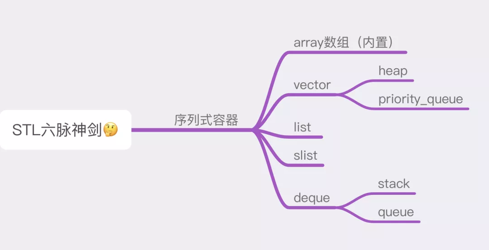
<a name="gc1Qq"></a>

## 容器分类
前面提到了，根据元素存储方式的不同，容器可分为序列式和关联式，那具体的又有哪些分类呢，这里画了一张图来看一下。<br />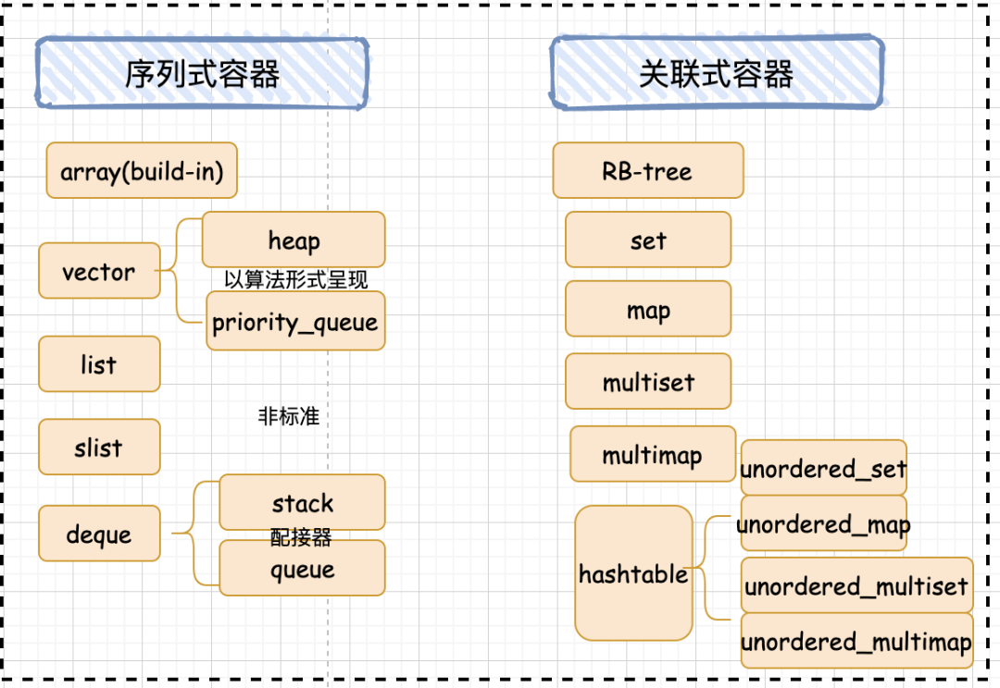<br />重点讲解一下经常使用到的那些容器，比如 vector，list，deque，以及衍生的栈和队列其背后核心的设计和奥秘。
<a name="eSmzo"></a>
### vector
写 C++ 的小伙伴们，应该对 vector 都非常熟悉了，vector 基本能够支持任何类型的对象，同时它也是一个可以动态增长的数组，使用起来非常的方便。
<a name="Qz8QB"></a>
#### vector 基本数据结构
基本上，STL 里面所有的容器的源码都包含至少三个部分：

- 迭代器，遍历容器的元素，控制容器空间的边界和元素的移动；
- 构造函数，满足容器的多种初始化；
- 属性的获取，比如 `begin()`，`end()`等；

vector 也不例外，其实看了源码之后就发现，vector 相反是所有容器里面最简单的一种。
```cpp
template <class T, class Alloc = alloc>
class vector {
public:
   // 定义 vector 自身的嵌套型别
    typedef T value_type;
    typedef value_type* pointer;
    typedef const value_type* const_pointer;
    // 定义迭代器, 这里就只是一个普通的指针
    typedef value_type* iterator;
    typedef const value_type* const_iterator;
    typedef value_type& reference;
    typedef const value_type& const_reference;
    typedef size_t size_type;
    typedef ptrdiff_t difference_type;
    ...
  protected:
    typedef simple_alloc<value_type, Alloc> data_allocator; // 设置其空间配置器
    iterator start;    // 当前使用空间的头
    iterator finish;   // 当前使用空间的尾
    iterator end_of_storage; // 当前可用空间的尾
    ...
};
```
因为 vector 需要表示用户操作的当前数据的起始地址，结束地址，还需要其真正的最大地址。所以总共需要 3 个迭代器，分别来指向数据的头(start)，数据的尾(finish)，数组的尾(end_of_storage)。<br />构造函数<br />vector 有多个构造函数, 为了满足多种初始化。<br />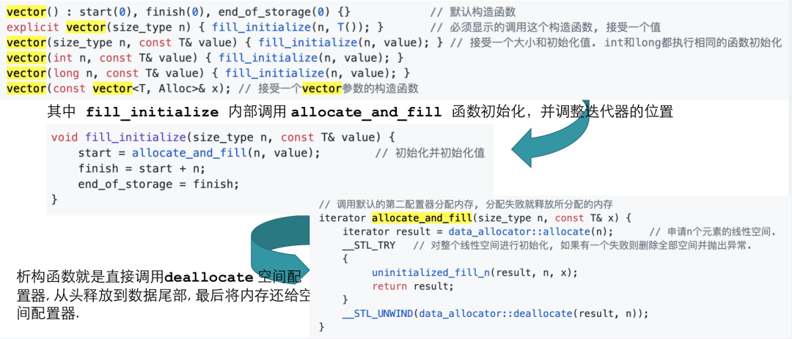<br />可以看到，这里面，初始化满足要么都初始化成功， 要么一个都不初始化并释放掉抛出异常，在 STL 里面，异常机制这块拿捏的死死的呀。<br />因为 vector 是一种 class template， 所以并不需要手动的释放内存， 生命周期结束后就自动调用析构从而释放调用空间，当然也可以直接调用析构函数释放内存。
```cpp
void deallocate() {
 if (start) 
        data_allocator::deallocate(start, end_of_storage - start);
}
// 调用析构函数并释放内存
~vector()  { 
 destroy(start, finish);
 deallocate();
}
```
<a name="Zgwg6"></a>
#### 属性获取
下面的部分就涉及到了位置参数的获取， 比如返回 vector 的开始和结尾，返回最后一个元素，返回当前元素个数，元素容量，是否为空等。<br />这里需要注意的是因为 `end()` 返回的是 finish，而 finish 是指向最后一个元素的后一个位置的指针，所以使用 `end()` 的时候要注意。
```cpp
public:
 // 获取数据的开始以及结束位置的指针. 记住这里返回的是迭代器, 也就是 vector 迭代器就是该类型的指针.
    iterator begin() { return start; }
    iterator end() { return finish; }
    reference front() { return *begin(); } // 获取值
    reference back() { return *(end() - 1); } 
    ...
    size_type size() const { return size_type(end() - begin()); }  // 数组元素的个数
    size_type max_size() const { return size_type(-1) / sizeof(T); } // 最大能存储的元素个数
    size_type capacity() const { return size_type(end_of_storage - begin()); } // 数组的实际大小
    bool empty() const { return begin() == end(); } 
    //判断 vector 是否为空， 并不是比较元素为 0，是直接比较头尾指针。
```
<a name="pXPJd"></a>
#### push 和 pop 操作
vector 的 push 和 pop 操作都只是对尾进行操作， 这里说的尾部是指数据的尾部。当调用 push_back 插入新元素的时候，首先会检查是否有备用空间，如果有就直接在备用空间上构造元素，并调整迭代器 finish。<br />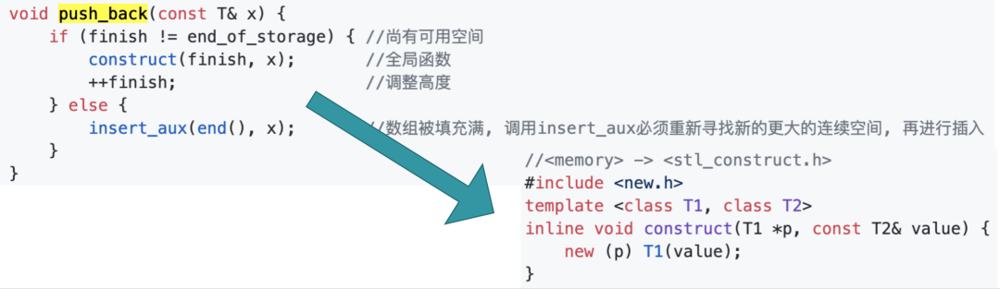<br />当如果没有备用空间，就扩充空间(重新配置-移动数据-释放原空间)，这里实际是调用了另外一个函数：insert_aux 函数。<br />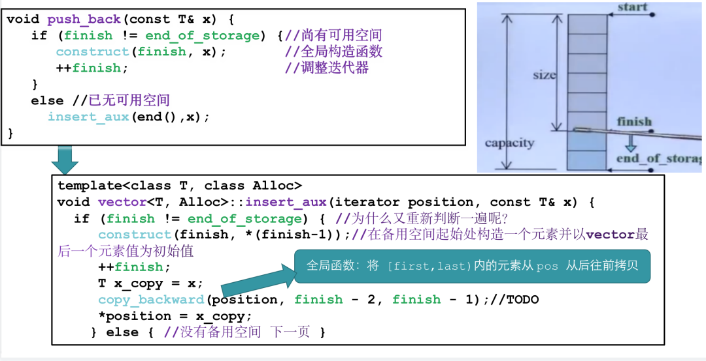在上面这张图里，可以看到，push_back 这个函数里面又判断了一次 finish != end_of_storage 这是因为啥呢？这里的原因是因为 insert_aux 函数可能还被其他函数调用哦。<br />在下面的 else 分支里面，看到了 vector 的动态扩容机制：如果原空间大小为 0 则分配 1 个元素，如果大于 0 则分配原空间两倍的新空间，然后把数据拷贝过去。<br />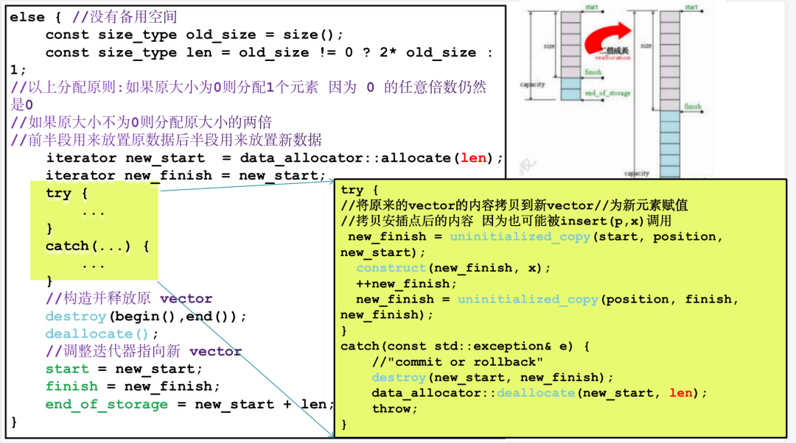<br />pop 元素：从尾端删除一个元素。
```cpp
public:
//将尾端元素拿掉 并调整大小
void pop_back() {
    --finish;//将尾端标记往前移动一个位置 放弃尾端元素
    destroy(finish);
}
```
<a name="VMDhx"></a>
#### erase 删除元素
erase 函数清除指定位置的元素， 其重载函数用于清除一个范围内的所有元素。实际实现就是将删除元素后面所有元素往前移动，对于 vector 来说删除元素的操作开销还是很大的，所以说 vector 它不适合频繁的删除操作，毕竟它是一个数组。
```cpp
//清楚[first, last)中的所有元素
iterator erase(iterator first, iterator last) {
    iterator i = copy(last, finish, first);
    destroy(i, finish);
    finish = finish - (last - first);
    return first;
}
//清除指定位置的元素
iterator erase(iterator position) {
    if (position + 1 != end()) 
        copy(position + 1, finish, position);//copy 全局函数
}      
--finish;
destroy(finish);
return position;
}
void clear() {
    erase(begin(), end());
}
```
结合图解来看一下:<br />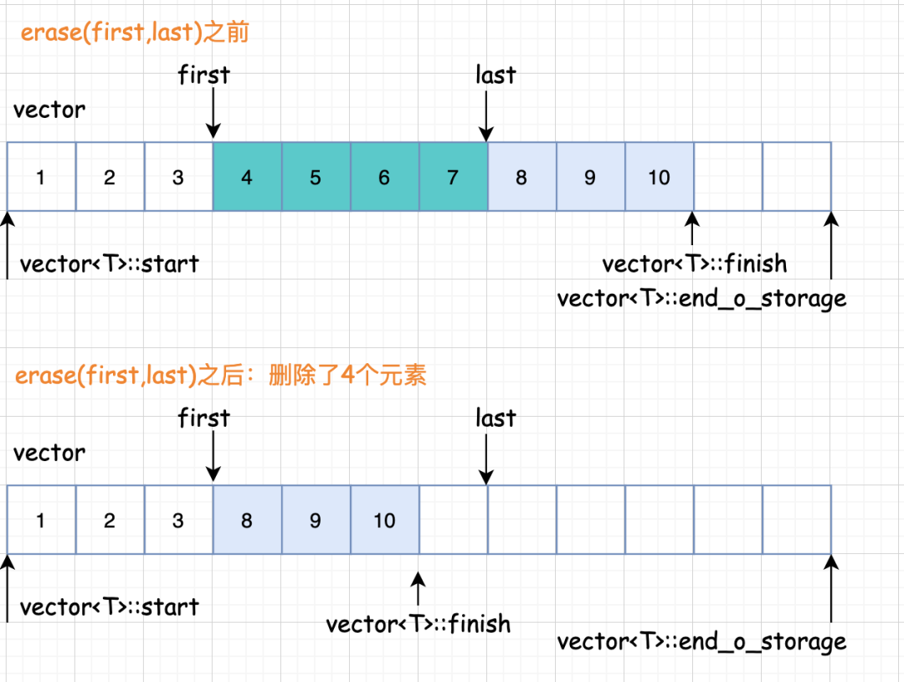<br />清楚范围内的元素，第一步要将 finish 迭代器后面的元素拷贝回去，然后返回拷贝完成的尾部迭代器，最后在删除之前的。<br />删除指定位置的元素就是实际就是将指定位置后面的所有元素向前移动, 最后析构掉最后一个元素。
<a name="cU7QH"></a>
##### insert 插入元素
vector 的插入元素具体来说呢，又分三种情况：<br />1、如果备用空间足够且插入点的现有元素多于新增元素；<br />2、如果备用空间足够且插入点的现有元素小于新增元素；<br />3、如果备用空间不够；<br />一个一个来分析。

- 插入点之后的现有元素个数 > 新增元素个数

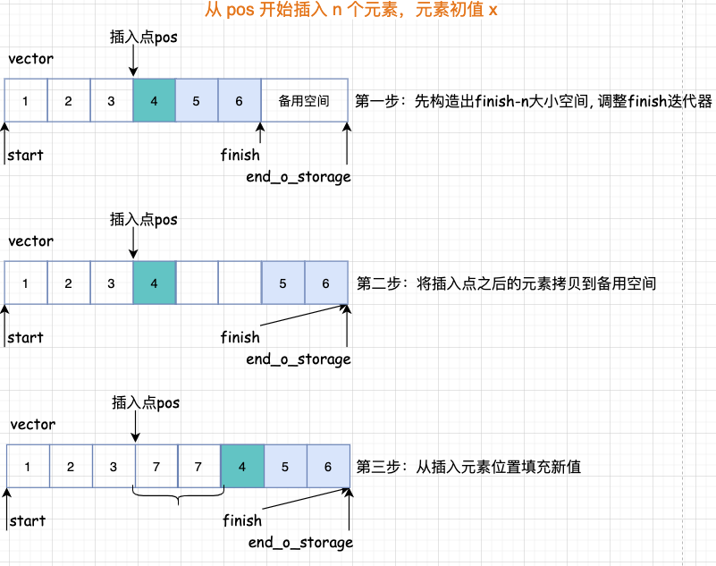

- 插入点之后的现有元素个数 <= 新增元素个数

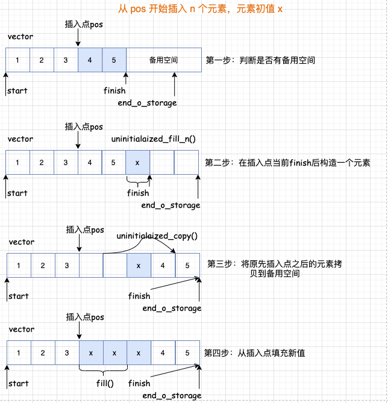<br />如果备用空间不足<br />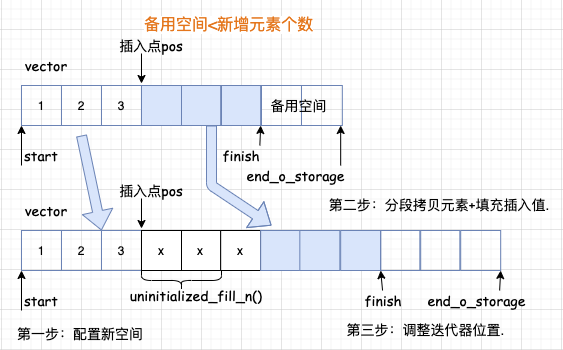<br />这里呢，要注意一个坑，就是所谓的迭代器失效问题。通过图解就明白了，所谓的迭代器失效问题是由于元素空间重新配置导致之前的迭代器访问的元素不在了，总结来说有两种情况：

- 由于插入元素，使得容器元素整体迁移导致存放原容器元素的空间不再有效，从而使得指向原空间的迭代器失效。
- 由于删除元素，使得某些元素次序发生变化导致原本指向某元素的迭代器不再指向期望指向的元素。

前面提到的一些全局函数，这里在总结一下：

- copy(a,b,c)：将(a,b)之间的元素拷贝到(c,c-(b-a))位置
- uninitialized_copy(first, last, result)：具体作用是将 [first,last)内的元素拷贝到 result 从前往后拷贝
- copy_backward(first, last, result)：将 [first,last)内的元素拷贝到 result 从后往前拷贝
<a name="s9osC"></a>
#### vector 总结
到这里呢，vector 分析的就差不多了，最后提醒需要注意的是：vector 的成员函数都不做边界检查 (at方法会抛异常)，使用者要自己确保迭代器和索引值的合法性。<br />来总结一下 vector 的优缺点。<br />优点

- 在内存中是分配一块连续的内存空间进行存储，可以像数组一样操作，并且支持动态扩容。
- 因此元素的随机访问方便，支持下标访问和 `vector.at()` 操作。
- 节省空间。

缺点

- 由于其顺序存储的特性，vector 插入删除操作的时间复杂度是 O(n)。
- 只能在末端进行 pop 和 push。
- 当动态长度超过默认分配大小后，要整体重新分配、拷贝和释放空间。
<a name="RvMMY"></a>
### list
好了，下面来看一下 list，list 是一种双向链表。<br />list 的设计更加复杂一点，好处是每次插入或删除一个元素，就配置或释放一个元素，list 对于空间的运用有绝对的精准，一点也不浪费。而且对于任何位置的元素插入或删除，list 永远是常数空间。<br />注意：list 源码里其实分了两个部分，一个部分是 list 结构，另一部分是 list 节点的结构。<br />那这里不妨思考一下，为什么 list 节点分为了两个部分，而不是在一个结构体里面呢? 也就是说为什么指针变量和数据变量分开定义呢？<br />如果看了后面的源码就晓得了，这里是为了给迭代器做铺垫，因为迭代器遍历的时候不需要数据成员的，只需要前后指针就可以遍历该 list。 <br />list 的节点结构如下图所示：<br />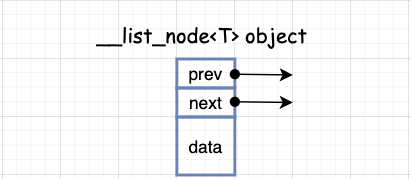
<a name="np7bH"></a>
#### list 数据结构-节点
__list_node 用来实现节点，数据结构中就储存前后指针和属性。
```cpp
template <class T> struct __list_node {
    // 前后指针
    typedef void* void_pointer;
    void_pointer next;
    void_pointer prev;
    // 属性
    T data;
};
```
来看看list 的节点长啥样，因为 list 是一种双向链表，所以基本结构就是下面这个样子：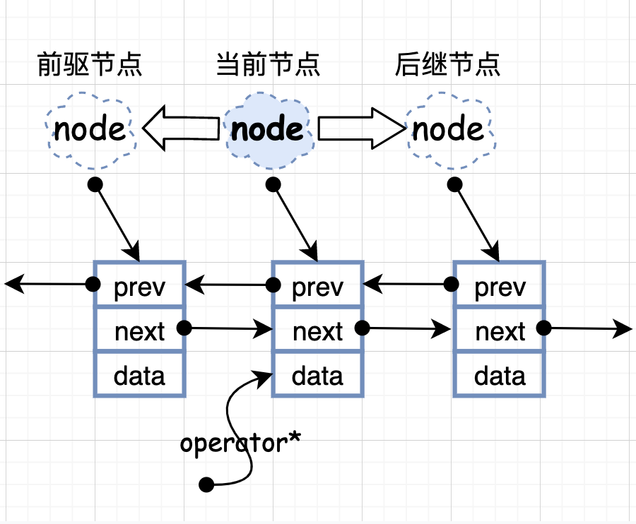<br />基本类型
```cpp
template<class T, class Ref, class Ptr> struct __list_iterator {
   typedef __list_iterator<T, T&, T*>     iterator; // 迭代器
   typedef __list_iterator<T, const T&, const T*> const_iterator;
   typedef __list_iterator<T, Ref, Ptr>    self;  
 
    // 迭代器是bidirectional_iterator_tag类型
   typedef bidirectional_iterator_tag iterator_category;
   typedef T value_type;
   typedef Ptr pointer;
   typedef Ref reference;
   typedef size_t size_type;
   typedef ptrdiff_t difference_type;
    ... 
};
```
构造函数
```cpp
template<class T, class Ref, class Ptr> struct __list_iterator {
    ...
    // 定义节点指针
   typedef __list_node<T>* link_type;
   link_type node;
 // 构造函数
   __list_iterator(link_type x) : node(x) {}
   __list_iterator() {}
   __list_iterator(const iterator& x) : node(x.node) {}
   ... 
};
```
重载
```cpp
template<class T, class Ref, class Ptr> struct __list_iterator  {
    ...
 // 重载
   bool operator==(const self& x) const { return node == x.node; }
   bool operator!=(const self& x) const { return node != x.node; }
    ...

    // ++和--是直接操作的指针指向next还是prev, 因为list是一个双向链表
   self& operator++() { 
     node = (link_type)((*node).next);
     return *this;
   }
   self operator++(int) { 
     self tmp = *this;
     ++*this;
     return tmp;
   }
   self& operator--() { 
     node = (link_type)((*node).prev);
     return *this;
   }
   self operator--(int)  { 
     self tmp = *this;
     --*this;
     return tmp;
   }
};
```
<a name="Nilja"></a>
#### list 结构
list 自己定义了嵌套类型满足 traits 编程， list 迭代器是 bidirectional_iterator_tag 类型，并不是一个普通指针。<br />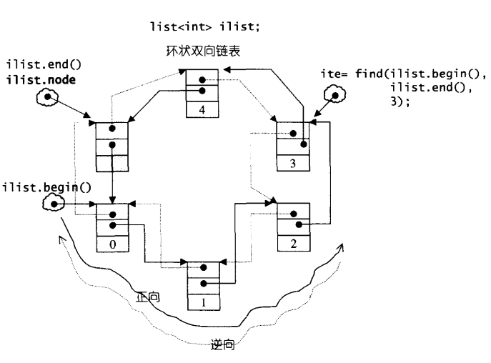<br />list 在定义 node 节点时， 定义的不是一个指针，这里要注意。
```cpp
template <class T, class Alloc = alloc>
class list {
protected:
    typedef void* void_pointer;
    typedef __list_node<T> list_node; // 节点 就是前面分析过的
    typedef simple_alloc<list_node, Alloc> list_node_allocator; // 空间配置器
public:      
    // 定义嵌套类型
    typedef T value_type;
    typedef value_type* pointer;
    typedef const value_type* const_pointer;
    typedef value_type& reference;
    typedef const value_type& const_reference;
    typedef list_node* link_type;
    typedef size_t size_type;
    typedef ptrdiff_t difference_type;
    
protected:
    // 定义一个节点, 这里节点并不是一个指针.
    link_type node;
    
public:
    // 定义迭代器
    typedef __list_iterator<T, T&, T*>             iterator;
    typedef __list_iterator<T, const T&, const T*> const_iterator;
 ...
};
```
<a name="Nsh94"></a>
#### list 构造和析构函数实现
构造函数前期准备：<br />每个构造函数都会创造一个空的 node 节点，为了保证在执行任何操作都不会修改迭代器。<br />list 默认使用 alloc 作为空间配置器，并根据这个另外定义了一个 list_node_allocator，目的是更加方便以节点大小来配置单元。
```cpp
template <class T, class Alloc = alloc>
class list {
protected:
    typedef void* void_pointer;
    typedef __list_node<T> list_node; // 节点
    typedef simple_alloc<list_node, Alloc> list_node_allocator; // 空间配置器
```
其中，list_node_allocator(n) 表示配置 n 个节点空间。以下四个函数，分别用来配置，释放，构造，销毁一个节点。
```cpp
class list {
    protected:
    // 配置一个节点并返回
    link_type get_node() { return list_node_allocator::allocate(); }
    // 释放一个节点
    void put_node(link_type p) { list_node_allocator::deallocate(p); }
    // 产生(配置并构造)一个节点带有元素初始值
    link_type create_node(const T& x) {
        link_type p = get_node();
        __STL_TRY {
            construct(&p->data, x);
        }
        __STL_UNWIND(put_node(p));
        return p;
    }
    //销毁(析构并释放)一个节点
    void destroy_node(link_type p) {
        destroy(&p->data);
        put_node(p);
    }
    // 对节点初始化
    void empty_initialize() { 
        node = get_node();
        node->next = node;
        node->prev = node;
    }  
};
```
<a name="p5oFU"></a>
#### 基本属性获取
```cpp
template <class T, class Alloc = alloc>
class list {
    ...
public: 
 iterator begin() { return (link_type)((*node).next); } // 返回指向头的指针
    const_iterator begin() const { return (link_type)((*node).next); }
    iterator end() { return node; } // 返回最后一个元素的后一个的地址
    const_iterator end() const { return node; }

    // 这里是为旋转做准备, rbegin返回最后一个地址, rend返回第一个地址. 我们放在配接器里面分析
    reverse_iterator rbegin() { return reverse_iterator(end()); }
    const_reverse_iterator rbegin() const { 
      return const_reverse_iterator(end()); 
    }
    reverse_iterator rend() { return reverse_iterator(begin()); }
    const_reverse_iterator rend() const { 
      return const_reverse_iterator(begin());
    } 

    // 判断是否为空链表, 这是判断只有一个空node来表示链表为空.
    bool empty() const { return node->next == node; }
    // 因为这个链表, 地址并不连续, 所以要自己迭代计算链表的长度.
    size_type size() const {
      size_type result = 0;
      distance(begin(), end(), result);
      return result;
    }
    size_type max_size() const { return size_type(-1); }
    // 返回第一个元素的值
    reference front() { return *begin(); }
    const_reference front() const { return *begin(); }
    // 返回最后一个元素的值
    reference back() { return *(--end()); }
    const_reference back() const { return *(--end()); }

    // 交换
    void swap(list<T, Alloc>& x) { __STD::swap(node, x.node); }
    ...
};
template <class T, class Alloc>
inline void swap(list<T, Alloc>& x, list<T, Alloc>& y) {
   x.swap(y);
}
```
<a name="YFFVZ"></a>
#### list 的头插和尾插
因为 list 是一个循环的双链表， 所以 push 和 pop 就必须实现是在头插入，删除还是在尾插入和删除。<br />在 list 中，push 操作都调用 insert 函数， pop 操作都调用 erase 函数。
```cpp
template <class T, class Alloc = alloc>
class list {
    ...
    // 直接在头部或尾部插入
    void push_front(const T& x) { insert(begin(), x); } 
    void push_back(const T& x) { insert(end(), x); }
    // 直接在头部或尾部删除
    void pop_front() { erase(begin()); } 
    void pop_back() { 
      iterator tmp = end();
      erase(--tmp);
    }
    ...
};
```
上面的两个插入函数内部调用的 insert 函数。
```cpp
class list {
    ...
    public:
      // 最基本的insert操作, 之插入一个元素
      iterator insert(iterator position, const T& x) {
          // 将元素插入指定位置的前一个地址
        link_type tmp = create_node(x);
        tmp->next = position.node;
        tmp->prev = position.node->prev;
        (link_type(position.node->prev))->next = tmp;
        position.node->prev = tmp;
    return tmp;
}
```
这里需要注意的是

- 节点实际是以 node 空节点开始的。
- 插入操作是将元素插入到指定位置的前一个地址进行插入的。
<a name="poL0i"></a>
#### 删除操作
删除元素的操作大都是由 erase 函数来实现的，其他的所有函数都是直接或间接调用 erase。<br />list 是链表，所以链表怎么实现删除元素， list 就在怎么操作：很简单，先保留前驱和后继节点， 再调整指针位置即可。<br />由于它是双向环状链表，只要把边界条件处理好，那么在头部或者尾部插入元素操作几乎是一样的，同样的道理，在头部或者尾部删除元素也是一样的。
```cpp
template <class T, class Alloc = alloc>
class list {
    ...
     iterator erase(iterator first, iterator last);
        void clear();   
        // 参数是一个迭代器 修改该元素的前后指针指向再单独释放节点就行了
     iterator erase(iterator position) {
          link_type next_node = link_type(position.node->next);
          link_type prev_node = link_type(position.node->prev);
          prev_node->next = next_node;
          next_node->prev = prev_node;
          destroy_node(position.node);
          return iterator(next_node);
        }
        ...
    };
    ...
}
```
list 内部提供一种所谓的迁移操作(transfer)：将某连续范围的元素迁移到某个特定位置之前，技术上实现其实不难，就是节点之间的指针移动，只要明白了这个函数的原理，后面的 splice，sort，merge 函数也就一一知晓了，来看一下 transfer 的源码：
```cpp
template <class T, class Alloc = alloc>
class list {
    ...
protected:
    void transfer(iterator position, iterator first, iterator last) {
      if (position != last) {
        (*(link_type((*last.node).prev))).next = position.node;
        (*(link_type((*first.node).prev))).next = last.node;
        (*(link_type((*position.node).prev))).next = first.node;  
        link_type tmp = link_type((*position.node).prev);
        (*position.node).prev = (*last.node).prev;
        (*last.node).prev = (*first.node).prev; 
        (*first.node).prev = tmp;
      }
    }
    ...
};
```
上面代码的七行分别对应下图的七个步骤，看明白应该不难吧。<br />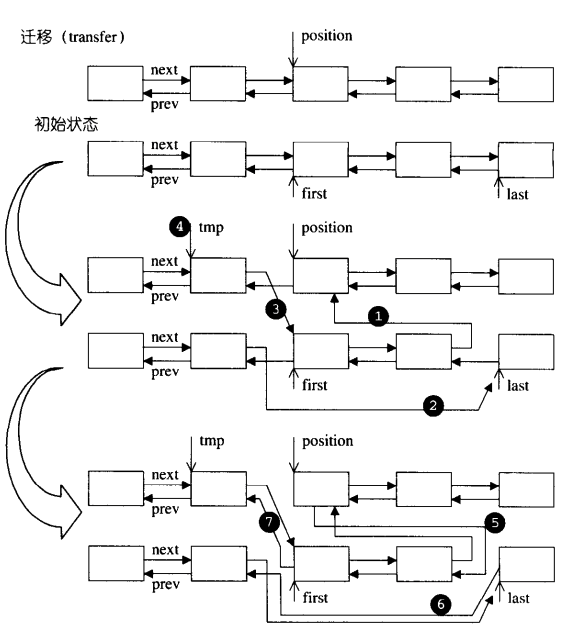<br />另外 list 的其它的一些成员函数这里限于篇幅，就不贴出源码了，简单说一些注意点。<br />splice函数： 将两个链表进行合并：内部就是调用的 transfer 函数。<br />merge 函数： 将传入的 list 链表 x 与原链表按从小到大合并到原链表中(前提是两个链表都是已经从小到大排序了). 这里 merge 的核心就是 transfer 函数。<br />reverse 函数： 实现将链表翻转的功能：主要是 list 的迭代器基本不会改变的特点, 将每一个元素一个个插入到 begin 之前。<br />sort 函数： list 这个容器居然还自己实现一个排序，看一眼源码就发现其实内部调用的 merge 函数，用了一个数组链表用来存储 2^i 个元素, 当上一个元素存储满了之后继续往下一个链表存储, 最后将所有的链表进行 merge归并(合并), 从而实现了链表的排序。<br />赋值操作： 需要考虑两个链表的实际大小不一样时的操作：如果原链表大 : 复制完后要删除掉原链表多余的元素；如果原链表小 : 复制完后要还要将x链表的剩余元素以插入的方式插入到原链表中。<br />resize 操作： 重新修改 list 的大小，传入一个 new_size，如果链表旧长度大于 new_size 的大小, 那就删除后面多余的节点。<br />clear 操作： 清除所有节点：遍历每一个节点，销毁(析构并释放)一个节点。<br />remove 操作： 清除指定值的元素：遍历每一个节点，找到就移除。<br />unique 操作： 清除数值相同的连续元素，注意只有“连续而相同的元素”，才会被移除剩一个：遍历每一个节点，如果在此区间段有相同的元素就移除之。<br />感兴趣的读者可以自行去阅读源码体会。
<a name="BE7aO"></a>
#### list 总结
list 是一种双向链表。每个结点都包含一个数据域、一个前驱指针 prev 和一个后驱指针 next。<br />由于其链表特性，实现同样的操作，相对于 STL 中的通用算法， list 的成员函数通常有更高的效率，内部仅需做一些指针的操作，因此尽可能选择 list 成员函数。<br />优点

- 在内部方便进行插入删除操作。
- 可在两端进行push和pop操作。

缺点

- 不支持随机访问，即下标操作和.at()。
- 相对于 vector 占用内存多。
<a name="iGWOx"></a>
### deque
下面到了本篇最硬核的内容了，接下来学习一下 双端队列 deque 。<br />deque 的功能很强大。<br />首先来一张图吧。<br />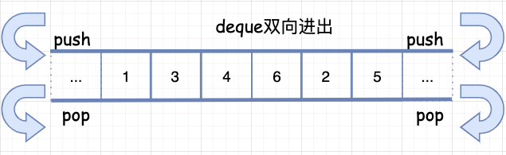<br />上面就是 deque 的示例图，deque 和 vector 的最大差异一在于 deque 允许常数时间内对头端或尾端进行元素的插入或移除操作。<br />二在于 deque 没有所谓的容量概念，因为它是动态地以分段连续空间组合而成随时可以增加一块新的空间并拼接起来。<br />虽然 deque 也提供 随机访问的迭代器，但它的迭代器和前面两种容器的都不一样，其设计相当复杂度和精妙，因此，会对各种运算产生一定影响，除非必要，尽可能的选择使用 vector 而非 deque。一一来探究下吧。
<a name="vsMQp"></a>
#### deque 的中控器
deque 在逻辑上看起来是连续空间，内部确实是由一段一段的定量连续空间构成。<br />一旦有必要在 deque 的前端或尾端增加新空间，deque 便会配置一段定量的连续空间，串接在整个 deque 的头部或尾部。<br />设计 deque 的大师们，想必设计的时候遇到的最大挑战就是如何在这些分段的定量连续空间上，还能维护其整体连续的假象，并提供其随机存取的接口，从而避开了像 vector 那样的“重新配置-复制-释放”开销三部曲。<br />这样一来，虽然开销降低，却提高了复杂的迭代器架构。<br />因此 deque 数据结构的设计和迭代器前进或后退等操作都非常复杂。<br />deque 采用一块所谓的 map （注意不是 STL 里面的 map 容器）作为中控器，其实就是一小块连续空间，其中的每个元素都是指针，指向另外一段较大的连续线性空间，称之为缓冲区。在后面看到，缓冲区才是 deque 的储存空间主体。
```cpp
#ifndef __STL_NON_TYPE_TMPL_PARAM_BUG
template <class T, class Ref, class Ptr, size_t BufSiz>
class deque {
public:
  typedef T value_type;
  typedef value_type* pointer;
  ...
protected:
  typedef pointer** map_pointer;
  map_pointer map;//指向 map，map 是连续空间，其内的每个元素都是一个指针。
  size_type map_size;
  ...
};
```
其示例图如下：deque 的结构设计中，map 和 node-buffer 的关系如下：<br />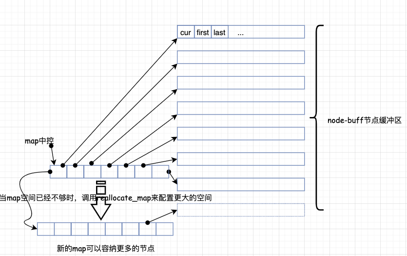
<a name="UWaEq"></a>
#### deque 的迭代器
deque 是分段连续空间，维持其“整体连续”假象的任务，就靠它的迭代器来实现，也就是 operator++ 和 operator-- 两个运算子上面。<br />在看源码之前，可以思考一下，如果让你来设计，你觉得 deque 的迭代器应该具备什么样的结构和功能呢？<br />首先第一点，能想到的是，既然是分段连续，迭代器应该能指出当前的连续空间在哪里；<br />其次，第二点因为缓冲区有边界，迭代器还应该要能判断，当前是否处于所在缓冲区的边缘，如果是，一旦前进或后退，就必须跳转到下一个或上一个缓冲区；<br />第三点，也就是实现前面两种情况的前提，迭代器必须能随时控制中控器。<br />有了这样的思想准备之后，再来看源码，就显得容易理解一些了。
```cpp
template <class T, class Ref, class Ptr, size_t BufSiz>
struct __deque_iterator {
 // 迭代器定义
  typedef __deque_iterator<T, T&, T*, BufSiz>             iterator;
  typedef __deque_iterator<T, const T&, const T*, BufSiz> const_iterator;
  static size_t buffer_size() {return __deque_buf_size(BufSiz, sizeof(T)); }
 // deque是random_access_iterator_tag类型
  typedef random_access_iterator_tag iterator_category;
  // 基本类型的定义, 满足traits编程
  typedef T value_type;
  typedef Ptr pointer;
  typedef Ref reference;
  typedef size_t size_type;
  typedef ptrdiff_t difference_type;
  // node
  typedef T** map_pointer;
  map_pointer node;
  typedef __deque_iterator self;
  ...
};
```
deque 的每一个缓冲区由设计了三个迭代器（为什么这样设计？）
```cpp
struct __deque_iterator {
 ...
  typedef T value_type;
  T* cur;
  T* first;
  T* last;
  typedef T** map_pointer;
  map_pointer node;
  ...
};
```
为什么要这样设计呢？回到前面刚才说的，因为它是分段连续的空间。<br />下图描绘了 deque 的中控器、缓冲区、迭代器之间的相互关系：<br />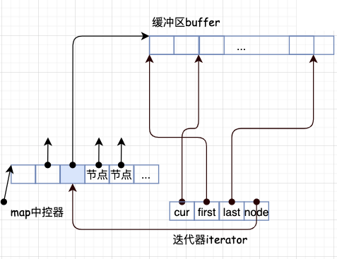<br />看明白了吗，每一段都指向一个缓冲区 buffer，而缓冲区是需要知道每个元素的位置的，所以需要这些迭代器去访问。<br />其中 cur 表示当前所指的位置；<br />first 表示当前数组中头的位置；<br />last 表示当前数组中尾的位置。<br />这样就方便管理，需要注意的是 deque 的空间是由 map 管理的， 它是一个指向指针的指针， 所以三个参数都是指向当前的数组，但这样的数组可能有多个，只是每个数组都管理这3个变量。<br />那么，缓冲区大小是谁来决定的呢？这里呢，用来决定缓冲区大小的是一个全局函数:
```cpp
inline size_t __deque_buf_size(size_t n, size_t sz) {
  return n != 0 ? n : (sz < 512 ? size_t(512 / sz): size_t(1));
}
//如果 n 不为0，则返回 n，表示缓冲区大小由用户自定义
//如果 n == 0，表示 缓冲区大小默认值
//如果 sz = (元素大小 sizeof(value_type)) 小于 512 则返回 521/sz
//如果 sz 不小于 512 则返回 1
```
来举例说明一下：<br />假设现在构造了一个 int 类型的 deque，设置缓冲区大小等于 32，这样一来，每个缓冲区可以容纳 32/sizeof(int) = 8(64位系统)个元素。经过一番操作之后，deque 现在有 20 个元素了，那么成员函数 `begin()` 和 `end()` 返回的两个迭代器应该是怎样的呢？<br />如下图所示：<br />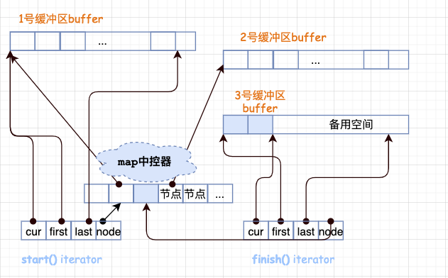<br />20 个元素需要 20/(sizeof(int)) = 5(图中只展示3个) 个缓冲区。<br />所以 map 运用了三个节点，迭代器 start 内的 cur 指针指向缓冲区的第一个元素，迭代器 finish 内的 cur 指针指向缓冲区的最后一个元素(的下一个位置)。<br />注意，最后一个缓冲区尚有备用空间，如果之后还有新元素插入，则直接插入到备用空间。
<a name="zYapJ"></a>
#### deque 迭代器的操作
主要就是两种：前进和后退。<br />operator++ 操作代表是需要切换到下一个元素，这里需要先切换再判断是否已经到达缓冲区的末尾。
```cpp
self& operator++() { 
  ++cur;      //切换至下一个元素
  if (cur == last) {   //如果已经到达所在缓冲区的末尾
     set_node(node+1);  //切换下一个节点
     cur = first;  
  }
  return *this;
}

operator-- 操作代表切换到上一个元素所在的位置，需要先判断是否到达缓冲区的头部，再后退。
self& operator--() {     
  if (cur == first) {    //如果已经到达所在缓冲区的头部
     set_node(node - 1); //切换前一个节点的最后一个元素
     cur = last;  
  }
  --cur;       //切换前一个元素
  return *this;
}  //结合前面的分段连续空间，你在想一想这样的设计是不是合理呢？
```
<a name="mXHfP"></a>
#### deque 的构造和析构函数
deque 的构造函数有多个重载函数，接受大部分不同的参数类型，基本上每一个构造函数都会调用 create_map_and_nodes，这就是构造函数的核心，后面来分析这个函数的实现。
```cpp
template <class T, class Alloc = alloc, size_t BufSiz = 0> 
class deque {
    ...
public:                         // Basic types
  deque() : start(), finish(), map(0), map_size(0){
    create_map_and_nodes(0);
  }  // 默认构造函数
  deque(const deque& x) : start(), finish(), map(0), map_size(0) {
    create_map_and_nodes(x.size());
    __STL_TRY {
      uninitialized_copy(x.begin(), x.end(), start);
    }
    __STL_UNWIND(destroy_map_and_nodes());
  }
    // 接受 n:初始化大小, value:初始化的值
  deque(size_type n, const value_type& value) : start(), finish(), map(0), map_size(0) {
    fill_initialize(n, value);
  }
  deque(int n, const value_type& value) : start(), finish(), map(0), map_size(0) {
    fill_initialize(n, value);
  } 
  deque(long n, const value_type& value) : start(), finish(), map(0), map_size(0){
    fill_initialize(n, value);
  }
  ...
```
下面来看一下 deque 的中控器是如何配置的。
```cpp
void deque<T,Alloc,BufSize>::create_map_and_nodes(size_type_num_elements) {
  //需要节点数= (每个元素/每个缓冲区可容纳的元素个数+1)
  //如果刚好整除，多配一个节点
  size_type num_nodes = num_elements / buffer_size() + 1;
  //一个 map 要管理几个节点，最少 8 个，最多是需要节点数+2
  map_size = max(initial_map_size(), num_nodes + 2);
  map = map_allocator::allocate(map_size);
 // 计算出数组的头前面留出来的位置保存并在nstart.
  map_pointer nstart = map + (map_size - num_nodes) / 2;
  map_pointer nfinish = nstart + num_nodes - 1;
  map_pointer cur;//指向所拥有的节点的最中央位置
  ...
}
```
注意了，看了源码之后才知道：deque 的 begin 和 end 不是一开始就是指向 map 中控器里开头和结尾的，而是指向所拥有的节点的最中央位置。<br />这样带来的好处是可以使得头尾两边扩充的可能性和一样大，换句话来说，因为 deque 是头尾插入都是 O(1)， 所以 deque 在头和尾都留有空间方便头尾插入。<br />那么，什么时候 map 中控器 本身需要调整大小呢？触发条件在于 reserve_map_at_back 和 reserve_map_at_front 这两个函数来判断，实际操作由 reallocate_map 来执行。<br />那 reallocate_map 又是如何操作的呢？这里先留个悬念。
```cpp
// 如果 map 尾端的节点备用空间不足，符合条件就配置一个新的map(配置更大的，拷贝原来的，释放原来的)
void reserve_map_at_back (size_type nodes_to_add = 1) {
  if (nodes_to_add + 1 > map_size - (finish.node - map))
    reallocate_map(nodes_to_add, false);
}
// 如果 map 前端的节点备用空间不足，符合条件就配置一个新的map(配置更大的，拷贝原来的，释放原来的)
void reserve_map_at_front (size_type nodes_to_add = 1) {
  if (nodes_to_add > start.node - map)
    reallocate_map(nodes_to_add, true);
}
```
<a name="gFmKF"></a>
#### deque 的插入元素和删除元素
因为 deque 的是能够双向操作，所以其 push 和 pop 操作都类似于 list 都可以直接有对应的操作，需要注意的是 list 是链表，并不会涉及到界线的判断， 而deque 是由数组来存储的，就需要随时对界线进行判断。<br />push 实现
```cpp
template <class T, class Alloc = alloc, size_t BufSiz = 0> 
class deque {
    ...
public:                         // push_* and pop_*
    // 对尾进行插入
    // 判断函数是否达到了数组尾部. 没有达到就直接进行插入
  void push_back(const value_type& t) {
    if (finish.cur != finish.last - 1) {
      construct(finish.cur, t);
      ++finish.cur;
    }
    else
      push_back_aux(t);
  }
    // 对头进行插入
    // 判断函数是否达到了数组头部. 没有达到就直接进行插入
  void push_front(const value_type& t) {
    if (start.cur != start.first) {
      construct(start.cur - 1, t);
      --start.cur;
    }
    else
      push_front_aux(t);
  }
    ...
};
```
pop 实现
```cpp
template <class T, class Alloc = alloc, size_t BufSiz = 0> 
class deque {
    ...
public: 
    // 对尾部进行操作
    // 判断是否达到数组的头部. 没有到达就直接释放
    void pop_back() {
    if (finish.cur != finish.first) {
      --finish.cur;
      destroy(finish.cur);
    }
    else
      pop_back_aux();
  }
    // 对头部进行操作
    // 判断是否达到数组的尾部. 没有到达就直接释放
  void pop_front() {
    if (start.cur != start.last - 1) {
      destroy(start.cur);
      ++start.cur;
    }
    else 
      pop_front_aux();
  }
    ...
};
```
pop 和 push 都先调用了 reserve_map_at_XX 函数，这些函数主要是为了判断前后空间是否足够。
<a name="D7clb"></a>
#### 删除操作
不知道还记得，最开始构造函数调用 create_map_and_nodes 函数，考虑到 deque 实现前后插入时间复杂度为O(1)，保证了在前后留出了空间，所以 push 和 pop 都可以在前面的数组进行操作。<br />现在就来看 erase，因为 deque 是由数组构成，所以地址空间是连续的，删除也就像 vector一样，要移动所有的元素。<br />deque 为了保证效率尽可能的高，就判断删除的位置是中间偏后还是中间偏前来进行移动。
```cpp
template <class T, class Alloc = alloc, size_t BufSiz = 0> 
class deque {
    ...
public:                         // erase
  iterator erase(iterator pos) {
    iterator next = pos;
    ++next;
    difference_type index = pos - start;
      // 删除的地方是中间偏前, 移动前面的元素
    if (index < (size() >> 1)) {
      copy_backward(start, pos, next);
      pop_front();
    }
      // 删除的地方是中间偏后, 移动后面的元素
    else {
      copy(next, finish, pos);
      pop_back();
    }
    return start + index;
  }
 // 范围删除, 实际也是调用上面的erase函数.
  iterator erase(iterator first, iterator last);
  void clear(); 
    ...
};
```
最后讲一下 insert 函数<br />deque 源码的基本每一个insert 重载函数都会调用了 insert_auto 判断插入的位置离头还是尾比较近。<br />如果离头进：则先将头往前移动，调整将要移动的距离，用 copy 进行调整。<br />如果离尾近：则将尾往前移动，调整将要移动的距离，用 copy 进行调整。<br />注意 : push_back 是先执行构造在移动 node，而 push_front 是先移动 node 在进行构造，实现的差异主要是 finish 是指向最后一个元素的后一个地址而 first指 向的就只第一个元素的地址，下面 pop 也是一样的。<br />deque 源码里还有一些其它的成员函数，限于篇幅，这里就不贴出来了，简单的过一遍<br />reallocate_map：判断中控器的容量是否够用，如果不够用，申请更大的空间，拷贝元素过去，修改 map 和 start，finish 的指向。<br />fill_initialize 函数：申请空间，对每个空间进行初始化，最后一个数组单独处理。毕竟最后一个数组一般不是会全部填充满。<br />clear 函数：删除所有元素，分两步执行：<br />首先从第二个数组开始到倒数第二个数组一次性全部删除，这样做是考虑到中间的数组肯定都是满的，前后两个数组就不一定是填充满的，最后删除前后两个数组的元素。<br />deque 的 swap 操作：只是交换了 start, finish, map，并没有交换所有的元素。<br />resize 函数： 重新将 deque 进行调整, 实现与 list一样的。<br />析构函数： 分步释放内存。
<a name="wbNLg"></a>
#### deque 总结
deque 其实是在功能上合并了 vector 和 list。<br />优点：<br />1、随机访问方便，即支持 [ ] 操作符和 vector.at()；<br />2、在内部方便的进行插入和删除操作；<br />3、可在两端进行 push、pop<br />缺点：因为涉及比较复杂，采用分段连续空间，所以占用内存相对多。<br />使用区别：<br />1、如果需要高效的随即存取，而不在乎插入和删除的效率，使用 vector。<br />2、如果需要大量的插入和删除，而不关心随机存取，则应使用 list。<br />3、如果需要随机存取，而且关心两端数据的插入和删除，则应使用 deque 。
<a name="Lg69k"></a>
## 栈和队列
以 deque 为底层容器的适配器<br />最后要介绍的三种常用的数据结构，准确来说其实是一种适配器，底层都是已其它容器为基准。<br />栈-stack：先入后出，只允许在栈顶添加和删除元素，称为出栈和入栈。<br />队列-queue：先入先出，在队首取元素，在队尾添加元素，称为出队和入队。<br />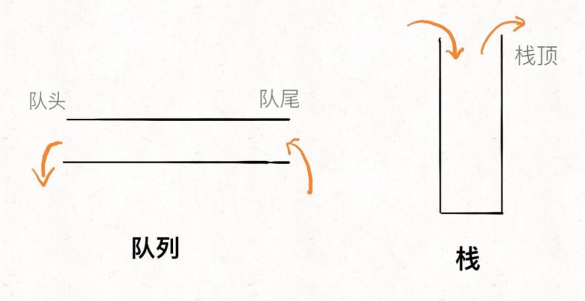<br />优先队列-priority_queue：带权值的队列。<br />常见栈的应用场景包括括号问题的求解，表达式的转换和求值，函数调用和递归实现，深度优先遍历 DFS 等；<br />常见的队列的应用场景包括计算机系统中各种资源的管理，消息缓冲队列的管理和广度优先遍历 BFS 等。<br />翻一下源码，就知道 stack 和 queue 的底层其实就是使用 deque，用 deque 为底层容器封装。<br />stack 的源码：
```cpp
#ifndef __STL_LIMITED_DEFAULT_TEMPLATES
template <class T, class Sequence = deque<T> >
#else
template <class T, class Sequence>
#endif
class stack {
public:
  typedef typename Sequence::value_type value_type;
  typedef typename Sequence::size_type size_type;
  typedef typename Sequence::reference reference;
  typedef typename Sequence::const_reference const_reference;
protected:
  Sequence c;

queue 的源码：
#ifndef __STL_LIMITED_DEFAULT_TEMPLATES
template <class T, class Sequence = deque<T> >
#else
template <class T, class Sequence>
#endif
class queue {
public:
  typedef typename Sequence::value_type value_type;
  typedef typename Sequence::size_type size_type;
  typedef typename Sequence::reference reference;
  typedef typename Sequence::const_reference const_reference;
protected:
  Sequence c;
```
<a name="b0tLm"></a>
### heap堆
最后来看一下，heap ，heap 并不是一个容器，所以他没有实现自己的迭代器，也就没有遍历操作，它只是一种算法。
<a name="s2O5d"></a>
#### push_heap 插入元素
插入函数是 push_heap， heap 只接受 RandomAccessIterator 类型的迭代器。
```cpp
template <class RandomAccessIterator>
inline void push_heap(RandomAccessIterator first, RandomAccessIterator last) {
  __push_heap_aux(first, last, distance_type(first), value_type(first));
}

template <class RandomAccessIterator, class Distance, class T>
inline void __push_heap_aux(RandomAccessIterator first, RandomAccessIterator last, Distance*, T*) {
    // 这里传入的是两个迭代器的长度, 0, 还有最后一个数据
  __push_heap(first, Distance((last - first) - 1), Distance(0),  T(*(last - 1)));
}
```
<a name="ZZygi"></a>
#### pop_heap 删除元素
pop 操作其实并没有真正意义去删除数据，而是将数据放在最后，只是没有指向最后的元素而已，这里使用 arrary 也可以，毕竟没有对数组的大小进行调整。<br />pop 的实现有两种，这里都罗列了出来，另一个传入的是 cmp 仿函数。
```cpp
template <class RandomAccessIterator, class Compare>
inline void pop_heap(RandomAccessIterator first, RandomAccessIterator last,
                     Compare comp) {
    __pop_heap_aux(first, last, value_type(first), comp);
}
template <class RandomAccessIterator, class T, class Compare>
inline void __pop_heap_aux(RandomAccessIterator first,
                           RandomAccessIterator last, T*, Compare comp) {
  __pop_heap(first, last - 1, last - 1, T(*(last - 1)), comp,
             distance_type(first));
}
template <class RandomAccessIterator, class T, class Compare, class Distance>
inline void __pop_heap(RandomAccessIterator first, RandomAccessIterator last,
                       RandomAccessIterator result, T value, Compare comp,
                       Distance*) {
  *result = *first;
  __adjust_heap(first, Distance(0), Distance(last - first), value, comp);
}
template <class RandomAccessIterator, class T, class Distance>
inline void __pop_heap(RandomAccessIterator first, RandomAccessIterator last,
                       RandomAccessIterator result, T value, Distance*) {
  *result = *first; // 因为这里是大根堆, 所以first的值就是最大值, 先将最大值保存.
  __adjust_heap(first, Distance(0), Distance(last - first), value);
}
```
make_heap 将数组变成堆存放
```cpp
template <class RandomAccessIterator>
inline void make_heap(RandomAccessIterator first, RandomAccessIterator last) {
  __make_heap(first, last, value_type(first), distance_type(first));
}
template <class RandomAccessIterator, class T, class Distance>
void __make_heap(RandomAccessIterator first, RandomAccessIterator last, T*,
                 Distance*) {
  if (last - first < 2) return;
    // 计算长度, 并找出中间的根值
  Distance len = last - first;
  Distance parent = (len - 2)/2;
    
  while (true) {
      // 一个个进行调整, 放到后面
    __adjust_heap(first, parent, len, T(*(first + parent)));
    if (parent == 0) return;
    parent--;
  }
}
```
<a name="GV10N"></a>
#### sort_heap 实现堆排序
其实就是每次将第一位数据弹出从而实现排序功。
```cpp
template <class RandomAccessIterator>
void sort_heap(RandomAccessIterator first, RandomAccessIterator last) {
  while (last - first > 1) pop_heap(first, last--);
}
template <class RandomAccessIterator, class Compare>
void sort_heap(RandomAccessIterator first, RandomAccessIterator last,
               Compare comp) {
  while (last - first > 1) pop_heap(first, last--, comp);
}
```
<a name="ulx9x"></a>
### priority_queue 优先队列
最后来看一下 priority_queue。<br />上一节分析 heap 其实就是为 priority_queue 做准备，priority_queue 是一个优先级队列，是带权值的， 支持插入和删除操作，其只能从尾部插入，头部删除， 并且其顺序也并非是根据加入的顺序排列的。<br />priority_queue 因为也是队列的一种体现， 所以也就跟队列一样不能直接的遍历数组，也就没有迭代器。<br />priority_queue 本身也不算是一个容器，它是以 vector 为容器以 heap为数据操作的配置器。
<a name="WYOFn"></a>
#### 类型定义
```cpp
#ifndef __STL_LIMITED_DEFAULT_TEMPLATES
template <class T, class Sequence = vector<T>, 
          class Compare = less<typename Sequence::value_type> >
#else
template <class T, class Sequence, class Compare>
#endif
class  priority_queue {
public:
 // 符合traits编程规范
  typedef typename Sequence::value_type value_type;
  typedef typename Sequence::size_type size_type;
  typedef typename Sequence::reference reference;
  typedef typename Sequence::const_reference const_reference;
protected:
  Sequence c; // 定义vector容器的对象
  Compare comp; // 定义比较函数(伪函数)
  ...
};
```
<a name="jg0Po"></a>
#### 属性获取
priority_queue 只有简单的 3 个属性获取的函数, 其本身的操作也很简单, 只是实现依赖了 vector 和 heap 就变得比较复杂。
```cpp
class  priority_queue {
 ...
public:
  bool empty() const { return c.empty(); }
  size_type size() const { return c.size(); }
  const_reference top() const { return c.front(); }
    ...
};
```
<a name="QmsTP"></a>
#### push 和 pop 实现
push 和 pop 具体都是采用的 heap 算法。<br />priority_queue 本身实现是很复杂的，但是当了解过 vector，heap 之后再来看，它其实就简单了。<br />就是将 vector 作为容器， heap 作为算法来操作的配置器，这也体现了 STL 的灵活性： 通过各个容器与算法的结合就能实现另一种功能。<br />最后，来自实践生产环境的一个体会：上面所列的所有容器的一个原则：为了避免拷贝开销，不要直接把大的对象直接往里塞，而是使用指针。
