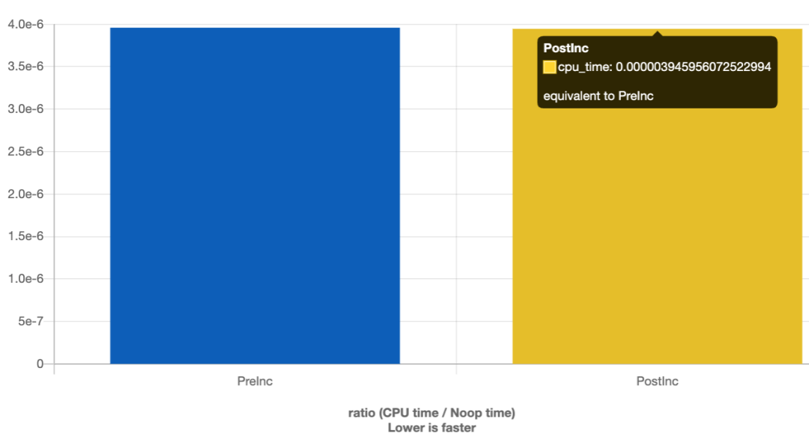
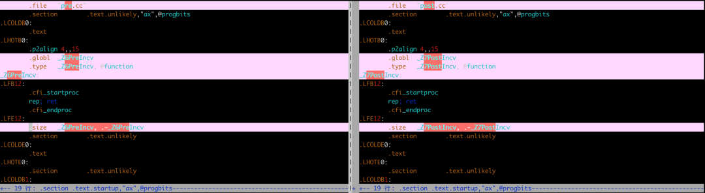

# C++

无论是查阅资料、技术博客亦或是同事间的技术交流，都有一个共识：**在循环的时候，务必使用前置操作符，因为其性能优于后置操作符，久而久之，这个就像一个不成文的规定，大家都在遵循，久而久之，成为潜移默化的编码习惯。而使得大家持有这个观点的原因就是后置操作会产生临时变量，而后置操作则不会**。

借助本文，来分析或者证明下该结了正确与否~~
<a name="ITdiJ"></a>

## 原因
后置操作和前置操作，一个会产生临时变量，一个不会产生临时变量，其原因是：**前置操作遵循的规则是**change-then-use，**而后置操作遵循的规则是**use-then-change。正因为后置操作的use-then-change原则，使得编译器在实现该操作的时候，先把之前的值进行拷贝备份，然后对值进行更改操作，最后返回之前备份的值。

以整型为例：

```cpp
// ++i
i = i+1;
return i;

// i++
temp = i;
i=i+1;
return temp;
```
同样，对于复杂类型：
```cpp
// ++i
Object &operator++() {     
    ++value_;     
    return *this;   
}    
// i++    
Object operator++(int) {     
    Object old = *this;    
    ++*this;     
    return old;  
}
```
也正是基于上述原因，通常会得出一个结论：前置操作比后置操作更快。<br />那么，真的是这样么？下面将分别从**内置类型和非内置类型**两个方面进行分析。
<a name="Umir0"></a>
## 内置类型
为了便于分析二者的性能，写了个测试代码，用来比较前置++和后置++的性能差异，代码如下：<br />pre_inc.cc
```cpp
void PreInc() {
  for (int i = 0; i < 100000; ++i) {
     for (int j = 0; j < 100000; ++j) {
       for (int k = 0; k < 1000; ++k);
     }
   }
}
int main() {
  PreInc();
  return 0;
}
```
post_inc.cc
```cpp
void PostInc() {
  for (int i = 0; i < 100000; i++) {
     for (int j = 0; j < 100000; j++) {
       for (int k = 0; k < 1000; k++);
     }
   }
}
int main() {
  PostInc();
  return 0;
}
```
编译运行之后，比较二者的运行时间，对比图如下：<br /><br />耗时竟然一样😲，颠覆了之前对这块的认知。<br />使用下述命令生成汇编代码(**使用**`**-O0**`**禁用优化以免结果产生偏差**)：
```bash
$ g++ -O0 -S pre.cc
$ g++ -O0 -S post.cc
```
查看上述两个汇编文件的不同点(使用vimdiff):<br /><br />通过上述对比，发现前置++和后置++的汇编结果一致，这也就是说至少对于内置类型(上述代码使用的是int)，前置++和后置++的性能一样。在进行搜索的时候，发现了下面这段话：
> “The compiler will optimize it away” is an _incredibly_ lazy justification for using i++ instead of ++i. Moreover, it is basically only true for built-in types, not for class types.

从上述可以看出，对于内置类型的后置++操作，编译器会进行优化，而对于非内置内存，则不会进行优化，那么到底是不是这样呢？
<a name="RY4UE"></a>
## 自定义类型
<a name="PC4qq"></a>
### 迭代器
对于C++开发人员，在遍历vector、list或者set等结构的时候，都习惯于使用迭代器即iterator进行遍历，而gcc实现中，对iterator(此处只罗列了vector相关)的定义如下：
```cpp
typedef __gnu_cxx::__normal_iterator<pointer, vector> iterator;
```
从上述定义可以看出，`**iterator**`**不是内置类型**，同内置类型一样，`**iterator**`**也支持前置++和后置++**，所以，在本节中使用迭代器的前置++和后置++对容器进行遍历，以测试其性能，代码如下：
```cpp
#include <chrono>
#include <iostream>
#include <numeric>
#include <vector>

int main(int, char**)
{
  std::vector<unsigned> v1( 1000000 );
  std::vector<unsigned> v2( 1000000 );

  std::iota( v1.begin(), v1.end(), 1 );
  std::iota( v2.begin(), v2.end(), 2 );

  std::chrono::time_point<std::chrono::high_resolution_clock> t1, t2, t3;

  t1 = std::chrono::high_resolution_clock::now();

  for( auto it = v1.begin(); it != v1.end(); ++it )
    *it *= 2;

  t2 = std::chrono::high_resolution_clock::now();

  for( auto it = v2.begin(); it != v2.end(); it++ )
    *it *= 2;

  t3 = std::chrono::high_resolution_clock::now();

  std::chrono::duration<double> d1 = t2 - t1;
  std::chrono::duration<double> d2 = t3 - t2;

  std::cout << "pre time cost: " << std::chrono::duration_cast<std::chrono::microseconds>(d1).count() << "us" << std::endl;
  std::cout << "post time cost:  " << std::chrono::duration_cast<std::chrono::microseconds>(d2).count() << "us" << std::endl;

  return 0;
}
```
编译并运行：
```bash
g++ --std=c++11 test.cc -o test; ./test
pre time cost: 44008us
post time cost:  58283us
```
通过上述结果可以看出，对于非内置类型（或者更确切的说对于迭代器类型），**前置操作的性能优于后置**。<br />上面从执行时间的角度分析了迭代器的前置操作和后置操作对性能的影响，下面是STL中对`iterator`的源码：
```cpp
__normal_iterator&
       operator++() // 前置操作
       {
     ++_M_current;
     return *this;
       }

 __normal_iterator
       operator++(int) // 后置操作
       { return __normal_iterator(_M_current++); }
```
从上面代码可以看出，迭代器的前置和后置操作主要有以下两个区别：

- 返回值：前置操作返回对象的引用，后置操作返回类型为对象，
- 拷贝：前置操作无拷贝操作，后置操作存在一次对象拷贝

正式因为这两个原因，前置操作符就地修改对象，而后置操作符将导致创建临时对象，调用构造函数和析构函数（某些情况下编译器会做优化，此处不做讨论），导致了前置操作和后置操作的性能差异。
<a name="Ip5lA"></a>
### 自定义对象
在上一节中，通过迭代器(前置递增和后置递增)遍历对`vector`进行遍历，证明了前置递增的性能优于后置递增，在本节中，将自定义一个对象，然后进行测试。<br />代码如下（在最开始的自定义对象中，只有整数`value_`而没有`v_`变量，这就导致测试结果很相近，所以为了更加明显的看出其差异，所以增加了vector😁）：
```cpp
class Object {
  public:
    Object(int value)
      : value_(value) {
        v_.emplace_back(value_);
      }

    int Get() { return value_; }

    Object &operator++() // 前置操作
    {
      ++value_;
      v_.emplace_back(value_);
      return *this;
    }

    Object operator++(int) // 后置操作
    {
      Integer tmp = *this; // 拷贝，注意此处这个拷贝行为以及临时变量
      ++value_;
      v_.emplace_back(value_);
      return tmp; //
    }

  private:
    std::vector<int> v_;
    int value_;
};

int main() {
  std::chrono::time_point<std::chrono::high_resolution_clock> t1, t2, t3;

  t1 = std::chrono::high_resolution_clock::now();
  Integer i(0);
  for (int j = 0; j < 10000; ++j) {
    ++i;
  }
  t2 = std::chrono::high_resolution_clock::now();
  Integer k(0);
  for (int j = 0; j < 10000; ++j) {
    k++;
  }
  t3 = std::chrono::high_resolution_clock::now();
  
  std::chrono::duration<double> d1 = t2 - t1;
  std::chrono::duration<double> d2 = t3 - t2;

  std::cout << "pre time cost: " << std::chrono::duration_cast<std::chrono::microseconds>(d1).count() << "us" << std::endl;
  std::cout << "post time cost:  " << std::chrono::duration_cast<std::chrono::microseconds>(d2).count() << "us" << std::endl;
  
  return 0;
}
```
编译并运行：
```bash
g++ --std=c++11 test.cc -o test; ./test
pre time cost: 188us
post time cost:  29625us
```
从上述测试结果可以进一步看出，前置++的性能优于后置++。<br />对于内置类型来说，前置++和后置++的性能一样，这是因为编译器会对其进行优化；而对于自定义类型的前置和后置操作，你可能会有疑问，**为什么编译器不能像优化内置类型一样，优化自定义类型呢？**这是因为依赖于场景。在某些场景下编译器可以进行优化（主要是拷贝部分），但是在某些情况下，编译器无法在不更改代码含义的情况下对其进行优化。所以，**除非需要后置操作，否则建议使用前置操作**。
## 结语
在本文中，分别从内置类型的前后置操作和自定义类型的后置操作进行性能对比，结果发现**对于内置类型，二者在性能上无差异，而对于自定义类型，前置操作的性能远优于后置操作**。

除非必须使用`i++`以满足编码场景，否则，在任何情况下都建议使用`++i`这种前置操作。

很多人都会认为**前置操作性能优于后置操作，这是错误的观点，在此进行下纠正，准确的说法应该是前置操作不会比后置操作性能差**。
