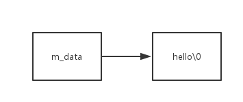
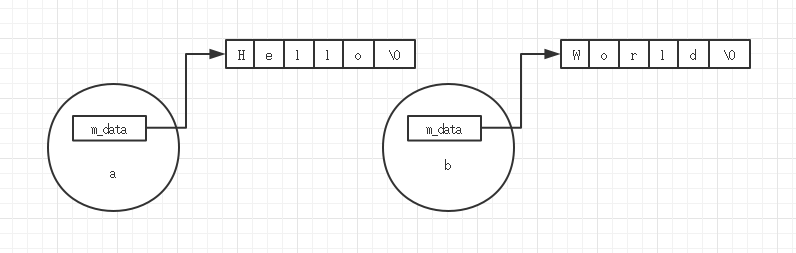
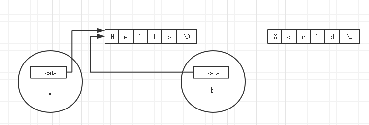
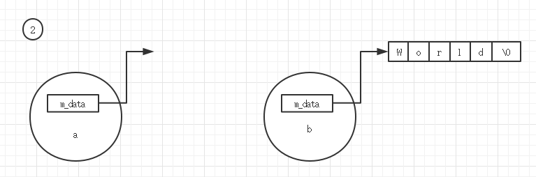
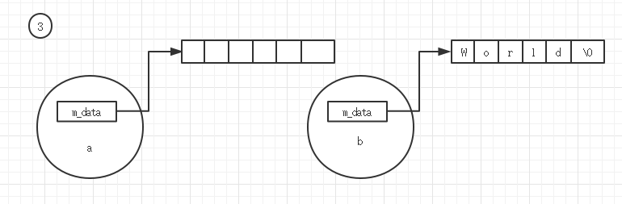
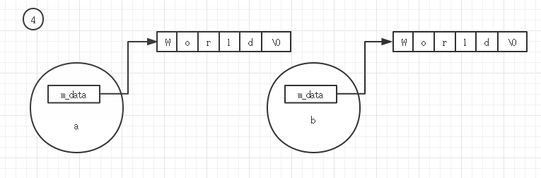
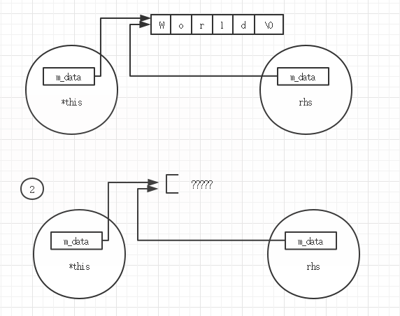

## 以良好的方式编写C++ class
假设现在要实现一个复数类complex，在类的实现过程中探索良好的编程习惯。
### ① Header(头文件)中的防卫式声明
```cpp
complex.h:
# ifndef  __COMPLEX__
# define __COMPLEX__
class complex
{

}
# endif
```
防止头文件的内容被多次包含。
### ② 把数据放在private声明下，提供接口访问数据
```cpp
# ifndef  __COMPLEX__
# define __COMPLEX__
class complex
{
    public:
        double real() const {return re;}
        double imag() const {return im;}
    private:
        doubel re,im;
}
# endif
```
### ③ 不会改变类属性（数据成员）的成员函数，全部加上`const`声明
例如上面的成员函数：
```cpp
double real () `const` {return re;}
double imag() `const` {return im;}
```
既然函数不会改变对象，那么就如实说明，编译器能帮你确保函数的`const`属性，阅读代码的人也明确你的意图。<br />而且，`const`对象才可以调用这些函数——`const`对象不能够调用非`const`成员函数。
<a name="Pbwe5"></a>
### ④ 使用构造函数初始值列表
```cpp
class complex
{
    public:
        complex(double r = 0, double i =0)
            : re(r), im(i)  { }
    private:
        doubel re,im;
}
```
在初始值列表中，才是初始化。在构造函数体内的，叫做赋值。
<a name="SakMV"></a>
### ⑤如果可以，参数尽量使用reference to const
为complex 类添加一个+=操作符：
```cpp
class complex
{
    public:
        complex& operator += (const complex &)
}
```
使用引用避免类对象构造与析构的开销，使用const确保参数不会被改变。内置类型的值传递与引用传递效率没有多大差别，甚至值传递效率会更高。<br />例如，传递char类型时，值传递只需传递一个字节；引用实际上是指针实现，需要四个字节（32位机）的传递开销。但是为了一致，不妨统一使用引用。
<a name="RwhoW"></a>
### ⑥ 如果可以，函数返回值也尽量使用引用
以引用方式返回函数局部变量会引发程序未定义行为，离开函数作用域局部变量被销毁，引用该变量没有意义。但是我要说的是，如果可以，函数应该返回引用。<br />当然，要放回的变量要有一定限制：**该变量的在进入函数前，已经被分配了内存**。以此条件来考量，很容易决定是否要放回引用。而在函数被调用时才创建出来的对象，一定不能返回引用。<br />说回`operator +=`，其返回值就是引用，原因在于，执行`a+=b`时，a已经在内存上存在了。<br />而`operator +` ，其返回值不能是引用，因为a+b的值，在调用`operator +`的时候才产生。<br />下面是`operator+=` 与`operator +`的实现：
```cpp
inline complex & complex :: operator += (const complex & r)
{
        this -> re+= r->re;
        this -> im+= r->im;
        return * this;
}
inline complex operator + (const complex & x , const complex & y)
{
        return complex ( real (x)+ real (y), //新创建的对象，不能返回引用
                         imag(x)+ imag(y));
}
```
在`operator +=`中返回引用还是必要的，这样可以使用连续的操作：
```cpp
c3 += c2 += c1;
```
<a name="DAU3N"></a>
### ⑦ 如果重载了操作符，就考虑是否需要多个重载
就复数类来说，`+`可以有多种使用方式：
```cpp
complex c1(2,1);
complex c2;
c2 = c1+ c2;
c2 = c1 + 5;
c2 = 7 + c1;
```
为了应付怎么多种加法，+需要有如下三种重载：
```cpp
inline complex operator+ (const complex & x ,const complex & y)
{
    return complex (real(x)+real(y),
                    imag(x+imag(y););
}
inline complex operator + (const complex & x, double y)
{
    return complex (real(x)+y,imag(x));

inline complex operator + (double x，const complex &y)
{
    return complex (x+real(y),imag(y));
}
```
<a name="OQM2B"></a>
### ⑧ 提供给外界使用的接口，放在类声明的最前面
想想确实是有道理，类的用户用起来也舒服，一眼就能看见接口。
<a name="Pwv1K"></a>
## Class with pointer member(s)：记得写Big Three
C++的类可以分为带指针数据成员与不带指针数据成员两类，complex就属于不带指针成员的类。而这里要说的字符串类String，一般的实现会带有一个`char *`指针。带指针数据成员的类，需要自己实现class三大件：拷贝构造函数、拷贝赋值函数、析构函数。
```cpp
class String
{
    public:
        String (const char * cstr = 0);
        String (const String & str);
        String & operator = (const String & str);
        ~String();
        char * get_c_str() const {return m_data};
    private:
        char * m_data;
}
```
如果没有写拷贝构造函数、赋值构造函数、析构函数，编译器默认会写一套。然而带指针的类不能依赖编译器的默认实现——这涉及到资源的释放、深拷贝与浅拷贝的问题。在实现String类的过程中来阐述这些问题。
<a name="OjjCw"></a>
### ①析构函数释放动态分配的内存资源
如果class里有指针，多半是需要进行内存动态分配（例如String），析构函数必须负责在对象生命结束时释放掉动态申请来的内存，否则就造成了内存泄露。<br />局部对象在离开函数作用域时，对象析构函数被自动调用，而使用new动态分配的对象，也需要显式的使用delete来删除对象。而delete实际上会调用对象的析构函数，必须在析构函数中完成释放指针m_data所申请的内存。下面是一个构造函数，体现了m_data的动态内存申请：
```cpp
/*String的构造函数*/
inline
String ::String (const char *cstr = 0)
{
    if(cstr)
    {
        m_data = new char[strlen(cstr)+1];   // 这里，m_data申请了内存
        strcpy(m_data,cstr);
    }
    else
    {
        m_data= new char[1];
        *m_data = '\0';
    }
}
```
这个构造函数以C风格字符串为参数，当执行
```cpp
String *p = new String ("hello");
```
m_data向系统申请了一块内存存放字符串hello：<br /><br />析构函数必须负责把这段动态申请来的内存释放掉：
```cpp
inline
String ::~String()
{
    delete[]m_data;
}
```
<a name="nfw4g"></a>
### ②赋值构造函数与复制构造函数负责进行深拷贝
来看看如果使用编译器为String默认生成的拷贝构造函数与赋值操作符会发生什么事情。默认的复制构造函数或赋值操作符所做的事情是对类的内存进行按位的拷贝，也称为**浅拷贝**，它们只是把对象内存上的每一个bit复制到另一个对象上去，在String中就只是复制了指针，而不复制指针所指内容。现在有两个String对象：
```cpp
String a("Hello");
String b("World");
```
a、b在内存上如图所示：<br /><br />如果此时执行
```cpp
b = a;
```
浅拷贝体现为：<br /><br />存储World\0的内存块没有指针所指向，已经成了一块无法利用内存，从而发生了内存泄露。不止如此，如果此时对象a被删除，使用上面所写的析构函数，存储Hello\0的内存块就被释放调用，此时b.m_data成了一个野指针。<br />来看看自己实现的构造函数是如何解决这个问题的，它复制的是指针所指的内存内容，这称为**深拷贝**
```cpp
/*拷贝赋值函数*/
inline String &String ::operator= (const String & str)
{
    if(this == &str)           //①
        return *this;
    delete[] m_data;        //②
    m_data = new char[strlen(str.m_data)+1];        //③
    strcpy(m_data,str.m_data);            //④
    return *this
}
```
这是拷贝赋值函数的经典实现，要点在于：<br />① 处理自我赋值，如果不存在自我赋值问题，继续下列步骤：② 释放自身已经申请的内存 ③ 申请一块大小与目标字符串一样大的内存 ④ 进行字符串的拷贝<br />对于a = b，②③④过程如下：<br /><br /><br /><br />同样的，复制构造函数也是一个深拷贝的过程：
```cpp
inline String ::String(const String & str )
{
    m_data = new char[ strlen (str) +1];
    strcpy(m_data,str.m_data);
}
```
另外，**一定要在operator = 中检查是否self assignment** 假设这时候确实执行了对象的自我赋值，左右pointers指向同一个内存块，前面的步骤②delete掉该内存块造成下面的结果。当企图对rhs的内存进行访问是，结果是未定义的。<br />
<a name="YqfTi"></a>
## static与类
<a name="G8ev5"></a>
### ① 不和对象直接相关的数据，声明为`static`
想象有一个银行账户的类，每个人都可以开银行账户。存在银行利率这个成员变量，它不应该属于对象，而应该属于银行这个类，由所有的用户来共享。<br />`static`修饰成员变量时，该成员变量放在程序的全局区中，整个程序运行过程中只有该成员变量的一份副本。而普通的成员变量存在每个对象的内存中，若把银行利率放在每个对象中，是浪费了内存。
<a name="Ov0Dk"></a>
### ② `static`成员函数没有this指针
`static`成员函数与普通函数一样，都是只有一份函数的副本，存储在进程的代码段上。不一样的是，`static`成员函数没有this指针，所以它不能够调用普通的成员变量，只能调用`static`成员变量。普通成员函数的调用需要通过对象来调用，编译器会把对象取地址，作为this指针的实参传递给成员函数：
```cpp
obj.func() ---> Class :: fun(&obj);
```
而`static`成员函数即可以通过对象来调用，也可以通过类名称来调用。
<a name="kN4co"></a>
### ③在类的外部定义`static`成员变量
另一个问题是`static`成员变量的定义。`static`成员变量必须在类外部进行定义：
```cpp
class A
{
    private:
        static int a; //①
}
int A::a = 10;  //②
```
注意①是声明，②才是定义，定义为变量分配了内存。
<a name="dDYNQ"></a>
### ④`static`与类的一些小应用
这些可以用来应付一下面试，在实现单例模式的时候，`static`成员函数与`static`成员变量得到了使用，下面是一种称为”饿汉式“的单例模式的实现：
```cpp
class A
{
public:
    static A& getInstance();
    setup(){...};
private:
    A();
    A(const A & rhs);
    static A a;
}
```
这里把class A的构造函数都设置为私有，不允许用户代码创建对象。要获取对象实例需要通过接口getInstance。”饿汉式“缺点在于无论有没有代码需要a，a都被创建出来。下面是改进的单例模式，称为”懒汉式“：
```cpp
class A
{
    public:
        static  A& getInstance();
        setup(){....};
    private:
        A();
        A(const A& rsh);
        ...
};
A& A::getInstance()
{
        static A a;
        return a;
}
```
“懒汉式”只有在真正需要a时，调用getInstance才创建出唯一实例。这可以看成一个具有拖延症的单例模式，不到最后关头不干活。很多设计都体现了这种拖延的思想，比如string的写时复制，真正需要的时候才分配内存给string对象管理的字符串。
