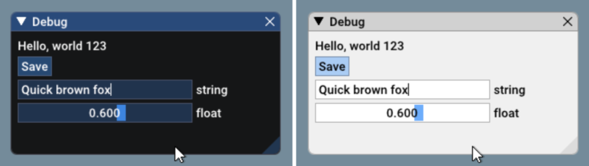
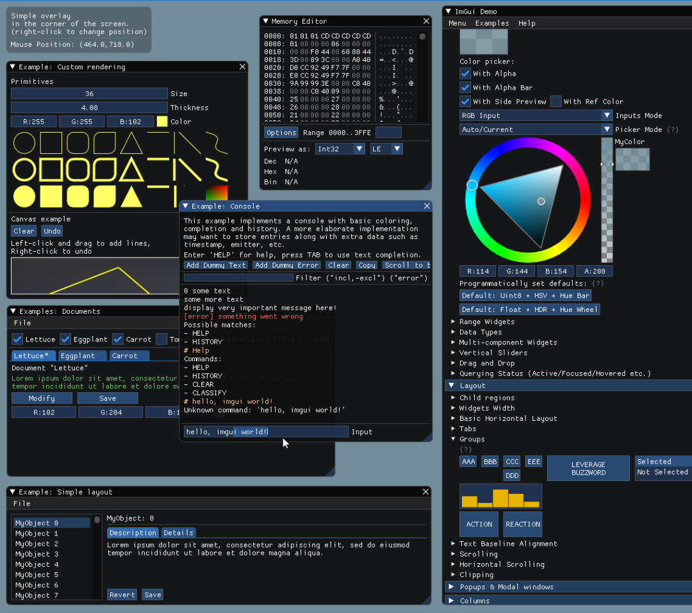

# C++

<a name="Q0ufq"></a>

## 1、Google 的 C++ 测试框架
GoogleTest 是测试技术团队根据 Google 的特定要求和约束条件开发的测试框架。无论是在 Linux、Windows 还是 Mac 上工作，只要编写 C++ 代码，GoogleTest 都可以提供帮助。<br />项目地址：[https://github.com/google/googletest](https://github.com/google/googletest)
<a name="lDKdj"></a>
## 2、用于 C++ 的图形用户界面库
Dear ImGui 是一个用于 C++ 的无膨胀图形用户界面库，它输出优化的顶点缓冲区，你可以在启用的 3D 应用程序中随时渲染这些缓冲区，特别适合集成到游戏引擎（用于工具）、实时 3D 应用程序、全屏应用程序、嵌入式应用程序或操作系统功能非标准控制台上的任何应用程序中。<br />项目地址：[https://github.com/ocornut/imgui](https://github.com/ocornut/imgui)<br />Dear ImGui 的核心是独立的，不需要特定的构建过程，可以将 .cpp 文件添加到现有项目中。
```cpp
ImGui::Text("Hello, world %d", 123);
if (ImGui::Button("Save"))
    MySaveFunction();
ImGui::InputText("string", buf, IM_ARRAYSIZE(buf));
ImGui::SliderFloat("float", &f, 0.0f, 1.0f);
```
Result：深色风格（左），浅色风格（右）/字体：Roboto-Medium，16px<br /><br />调用 `ImGui::ShowDemoWindow()` 函数将创建一个展示各种功能和示例的演示窗口<br />
