# C++


<a name="Grvzx"></a>

## 项目介绍
本项目实现的是一个HTTP服务器，项目中将会通过基本的网络套接字读取客户端发来的HTTP请求并进行分析，最终构建HTTP响应并返回给客户端。<br />HTTP在网络应用层中的地位是不可撼动的，无论是移动端还是PC端浏览器，HTTP无疑是打开互联网应用窗口的重要协议。<br />该项目将会把HTTP中最核心的模块抽取出来，采用CS模型实现一个小型的HTTP服务器，目的在于理解HTTP协议的处理过程。<br />该项目主要涉及C/C++、HTTP协议、网络套接字编程、CGI、单例模式、多线程、线程池等方面的技术。
<a name="lhqrP"></a>
## 网络协议栈介绍
### 协议分层
网络协议栈的分层情况如下：

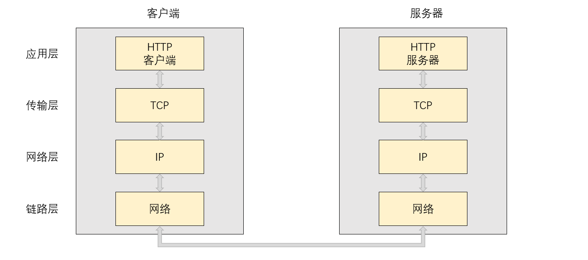网络协议栈中各层的功能如下：

1. 应用层：根据特定的通信目的，对数据进行分析处理，以达到某种业务性的目的。
2. 传输层：处理传输时遇到的问题，主要是保证数据传输的可靠性。
3. 网络层：完成数据的转发，解决数据去哪里的问题。
4. 链路层：负责数据真正的发生过程。
### 数据的封装与分用
数据封装与分用的过程如下：

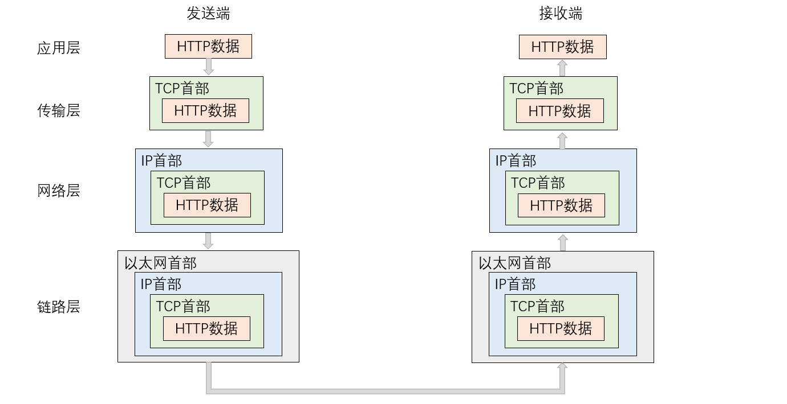也就是说，发送端在发生数据前，该数据需要先自顶向下贯穿网络协议栈完成数据的封装，在这个过程中，每一层协议都会为该数据添加上对应的报头信息。接收端在收到数据后，该数据需要先自底向上贯穿网络协议栈完成数据的解包和分用，在这个过程中，每一层协议都会将对应的报头信息提取出来。<br />而本项目要做的就是，在接收到客户端发来的HTTP请求后，将HTTP的报头信息提取出来，然后对数据进行分析处理，最终将处理结果添加上HTTP报头再发送给客户端。<br />需要注意的是，该项目中我们所处的位置是应用层，因此我们读取的HTTP请求实际是从传输层读取上来的，而我们发送的HTTP响应实际也只是交给了传输层，数据真正的发送还得靠网络协议栈中的下三层来完成，这里直接说“接收到客户端的HTTP请求”以及“发送HTTP响应给客户端”，只是为了方便大家理解，此外，同层协议之间本身也是可以理解成是在直接通信的。


## HTTP相关知识介绍
### HTTP的特点
HTTP的五大特点如下：

1. 客户端服务器模式（CS，BS）：在一条通信线路上必定有一端是客户端，另一端是服务器端，请求从客户端发出，服务器响应请求并返回。
2. 简单快速：客户端向服务器请求服务时，只需传送请求方法和请求资源路径，不需要发送额外过多的数据，并且由于HTTP协议结构较为简单，使得HTTP服务器的程序规模小，因此通信速度很快。
3. 灵活：HTTP协议对数据对象没有要求，允许传输任意类型的数据对象，对于正在传输的数据类型，HTTP协议将通过报头中的Content-Type属性加以标记。
4. 无连接：每次连接都只会对一个请求进行处理，当服务器对客户端的请求处理完毕并收到客户端的应答后，就会直接断开连接。HTTP协议采用这种方式可以大大节省传输时间，提高传输效率。
5. 无状态：HTTP协议自身不对请求和响应之间的通信状态进行保存，每个请求都是独立的，这是为了让HTTP能更快地处理大量事务，确保协议的可伸缩性而特意设计的。

说明一下：

1. 随着HTTP的普及，文档中包含大量图片的情况多了起来，每次请求都要断开连接，无疑增加了通信量的开销，因此HTTP1.1支持了长连接Keey-Alive，就是任意一端只要没有明确提出断开连接，则保持连接状态。（当前项目实现的是1.0版本的HTTP服务器，因此不涉及长连接）
2. HTTP无状态的特点无疑可以减少服务器内存资源的消耗，但是问题也是显而易见的。比如某个网站需要登录后才能访问，由于无状态的特点，那么每次跳转页面的时候都需要重新登录。为了解决无状态的问题，于是引入了Cookie技术，通过在请求和响应报文中写入Cookie信息来控制客户端的状态，同时为了保护用户数据的安全，又引入了Session技术，因此现在主流的HTTP服务器都是通过Cookie+Session的方式来控制客户端的状态的。
<a name="JgSLf"></a>
### URL格式
URL（Uniform Resource Lacator）叫做统一资源定位符，也就是通常所说的网址，是因特网的万维网服务程序上用于指定信息位置的表示方法。<br />一个URL大致由如下几部分构成：<br />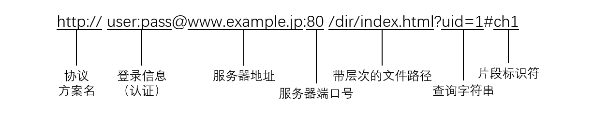<br />简单说明：

1. http://表示的是协议名称，表示请求时需要使用的协议，通常使用的是HTTP协议或安全协议HTTPS。
2. user:pass表示的是登录认证信息，包括登录用户的用户名和密码。（可省略）
3. www.example.jp表示的是服务器地址，通常以域名的形式表示。
4. 80表示的是服务器的端口号。（可省略）
5. /dir/index.html表示的是要访问的资源所在的路径（/表示的是web根目录）。
6. uid=1表示的是请求时通过URL传递的参数，这些参数以键值对的形式通过&符号分隔开。（可省略）
7. ch1表示的是片段标识符，是对资源的部分补充。（可省略） 注意：
8. 如果访问服务器时没有指定要访问的资源路径，那么浏览器会自动添加`/`，但此时仍然没有指明要访问web根目录下的哪一个资源文件，这时默认访问的是目标服务的首页。
9. 大部分URL中的端口号都是省略的，因为常见协议对应的端口号都是固定的，比如HTTP、HTTPS和SSH对应的端口号分别是80、443和22，在使用这些常见协议时不必指明协议对应的端口号，浏览器会自动进行填充。
<a name="BF11I"></a>
### URI、URL、URN
URI、URL、URN的定义如下：

1. URI（Uniform Resource Indentifier）统一资源标识符：用来唯一标识资源。
2. URL（Uniform Resource Locator）统一资源定位符：用来定位唯一的资源。
3. URN（Uniform Resource Name）统一资源名称：通过名字来标识资源，比如mailto:java-net@java.sun.com。URI、URL、URN三者的关系 URL是URI的一种，URL不仅能唯一标识资源，还定义了该如何访问或定位该资源，URN也是URI的一种，URN通过名字来标识资源，因此URL和URN都是URI的子集。

URI、URL、URN三者的关系如下：<br />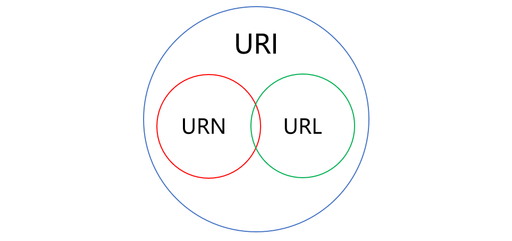<br />URI有绝对和相对之分：

1. 绝对的URI：对标识符出现的环境没有依赖，比如URL就是一种绝对的URI，同一个URL无论出现在什么地方都能唯一标识同一个资源。
2. 相对的URI：对标识符出现的环境有依赖，比如HTTP请求行中的请求资源路径就是一种相对的URI，这个资源路径出现在不同的主机上标识的就是不同的资源。
<a name="WvaPz"></a>
## HTTP的协议格式
HTTP请求协议格式如下：<br />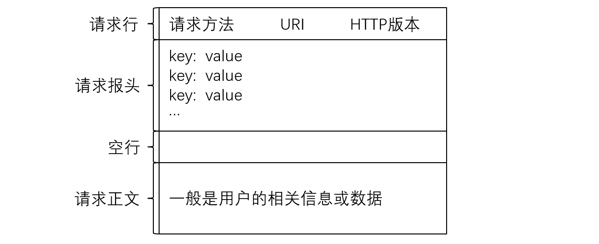HTTP请求由以下四部分组成：

1. 请求行：[请求方法] + [URI] + [HTTP版本]。
2. 请求报头：请求的属性，这些属性都是以key: value的形式按行陈列的。
3. 空行：遇到空行表示请求报头结束。
4. 请求正文：请求正文允许为空字符串，如果请求正文存在，则在请求报头中会有一个Content-Length属性来标识请求正文的长度。HTTP响应协议格式如下：

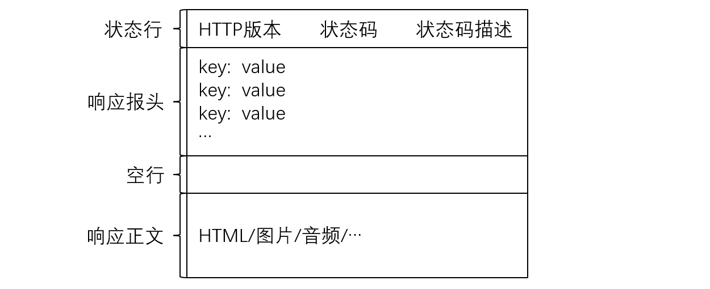

5. HTTP响应由以下四部分组成：
6. 状态行：[HTTP版本] + [状态码] + [状态码描述]。
7. 响应报头：响应的属性，这些属性都是以key: value的形式按行陈列的。
8. 空行：遇到空行表示响应报头结束。
9. 响应正文：响应正文允许为空字符串，如果响应正文存在，则在响应报头中会有一个Content-Length属性来标识响应正文的长度。
<a name="lcZ5B"></a>
### HTTP的请求方法
HTTP常见的请求方法如下：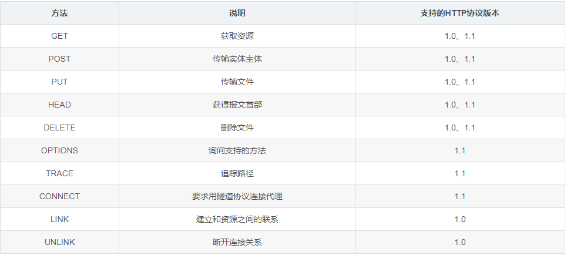<br />GET方法和POST方法<br />HTTP的请求方法中最常用的就是GET方法和POST方法，其中GET方法一般用于获取某种资源信息，而POST方法一般用于将数据上传给服务器，但实际GET方法也可以用来上传数据，比如百度搜索框中的数据就是使用GET方法提交的。<br />GET方法和POST方法都可以带参，其中GET方法通过URL传参，POST方法通过请求正文传参。由于URL的长度是有限制的，因此GET方法携带的参数不能太长，而POST方法通过请求正文传参，一般参数长度没有限制。
<a name="DVxNV"></a>
### HTTP的状态码
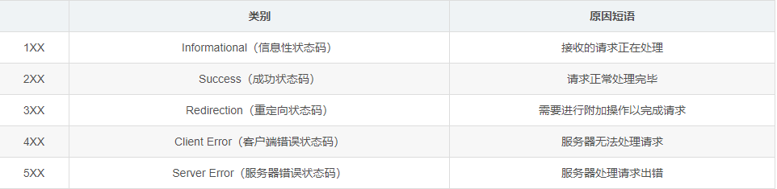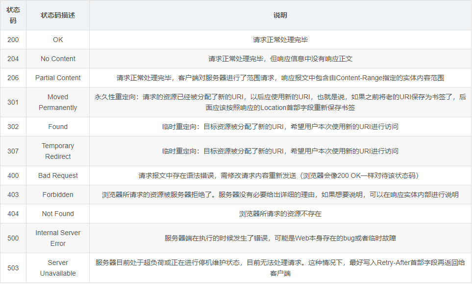
<a name="J5NFe"></a>
### HTTP常见的Header

1. Content-Type：数据类型（text/html等）。
2. Content-Length：正文的长度。
3. Host：客户端告知服务器，所请求的资源是在哪个主机的哪个端口上。
4. User-Agent：声明用户的操作系统和浏览器的版本信息。
5. Referer：当前页面是哪个页面跳转过来的。
6. Location：搭配3XX状态码使用，告诉客户端接下来要去哪里访问。
7. Cookie：用户在客户端存储少量信息，通常用于实现会话（session）的功能。
<a name="dYjJo"></a>
## CGI机制介绍
<a name="oQMml"></a>
### CGI机制的概念
CGI（Common Gateway Interface，通用网关接口）是一种重要的互联网技术，可以让一个客户端，从网页浏览器向执行在网络服务器上的程序请求数据。CGI描述了服务器和请求处理程序之间传输数据的一种标准。<br />实际在进行网络请求时，无非就两种情况：

1. 浏览器想从服务器上拿下来某种资源，比如打开网页、下载等。
2. 浏览器想将自己的数据上传至服务器，比如上传视频、登录、注册等。

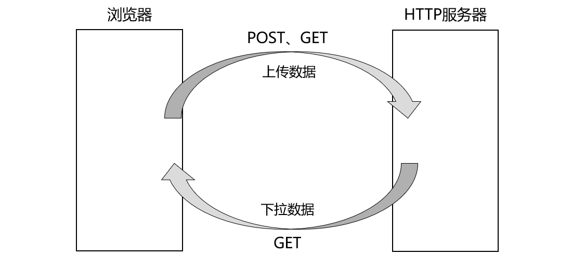<br />通常从服务器上获取资源对应的请求方法就是GET方法，而将数据上传至服务器对应的请求方法就是POST方法，但实际GET方法有时也会用于上传数据，只不过POST方法是通过请求正文传参的，而GET方法是通过URL传参的。<br />而用户将自己的数据上传至服务器并不仅仅是为了上传，用户上传数据的目的是为了让HTTP或相关程序对该数据进行处理，比如用户提交的是搜索关键字，那么服务器就需要在后端进行搜索，然后将搜索结果返回给浏览器，再由浏览器对HTML文件进行渲染刷新展示给用户。<br />但实际对数据的处理与HTTP的关系并不大，而是取决于上层具体的业务场景的，因此HTTP不对这些数据做处理。但HTTP提供了CGI机制，上层可以在服务器中部署若干个CGI程序，这些CGI程序可以用任何程序设计语言编写，当HTTP获取到数据后会将其提交给对应CGI程序进行处理，然后再用CGI程序的处理结果构建HTTP响应返回给浏览器。<br />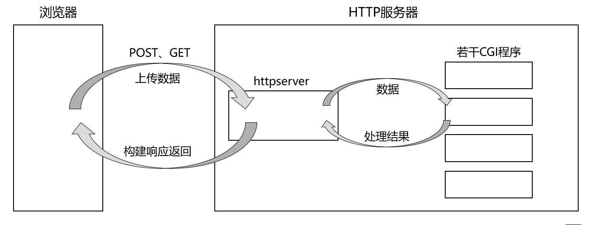<br />其中HTTP获取到数据后，如何调用目标CGI程序、如何传递数据给CGI程序、如何拿到CGI程序的处理结果，这些都属于CGI机制的通信细节，而本项目就是要实现一个HTTP服务器，因此CGI的所有交互细节都需要由我们来完成。<br />只要用户请求服务器时上传了数据，那么服务器就需要使用CGI模式对用户上传的数据进行处理，而如果用户只是单纯的想请求服务器上的某个资源文件则不需要使用CGI模式，此时直接将用户请求的资源文件返回给用户即可。<br />此外，如果用户请求的是服务器上的一个可执行程序，说明用户想让服务器运行这个可执行程序，此时也需要使用CGI模式。
<a name="mB45t"></a>
### CGI机制的实现步骤
<a name="y9x6G"></a>
#### 一、创建子进程进行程序替换
服务器获取到新连接后一般会创建一个新线程为其提供服务，而要执行CGI程序一定需要调用exec系列函数进行进程程序替换，但服务器创建的新线程与服务器进程使用的是同一个进程地址空间，如果直接让新线程调用exec系列函数进行进程程序替换，此时服务器进程的代码和数据就会直接被替换掉，相当于HTTP服务器在执行一次CGI程序后就直接退出了，这肯定是不合理的。因此新线程需要先调用fork函数创建子进程，然后让子进程调用exec系列函数进行进程程序替换。
<a name="eryRh"></a>
#### 二、完成管道通信信道的建立
调用CGI程序的目的是为了让其进行数据处理，因此需要通过某种方式将数据交给CGI程序，并且还要能够获取到CGI程序处理数据后的结果，也就是需要进行进程间通信。因为这里的服务器进程和CGI进程是父子进程，因此优先选择使用匿名管道。<br />由于父进程不仅需要将数据交给子进程，还需要从子进程那里获取数据处理的结果，而管道是半双工通信的，为了实现双向通信于是需要借助两个匿名管道，因此在创建调用fork子进程之前需要先创建两个匿名管道，在创建子进程后还需要父子进程分别关闭两个管道对应的读写端。
<a name="so9B4"></a>
#### 三、完成重定向相关的设置
创建用于父子进程间通信的两个匿名管道时，父子进程都是各自用两个变量来记录管道对应读写端的文件描述符的，但是对于子进程来说，当子进程调用exec系列函数进行程序替换后，子进程的代码和数据就被替换成了目标CGI程序的代码和数据，这也就意味着被替换后的CGI程序无法得知管道对应的读写端，这样父子进程之间也就无法进行通信了。<br />需要注意的是，进程程序替换只替换对应进程的代码和数据，而对于进程的进程控制块、页表、打开的文件等内核数据结构是不做任何替换的。因此子进程进行进程程序替换后，底层创建的两个匿名管道仍然存在，只不过被替换后的CGI程序不知道这两个管道对应的文件描述符罢了。<br />这时可以做一个约定：被替换后的CGI程序，从标准输入读取数据等价于从管道读取数据，向标准输出写入数据等价于向管道写入数据。这样一来，所有的CGI程序都不需要得知管道对应的文件描述符了，当需要读取数据时直接从标准输入中进行读取，而数据处理的结果就直接写入标准输出就行了。<br />当然，这个约定并不是你说有就有的，要实现这个约定需要在子进程被替换之前进行重定向，将0号文件描述符重定向到对应管道的读端，将1号文件描述符重定向到对应管道的写端。
<a name="hdMaP"></a>
#### 四、父子进程交付数据
这时父子进程已经能够通过两个匿名管道进行通信了，接下来就应该讨论父进程如何将数据交给CGI程序，以及CGI程序如何将数据处理结果交给父进程了。<br />父进程将数据交给CGI程序：

1. 如果请求方法为GET方法，那么用户是通过URL传递参数的，此时可以在子进程进行进程程序替换之前，通过putenv函数将参数导入环境变量，由于环境变量也不受进程程序替换的影响，因此被替换后的CGI程序就可以通过getenv函数来获取对应的参数。
2. 如果请求方法为POST方法，那么用户是通过请求正文传参的，此时父进程直接将请求正文中的数据写入管道传递给CGI程序即可，但是为了让CGI程序知道应该从管道读取多少个参数，父进程还需要通过putenv函数将请求正文的长度导入环境变量。

说明一下：请求正文长度、URL传递的参数以及请求方法都比较短，通过写入管道来传递会导致效率降低，因此选择通过导入环境变量的方式来传递。<br />也就是说，使用CGI模式时如果请求方法为POST方法，那么CGI程序需要从管道读取父进程传递过来的数据，如果请求方法为GET方法，那么CGI程序需要从环境变量中获取父进程传递过来的数据。<br />但被替换后的CGI程序实际并不知道本次HTTP请求所对应的请求方法，因此在子进程在进行进程程序替换之前，还需要通过putenv函数将本次HTTP请求所对应的请求方法也导入环境变量。因此CGI程序启动后，首先需要先通过环境变量得知本次HTTP请求所对应的请求方法，然后再根据请求方法对应从管道或环境变量中获取父进程传递过来的数据。<br />CGI程序读取到父进程传递过来的数据后，就可以进行对应的数据处理了，最终将数据处理结果写入到管道中，此时父进程就可以从管道中读取CGI程序的处理结果了。
<a name="z1tOc"></a>
### CGI机制的意义
CGI机制的处理流程如下：<br />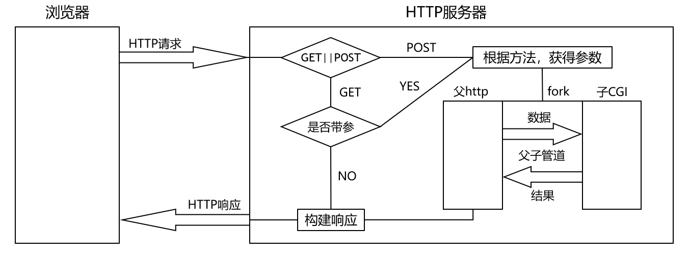处理HTTP请求的步骤如下：

1. 判断请求方法是GET方法还是POST方法，如果是GET方法带参或POST方法则进行CGI处理，如果是GET方法不带参则进行非CGI处理。
2. 非CGI处理就是直接根据用户请求的资源构建HTTP响应返回给浏览器。
3. CGI处理就是通过创建子进程进行程序替换的方式来调用CGI程序，通过创建匿名管道、重定向、导入环境变量的方式来与CGI程序进行数据通信，最终根据CGI程序的处理结果构建HTTP响应返回给浏览器。
4. CGI机制就是让服务器将获取到的数据交给对应的CGI程序进行处理，然后将CGI程序的处理结果返回给客户端，这显然让服务器逻辑和业务逻辑进行了解耦，让服务器和业务程序可以各司其职。
5. CGI机制使得浏览器输入的数据最终交给了CGI程序，而CGI程序输出的结果最终交给了浏览器。这也就意味着CGI程序的开发者，可以完全忽略中间服务器的处理逻辑，相当于CGI程序从标准输入就能读取到浏览器输入的内容，CGI程序写入标准输出的数据最终就能输出到浏览器。
<a name="j82n2"></a>
## 日志编写
服务器在运作时会产生一些日志，这些日志会记录下服务器运行过程中产生的一些事件。本项目中的日志格式如下：<br />日志说明：

1. 日志级别：分为四个等级，从低到高依次是INFO、WARNING、ERROR、FATAL。
2. 时间戳：事件产生的时间。
3. 日志信息：事件产生的日志信息。
4. 错误文件名称：事件在哪一个文件产生。
5. 行数：事件在对应文件的哪一行产生。日志级别说明：
6. INFO：表示正常的日志输出，一切按预期运行。
7. WARNING：表示警告，该事件不影响服务器运行，但存在风险。
8. ERROR：表示发生了某种错误，但该事件不影响服务器继续运行。
9. FATAL：表示发生了致命的错误，该事件将导致服务器停止运行。
<a name="h8hs5"></a>
### 日志函数编写
可以针对日志编写一个输出日志的Log函数，该函数的参数就包括日志级别、日志信息、错误文件名称、错误的行数。如下：
```cpp
void Log(std::string level, std::string message, std::string file_name, int line)
{
  std::cout<<"["<<level<<"]["<<time(nullptr)<<"]["<<message<<"]["<<file_name<<"]["<<line<<"]"<<std::endl;
}
```
说明一下：调用time函数时传入nullptr即可获取当前的时间戳，因此调用Log函数时不必传入时间戳。
<a name="QEFmu"></a>
### 文件名称和行数的问题
通过C语言中的预定义符号__FILE__和__LINE__，分别可以获取当前文件的名称和当前的行数，但最好在调用Log函数时不用调用者显示的传入__FILE__和__LINE__，因为每次调用Log函数时传入的这两个参数都是固定的。<br />需要注意的是，不能将__FILE__和__LINE__设置为参数的缺省值，因为这样每次获取到的都是Log函数所在的文件名称和所在的行数。而宏可以在预处理期间将代码插入到目标地点，因此可以定义如下宏：
```cpp
#define LOG(level, message) Log(level, message, __FILE__, __LINE__)
```
后续需要打印日志的时候就直接调用LOG，调用时只需要传入日志级别和日志信息，在预处理期间__FILE__和__LINE__就会被插入到目标地点，这时就能获取到日志产生的文件名称和对应的行数了。
<a name="FTrUs"></a>
### 日志级别传入问题
后续调用LOG传入日志级别时，肯定希望以INFO、WARNING这样的方式传入，而不是以"INFO"、"WARNING"这样的形式传入，这时可以将这四个日志级别定义为宏，然后通过#将宏参数level变成对应的字符串。如下：
```cpp
#define INFO    1
#define WARNING 2
#define ERROR   3
#define FATAL   4

#define LOG(level, message) Log(#level, message, __FILE__, __LINE__)
```
此时以INFO、WARNING的方式传入LOG的宏参数，就会被转换成对应的字符串传递给Log函数的level参数，后续就可以以如下方式输出日志了：
```cpp
LOG(INFO, "This is a demo"); //LOG使用示例
```
<a name="qdXma"></a>
## 套接字相关代码编写
可以将套接字相关的代码封装到TcpServer类中，在初始化TcpServer对象时完成套接字的创建、绑定和监听动作，并向外提供一个Sock接口用于获取监听套接字。此外，可以将TcpServer设置成单例模式：

1. 将TcpServer类的构造函数设置为私有，并将拷贝构造和拷贝赋值函数设置为私有或删除，防止外部创建或拷贝对象。
2. 提供一个指向单例对象的static指针，并在类外将其初始化为nullptr。
3. 提供一个全局访问点获取单例对象，在单例对象第一次被获取的时候就创建这个单例对象并进行初始化。

代码如下：
```cpp
#define BACKLOG 5

//TCP服务器
class TcpServer{
    private:
        int _port;              //端口号
        int _listen_sock;       //监听套接字
        static TcpServer* _svr; //指向单例对象的static指针
    private:
        //构造函数私有
        TcpServer(int port)
            :_port(port)
            ,_listen_sock(-1)
        {}
        //将拷贝构造函数和拷贝赋值函数私有或删除（防拷贝）
        TcpServer(const TcpServer&)=delete;
        TcpServer* operator=(const TcpServer&)=delete;
    public:
        //获取单例对象
        static TcpServer* GetInstance(int port)
        {
            static pthread_mutex_t mtx = PTHREAD_MUTEX_INITIALIZER; //定义静态的互斥锁
            if(_svr == nullptr){
                pthread_mutex_lock(&mtx); //加锁
                if(_svr == nullptr){
                    //创建单例TCP服务器对象并初始化
                    _svr = new TcpServer(port);
                    _svr->InitServer();
                }
                pthread_mutex_unlock(&mtx); //解锁
            }
            return _svr; //返回单例对象
        }
        //初始化服务器
        void InitServer()
        {
            Socket(); //创建套接字
            Bind();   //绑定
            Listen(); //监听
            LOG(INFO, "tcp_server init ... success");
        }
        //创建套接字
        void Socket()
        {
            _listen_sock = socket(AF_INET, SOCK_STREAM, 0);
            if(_listen_sock < 0){ //创建套接字失败
                LOG(FATAL, "socket error!");
                exit(1);
            }
            //设置端口复用
            int opt = 1;
            setsockopt(_listen_sock, SOL_SOCKET, SO_REUSEADDR, &opt, sizeof(opt));
            LOG(INFO, "create socket ... success");
        }
        //绑定
        void Bind()
        {
            struct sockaddr_in local;
            memset(&local, 0, sizeof(local));
            local.sin_family = AF_INET;
            local.sin_port = htons(_port);
            local.sin_addr.s_addr = INADDR_ANY;

            if(bind(_listen_sock, (struct sockaddr*)&local, sizeof(local)) < 0){ //绑定失败
                LOG(FATAL, "bind error!");
                exit(2);
            }
            LOG(INFO, "bind socket ... success");
        }
        //监听
        void Listen()
        {
            if(listen(_listen_sock, BACKLOG) < 0){ //监听失败
                LOG(FATAL, "listen error!");
                exit(3);
            }
            LOG(INFO, "listen socket ... success");
        }
        //获取监听套接字
        int Sock()
        {
            return _listen_sock;
        }
        ~TcpServer()
        {
            if(_listen_sock >= 0){ //关闭监听套接字
                close(_listen_sock);
            }
        }
};
//单例对象指针初始化为nullptr
TcpServer* TcpServer::_svr = nullptr;
```
说明一下：

1. 如果使用的是云服务器，那么在设置服务器的IP地址时，不需要显式绑定IP地址，直接将IP地址设置为INADDR_ANY即可，此时服务器就可以从本地任何一张网卡当中读取数据。此外，由于INADDR_ANY本质就是0，因此在设置时不需要进行网络字节序列的转换。
2. 在第一次调用GetInstance获取单例对象时需要创建单例对象，这时需要定义一个锁来保证线程安全，代码中以PTHREAD_MUTEX_INITIALIZER的方式定义的静态的锁是不需要释放的，同时为了保证后续调用GetInstance获取单例对象时不会频繁的加锁解锁，因此代码中以双检查的方式进行加锁。
<a name="aUZgR"></a>
## HTTP服务器主体逻辑
可以将HTTP服务器封装成一个HttpServer类，在构造HttpServer对象时传入一个端口号，之后就可以调用Loop让服务器运行起来了。服务器运行起来后要做的就是，先获取单例对象TcpServer中的监听套接字，然后不断从监听套接字中获取新连接，每当获取到一个新连接后就创建一个新线程为该连接提供服务。<br />代码如下：
```cpp
#define PORT 8081

//HTTP服务器
class HttpServer{
    private:
        int _port; //端口号
    public:
        HttpServer(int port)
            :_port(port)
        {}

        //启动服务器
        void Loop()
        {
            LOG(INFO, "loop begin");
            TcpServer* tsvr = TcpServer::GetInstance(_port); //获取TCP服务器单例对象
            int listen_sock = tsvr->Sock(); //获取监听套接字
            while(true){
                struct sockaddr_in peer;
                memset(&peer, 0, sizeof(peer));
                socklen_t len = sizeof(peer);
                int sock = accept(listen_sock, (struct sockaddr*)&peer, &len); //获取新连接
                if(sock < 0){
                    continue; //获取失败，继续获取
                }

                //打印客户端相关信息
                std::string client_ip = inet_ntoa(peer.sin_addr);
                int client_port = ntohs(peer.sin_port);
                LOG(INFO, "get a new link: ["+client_ip+":"+std::to_string(client_port)+"]");
                
                //创建新线程处理新连接发起的HTTP请求
                int* p = new int(sock);
                pthread_t tid;
                pthread_create(&tid, nullptr, CallBack::HandlerRequest, (void*)p);
                pthread_detach(tid); //线程分离
            }
        }
        ~HttpServer()
        {}
};
```
说明一下：

1. 服务器需要将新连接对应的套接字作为参数传递给新线程，为了避免该套接字在新线程读取之前被下一次获取到的套接字覆盖，因此在传递套接字时最好重新new一块空间来存储套接字的值。
2. 新线程创建后可以将新线程分离，分离后主线程继续获取新连接，而新线程则处理新连接发来的HTTP请求，代码中的HandlerRequest函数就是新线程处理新连接时需要执行的回调函数。

运行服务器时要求指定服务器的端口号，用这个端口号创建一个HttpServer对象，然后调用Loop函数运行服务器，此时服务器就会不断获取新连接并创建新线程来处理连接。
```cpp
static void Usage(std::string proc)
{
    std::cout<<"Usage:\n\t"<<proc<<" port"<<std::endl;
}
int main(int argc, char* argv[])
{
    if(argc != 2){
        Usage(argv[0]);
        exit(4);
    }
    int port = atoi(argv[1]); //端口号
    std::shared_ptr<HttpServer> svr(new HttpServer(port)); //创建HTTP服务器对象
    svr->Loop(); //启动服务器
    return 0;
}
```
<a name="bdmb3"></a>
## HTTP请求结构设计
可以将HTTP请求封装成一个类，这个类当中包括HTTP请求的内容、HTTP请求的解析结果以及是否需要使用CGI模式的标志位。后续处理请求时就可以定义一个HTTP请求类，读取到的HTTP请求的数据就存储在这个类当中，解析HTTP请求后得到的数据也存储在这个类当中。<br />代码如下：
```cpp
//HTTP请求
class HttpRequest{
    public:
        //HTTP请求内容
        std::string _request_line;                //请求行
        std::vector<std::string> _request_header; //请求报头
        std::string _blank;                       //空行
        std::string _request_body;                //请求正文

        //解析结果
        std::string _method;       //请求方法
        std::string _uri;          //URI
        std::string _version;      //版本号
        std::unordered_map<std::string, std::string> _header_kv; //请求报头中的键值对
        int _content_length;       //正文长度
        std::string _path;         //请求资源的路径
        std::string _query_string; //uri中携带的参数

        //CGI相关
        bool _cgi; //是否需要使用CGI模式
    public:
        HttpRequest()
            :_content_length(0) //默认请求正文长度为0
            ,_cgi(false)        //默认不使用CGI模式
        {}
        ~HttpRequest()
        {}
};
```
<a name="hSUoU"></a>
## HTTP响应结构设计
HTTP响应也可以封装成一个类，这个类当中包括HTTP响应的内容以及构建HTTP响应所需要的数据。后续构建响应时就可以定义一个HTTP响应类，构建响应需要使用的数据就存储在这个类当中，构建后得到的响应内容也存储在这个类当中。<br />代码如下：
```cpp
//HTTP响应
class HttpResponse{
    public:
        //HTTP响应内容
        std::string _status_line;                  //状态行
        std::vector<std::string> _response_header; //响应报头
        std::string _blank;                        //空行
        std::string _response_body;                //响应正文（CGI相关）

        //所需数据
        int _status_code;    //状态码
        int _fd;             //响应文件的fd  （非CGI相关）
        int _size;           //响应文件的大小（非CGI相关）
        std::string _suffix; //响应文件的后缀（非CGI相关）
    public:
        HttpResponse()
            :_blank(LINE_END) //设置空行
            ,_status_code(OK) //状态码默认为200
            ,_fd(-1)          //响应文件的fd初始化为-1
            ,_size(0)         //响应文件的大小默认为0
        {}
        ~HttpResponse()
        {}
};
```
<a name="u2k9p"></a>
## EndPoint类编写
<a name="q0HeC"></a>
### EndPoint结构设计
EndPoint这个词经常用来描述进程间通信，比如在客户端和服务器通信时，客户端是一个EndPoint，服务器则是另一个EndPoint，因此这里将处理请求的类取名为EndPoint。<br />EndPoint类中包含三个成员变量：

- sock：表示与客户端进行通信的套接字。
- http_request：表示客户端发来的HTTP请求。
- http_response：表示将会发送给客户端的HTTP响应。

EndPoint类中主要包含四个成员函数：

- `RecvHttpRequest`：读取客户端发来的HTTP请求。
- `HandlerHttpRequest`：处理客户端发来的HTTP请求。
- `BuildHttpResponse`：构建将要发送给客户端的HTTP响应。
- `SendHttpResponse`：发送HTTP响应给客户端。

代码如下：
```cpp
//服务端EndPoint
class EndPoint{
    private:
        int _sock;                   //通信的套接字
        HttpRequest _http_request;   //HTTP请求
        HttpResponse _http_response; //HTTP响应
    public:
        EndPoint(int sock)
            :_sock(sock)
        {}
        //读取请求
        void RecvHttpRequest();
        //处理请求
        void HandlerHttpRequest();
        //构建响应
        void BuildHttpResponse();
        //发送响应
        void SendHttpResponse();
        ~EndPoint()
        {}
};
```
<a name="Obpk4"></a>
### 设计线程回调
服务器每获取到一个新连接就会创建一个新线程来进行处理，而这个线程要做的实际就是定义一个EndPoint对象，然后依次进行读取请求、处理请求、构建响应、发送响应，处理完毕后将与客户端建立的套接字关闭即可。<br />代码如下：
```cpp
class CallBack{
    public:
        static void* HandlerRequest(void* arg)
        {
            LOG(INFO, "handler request begin");
            int sock = *(int*)arg;
            
            EndPoint* ep = new EndPoint(sock);
            ep->RecvHttpRequest();    //读取请求
            ep->HandlerHttpRequest(); //处理请求
            ep->BuildHttpResponse();  //构建响应
            ep->SendHttpResponse();   //发送响应

            close(sock); //关闭与该客户端建立的套接字
            delete ep;

            LOG(INFO, "handler request end");
            return nullptr;
        }
};
```
<a name="nfNNU"></a>
### 读取HTTP请求
读取HTTP请求的同时可以对HTTP请求进行解析，这里分为五个步骤，分别是读取请求行、读取请求报头和空行、解析请求行、解析请求报头、读取请求正文。<br />代码如下：
```cpp
//服务端EndPoint
class EndPoint{
    private:
        int _sock;                   //通信的套接字
        HttpRequest _http_request;   //HTTP请求
        HttpResponse _http_response; //HTTP响应
    public:
        //读取请求
        void RecvHttpRequest()
        {
            RecvHttpRequestLine();    //读取请求行
            RecvHttpRequestHeader();  //读取请求报头和空行
            ParseHttpRequestLine();   //解析请求行
            ParseHttpRequestHeader(); //解析请求报头
            RecvHttpRequestBody();    //读取请求正文
        }
};
```
<a name="YDRwq"></a>
#### 一、读取请求行
读取请求行很简单，就是从套接字中读取一行内容存储到HTTP请求类中的request_line中即可。<br />代码如下：
```cpp
//服务端EndPoint
class EndPoint{
    private:
        int _sock;                   //通信的套接字
        HttpRequest _http_request;   //HTTP请求
        HttpResponse _http_response; //HTTP响应
    private:
        //读取请求行
        void RecvHttpRequestLine()
        {
            auto& line = _http_request._request_line;
            if(Util::ReadLine(_sock, line) > 0){
                line.resize(line.size() - 1); //去掉读取上来的\n
            }
        }
};
```
需要注意的是，这里在按行读取HTTP请求时，不能直接使用C/C++提供的gets或getline函数进行读取，因为不同平台下的行分隔符可能是不一样的，可能是`\r`、`\n`或者`\r\n`。<br />比如下面是用WFetch请求百度首页时得到的HTTP响应，可以看到其中使用的行分隔符就是`\r\n`：<br /><br />因此这里需要自己写一个`ReadLine`函数，以确保能够兼容这三种行分隔符。可以把这个函数写到一个工具类当中，后续编写的处理字符串的函数也都写到这个类当中。<br />ReadLine函数的处理逻辑如下：

1. 从指定套接字中读取一个个字符。
2. 如果读取到的字符既不是\n也不是\r，则将读取到的字符push到用户提供的缓冲区后继续读取下一个字符。
3. 如果读取到的字符是\n，则说明行分隔符是\n，此时将\npush到用户提供的缓冲区后停止读取。
4. 如果读取到的字符是\r，则需要继续窥探下一个字符是否是\n，如果窥探成功则说明行分隔符为\r\n，此时将未读取的\n读取上来后，将\npush到用户提供的缓冲区后停止读取；如果窥探失败则说明行分隔符是\r，此时也将\npush到用户提供的缓冲区后停止读取。

也就是说，无论是哪一种行分隔符，最终读取完一行后都把\npush到了用户提供的缓冲区当中，相当于将这三种行分隔符统一转换成了以\n为行分隔符，只不过最终把\n一同读取到了用户提供的缓冲区中罢了，因此如果调用者不需要读取上来的\n，需要后续自行将其去掉。<br />代码如下：
```cpp
//工具类
class Util{
    public:
        //读取一行
        static int ReadLine(int sock, std::string& out)
        {
            char ch = 'X'; //ch只要不初始化为\n即可（保证能够进入while循环）
            while(ch != '\n'){
                ssize_t size = recv(sock, &ch, 1, 0);
                if(size > 0){
                    if(ch == '\r'){
                        //窥探下一个字符是否为\n
                        recv(sock, &ch, 1, MSG_PEEK);

                        if(ch == '\n'){ //下一个字符是\n
                            //\r\n->\n
                            recv(sock, &ch, 1, 0); //将这个\n读走
                        }
                        else{ //下一个字符不是\n
                            //\r->\n
                            ch = '\n'; //将ch设置为\n
                        }
                    }
                    //普通字符或\n
                    out.push_back(ch);
                }
                else if(size == 0){ //对方关闭连接
                    return 0;
                }
                else{ //读取失败
                    return -1;
                }
            }
            return out.size(); //返回读取到的字符个数
        }
};
```
说明一下： `recv`函数的最后一个参数如果设置为MSG_PEEK，那么recv函数将返回TCP接收缓冲区头部指定字节个数的数据，但是并不把这些数据从TCP接收缓冲区中取走，这个叫做数据的窥探功能。
<a name="du1Hr"></a>
#### 二、读取请求报头和空行
由于HTTP的请求报头和空行都是按行陈列的，因此可以循环调用ReadLine函数进行读取，并将读取到的每行数据都存储到HTTP请求类的request_header中，直到读取到空行为止。<br />代码如下：
```cpp
//服务端EndPoint
class EndPoint{
    private:
        int _sock;                   //通信的套接字
        HttpRequest _http_request;   //HTTP请求
        HttpResponse _http_response; //HTTP响应
    private:
        //读取请求报头和空行
        void RecvHttpRequestHeader()
        {
            std::string line;
            while(true){
                line.clear(); //每次读取之前清空line
                Util::ReadLine(_sock, line);
                if(line == "\n"){ //读取到了空行
                    _http_request._blank = line;
                    break;
                }
                //读取到一行请求报头
                line.resize(line.size() - 1); //去掉读取上来的\n
                _http_request._request_header.push_back(line);
            }
        }
};
```
说明一下：

- 由于ReadLine函数是将读取到的数据直接push_back到用户提供的缓冲区中的，因此每次调用ReadLine函数进行读取之前需要将缓冲区清空。
- ReadLine函数会将行分隔符\n一同读取上来，但对于我们来说\n并不是有效数据，因此在将读取到的行存储到HTTP请求类的request_header中之前，需要先将\n去掉。
<a name="kG8ck"></a>
#### 三、解析请求行
解析请求行要做的就是将请求行中的请求方法、URI和HTTP版本号拆分出来，依次存储到HTTP请求类的method、uri和version中，由于请求行中的这些数据都是以空格作为分隔符的，因此可以借助一个stringstream对象来进行拆分。此外，为了后续能够正确判断用户的请求方法，这里需要通过transform函数统一将请求方法转换为全大写。<br />代码如下：
```cpp
//服务端EndPoint
class EndPoint{
    private:
        int _sock;                   //通信的套接字
        HttpRequest _http_request;   //HTTP请求
        HttpResponse _http_response; //HTTP响应
    private:
        //解析请求行
        void ParseHttpRequestLine()
        {
            auto& line = _http_request._request_line;

            //通过stringstream拆分请求行
            std::stringstream ss(line);
            ss>>_http_request._method>>_http_request._uri>>_http_request._version;

            //将请求方法统一转换为全大写
            auto& method = _http_request._method;
            std::transform(method.begin(), method.end(), method.begin(), toupper);
        }
};
```
<a name="qA370"></a>
#### 四、解析请求报头
解析请求报头要做的就是将读取到的一行一行的请求报头，以`:` 为分隔符拆分成一个个的键值对存储到HTTP请求的header_kv中，后续就可以直接通过属性名获取到对应的值了。<br />代码如下：
```cpp
#define SEP ": "

//服务端EndPoint
class EndPoint{
    private:
        int _sock;                   //通信的套接字
        HttpRequest _http_request;   //HTTP请求
        HttpResponse _http_response; //HTTP响应
    private:
        //解析请求报头
        void ParseHttpRequestHeader()
        {
            std::string key;
            std::string value;
            for(auto& iter : _http_request._request_header){
                //将每行请求报头打散成kv键值对，插入到unordered_map中
                if(Util::CutString(iter, key, value, SEP)){
                    _http_request._header_kv.insert({key, value});
                }
            }
        }
};
```
此处用于切割字符串的`CutString`函数也可以写到工具类中，切割字符串时先通过`find`方法找到指定的分隔符，然后通过`substr`提取切割后的子字符串即可。<br />代码如下：
```cpp
//工具类
class Util{
    public:
        //切割字符串
        static bool CutString(std::string& target, std::string& sub1_out, std::string& sub2_out, std::string sep)
        {
            size_t pos = target.find(sep, 0);
            if(pos != std::string::npos){
                sub1_out = target.substr(0, pos);
                sub2_out = target.substr(pos + sep.size());
                return true;
            }
            return false;
        }
};
```
<a name="aup45"></a>
#### 五、读取请求正文
在读取请求正文之前，首先需要通过本次的请求方法来判断是否需要读取请求正文，因为只有请求方法是POST方法才可能会有请求正文，此外，如果请求方法为POST，还需要通过请求报头中的Content-Length属性来得知请求正文的长度。<br />在得知需要读取请求正文以及请求正文的长度后，就可以将请求正文读取到HTTP请求类的request_body中了。<br />代码如下：
```cpp
//服务端EndPoint
class EndPoint{
    private:
        int _sock;                   //通信的套接字
        HttpRequest _http_request;   //HTTP请求
        HttpResponse _http_response; //HTTP响应
    private:
        //判断是否需要读取请求正文
        bool IsNeedRecvHttpRequestBody()
        {
            auto& method = _http_request._method;
            if(method == "POST"){ //请求方法为POST则需要读取正文
                auto& header_kv = _http_request._header_kv;
                //通过Content-Length获取请求正文长度
                auto iter = header_kv.find("Content-Length");
                if(iter != header_kv.end()){
                    _http_request._content_length = atoi(iter->second.c_str());
                    return true;
                }
            }
            return false;
        }
        //读取请求正文
        void RecvHttpRequestBody()
        {
            if(IsNeedRecvHttpRequestBody()){ //先判断是否需要读取正文
                int content_length = _http_request._content_length;
                auto& body = _http_request._request_body;

                //读取请求正文
                char ch = 0;
                while(content_length){
                    ssize_t size = recv(_sock, &ch, 1, 0);
                    if(size > 0){
                        body.push_back(ch);
                        content_length--;
                    }
                    else{
                        break;
                    }
                }
            }
        }
};
```
说明一下：<br />由于后续还会用到请求正文的长度，因此代码中将其存储到了HTTP请求类的content_length中。<br />在通过Content-Length获取到请求正文的长度后，需要将请求正文长度从字符串类型转换为整型。
<a name="V0g8p"></a>
### 处理HTTP请求
<a name="bwml4"></a>
#### 定义状态码
在处理请求的过程中可能会因为某些原因而直接停止处理，比如请求方法不正确、请求资源不存在或服务器处理请求时出错等等。为了告知客户端本次HTTP请求的处理情况，服务器需要定义不同的状态码，当处理请求被终止时就可以设置对应的状态码，后续构建HTTP响应的时候就可以根据状态码返回对应的错误页面。<br />状态码定义如下：
```cpp
#define OK 200
#define BAD_REQUEST 400
#define NOT_FOUND 404
#define INTERNAL_SERVER_ERROR 500
```
<a name="gQejV"></a>
#### 处理HTTP请求
处理HTTP请求的步骤如下：

1. 判断请求方法是否是正确，如果不正确则设置状态码为BAD_REQUEST后停止处理。
2. 如果请求方法为GET方法，则需要判断URI中是否带参。如果URI不带参，则说明URI即为客户端请求的资源路径；如果URI带参，则需要以?为分隔符对URI进行字符串切分，切分后?左边的内容就是客户端请求的资源路径，而?右边的内容则是GET方法携带的参数，由于此时GET方法携带了参数，因此后续处理需要使用CGI模式，于是需要将HTTP请求类中的cgi设置为true。
3. 如果请求方法为POST方法，则说明URI即为客户端请求的资源路径，由于POST方法会通过请求正文上传参数，因此后续处理需要使用CGI模式，于是需要将HTTP请求类中的cgi设置为true。
4. 接下来需要对客户端请求的资源路径进行处理，首先需要在请求的资源路径前拼接上web根目录，然后需要判断请求资源路径的最后一个字符是否是/，如果是则说明客户端请求的是一个目录，这时服务器不会将该目录下全部的资源都返回给客户端，而是默认将该目录下的index.html返回给客户端，因此这时还需要在请求资源路径的后面拼接上index.html。
5. 对请求资源的路径进行处理后，需要通过stat函数获取客户端请求资源文件的属性信息。如果客户端请求的是一个目录，则需要在请求资源路径的后面拼接上/index.html并重新获取资源文件的属性信息；如果客户端请求的是一个可执行程序，则说明后续处理需要使用CGI模式，于是需要将HTTP请求类中的cgi设置为true。
6. 根据HTTP请求类中的cgi分别进行CGI或非CGI处理。

代码如下：
```cpp
#define WEB_ROOT "wwwroot"
#define HOME_PAGE "index.html"

//服务端EndPoint
class EndPoint{
    private:
        int _sock;                   //通信的套接字
        HttpRequest _http_request;   //HTTP请求
        HttpResponse _http_response; //HTTP响应
    public:
        //处理请求
        void HandlerHttpRequest()
        {
            auto& code = _http_response._status_code;

            if(_http_request._method != "GET"&&_http_request._method != "POST"){ //非法请求
                LOG(WARNING, "method is not right");
                code = BAD_REQUEST; //设置对应的状态码，并直接返回
                return;
            }

            if(_http_request._method == "GET"){
                size_t pos = _http_request._uri.find('?');
                if(pos != std::string::npos){ //uri中携带参数
                    //切割uri，得到客户端请求资源的路径和uri中携带的参数
                    Util::CutString(_http_request._uri, _http_request._path, _http_request._query_string, "?");
                    _http_request._cgi = true; //上传了参数，需要使用CGI模式
                }
                else{ //uri中没有携带参数
                    _http_request._path = _http_request._uri; //uri即是客户端请求资源的路径
                }
            }
            else if(_http_request._method == "POST"){
                _http_request._path = _http_request._uri; //uri即是客户端请求资源的路径
                _http_request._cgi = true; //上传了参数，需要使用CGI模式
            }
            else{
                //Do Nothing
            }

            //给请求资源路径拼接web根目录
            std::string path = _http_request._path;
            _http_request._path = WEB_ROOT;
            _http_request._path += path;

            //请求资源路径以/结尾，说明请求的是一个目录
            if(_http_request._path[_http_request._path.size() - 1] == '/'){
                //拼接上该目录下的index.html
                _http_request._path += HOME_PAGE;
            }
            
            //获取请求资源文件的属性信息
            struct stat st;
            if(stat(_http_request._path.c_str(), &st) == 0){ //属性信息获取成功，说明该资源存在
                if(S_ISDIR(st.st_mode)){ //该资源是一个目录
                    _http_request._path += "/"; //需要拼接/，以/结尾的目录前面已经处理过了
                    _http_request._path += HOME_PAGE; //拼接上该目录下的index.html
                    stat(_http_request._path.c_str(), &st); //需要重新资源文件的属性信息
                }
                else if(st.st_mode&S_IXUSR||st.st_mode&S_IXGRP||st.st_mode&S_IXOTH){ //该资源是一个可执行程序
                    _http_request._cgi = true; //需要使用CGI模式
                }
                _http_response._size = st.st_size; //设置请求资源文件的大小
            }
            else{ //属性信息获取失败，可以认为该资源不存在
                LOG(WARNING, _http_request._path + " NOT_FOUND");
                code = NOT_FOUND; //设置对应的状态码，并直接返回
                return;
            }

            //获取请求资源文件的后缀
            size_t pos = _http_request._path.rfind('.');
            if(pos == std::string::npos){
                _http_response._suffix = ".html"; //默认设置
            }
            else{
                _http_response._suffix = _http_request._path.substr(pos);
            }

            //进行CGI或非CGI处理
            if(_http_request._cgi == true){
                code = ProcessCgi(); //以CGI的方式进行处理
            }
            else{
                code = ProcessNonCgi(); //简单的网页返回，返回静态网页
            }
        }
};
```
说明一下：<br />本项目实现的HTTP服务器只支持GET方法和POST方法，因此如果客户端发来的HTTP请求中不是这两种方法则认为请求方法错误，如果想让服务器支持其他的请求方法则直接增加对应的逻辑即可。<br />服务器向外提供的资源都会放在web根目录下，比如网页、图片、视频等资源，本项目中的web根目录取名为wwwroot。web根目录下的所有子目录下都会有一个首页文件，当用户请求的资源是一个目录时，就会默认返回该目录下的首页文件，本项目中的首页文件取名为index.html。<br />stat是一个系统调用函数，它可以获取指定文件的属性信息，包括文件的inode编号、文件的权限、文件的大小等。如果调用stat函数获取文件的属性信息失败，则可以认为客户端请求的这个资源文件不存在，此时直接设置状态码为NOT_FOUND后停止处理即可。<br />当获取文件的属性信息后发现该文件是一个目录，此时请求资源路径一定不是以/结尾的，因为在此之前已经对/结尾的请求资源路径进行过处理了，因此这时需要给请求资源路径拼接上/index.html。<br />只要一个文件的拥有者、所属组、other其中一个具有可执行权限，则说明这是一个可执行文件，此时就需要将HTTP请求类中的cgi设置为true。<br />由于后续构建HTTP响应时需要用到请求资源文件的后缀，因此代码中对请求资源路径通过从后往前找.的方式，来获取请求资源文件的后缀，如果没有找到.则默认请求资源的后缀为.html。<br />由于请求资源文件的大小后续可能会用到，因此在获取到请求资源文件的属性后，可以将请求资源文件的大小保存到HTTP响应类的size中。
<a name="yC549"></a>
#### CGI处理
CGI处理时需要创建子进程进行进程程序替换，但是在创建子进程之前需要先创建两个匿名管道。这里站在父进程角度对这两个管道进行命名，父进程用于读取数据的管道叫做input，父进程用于写入数据的管道叫做output。<br />示意图如下：<br />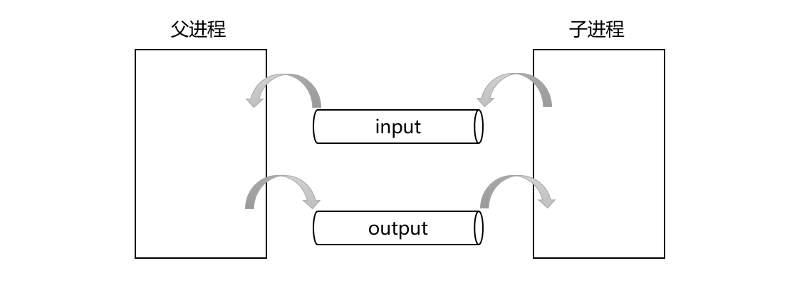<br />创建匿名管道并创建子进程后，需要父子进程各自关闭两个管道对应的读写端：<br />对于父进程来说，input管道是用来读数据的，因此父进程需要保留input[0]关闭input[1]，而output管道是用来写数据的，因此父进程需要保留output[1]关闭output[0]。<br />对于子进程来说，input管道是用来写数据的，因此子进程需要保留input[1]关闭input[0]，而output管道是用来读数据的，因此子进程需要保留output[0]关闭output[1]。<br />此时父子进程之间的通信信道已经建立好了，但为了让替换后的CGI程序从标准输入读取数据等价于从管道读取数据，向标准输出写入数据等价于向管道写入数据，因此在子进程进行进程程序替换之前，还需要对子进程进行重定向。<br />假设子进程保留的input[1]和output[0]对应的文件描述符分别是3和4，那么子进程对应的文件描述符表的指向大致如下：<br />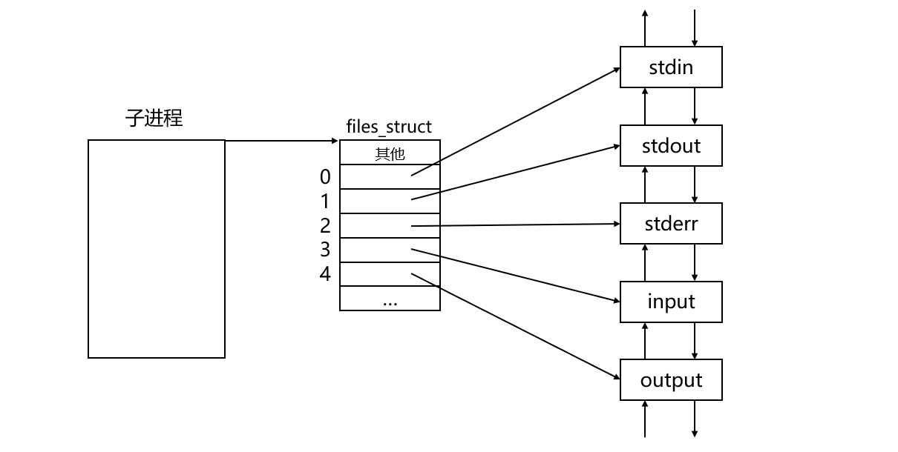<br />现在要做的就是将子进程的标准输入重定向到output管道，将子进程的标准输出重定向到input管道，也就是让子进程的0号文件描述符指向output管道，让子进程的1号文件描述符指向input管道。<br />示意图如下：<br />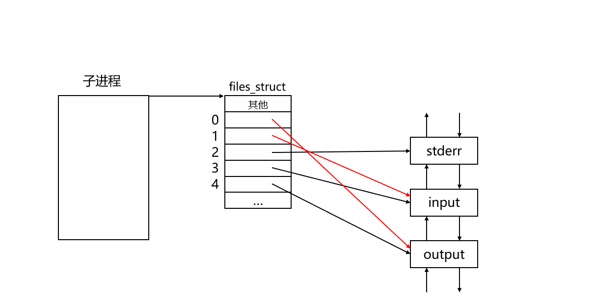<br />此外，在子进程进行进程程序替换之前，还需要进行各种参数的传递：

- 首先需要将请求方法通过putenv函数导入环境变量，以供CGI程序判断应该以哪种方式读取父进程传递过来的参数。
- 如果请求方法为GET方法，则需要将URL中携带的参数通过导入环境变量的方式传递给CGI程序。
- 如果请求方法为POST方法，则需要将请求正文的长度通过导入环境变量的方式传递给CGI程序，以供CGI程序判断应该从管道读取多少个参数。

此时子进程就可以进行进程程序替换了，而父进程需要做如下工作：

- 如果请求方法为POST方法，则父进程需要将请求正文中的参数写入管道中，以供被替换后的CGI程序进行读取。
- 然后父进程要做的就是不断调用read函数，从管道中读取CGI程序写入的处理结果，并将其保存到HTTP响应类的response_body当中。
- 管道中的数据读取完毕后，父进程需要调用waitpid函数等待CGI程序退出，并关闭两个管道对应的文件描述符，防止文件描述符泄露。

代码如下：
```cpp
//服务端EndPoint
class EndPoint{
    private:
        int _sock;                   //通信的套接字
        HttpRequest _http_request;   //HTTP请求
        HttpResponse _http_response; //HTTP响应
    private:
        //CGI处理
        int ProcessCgi()
        {
            int code = OK; //要返回的状态码，默认设置为200

            auto& bin = _http_request._path;      //需要执行的CGI程序
            auto& method = _http_request._method; //请求方法

            //需要传递给CGI程序的参数
            auto& query_string = _http_request._query_string; //GET
            auto& request_body = _http_request._request_body; //POST

            int content_length = _http_request._content_length;  //请求正文的长度
            auto& response_body = _http_response._response_body; //CGI程序的处理结果放到响应正文当中

            //1、创建两个匿名管道（管道命名站在父进程角度）
            //创建从子进程到父进程的通信信道
            int input[2];
            if(pipe(input) < 0){ //管道创建失败，则返回对应的状态码
                LOG(ERROR, "pipe input error!");
                code = INTERNAL_SERVER_ERROR;
                return code;
            }
            //创建从父进程到子进程的通信信道
            int output[2];
            if(pipe(output) < 0){ //管道创建失败，则返回对应的状态码
                LOG(ERROR, "pipe output error!");
                code = INTERNAL_SERVER_ERROR;
                return code;
            }

            //2、创建子进程
            pid_t pid = fork();
            if(pid == 0){ //child
                //子进程关闭两个管道对应的读写端
                close(input[0]);
                close(output[1]);

                //将请求方法通过环境变量传参
                std::string method_env = "METHOD=";
                method_env += method;
                putenv((char*)method_env.c_str());

                if(method == "GET"){ //将query_string通过环境变量传参
                    std::string query_env = "QUERY_STRING=";
                    query_env += query_string;
                    putenv((char*)query_env.c_str());
                    LOG(INFO, "GET Method, Add Query_String env");
                }
                else if(method == "POST"){ //将正文长度通过环境变量传参
                    std::string content_length_env = "CONTENT_LENGTH=";
                    content_length_env += std::to_string(content_length);
                    putenv((char*)content_length_env.c_str());
                    LOG(INFO, "POST Method, Add Content_Length env");
                }
                else{
                    //Do Nothing
                }

                //3、将子进程的标准输入输出进行重定向
                dup2(output[0], 0); //标准输入重定向到管道的输入
                dup2(input[1], 1);  //标准输出重定向到管道的输出

                //4、将子进程替换为对应的CGI程序
                execl(bin.c_str(), bin.c_str(), nullptr);
                exit(1); //替换失败
            }
            else if(pid < 0){ //创建子进程失败，则返回对应的错误码
                LOG(ERROR, "fork error!");
                code = INTERNAL_SERVER_ERROR;
                return code;
            }
            else{ //father
                //父进程关闭两个管道对应的读写端
                close(input[1]);
                close(output[0]);

                if(method == "POST"){ //将正文中的参数通过管道传递给CGI程序
                    const char* start = request_body.c_str();
                    int total = 0;
                    int size = 0;
                    while(total < content_length && (size = write(output[1], start + total, request_body.size() - total)) > 0){
                        total += size;
                    }
                }

                //读取CGI程序的处理结果
                char ch = 0;
                while(read(input[0], &ch, 1) > 0){
                    response_body.push_back(ch);
                } //不会一直读，当另一端关闭后会继续执行下面的代码

                //等待子进程（CGI程序）退出
                int status = 0;
                pid_t ret = waitpid(pid, &status, 0);
                if(ret == pid){
                    if(WIFEXITED(status)){ //正常退出
                        if(WEXITSTATUS(status) == 0){ //结果正确
                            LOG(INFO, "CGI program exits normally with correct results");
                            code = OK;
                        }
                        else{
                            LOG(INFO, "CGI program exits normally with incorrect results");
                            code = BAD_REQUEST;
                        }
                    }
                    else{
                        LOG(INFO, "CGI program exits abnormally");
                        code = INTERNAL_SERVER_ERROR;
                    }
                }

                //关闭两个管道对应的文件描述符
                close(input[0]);
                close(output[1]);
            }
            return code; //返回状态码
        }
};
```
说明一下：

- 在CGI处理过程中，如果管道创建失败或者子进程创建失败，则属于服务器端处理请求时出错，此时返回INTERNAL_SERVER_ERROR状态码后停止处理即可。
- 环境变量是key=value形式的，因此在调用putenv函数导入环境变量前需要先正确构建环境变量，此后被替换的CGI程序在调用getenv函数时，就可以通过key获取到对应的value。
- 子进程传递参数的代码最好放在重定向之前，否则服务器运行后无法看到传递参数对应的日志信息，因为日志是以cout的方式打印到标准输出的，而dup2函数调用后标准输出已经被重定向到了管道，此时打印的日志信息将会被写入管道。
- 父进程循环调用read函数从管道中读取CGI程序的处理结果，当CGI程序执行结束时相当于写端进程将写端关闭了（文件描述符的生命周期随进程），此时读端进程将管道当中的数据读完后，就会继续执行后续代码，而不会被阻塞。
- 父进程在等待子进程退出后，可以通过WIFEXITED判断子进程是否是正常退出，如果是正常退出再通过WEXITSTATUS判断处理结果是否正确，然后根据不同情况设置对应的状态码（此时就算子进程异常退出或处理结果不正确也不能立即返回，需要让父进程继续向后执行，关闭两个管道对应的文件描述符，防止文件描述符泄露）。
<a name="hLY5l"></a>
#### 非CGI处理
非CGI处理时只需要将客户端请求的资源构建成HTTP响应发送给客户端即可，理论上这里要做的就是打开目标文件，将文件中的内容读取到HTTP响应类的response_body中，以供后续发送HTTP响应时进行发送即可，但并不推荐这种做法。<br />因为HTTP响应类的response_body属于用户层的缓冲区，而目标文件是存储在服务器的磁盘上的，按照这种方式需要先将文件内容读取到内核层缓冲区，再由操作系统将其拷贝到用户层缓冲区，发送响应正文的时候又需要先将其拷贝到内核层缓冲区，再由操作系统将其发送给对应的网卡进行发送。<br />示意图如下：<br />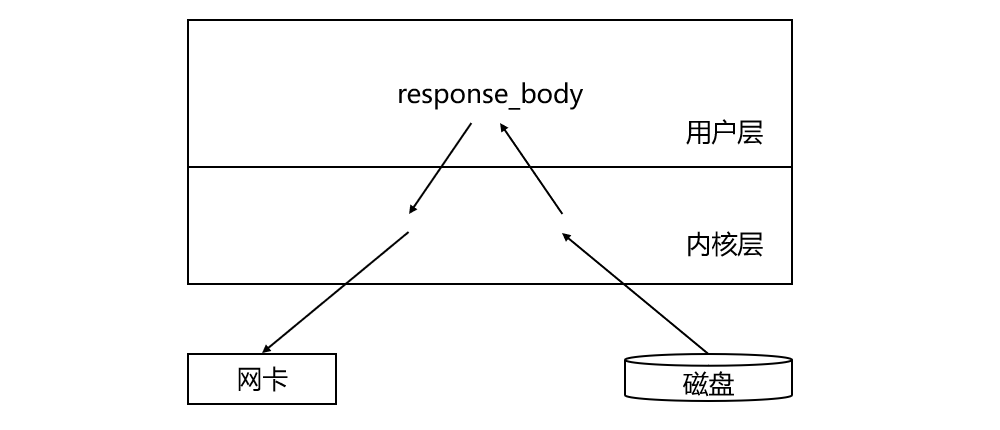<br />可以看到上述过程涉及数据在用户层和内核层的来回拷贝，但实际这个拷贝操作是不需要的，完全可以直接将磁盘当中的目标文件内容读取到内核，再由内核将其发送给对应的网卡进行发送。<br />示意图如下：<br />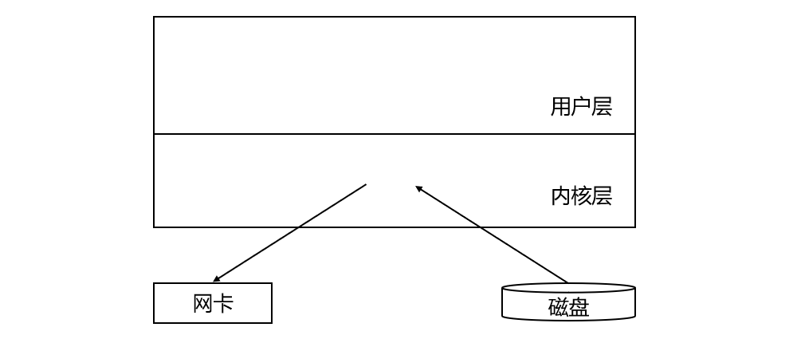<br />要达到上述效果就需要使用sendfile函数，该函数的功能就是将数据从一个文件描述符拷贝到另一个文件描述符，并且这个拷贝操作是在内核中完成的，因此sendfile比单纯的调用read和write更加高效。<br />但是需要注意的是，这里还不能直接调用sendfile函数，因为sendfile函数调用后文件内容就发送出去了，而应该构建HTTP响应后再进行发送，因此这里要做的仅仅是将要发送的目标文件打开即可，将打开文件对应的文件描述符保存到HTTP响应的fd当中。<br />代码如下：
```cpp
//服务端EndPoint
class EndPoint{
    private:
        int _sock;                   //通信的套接字
        HttpRequest _http_request;   //HTTP请求
        HttpResponse _http_response; //HTTP响应
    private:
        //非CGI处理
        int ProcessNonCgi()
        {
            //打开客户端请求的资源文件，以供后续发送
            _http_response._fd = open(_http_request._path.c_str(), O_RDONLY);
            if(_http_response._fd >= 0){ //打开文件成功
                return OK;
            }
            return INTERNAL_SERVER_ERROR; //打开文件失败
        }
};
```
说明一下： 如果打开文件失败，则返回INTERNAL_SERVER_ERROR状态码表示服务器处理请求时出错，而不能返回NOT_FOUND，因为之前调用stat获取过客户端请求资源的属性信息，说明该资源文件是一定存在的。
<a name="rnFiy"></a>
### 构建HTTP响应
构建HTTP响应首先需要构建的就是状态行，状态行由状态码、状态码描述、HTTP版本构成，并以空格作为分隔符，将状态行构建好后保存到HTTP响应的status_line当中即可，而响应报头需要根据请求是否正常处理完毕分别进行构建。<br />代码如下：
```cpp
#define HTTP_VERSION "HTTP/1.0"
#define LINE_END "\r\n"

#define PAGE_400 "400.html"
#define PAGE_404 "404.html"
#define PAGE_500 "500.html"

//服务端EndPoint
class EndPoint{
    private:
        int _sock;                   //通信的套接字
        HttpRequest _http_request;   //HTTP请求
        HttpResponse _http_response; //HTTP响应
    public:
        //构建响应
        void BuildHttpResponse()
        {
            int code = _http_response._status_code;
            //构建状态行
            auto& status_line = _http_response._status_line;
            status_line += HTTP_VERSION;
            status_line += " ";
            status_line += std::to_string(code);
            status_line += " ";
            status_line += CodeToDesc(code);
            status_line += LINE_END;

            //构建响应报头
            std::string path = WEB_ROOT;
            path += "/";
            switch(code){
                case OK:
                    BuildOkResponse();
                    break;
                case NOT_FOUND:
                    path += PAGE_404;
                    HandlerError(path);
                    break;
                case BAD_REQUEST:
                    path += PAGE_400;
                    HandlerError(path);
                    break;
                case INTERNAL_SERVER_ERROR:
                    path += PAGE_500;
                    HandlerError(path);
                    break;
                default:
                    break;
            }
        }
};
```
注意： 本项目中将服务器的行分隔符设置为\r\n，在构建完状态行以及每行响应报头之后都需要加上对应的行分隔符，而在HTTP响应类的构造函数中已经将空行初始化为了LINE_END，因此在构建HTTP响应时不用处理空行。<br />对于状态行中的状态码描述，可以编写一个函数，该函数能够根据状态码返回对应的状态码描述。<br />代码如下：
```cpp
//根据状态码获取状态码描述
static std::string CodeToDesc(int code)
{
    std::string desc;
    switch(code){
        case 200:
            desc = "OK";
            break;
        case 400:
            desc = "Bad Request";
            break;
        case 404:
            desc = "Not Found";
            break;
        case 500:
            desc = "Internal Server Error";
            break;
        default:
            break;
    }
    return desc;
}
```
构建响应报头（请求正常处理完毕）<br />构建HTTP的响应报头，至少需要构建Content-Type和Content-Length这两个响应报头，分别用于告知对方响应资源的类型和响应资源的长度。<br />对于请求正常处理完毕的HTTP请求，需要根据客户端请求资源的后缀来得知返回资源的类型。而返回资源的大小需要根据该请求被处理的方式来得知，如果该请求是以非CGI方式进行处理的，那么返回资源的大小早已在获取请求资源属性时被保存到了HTTP响应类中的size当中，如果该请求是以CGI方式进行处理的，那么返回资源的大小应该是HTTP响应类中的response_body的大小。<br />代码如下：
```cpp
//服务端EndPoint
class EndPoint{
    private:
        int _sock;                   //通信的套接字
        HttpRequest _http_request;   //HTTP请求
        HttpResponse _http_response; //HTTP响应
    private:
        void BuildOkResponse()
        {
            //构建响应报头
            std::string content_type = "Content-Type: ";
            content_type += SuffixToDesc(_http_response._suffix);
            content_type += LINE_END;
            _http_response._response_header.push_back(content_type);

            std::string content_length = "Content-Length: ";
            if(_http_request._cgi){ //以CGI方式请求
                content_length += std::to_string(_http_response._response_body.size());
            }
            else{ //以非CGI方式请求
                content_length += std::to_string(_http_response._size);
            }
            content_length += LINE_END;
            _http_response._response_header.push_back(content_length);
        }
};
```
对于返回资源的类型，可以编写一个函数，该函数能够根据文件后缀返回对应的文件类型。查看Content-Type转化表可以得知后缀与文件类型的对应关系，将这个对应关系存储一个unordered_map容器中，当需要根据后缀得知文件类型时直接在这个unordered_map容器中进行查找，如果找到了则返回对应的文件类型，如果没有找到则默认该文件类型为text/html。<br />代码如下：
```cpp
//根据后缀获取资源类型
static std::string SuffixToDesc(const std::string& suffix)
{
    static std::unordered_map<std::string, std::string> suffix_to_desc = {
        {".html", "text/html"},
        {".css", "text/css"},
        {".js", "application/x-javascript"},
        {".jpg", "application/x-jpg"},
        {".xml", "text/xml"}
    };
    auto iter = suffix_to_desc.find(suffix);
    if(iter != suffix_to_desc.end()){
        return iter->second;
    }
    return "text/html"; //所给后缀未找到则默认该资源为html文件
}
```
<a name="AX7Is"></a>
#### 构建响应报头（请求处理出现错误）
对于请求处理过程中出现错误的HTTP请求，服务器将会为其返回对应的错误页面，因此返回的资源类型就是text/html，而返回资源的大小可以通过获取错误页面对应的文件属性信息来得知。此外，为了后续发送响应时可以直接调用sendfile进行发送，这里需要将错误页面对应的文件打开，并将对应的文件描述符保存在HTTP响应类的fd当中。<br />代码如下：
```cpp
//服务端EndPoint
class EndPoint{
    private:
        int _sock;                   //通信的套接字
        HttpRequest _http_request;   //HTTP请求
        HttpResponse _http_response; //HTTP响应
    private:
        void HandlerError(std::string page)
        {
            _http_request._cgi = false; //需要返回对应的错误页面（非CGI返回）

            //打开对应的错误页面文件，以供后续发送
            _http_response._fd = open(page.c_str(), O_RDONLY);
            if(_http_response._fd > 0){ //打开文件成功
                //构建响应报头
                struct stat st;
                stat(page.c_str(), &st); //获取错误页面文件的属性信息

                std::string content_type = "Content-Type: text/html";
                content_type += LINE_END;
                _http_response._response_header.push_back(content_type);

                std::string content_length = "Content-Length: ";
                content_length += std::to_string(st.st_size);
                content_length += LINE_END;
                _http_response._response_header.push_back(content_length);

                _http_response._size = st.st_size; //重新设置响应文件的大小
            }
        }
};
```
特别注意： 对于处理请求时出错的HTTP请求，需要将其HTTP请求类中的cgi重新设置为false，因为后续发送HTTP响应时，需要根据HTTP请求类中的cgi来进行响应正文的发送，当请求处理出错后要返回给客户端的本质就是一个错误页面文件，相当于是以非CGI方式进行处理的。
<a name="Fy8eD"></a>
### 发送HTTP响应
发送HTTP响应的步骤如下：<br />调用send函数，依次发送状态行、响应报头和空行。<br />发送响应正文时需要判断本次请求的处理方式，如果本次请求是以CGI方式成功处理的，那么待发送的响应正文是保存在HTTP响应类的response_body中的，此时调用send函数进行发送即可。<br />如果本次请求是以非CGI方式处理或在处理过程中出错的，那么待发送的资源文件或错误页面文件对应的文件描述符是保存在HTTP响应类的fd中的，此时调用sendfile进行发送即可，发送后关闭对应的文件描述符。<br />代码如下：
```cpp
//服务端EndPoint
class EndPoint{
    private:
        int _sock;                   //通信的套接字
        HttpRequest _http_request;   //HTTP请求
        HttpResponse _http_response; //HTTP响应
    public:
        //发送响应
        void SendHttpResponse()
        {
            //发送状态行
            send(_sock, _http_response._status_line.c_str(), _http_response._status_line.size(), 0);
            //发送响应报头
            for(auto& iter : _http_response._response_header){
                send(_sock, iter.c_str(), iter.size(), 0);
            }
            //发送空行
            send(_sock, _http_response._blank.c_str(), _http_response._blank.size(), 0);
            //发送响应正文
            if(_http_request._cgi){
                auto& response_body = _http_response._response_body;
                const char* start = response_body.c_str();
                size_t size = 0;
                size_t total = 0;
                while(total < response_body.size()&&(size = send(_sock, start + total, response_body.size() - total, 0)) > 0){
                    total += size;
                }
            }
            else{
                sendfile(_sock, _http_response._fd, nullptr, _http_response._size);
                //关闭请求的资源文件
                close(_http_response._fd);
            }
        }
};
```
<a name="yol9Q"></a>
### 差错处理
至此服务器逻辑其实已经已经走通了，但会发现服务器在处理请求的过程中有时会莫名其妙的崩溃，根本原因就是当前服务器的错误处理还没有完全处理完毕。
<a name="MDP0B"></a>
#### 逻辑错误
逻辑错误主要是服务器在处理请求的过程中出现的一些错误，比如请求方法不正确、请求资源不存在或服务器处理请求时出错等等。逻辑错误其实已经处理过了，当出现这类错误时服务器会将对应的错误页面返回给客户端。
<a name="uBvPL"></a>
#### 读取错误
逻辑错误是在服务器处理请求时可能出现的错误，而在服务器处理请求之前首先要做的是读取请求，在读取请求的过程中出现的错误就叫做读取错误，比如调用recv读取请求时出错或读取请求时对方连接关闭等。<br />出现读取错误时，意味着服务器都没有成功读取完客户端发来的HTTP请求，因此服务器也没有必要进行后续的处理请求、构建响应以及发送响应的相关操作了。<br />可以在EndPoint类中新增一个bool类型的stop成员，表示是否停止本次处理，stop的值默认设置为false，当读取请求出错时就直接设置stop为true并不再进行后续的读取操作，因此读取HTTP请求的代码需要稍作修改。<br />代码如下：
```cpp
//服务端EndPoint
class EndPoint{
    private:
        int _sock;                   //通信的套接字
        HttpRequest _http_request;   //HTTP请求
        HttpResponse _http_response; //HTTP响应
        bool _stop;                  //是否停止本次处理
    private:
        //读取请求行
        bool RecvHttpRequestLine()
        {
            auto& line = _http_request._request_line;
            if(Util::ReadLine(_sock, line) > 0){
                line.resize(line.size() - 1); //去掉读取上来的\n
            }
            else{ //读取出错，则停止本次处理
                _stop = true;
            }
            return _stop;
        }
        //读取请求报头和空行
        bool RecvHttpRequestHeader()
        {
            std::string line;
            while(true){
                line.clear(); //每次读取之前清空line
                if(Util::ReadLine(_sock, line) <= 0){ //读取出错，则停止本次处理
                    _stop = true;
                    break;
                }
                if(line == "\n"){ //读取到了空行
                    _http_request._blank = line;
                    break;
                }
                //读取到一行请求报头
                line.resize(line.size() - 1); //去掉读取上来的\n
                _http_request._request_header.push_back(line);
            }
            return _stop;
        }
        //读取请求正文
        bool RecvHttpRequestBody()
        {
            if(IsNeedRecvHttpRequestBody()){ //先判断是否需要读取正文
                int content_length = _http_request._content_length;
                auto& body = _http_request._request_body;

                //读取请求正文
                char ch = 0;
                while(content_length){
                    ssize_t size = recv(_sock, &ch, 1, 0);
                    if(size > 0){
                        body.push_back(ch);
                        content_length--;
                    }
                    else{ //读取出错或对端关闭，则停止本次处理
                        _stop = true;
                        break;
                    }
                }
            }
            return _stop;
        }
    public:
        EndPoint(int sock)
            :_sock(sock)
            ,_stop(false)
        {}
        //本次处理是否停止
        bool IsStop()
        {
            return _stop;
        }
        //读取请求
        void RecvHttpRequest()
        {
            if(!RecvHttpRequestLine()&&!RecvHttpRequestHeader()){ //短路求值
                ParseHttpRequestLine();
                ParseHttpRequestHeader();
                RecvHttpRequestBody();
            }
        }
};
```
说明一下：

- 可以将读取请求行、读取请求报头和空行、读取请求正文对应函数的返回值改为bool类型，当读取请求行成功后再读取请求报头和空行，而当读取请求报头和空行成功后才需要进行后续的解析请求行、解析请求报头以及读取请求正文操作，这里利用到了逻辑运算符的短路求值策略。
- EndPoint类当中提供了IsStop函数，用于让外部处理线程得知是否应该停止本次处理。

此时服务器创建的新线程在读取请求后，就需要判断是否应该停止本次处理，如果需要则不再进行处理请求、构建响应以及发送响应操作，而直接关闭于客户端建立的套接字即可。<br />代码如下：
```cpp
class CallBack{
    public:
        static void* HandlerRequest(void* arg)
        {
            LOG(INFO, "handler request begin");
            int sock = *(int*)arg;

            EndPoint* ep = new EndPoint(sock);
            ep->RecvHttpRequest(); //读取请求
            if(!ep->IsStop()){
                LOG(INFO, "Recv No Error, Begin Handler Request");
                ep->HandlerHttpRequest(); //处理请求
                ep->BuildHttpResponse();  //构建响应
                ep->SendHttpResponse();   //发送响应
            }
            else{
                LOG(WARNING, "Recv Error, Stop Handler Request");
            }

            close(sock); //关闭与该客户端建立的套接字
            delete ep;

            LOG(INFO, "handler request end");
            return nullptr;
        }
};
```
<a name="XSNwh"></a>
#### 写入错误
除了读取请求时可能出现读取错误，处理请求时可能出现逻辑错误，在响应构建完毕发送响应时同样可能会出现写入错误，比如调用send发送响应时出错或发送响应时对方连接关闭等。<br />出现写入错误时，服务器也没有必要继续进行发送了，这时需要直接设置stop为true并不再进行后续的发送操作，因此发送HTTP响应的代码也需要进行修改。<br />代码如下：
```cpp
//服务端EndPoint
class EndPoint{
    private:
        int _sock;                   //通信的套接字
        HttpRequest _http_request;   //HTTP请求
        HttpResponse _http_response; //HTTP响应
    public:
        //发送响应
        bool SendHttpResponse()
        {
            //发送状态行
            if(send(_sock, _http_response._status_line.c_str(), _http_response._status_line.size(), 0) <= 0){
                _stop = true; //发送失败，设置_stop
            }
            //发送响应报头
            if(!_stop){
                for(auto& iter : _http_response._response_header){
                    if(send(_sock, iter.c_str(), iter.size(), 0) <= 0){
                        _stop = true; //发送失败，设置_stop
                        break;
                    }
                }
            }
            //发送空行
            if(!_stop){
                if(send(_sock, _http_response._blank.c_str(), _http_response._blank.size(), 0) <= 0){
                    _stop = true; //发送失败，设置_stop
                }
            }
            //发送响应正文
            if(_http_request._cgi){
                if(!_stop){
                    auto& response_body = _http_response._response_body;
                    const char* start = response_body.c_str();
                    size_t size = 0;
                    size_t total = 0;
                    while(total < response_body.size()&&(size = send(_sock, start + total, response_body.size() - total, 0)) > 0){
                        total += size;
                    }
                }
            }
            else{
                if(!_stop){
                    if(sendfile(_sock, _http_response._fd, nullptr, _http_response._size) <= 0){
                        _stop = true; //发送失败，设置_stop
                    }
                }
                //关闭请求的资源文件
                close(_http_response._fd);
            }
            return _stop;
        }
};
```
此外，当服务器发送响应出错时会收到SIGPIPE信号，而该信号的默认处理动作是终止当前进程，为了防止服务器因为写入出错而被终止，需要在初始化HTTP服务器时调用signal函数忽略SIGPIPE信号。<br />代码如下：
```cpp
//HTTP服务器
class HttpServer{
    private:
        int _port; //端口号
    public:
        //初始化服务器
        void InitServer()
        {
            signal(SIGPIPE, SIG_IGN); //忽略SIGPIPE信号，防止写入时崩溃
        }
};
```
<a name="Xsry4"></a>
## 接入线程池
当前多线程版服务器存在的问题：

- 每当获取到新连接时，服务器主线程都会重新为该客户端创建为其提供服务的新线程，而当服务结束后又会将该新线程销毁，这样做不仅麻烦，而且效率低下。
- 如果同时有大量的客户端连接请求，此时服务器就要为每一个客户端创建对应的服务线程，而计算机中的线程越多，CPU压力就越大，因为CPU要不断在这些线程之间来回切换。此外，一旦线程过多，每一个线程再次被调度的周期就变长了，而线程是为客户端提供服务的，线程被调度的周期变长，客户端也就迟迟得不到应答。

这时可以在服务器端引入线程池：<br />在服务器端预先创建一批线程和一个任务队列，每当获取到一个新连接时就将其封装成一个任务对象放到任务队列当中。<br />线程池中的若干线程就不断从任务队列中获取任务进行处理，如果任务队列当中没有任务则线程进入休眠状态，当有新任务时再唤醒线程进行任务处理。<br />示意图如下：<br />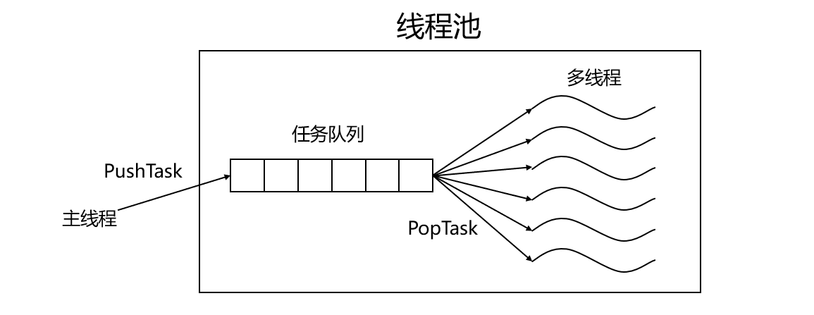
<a name="UVSTH"></a>
### 设计任务
当服务器获取到一个新连接后，需要将其封装成一个任务对象放到任务队列当中。任务类中首先需要有一个套接字，也就是与客户端进行通信的套接字，此外还需要有一个回调函数，当线程池中的线程获取到任务后就可以调用这个回调函数进行任务处理。<br />代码如下：
```cpp
//任务类
class Task{
    private:
        int _sock;         //通信的套接字
        CallBack _handler; //回调函数
    public:
        Task()
        {}
        Task(int sock)
            :_sock(sock)
        {}
        //处理任务
        void ProcessOn()
        {
            _handler(_sock); //调用回调
        }
        ~Task()
        {}
};
```
说明一下： 任务类需要提供一个无参的构造函数，因为后续从任务队列中获取任务时，需要先以无参的方式定义一个任务对象，然后再以输出型参数的方式来获取任务。
<a name="As1Jp"></a>
### 编写任务回调
任务类中处理任务时需要调用的回调函数，实际就是之前创建新线程时传入的执行例程`CallBack::HandlerRequest`，可以将CallBack类的()运算符重载为调用`HandlerRequest`函数，这时`CallBack`对象就变成了一个仿函数对象，这个仿函数对象被调用时实际就是在调用`HandlerRequest`函数。<br />代码如下：
```cpp
class CallBack{
    public:
        CallBack()
        {}
        void operator()(int sock)
        {
            HandlerRequest(sock);
        }
        void HandlerRequest(int sock)
        {
            LOG(INFO, "handler request begin");

            EndPoint* ep = new EndPoint(sock);
            ep->RecvHttpRequest(); //读取请求
            if(!ep->IsStop()){
                LOG(INFO, "Recv No Error, Begin Handler Request");
                ep->HandlerHttpRequest(); //处理请求
                ep->BuildHttpResponse();  //构建响应
                ep->SendHttpResponse();   //发送响应
                if(ep->IsStop()){
                    LOG(WARNING, "Send Error, Stop Send Response");
                }
            }
            else{
                LOG(WARNING, "Recv Error, Stop Handler Request");
            }

            close(sock); //关闭与该客户端建立的套接字
            delete ep;

            LOG(INFO, "handler request end");
        }
        ~CallBack()
        {}
};
```
<a name="WQfmR"></a>
### 编写线程池
<a name="APZib"></a>
#### 设计线程池结构
可以将线程池设计成单例模式：

1. 将ThreadPool类的构造函数设置为私有，并将拷贝构造和拷贝赋值函数设置为私有或删除，防止外部创建或拷贝对象。
2. 提供一个指向单例对象的static指针，并在类外将其初始化为nullptr。
3. 提供一个全局访问点获取单例对象，在单例对象第一次被获取时就创建这个单例对象并进行初始化。

ThreadPool类中的成员变量包括：

1. 任务队列：用于暂时存储未被处理的任务对象。
2. num：表示线程池中线程的个数。
3. 互斥锁：用于保证任务队列在多线程环境下的线程安全。
4. 条件变量：当任务队列中没有任务时，让线程在该条件变量下进行等等，当任务队列中新增任务时，唤醒在该条件变量下进行等待的线程。
5. 指向单例对象的指针：用于指向唯一的单例线程池对象。

ThreadPool类中的成员函数主要包括：

- 构造函数：完成互斥锁和条件变量的初始化操作。
- 析构函数：完成互斥锁和条件变量的释放操作。
- InitThreadPool：初始化线程池时调用，完成线程池中若干线程的创建。
- PushTask：生产任务时调用，将任务对象放入任务队列，并唤醒在条件变量下等待的一个线程进行处理。
- PopTask：消费任务时调用，从任务队列中获取一个任务对象。
- ThreadRoutine：线程池中每个线程的执行例程，完成线程分离后不断检测任务队列中是否有任务，如果有则调用PopTask获取任务进行处理，如果没有则进行休眠直到被唤醒。
- GetInstance：获取单例线程池对象时调用，如果单例对象未创建则创建并初始化后返回，如果单例对象已经创建则直接返回单例对象。

代码如下：
```cpp
#define NUM 6

//线程池
class ThreadPool{
    private:
        std::queue<Task> _task_queue; //任务队列
        int _num;                     //线程池中线程的个数
        pthread_mutex_t _mutex;       //互斥锁
        pthread_cond_t _cond;         //条件变量
        static ThreadPool* _inst;     //指向单例对象的static指针
    private:
        //构造函数私有
        ThreadPool(int num = NUM)
            :_num(num)
        {
            //初始化互斥锁和条件变量
            pthread_mutex_init(&_mutex, nullptr);
            pthread_cond_init(&_cond, nullptr);
        }
        //将拷贝构造函数和拷贝赋值函数私有或删除（防拷贝）
        ThreadPool(const ThreadPool&)=delete;
        ThreadPool* operator=(const ThreadPool&)=delete;

        //判断任务队列是否为空
        bool IsEmpty()
        {
            return _task_queue.empty();
        }

        //任务队列加锁
        void LockQueue()
        {
            pthread_mutex_lock(&_mutex);
        }
        
        //任务队列解锁
        void UnLockQueue()
        {
            pthread_mutex_unlock(&_mutex);
        }

        //让线程在条件变量下进行等待
        void ThreadWait()
        {
            pthread_cond_wait(&_cond, &_mutex);
        }
        
        //唤醒在条件变量下等待的一个线程
        void ThreadWakeUp()
        {
            pthread_cond_signal(&_cond);
        }

    public:
        //获取单例对象
        static ThreadPool* GetInstance()
        {
            static pthread_mutex_t mtx = PTHREAD_MUTEX_INITIALIZER; //定义静态的互斥锁
            //双检查加锁
            if(_inst == nullptr){
                pthread_mutex_lock(&mtx); //加锁
                if(_inst == nullptr){
                    //创建单例线程池对象并初始化
                    _inst = new ThreadPool();
                    _inst->InitThreadPool();
                }
                pthread_mutex_unlock(&mtx); //解锁
            }
            return _inst; //返回单例对象
        }

        //线程的执行例程
        static void* ThreadRoutine(void* arg)
        {
            pthread_detach(pthread_self()); //线程分离
            ThreadPool* tp = (ThreadPool*)arg;
            while(true){
                tp->LockQueue(); //加锁
                while(tp->IsEmpty()){
                    //任务队列为空，线程进行wait
                    tp->ThreadWait();
                }
                Task task;
                tp->PopTask(task); //获取任务
                tp->UnLockQueue(); //解锁

                task.ProcessOn(); //处理任务
            }
        }
        
        //初始化线程池
        bool InitThreadPool()
        {
            //创建线程池中的若干线程
            pthread_t tid;
            for(int i = 0;i < _num;i++){
                if(pthread_create(&tid, nullptr, ThreadRoutine, this) != 0){
                    LOG(FATAL, "create thread pool error!");
                    return false;
                }
            }
            LOG(INFO, "create thread pool success");
            return true;
        }
        
        //将任务放入任务队列
        void PushTask(const Task& task)
        {
            LockQueue();    //加锁
            _task_queue.push(task); //将任务推入任务队列
            UnLockQueue();  //解锁
            ThreadWakeUp(); //唤醒一个线程进行任务处理
        }

        //从任务队列中拿任务
        void PopTask(Task& task)
        {
            //获取任务
            task = _task_queue.front();
            _task_queue.pop();
        }

        ~ThreadPool()
        {
            //释放互斥锁和条件变量
            pthread_mutex_destroy(&_mutex);
            pthread_cond_destroy(&_cond);
        }
};
//单例对象指针初始化为nullptr
ThreadPool* ThreadPool::_inst = nullptr;
```
说明一下：

- 由于线程的执行例程的参数只能有一个void*类型的参数，因此线程的执行例程必须定义成静态成员函数，而线程执行例程中又需要访问任务队列，因此需要将this指针作为参数传递给线程的执行例程，这样线程才能够通过this指针访问任务队列。
- 在向任务队列中放任务以及从任务队列中获取任务时，都需要通过加锁的方式来保证线程安全，而线程在调用PopTask之前已经进行过加锁了，因此在PopTask函数中不必再加锁。
- 当任务队列中有任务时会唤醒线程进行任务处理，为了防止被伪唤醒的线程调用PopTask时无法获取到任务，因此需要以while的方式判断任务队列是否为空。

引入线程池后服务器要做的就是，每当获取到一个新连接时就构建一个任务，然后调用PushTask将其放入任务队列即可。<br />代码如下：
```cpp
//HTTP服务器
class HttpServer{
    private:
        int _port; //端口号
    public:
        //启动服务器
        void Loop()
        {
            LOG(INFO, "loop begin");
            TcpServer* tsvr = TcpServer::GetInstance(_port); //获取TCP服务器单例对象
            int listen_sock = tsvr->Sock(); //获取监听套接字
            while(true){
                struct sockaddr_in peer;
                memset(&peer, 0, sizeof(peer));
                socklen_t len = sizeof(peer);
                int sock = accept(listen_sock, (struct sockaddr*)&peer, &len); //获取新连接
                if(sock < 0){
                    continue; //获取失败，继续获取
                }

                //打印客户端相关信息
                std::string client_ip = inet_ntoa(peer.sin_addr);
                int client_port = ntohs(peer.sin_port);
                LOG(INFO, "get a new link: ["+client_ip+":"+std::to_string(client_port)+"]");
                
                //构建任务并放入任务队列中
                Task task(sock);
                ThreadPool::GetInstance()->PushTask(task);
            }
        }
};
```
<a name="JQBum"></a>
## 项目测试
<a name="a66Ht"></a>
### 服务器结构
至此HTTP服务器后端逻辑已经全部编写完毕，此时要做的就是将对外提供的资源文件放在一个名为wwwroot的目录下，然后将生成的HTTP服务器可执行程序与wwwroot放在同级目录下。比如：<br />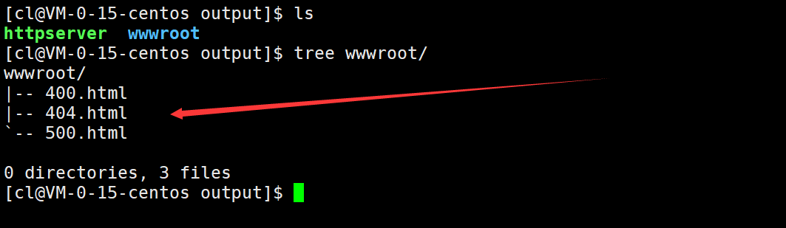<br />由于当前HTTP服务器没有任何业务逻辑，因此向外提供的资源文件只有三个错误页面文件，这些错误页面文件中的内容大致如下：
```html
<!DOCTYPE html>
<html>
    <head>
        <meta charset="UTF-8">
        <title>404 Not Found</title>
    </head>
    <body>
        <h1>404 Not Found</h1>
        <p>对不起，你所要访问的资源不存在！</p>
    </body>
</html>
```
<a name="V37w3"></a>
### 首页请求测试
<a name="R4AT8"></a>
#### 服务器首页编写
服务器的web根目录下的资源文件主要有两种，一种就是用于处理客户端上传上来的数据的CGI程序，另一种就是供客户端请求的各种网页文件了，而网页的制作实际是前端工程师要做的，但现在要对服务器进行测试，至少需要编写一个首页，首页文件需要放在web根目录下，取名为index.html。<br />以演示为主，首页的代码如下：
```html
<!DOCTYPE html>
<html lang="en">
<head>
    <meta charset="UTF-8">
    <meta http-equiv="X-UA-Compatible" content="IE=edge">
    <meta name="viewport" content="width=device-width, initial-scale=1.0">
    <title>Document</title>
    <style>
        .box{
            width: 400px;
            height: 400px;
            margin: 40px auto;
            background-color: #2b92d4;
            border-radius: 50%; /*圆角效果*/
            box-shadow: 0 1px 2px rgba(0, 0, 0, .3); /*阴影效果*/
            animation: breathe 2700ms ease-in-out infinite alternate;
        }
        @keyframes breathe {
            0%{
                opacity: 0.2; /*透明度*/
                box-shadow: 0 1px 2px rgba(255, 255, 255, 0.1);
            }
            50%{
                opacity: 0.5; /*透明度*/
                box-shadow: 0 1px 2px rgba(18, 190, 84, 0.76);
            }
            100%{
                opacity: 1; /*透明度*/
                box-shadow: 0 1px 30px rgba(59, 255, 255, 1);
            }
        }
    </style>
</head>
<body>
    <div class="box"></div>
</body>
</html>
```
<a name="mPCbX"></a>
#### 首页请求测试
指定端口号运行服务器后可以看到一系列日志信息被打印出来，包括套接字创建成功、绑定成功、监听成功，这时底层用于通信的TCP服务器已经初始化成功了。<br />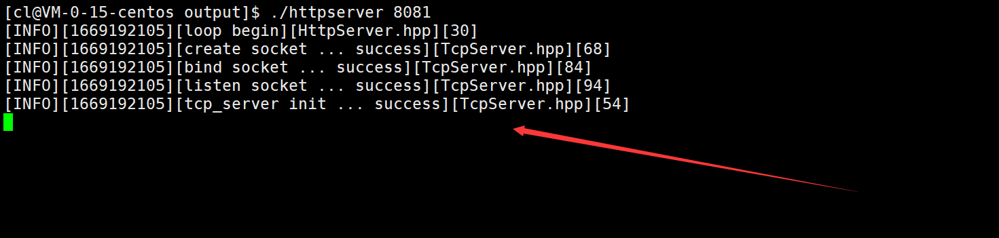<br />此时在浏览器上指定IP和端口访问HTTP服务器，由于没有指定要访问服务器web根目录下的那个资源，此时服务器就会默认将web根目录下的index.html文件进行返回，浏览器收到index.html文件后经过刷新渲染就显示出了对应的首页页面。<br />同时服务器端也打印出了本次请求的一些日志信息。如下：<br />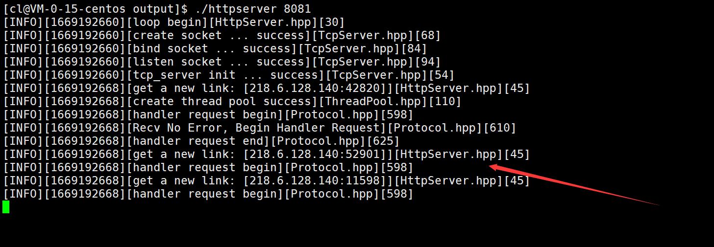<br />此时通过`ps -aL`命令可以看到线程池中的线程已经被创建好了，其中PID和LWP相同的就是主线程，剩下的就是线程池中处理任务的若干新线程。如下：<br />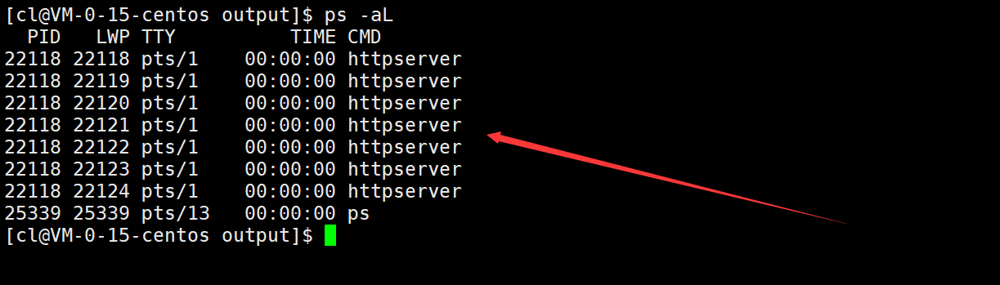
<a name="o1ISU"></a>
### 错误请求测试
如果请求的资源服务器并没有提供，那么服务器就会在获取请求资源属性信息时失败，这时服务器会停止本次请求处理，而直接将web根目录下的404.html文件返回浏览器，浏览器收到后经过刷新渲染就显示出了对应的404页面。<br /><br />这时在服务器端就能看到一条日志级别为WARNING的日志信息，这条日志信息中说明了客户端请求的哪一个资源是不存在的。<br />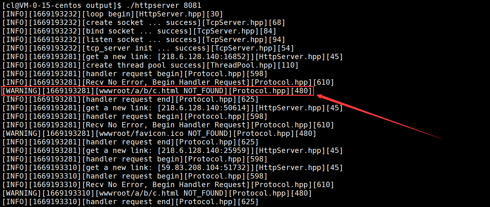
<a name="rtJLH"></a>
### GET方法上传数据测试
<a name="CrA7x"></a>
#### 编写CGI程序
如果用户请求服务器时上传了数据，那么服务器就需要将该数据后交给对应的CGI程序进行处理，因此在测试GET方法上传数据之前，需要先编写一个简单的CGI程序。<br />首先，CGI程序启动后需要先获取父进程传递过来的数据：<br />先通过getenv函数获取环境变量中的请求方法。<br />如果请求方法为GET方法，则继续通过getenv函数获取父进程传递过来的数据。<br />如果请求方法为POST方法，则先通过getenv函数获取父进程传递过来的数据的长度，然后再从0号文件描述符中读取指定长度的数据即可。<br />代码如下：
```cpp
//获取参数
bool GetQueryString(std::string& query_string)
{
    bool result = false;
    std::string method = getenv("METHOD"); //获取请求方法
    if(method == "GET"){ //GET方法通过环境变量获取参数
        query_string = getenv("QUERY_STRING");
        result = true;
    }
    else if(method == "POST"){ //POST方法通过管道获取参数
        int content_length = atoi(getenv("CONTENT_LENGTH"));
        //从管道中读取content_length个参数
        char ch = 0;
        while(content_length){
            read(0, &ch, 1);
            query_string += ch;
            content_length--;
        }
        result = true;
    }
    else{
        //Do Nothing
        result = false;
    }
    return result;
}
```
CGI程序在获取到父进程传递过来的数据后，就可以根据具体的业务场景进行数据处理了，比如用户上传的如果是一个关键字则需要CGI程序做搜索处理。这里以演示为目的，认为用户上传的是形如a=10&b=20的两个参数，需要CGI程序进行加减乘除运算。<br />因此CGI程序要做的就是，先以&为分隔符切割数据将两个操作数分开，再以=为分隔符切割数据分别获取到两个操作数的值，最后对两个操作数进行加减乘除运算，并将计算结果打印到标准输出即可（标准输出已经被重定向到了管道）。<br />代码如下：
```cpp
//切割字符串
bool CutString(std::string& in, const std::string& sep, std::string& out1, std::string& out2)
{
    size_t pos = in.find(sep);
    if(pos != std::string::npos){
        out1 = in.substr(0, pos);
        out2 = in.substr(pos + sep.size());
        return true;
    }
    return false;
}
int main()
{
    std::string query_string;
    GetQueryString(query_string); //获取参数

    //以&为分隔符将两个操作数分开
    std::string str1;
    std::string str2;
    CutString(query_string, "&", str1, str2);

    //以=为分隔符分别获取两个操作数的值
    std::string name1;
    std::string value1;
    CutString(str1, "=", name1, value1);
    std::string name2;
    std::string value2;
    CutString(str2, "=", name2, value2);

    //处理数据
    int x = atoi(value1.c_str());
    int y = atoi(value2.c_str());
    std::cout<<"<html>";
    std::cout<<"<head><meta charset=\"UTF-8\"></head>";
    std::cout<<"<body>";
    std::cout<<"<h3>"<<x<<" + "<<y<<" = "<<x+y<<"</h3>";
    std::cout<<"<h3>"<<x<<" - "<<y<<" = "<<x-y<<"</h3>";
    std::cout<<"<h3>"<<x<<" * "<<y<<" = "<<x*y<<"</h3>";
    std::cout<<"<h3>"<<x<<" / "<<y<<" = "<<x/y<<"</h3>"; //除0后cgi程序崩溃，属于异常退出
    std::cout<<"</body>";
    std::cout<<"</html>";

    return 0;
}
```
说明一下：

- CGI程序输出的结果最终会交给浏览器，因此CGI程序输出的最好是一个HTML文件，这样浏览器收到后就可以其渲染到页面上，让用户看起来更美观。
- 可以看到，使用C/C++以HTML的格式进行输出是很费劲的，因此这部分操作一般是由Python等语言来完成的，而在此之前对数据进行业务处理的动作一般才用C/C++等语言来完成。
- 在编写CGI程序时如果要进行调试，debug内容应该通过标准错误流进行输出，因为子进程在被替换成CGI程序之前，已经将标准输出重定向到管道了。
<a name="OJri3"></a>
#### URL上传数据测试
CGI程序编写编写完毕并生成可执行程序后，将这个可执行程序放到web根目录下，这时在请求服务器时就可以指定请求这个CGI程序，并通过URL上传参数让其进行处理，最终就能得到计算结果。<br /><br />此外，如果请求CGI程序时指定的第二个操作数为0，那么CGI程序在进行除法运算时就会崩溃，这时父进程等待子进程后就会发现子进程是异常退出的，进而设置状态码为INTERNAL_SERVER_ERROR，最终服务器就会构建对应的错误页面返回给浏览器。<br />
<a name="egeRH"></a>
#### 表单上传数据测试
当然，让用户通过更改URL的方式来向服务器上传参数是不现实的，服务器一般会让用户通过表单来上传参数。<br />HTML中的表单用于搜集用户的输入，可以通过设置表单的method属性来指定表单提交的方法，通过设置表单的action属性来指定表单需要提交给服务器上的哪一个CGI程序。<br />比如现在将服务器的首页改成以下HTML代码，指定将表单中的数据以GET方法提交给web根目录下的test_cgi程序：
```html
<!DOCTYPE html>
<html lang="en">
<head>
    <meta charset="UTF-8">
    <meta http-equiv="X-UA-Compatible" content="IE=edge">
    <meta name="viewport" content="width=device-width, initial-scale=1.0">
    <title>简易的在线计算器</title>
</head>
<body>
    <form action="/test_cgi" method="get" align="center">
        操作数1：<br>
        <input type="text" name="x"><br>
        操作数2：<br>
        <input type="text" name="y"><br><br>
        <input type="submit" value="计算">
    </form>
</body>
</html>
```
此时直接访问服务器看到的就是一个表单，向表单中输入两个操作数并点击“计算”后，表单中的数据就会以GET方法提交给web根目录下的test_cgi程序，此时CGI程序进行数据计算后同样将结果返回给了浏览器。<br /><br />同时在提交表单的一瞬间可以看到，通过表单上传的数据也回显到了浏览器上方的URL中，并且请求的资源也变成了web根目录下的test_cgi。实际就是在点击“计算”后，浏览器检测到表单method为“get”后，将把表单中数据添加到了URL中，并将请求资源路径替换成了表单action指定的路径，然后再次向服务器发起HTTP请求。
<a name="Z1QRP"></a>
### 理解百度搜索
当在百度的搜索框输入关键字并回车后，可以看到上方的URL发生了变化，URL中的请求资源路径为/s，并且URL后面携带了很多参数。<br />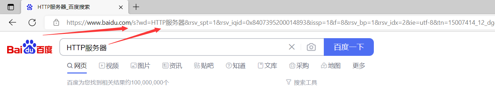<br />实际这里的/s就可以理解成是百度web根目录下的一个CGI程序，而URL中携带的各种参数就是交给这个CGI程序做搜索处理的，可以看到携带的参数中有一个名为wd的参数，这个参数正是用户的搜索关键字。
<a name="b8ZJE"></a>
### POST方法上传数据测试
<a name="YC82O"></a>
#### 表单上传数据测试
测试表单通过POST方法上传数据时，只需要将表单中的method属性改为“post”即可，此时点击“计算”提交表单时，浏览器检测到表单的提交方法为POST后，就会将表单中的数据添加到请求正文中，并将请求资源路径替换成表单action指定的路径，然后再次向服务器发起HTTP请求。<br />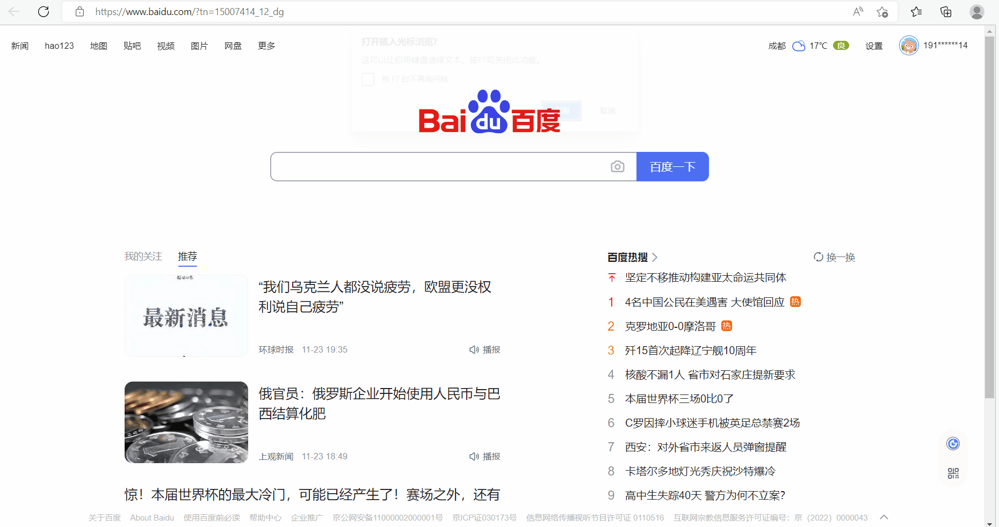<br />可以看到，由于POST方法是通过请求正文上传的数据，因此表单提交后浏览器上方的URL中只有请求资源路径发生了改变，而并没有在URL后面添加任何参数。同时观察服务器端输出的日志信息，也可以确认浏览器本次的请求方法为POST方法。<br />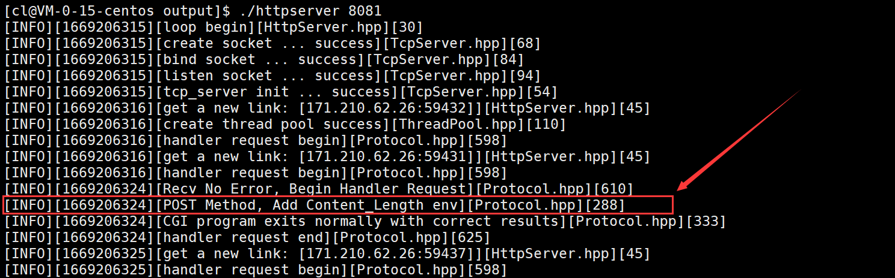
<a name="abdJA"></a>
## 项目扩展
当前项目的重点在于HTTP服务器后端的处理逻辑，主要完成的是GET和POST请求方法，以及CGI机制的搭建。如果想对当前项目进行扩展，可以选择在技术层面或应用层面进行扩展。
<a name="n7VVC"></a>
### 技术层面的扩展
技术层面可以选择进行如下扩展：

1. 当前项目编写的是HTTP1.0版本的服务器，每次连接都只会对一个请求进行处理，当服务器对客户端的请求处理完毕并收到客户端的应答后，就会直接断开连接。可以将其扩展为HTTP1.1版本，让服务器支持长连接，即通过一条连接可以对多个请求进行处理，避免重复建立连接（涉及连接管理）。
2. 当前项目虽然在后端接入了线程池，但也只能满足中小型应用，可以考虑将服务器改写成epoll版本，让服务器的IO变得更高效。
3. 可以给当前的HTTP服务器新增代理功能，也就是可以替代客户端去访问某种服务，然后将访问结果再返回给客户端。
<a name="h8N25"></a>
### 应用层面的扩展
应用层面可以选择进行如下扩展：

1. 基于当前HTTP服务器，搭建在线博客。
2. 基于当前HTTP服务器，编写在线画图板。
3. 基于当前HTTP服务器，编写一个搜索引擎。
<a name="fzA3m"></a>
## 项目源码
Github：[https://github.com/chenlong-cxy/Implement-Http-Server/tree/main/HTTP_End](https://github.com/chenlong-cxy/Implement-Http-Server/tree/main/HTTP_End)
