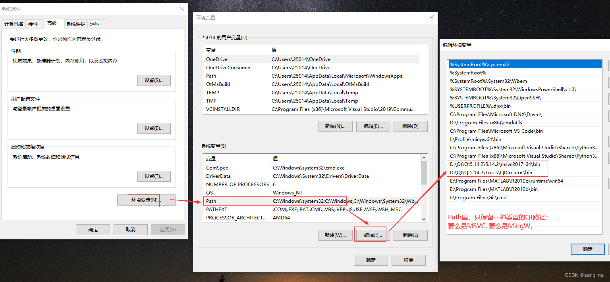

# 使用QT  Release打包

1、不使用<code>debug</code>，使用<code>release()</code>编译，**注意这里是64位版本！**

2、将使用<code>release()</code>编译方式生成的文件夹下的<code>xxxx.exe</code>单独放在新建的文件夹（c盘的cal_re的文件夹）里面

3、开始界面里找到qt开发工具<code>Qt 5.14.2（MinGW 7.3.0 64-bit）</code>，这里是<code>5.14.2</code>版本，**这里也是64位**（要与上面的编译器位数保持一致，否则会出现程序定位点无法正常输入的BUG）

> + 在我的实践过程中，一定要保持这两个位置一致，就是QTCreator的编译器和菜单栏的环境版本一致，都是**64位**的
>
> 
>
> 

打开命令行工具把路径修改成刚刚存放xxxx.exe的文件夹路径

使用<code>windeployqt</code>命令

~~~ shell
windeployqt calculator.exe
~~~

4、把整个文件夹cal_re移动到没安装qt环境的电脑上，点击xxxx.exe就可以单独运行了。

## Qt“报无法定位程序输入点xxx于动态连接库“问题

 出现这种问题的原因有很多：

- (1) 工程Release/Debug，与lib的Release/Debug不一致；
- (2）Qt的Path环境没有设置好，应该区分工程的32或64位，MSVC或MingW路径；
- (3) 子类没有实现父类的虚函数，导致编译报错。

### **1 将lib库版本与工程的版本保持一致**

+ 若工程是Release版本的，则引用的lib要改成Release的；若工程是Debug版本的，则引用的lib要改成Debug的；
  即Release lib + Release vs.sln；Debug lib + Debug vs.sln

+ 比如工程本身是Debug版本，而第三方lib库是Release的，则需要将工程改成Release版本，如图(2)所示：
  在VS里，将菜单栏改成Release，右击工程 --》属性 --》也改成Release --》应用。
  

### **2 设置正确的Qt环境变量**

+ Qt环境变量，包括2种：(A)Qt插件+VS环境，(B)纯Qt环境；
+ (A)、(B)这2种环境，不要同时配置到Path里。若同时配置到Path，编译器会无法识别，造成编译失败。 

#### 2.1 Qt插件+VS环境

​	若工程是Qt-addin插件+VS编译的，则选择MSVC环境变量；

**64位 MSVC**

~~~ text
path = D:\Qt\Qt5.14.2\5.14.2\msvc2017_64\bin;D:\Qt\Qt5.14.2\Tools\QtCreator\bin;
~~~

**32位 msvc**

~~~ shell
path = D:\Qt\Qt5.14.2\5.14.2\msvc2017\bin;D:\Qt\Qt5.14.2\Tools\QtCreator\bin;
~~~

#### 2.2 纯Qt环境

 若工程是纯Qt编译，即采用Qt Creator编译，则选择MingW环境。

**64位 mingw64**

~~~ shell
path = D:\Qt\Qt5.14.2\5.14.2\mingw73_64\bin;D:\Qt\Qt5.14.2\Tools\mingw730_64\bin;
~~~

**32位 mingw32**

~~~ shell
path = D:\Qt\Qt5.14.2\5.14.2\mingw73_32\bin;D:\Qt\Qt5.14.2\Tools\mingw730_32\bin;
~~~

#### 2.3 重启电脑

+  配置Qt的Path环境变量之后，要重启电脑，环境才生效。
+ 按Alt+F4快捷键，选中"重启"下拉框即可重启。

### **3. 实现父类的虚函数**

​	有些lib库继承了一个虚函数类，这个虚函数需要在子类里手动实现。可以在子类里加一个同名的函数覆盖它，先保证编译通过，再去调试相应的子模块。

~~~ c++
//父类: Father
class Father {
public:
	Father() {}
	~Father() {}

	virtual void Print() = 0;
};
~~~

~~~ c++
//子类:Child
class Child :Father {
public:
	Child() {}
	~Child() {}

	//重写父类的虚函数
	void Print() { std::cout << "hello\n"; };
};
~~~

