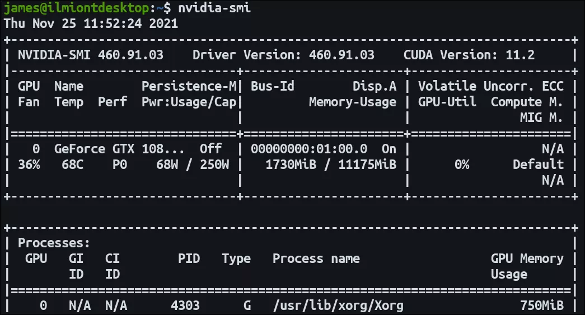
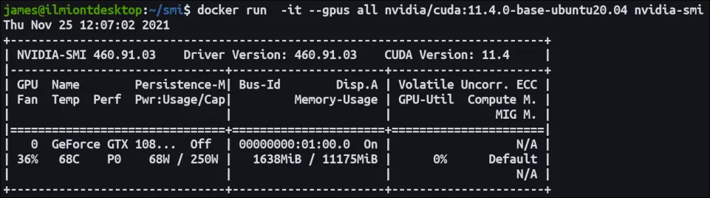

# GPU NVIDA Docker

Docker 容器不会自动看到系统的 GPU。这会导致依赖 GPU 的工作负载（例如机器学习框架）的性能降低。以下是将主机的 NVIDIA GPU 公开给容器的方法。
<a name="KSCML"></a>

## 让 GPU 在 Docker 中工作
Docker 容器共享主机的内核，但带有自己的操作系统和软件包。这意味着它们缺少用于与 GPU 交互的 NVIDIA 驱动程序。默认情况下，Docker 甚至不会向容器添加 GPU，因此`docker run`根本看不到硬件。<br />概括地说，让 GPU 工作是一个两步过程：在映像中安装驱动程序，然后指示 Docker 在运行时将 GPU 设备添加到容器中。<br />这里侧重于 CUDA 和 Docker 的现代版本。最新版本的 NVIDIA Container Toolkit 专为 CUDA 10 和 Docker Engine 19.03 及更高版本的组合而设计。CUDA、Docker 和 NVIDIA 驱动程序的旧版本可能需要额外的步骤。
<a name="fsV1G"></a>
## 添加 NVIDIA 驱动程序
在继续进行 Docker 配置之前，请确保主机上的 NVIDIA 驱动程序正常工作。应该能够成功运行nvidia-smi并看到 GPU 名称、驱动程序版本和 CUDA 版本。<br /><br />要将 GPU 与 Docker 结合使用，请首先将[NVIDIA Container Toolkit](https://github.com/NVIDIA/nvidia-docker)添加到主机。这集成到 Docker 引擎中以自动配置容器以支持 GPU。<br />使用示例命令将工具包的包存储库添加到系统：
```bash
distribution=$(. /etc/os-release;echo $ID$VERSION_ID) \
   && curl -s -L https://nvidia.github.io/nvidia-docker/gpgkey | sudo apt-key add - \
   && curl -s -L https://nvidia.github.io/nvidia-docker/$distribution/nvidia-docker.list | sudo tee /etc/apt/sources.list.d/nvidia-docker.list
```
接下来在主机上安装nvidia-docker2软件包：
```bash
apt-get update
apt-get install -y nvidia-docker2
```
重启 Docker 守护进程以完成安装：
```bash
sudo systemctl restart docker
```
Container Toolkit 现在应该可以运行了。
<a name="FhFUd"></a>
## 使用 GPU 访问启动容器
由于默认情况下 Docker 不提供系统的 GPU，需要创建带有`--gpus`硬件标志的容器以显示。可以指定要启用的特定设备或使用all关键字。<br />该nvidia/cuda 镜像是预先配置了CUDA二进制文件和GPU的工具。启动一个容器并运行nvidia-smi命令来检查 GPU 是否可以访问。输出应与nvidia-smi在主机上使用时看到的相符。CUDA 版本可能会有所不同，具体取决于主机上和所选容器映像中的工具包版本。
```bash
docker run -it --gpus all nvidia/cuda:11.4.0-base-ubuntu20.04 nvidia-smi
```

<a name="C7oVl"></a>
## 选择基础镜像
使用其中一个[nvidia/cuda](https://hub.docker.com/r/nvidia/cuda/tags)标签是让 GPU 工作负载在 Docker 中运行的最快和最简单的方法。有许多不同的变体可供选择；它们提供了操作系统、CUDA 版本和 NVIDIA 软件选项的矩阵。这些镜像是为多种架构而构建的。<br />每个标签都具有以下格式：<br />11.4.0-base-ubuntu20.04

- 11.4.0 – CUDA version.
- base – Image flavor.
- ubuntu20.04 – Operating system version.

提供三种不同的镜像风格。该base镜像是基本 CUDA 运行时二进制文件的最小选项。runtime是一个功能更全面的选项，包括用于[跨GPU通信](https://developer.nvidia.com/nccl)的 CUDA 数学库和 NCCL 。第三种变体devel为runtime提供了用于创建自定义 CUDA 镜像的所有内容以及头文件和开发工具。<br />如果其中一个镜像适合，请将其用作Dockerfile。然后，可以使用常规 Dockerfile 指令来安装编程语言、复制源代码并配置应用程序。它消除了手动 GPU 设置步骤的复杂性。
```dockerfile
FROM nvidia/cuda:11.4.0-base-ubuntu20.04
RUN apt update
RUN apt-get install -y python3 python3-pip
RUN pip install tensorflow-gpu

COPY tensor-code.py .
ENTRYPONT ["python3", "tensor-code.py"]
```
使用`--gpus`标志构建和运行此镜像将通过 GPU 加速启动 Tensor 工作负载。
<a name="Cqwh4"></a>
## 手动配置镜像
如果需要选择不同的基础镜像，可以手动为镜像添加 CUDA 支持。实现此目的的最佳方法是参考[官方NVIDIA Dockerfiles](https://gitlab.com/nvidia/container-images/cuda/-/blob/master/dist/11.5.0/ubuntu2004/base/Dockerfile)<br />复制用于添加 CUDA 包存储库、安装库并将其链接到路径的说明。这里不会复制本指南中的所有步骤，因为它们因 CUDA 版本和操作系统而异。<br />注意 Dockerfile 末尾的环境变量——这些定义了使用镜像的容器如何与 NVIDIA Container Runtime 集成：
```
ENV NVIDIA_VISIBLE_DEVICES all
ENV NVIDIA_DRIVER_CAPABILITIES compute,utility
```
一旦安装了 CUDA 并设置了环境变量，镜像应该会检测到 GPU。这可以更好地控制镜像的内容，但随着新 CUDA 版本的发布，可能需要调整。
<a name="JptmP"></a>
## 它是如何工作的？
NVIDIA Container Toolkit 是一个包的集合，它们将容器运行时（如 Docker）与主机上 NVIDIA 驱动程序的接口包装在一起。该libnvidia-container库负责提供 API 和 CLI，通过运行时包装器自动将系统的 GPU 提供给容器。<br />该nvidia-container-toolkit组件实现了一个容器运行时prestart钩子。这意味着它会在新容器即将启动时收到通知。它查看要附加并调用libnvidia-container以处理容器创建的 GPU 。<br />挂钩由nvidia-container-runtime启用。这会包装“真实”容器运行时，例如 containerd 或 runc，以确保prestart运行NVIDIA挂钩。在钩子执行后，现有的运行时会继续容器启动过程。安装容器工具包后，将看到在 Docker 守护程序配置文件中选择了 NVIDIA 运行时。
<a name="ih1Yt"></a>
## 概括
在 Docker 容器内使用 NVIDIA GPU 需要将 NVIDIA Container Toolkit 添加到主机。这将 NVIDIA 驱动程序与容器运行时集成在一起。<br />docker run使用--gpu标志调用硬件对容器可见。在安装 Container Toolkit 后，必须在启动的每个容器上设置此项。<br />NVIDIA 提供预配置的 CUDA Docker 镜像，可以将其用作应用程序的快速入门。如果需要更具体的内容，请参阅官方 Dockerfiles 以组装与 Container Toolkit 兼容的文件。
<a name="t5J59"></a>
## 参考资料
NVIDIA Container Toolkit: [https://github.com/NVIDIA/nvidia-docker](https://github.com/NVIDIA/nvidia-docker)<br />nvidia/cuda: [https://hub.docker.com/r/nvidia/cuda/tags](https://hub.docker.com/r/nvidia/cuda/tags)<br />跨GPU通信: [https://developer.nvidia.com/nccl](https://developer.nvidia.com/nccl)<br />官方NVIDIA Dockerfiles: [https://gitlab.com/nvidia/container-images/cuda/-/blob/master/dist/11.5.0/ubuntu2004/base/Dockerfile](https://gitlab.com/nvidia/container-images/cuda/-/blob/master/dist/11.5.0/ubuntu2004/base/Dockerfile)
