# OpenCV

+ 官方文档：[OpenCV官方文档](https://docs.opencv.org/)
+ 官网：[OpenCV官网](https://opencv.org/)
+ 官方训练好的模型[📎haarcascades.zip](https://www.yuque.com/attachments/yuque/0/2021/zip/448115/1630334524522-bacb6aa2-252e-4aac-9a27-f1a195b5172f.zip)

+ 数据集下载 https://www.kaggle.com/

OpenCV是一款由Intel公司俄罗斯团队发起并参与和维护的一个计算机视觉处理开源软件库，支持与计算机视觉和机器学习相关的众多算法。

## 1. opencv包安装

~~~ shell
pip install opencv-python -i https://mirrors.aliyun.com/pypi/simple/
~~~

官方文档：[OpenCV documentation index](https://docs.opencv.org/)

## 2. opencv简单图像处理

### 2.1 图像像素存储形式

首先得了解下图像在计算机中存储形式：(为了方便画图，每列像素值都写一样了)

对于只有黑白颜色的灰度图，为单通道，一个像素块对应矩阵中一个数字，数值为0到255, 其中0表示最暗（黑色） ，255表示最亮（白色）

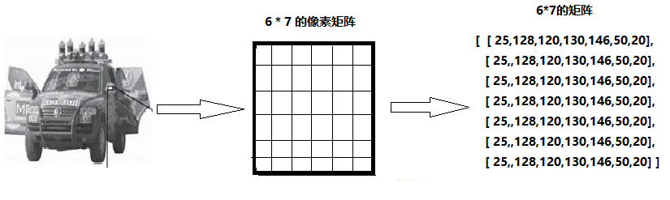

对于采用RGB模式的彩色图片，为三通道图，Red、Green、Blue三原色，按不同比例相加，一个像素块对应矩阵中的一个向量, 如[24,180, 50]，分别表示三种颜色的比列, 即对应深度上的数字，如下图所示：

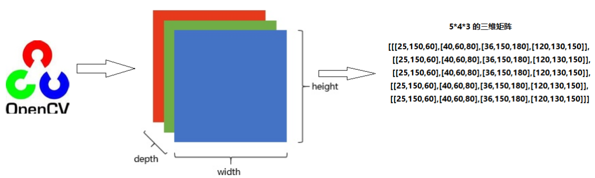

**注意：**由于历史遗留问题，opencv采用BGR模式，而不是RGB

### 2.2 图像读取和写入

**cv.imread()**

~~~ python
cv.imread(img_path, flag) 读取图片，返回图片对象
    img_path: 图片的路径，即使路径错误也不会报错，但打印返回的图片对象为None
    flag：cv.IMREAD_COLOR，读取彩色图片，图片透明性会被忽略，为默认参数，也可以传入1
          cv.IMREAD_GRAYSCALE,按灰度模式读取图像，也可以传入0
          cv.IMREAD_UNCHANGED,读取图像，包括其alpha通道，也可以传入-1
~~~

**cv.imshow()**

~~~ python
cv.imshow(window_name, img)：显示图片，窗口自适应图片大小
    window_name: 指定窗口的名字
    img：显示的图片对象
    可以指定多个窗口名称，显示多个图片
    
cv.waitKey(millseconds)  键盘绑定事件，阻塞监听键盘按键，返回一个数字（不同按键对应的数字不同）
    millseconds: 传入时间毫秒数，在该时间内等待键盘事件；传入0时，会一直等待键盘事件
    
cv.destroyAllWindows(window_name) 
    window_name: 需要销毁的窗口名字，不传入时关闭所有窗口
~~~

**cv.imwrite()**

~~~ python
cv.imwrite(img_path_name, img)
    img_path_name:保存的文件名
    img：文件对象
~~~

**cv.cvtColor()**

~~~ python
cv.cvtColor()
    参数：
        img: 图像对象
        code：
            cv.COLOR_RGB2GRAY: RGB转换到灰度模式
            cv.COLOR_RGB2HSV： RGB转换到HSV模式（hue,saturation,Value）
cv.inRange()
    参数：
        img: 图像对象/array
        lowerb: 低边界array，  如lower_blue = np.array([110,50,50])
        upperb：高边界array， 如 upper_blue = np.array([130,255,255])
    mask = cv.inRange(hsv, lower_green, upper_green)
~~~

使用示例：

~~~ python
import cv2 as cv

img = cv.imread(r"./image/kids.jpg")
# print(img.shape)
# 将图片灰度处理
img_gray = cv.cvtColor(img, cv.COLOR_BGR2GRAY)
ret, img_threshold = cv.threshold(img_gray, 127, 255, cv.THRESH_BINARY)
cv.imshow("img", img)
cv.imshow("thre", img_threshold)
key = cv.waitKey(0)
cv.imwrite(r"./image/kids1.jpg", img_threshold)
~~~

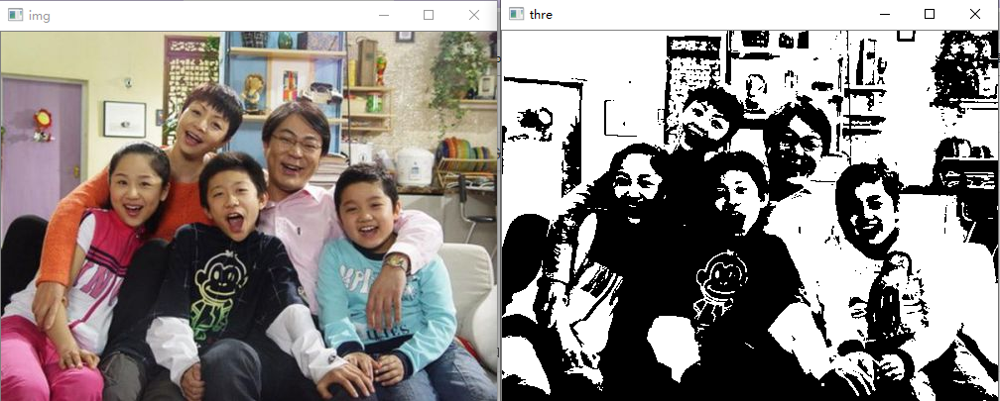

### 2.3 绘制图形和文字

**绘制图形**

~~~ python
# 绘制直线
cv.line(img, start, end, color, thickness)
    img:要绘制直线的图像
    Start,end: 直线的起点和终点
    color: 线条的颜色
    Thickness: 线条宽度
        
# 绘制圆形        
cv.circle(img, centerpoint, r, color, thickness)
    mg:要绘制圆形的图像
    Centerpoint, r: 圆心和半径
    color: 线条的颜色
    Thickness: 线条宽度，为-1时生成闭合图案并填充颜色
        
# 绘制矩形        
cv.rectangle(img,leftupper,rightdown,color,thickness)
    img:要绘制矩形的图像
    Leftupper, rightdown: 矩形的左上角和右下角坐标
    color: 线条的颜色
    Thickness: 线条宽度
~~~

**向图像中添加文字**

~~~ python
# 向图像中添加文字
cv.putText(img, text, station, font, fontsize, color, thickness, cv.LINE_AA)
    img: 图像
    text：要写入的文本数据
    station：文本的放置位置
    font：字体
    Fontsize :字体大小
~~~

使用示例：

~~~ python
import numpy as np
import cv2 as cv
import matplotlib.pyplot as plt

# 1 创建一个空白的图像
img = np.zeros((512, 512, 3), np.uint8)
# 2 绘制图形
cv.line(img, (0, 0), (511, 511), (255, 0, 0), 5)
cv.rectangle(img, (384, 0), (510, 128), (0, 255, 0), 3)
cv.circle(img, (447, 63), 63, (0, 0, 255), -1)
font = cv.FONT_HERSHEY_SIMPLEX
cv.putText(img, 'OpenCV', (10, 500), font, 4, (255, 255, 255), 2, cv.LINE_AA)
# 3 图像展示
plt.imshow(img)
plt.title('匹配结果'), plt.xticks([]), plt.yticks([])
plt.show()
~~~

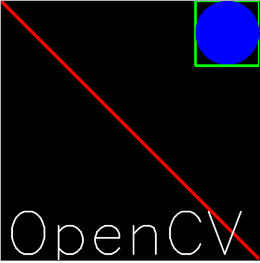

### 2.4 图像像素获取和裁剪

**获取并修改图像中的像素点**

~~~ python
import numpy as np
import cv2 as cv

img = cv.imread('./image/kids.jpg')
# 获取某个像素点的值
px = img[100, 100]
print(px)
# 仅获取蓝色通道的强度值
blue = img[100, 100, 0]
print(blue)
# 修改某个位置的像素值
img[100, 100] = [255, 255, 255]

[142 187 190]
142
~~~

**图片性质**

图像属性包括行数，列数和通道数，图像数据类型，像素数等。

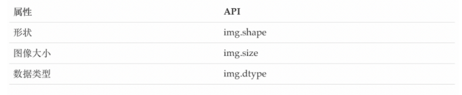

~~~ python
import cv2 as cv
img = cv.imread(r"./image/kids.jpg")

# rows, cols, channels
img.shape   #返回(280, 450, 3), 宽280(rows)，长450(cols)，3通道(channels)
# size
img.size    #返回378000，所有像素数量，=280*450*3
# type
img.dtype   #dtype('uint8')
~~~

**ROI截取（Range of Interest）**

有时需要在B，G，R通道图像上单独工作。在这种情况下，需要将BGR图像分割为单个通道。或者在其他情况下，可能需要将这些单独的通道合并到BGR图像。你可以通过以下方式完成。

~~~ python
#ROI,Range of instrest
roi = img[100:200,300:400]  #截取100行到200行，列为300到400列的整块区域
img[50:150,200:300] = roi   #将截取的roi移动到该区域 （50到100行，200到300列）
b = img[:,:,0]  #截取整个蓝色通道

# 通道拆分
b, g, r = cv.split(img)
# 通道合并
img = cv.merge((b, g, r))
~~~

### 2.5 添加边界(padding)

~~~ python
cv.copyMakeBorder()
    参数：
        img:图像对象
        top, bottom, left, right: 上下左右边界宽度，单位为像素值
        borderType:
            cv.BORDER_CONSTANT, 带颜色的边界，需要传入另外一个颜色值
            cv.BORDER_REFLECT, 边缘元素的镜像反射做为边界
            cv.BORDER_REFLECT_101/cv.BORDER_DEFAULT
            cv.BORDER_REPLICATE, 边缘元素的复制做为边界
            CV.BORDER_WRAP
        value: borderType为cv.BORDER_CONSTANT时，传入的边界颜色值，如[0,255,0]
~~~

使用示例：

~~~ python
import cv2 as cv
import matplotlib.pyplot as plt

img2 = cv.imread(r"./image/dog.jpg")
img = cv.cvtColor(img2, cv.COLOR_BGR2RGB)  # matplotlib的图像为RGB格式
constant = cv.copyMakeBorder(img, 20, 20, 20, 20, cv.BORDER_CONSTANT, value=[0, 255, 0])  # 绿色
reflect = cv.copyMakeBorder(img, 20, 20, 20, 20, cv.BORDER_REFLECT)
reflect01 = cv.copyMakeBorder(img, 20, 20, 20, 20, cv.BORDER_REFLECT_101)
replicate = cv.copyMakeBorder(img, 20, 20, 20, 20, cv.BORDER_REPLICATE)
wrap = cv.copyMakeBorder(img, 20, 20, 20, 20, cv.BORDER_WRAP)
titles = ["constant", "reflect", "reflect01", "replicate", "wrap"]
images = [constant, reflect, reflect01, replicate, wrap]

for i in range(5):
    plt.subplot(2, 3, i + 1), plt.imshow(images[i]), plt.title(titles[i])
    plt.xticks([]), plt.yticks([])
plt.show()
~~~

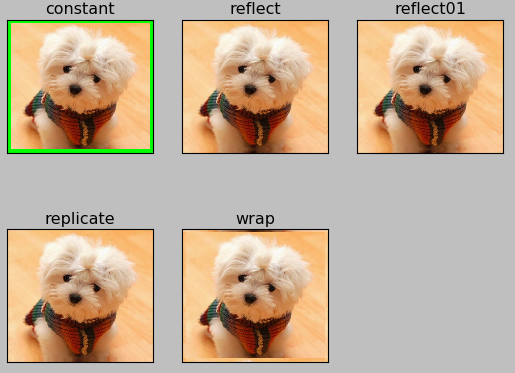

### 2.6 像素算术运算

**cv.add()** 相加的两个图片，应该有相同的大小和通道

你可以使用OpenCV的cv.add()函数把两幅图像相加，或者可以简单地通过numpy操作添加两个图像，如res = img1 + img2。两个图像应该具有相同的大小和类型，或者第二个图像可以是标量值。

**注意：OpenCV加法和Numpy加法之间存在差异。OpenCV的加法是饱和操作，而Numpy添加是模运算。**

~~~ python
cv.add()
    参数：
        img1:图片对象1
        img2:图片对象2
        mask:None （掩膜，一般用灰度图做掩膜，img1和img2相加后，和掩膜与运算，从而达到掩盖部分区域的目的）
        dtype:-1

注意：图像相加时应该用cv.add(img1,img2)代替img1+img2    
>>> x = np.uint8([250])
>>> y = np.uint8([10])
>>> print cv.add(x,y) # 250+10 = 260 => 255  #相加，opencv超过255的截取为255
[[255]]
>>> print x+y          # 250+10 = 260 % 256 = 4  #相加，np超过255的会取模运算 （uint8只能表示0-255，所以取模）
[4]
~~~

使用示例：图一无掩膜，图二有掩膜

~~~ python
import numpy as np
import cv2 as cv
import matplotlib.pyplot as plt

# 1 读取图像
img1 = cv.imread("./image/view.jpg")
img2 = cv.imread("./image/rain.jpg")

# 2 加法操作
img3 = cv.add(img1, img2)  # cv中的加法
img4 = img1 + img2  # 直接相加

# 3 图像显示
fig, axes = plt.subplots(nrows=1, ncols=2, figsize=(10, 8), dpi=100)
axes[0].imshow(img3[:, :, ::-1])
axes[0].set_title("cv中的加法")
axes[1].imshow(img4[:, :, ::-1])
axes[1].set_title("直接相加")
plt.show()
~~~

结果如下所示：

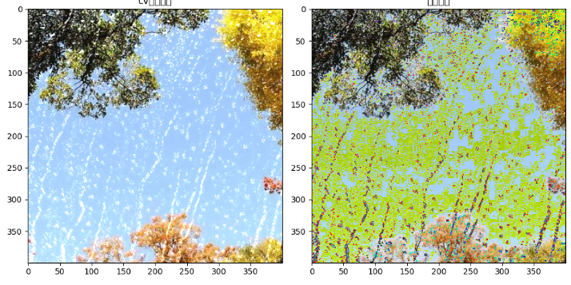

**cv.addWeight():** 两张图片相加，分别给予不同权重，实现图片融合和透明背景等效果

这其实也是加法，但是不同的是两幅图像的权重不同，这就会给人一种混合或者透明的感觉。图像混合的计算公式如下：

> g(x) = (1−α)f0(x) + αf1(x)

通过修改 α 的值（0 → 1），可以实现非常炫酷的混合。

现在我们把两幅图混合在一起。第一幅图的权重是0.7，第二幅图的权重是0.3。函数cv2.addWeighted()可以按下面的公式对图片进行混合操作。

> dst = α⋅img1 + β⋅img2 + γ

这里γ取为零。

~~~ python
cv.addWeighted() 两张图片相加，分别给予不同权重，实现图片融合和透明背景等效果
    参数：
        img1:图片对象1
        alpha:img1的权重
        img2:图片对象2
        beta:img1的权重
        gamma：常量值，图像相加后再加上常量值
        dtype：返回图像的数据类型，默认为-1，和img1一样
    (img1*alpha+img2*beta+gamma)
~~~

使用示例：

~~~ python
import numpy as np
import cv2 as cv
import matplotlib.pyplot as plt

# 1 读取图像
img1 = cv.imread("./image/view.jpg")
img2 = cv.imread("./image/rain.jpg")

# 2 图像混合
img3 = cv.addWeighted(img1, 0.7, img2, 0.3, 0)

# 3 图像显示
plt.figure(figsize=(8, 8))
plt.imshow(img3[:, :, ::-1])
plt.show()
~~~

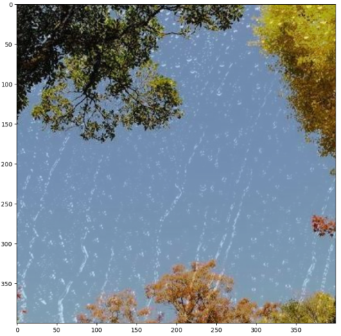

### 2.7 图像位运算

**btwise_and(), bitwise_or(), bitwise_not(), bitwise_xor()**

~~~ pythoncv.btwise_and(): 与运算
cv.btwise_and(): 与运算
    参数：
        img1:图片对象1
        img2:图片对象2
        mask:掩膜
    cv.bitwise_or()：或运算
    参数：
        img1:图片对象1
        img2:图片对象2
        mask:掩膜
    cv.bitwise_not(): 非运算
        img1:图片对象1
        mask:掩膜
    cv.bitwise_xor():异或运算，相同为1，不同为0（1^1=0,1^0=1）
        img1:图片对象1
        img2:图片对象2
        mask:掩膜
~~~

使用示例：将logo图片移动到足球图片中，需要截取logo图片的前景和足球图片ROI的背景，然后叠加，效果如下：

~~~ python
import cv2 as cv
import matplotlib.pyplot as plt

img1 = cv.imread(r"./image/logo.png")
rows,cols = img1.shape[0:2]
img2 = cv.imread(r"./image/Messi.jpg")
roi = img2[0:rows, 0:cols]
img1_gray = cv.cvtColor(img1,cv.COLOR_BGR2GRAY)

ret,img1_thres = cv.threshold(img1_gray, 200, 255,cv.THRESH_BINARY_INV)
img1_fg =cv.add(img1, img1, mask=img1_thres)    #拿到logo图案的前景

img1_thres_inv = cv.bitwise_not(img1_thres)
roi_bg = cv.add(roi, roi,mask=img1_thres_inv)  #拿到roi图案的背景

img_add = cv.add(img1_fg, roi_bg)     #背景和前景相加    
img2[0:rows, 0:cols] = img_add

cv.imshow("gray", img1_gray)
cv.imshow("thres", img1_thres)
cv.imshow("fg", img1_fg)
cv.imshow("tinv", img1_thres_inv)
cv.imshow("roi_bg", roi_bg)
cv.imshow("img_add", img_add)
cv.imshow("img2", img2)
cv.waitKey(0)
cv.destroyAllWindows()
~~~

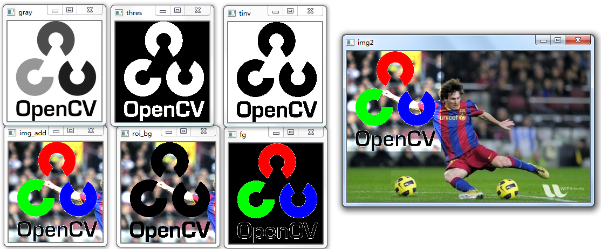

### 2.8 性能评价　

**cv.getTickCount()：** 获得时钟次数

**cv.getTickFrequency()****：**获得时钟频率 （每秒振动次数）

~~~ python
img1 = cv.imread('messi5.jpg')

e1 = cv.getTickCount()
for i in xrange(5,49,2):
    img1 = cv.medianBlur(img1,i)
e2 = cv.getTickCount()
t = (e2 - e1)/cv.getTickFrequency()
print(t)
~~~

### 2.9 绑定trackbar到图像

**cv.createTrackbar()**

**cv.getTrackbarPos()**

~~~ python
cv.createTrackbar() 为窗口添加trackbar
    参数：
        trackbarname: trackbar的名字
        winname: 窗口的名字
        value: trackbar创建时的值
        count：trackbar能设置的最大值，最小值总为0
        onChange：trackbar值发生变化时的回调函数，trackbar的值作为参数传给onchange
        
cv.getTrackbarPos() 获取某个窗口中trackbar的值
    参数：
        trackbarname: trackbar的名字
        winname: 窗口的名字
~~~

使用示例：通过改变trackbar的值，来寻找最优的mask范围，从而识别出图片中蓝色的瓶盖

~~~ python
import cv2 as cv
import numpy as np

def nothing(args):
    pass

img = cv.imread(r"./image/frame.png")
img_hsv = cv.cvtColor(img,cv.COLOR_BGR2HSV)
cv.namedWindow('tracks')
cv.createTrackbar("LH","tracks",0,255,nothing)
cv.createTrackbar("LS","tracks",0,255,nothing)
cv.createTrackbar("LV","tracks",0,255,nothing)

cv.createTrackbar("UH","tracks",255,255,nothing)
cv.createTrackbar("US","tracks",255,255,nothing)
cv.createTrackbar("UV","tracks",255,255,nothing)

# switch = "0:OFF \n1:ON"
# cv.createTrackbar(switch,"tracks",0,1,nothing)

while True:
        
    l_h = cv.getTrackbarPos("LH","tracks")
    l_s = cv.getTrackbarPos("LS","tracks")
    l_v = cv.getTrackbarPos("LV","tracks")
    u_h = cv.getTrackbarPos("UH","tracks")
    u_s = cv.getTrackbarPos("US","tracks")
    u_v = cv.getTrackbarPos("UV","tracks")
    
    lower_b = np.array([l_h,l_s,l_v])
    upper_b = np.array([u_h,u_s,u_v])
    
    mask = cv.inRange(img_hsv,lower_b,upper_b)
    res = cv.add(img,img,mask=mask)
    
    cv.imshow("img",img)
    cv.imshow("mask",mask)
    cv.imshow("res",res)
    k = cv.waitKey(1)
    if k==27:
        break
    
cv.destroyAllWindows()
~~~

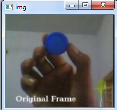

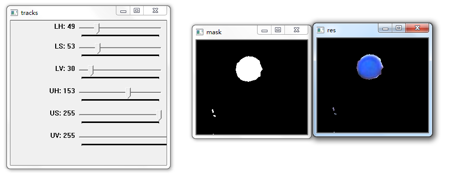

再来一个例子：

~~~ python
import cv2 as cv
import numpy as np

def empty(a):
    pass

def stackImages(scale, imgArray):
    rows = len(imgArray)
    cols = len(imgArray[0])
    rowsAvailable = isinstance(imgArray[0], list)
    width = imgArray[0][0].shape[1]
    height = imgArray[0][0].shape[0]
    if rowsAvailable:
        for x in range(0, rows):
            for y in range(0, cols):
                if imgArray[x][y].shape[:2] == imgArray[0][0].shape[:2]:
                    imgArray[x][y] = cv.resize(imgArray[x][y], (0, 0), None, scale, scale)
                else:
                    imgArray[x][y] = cv.resize(imgArray[x][y], (imgArray[0][0].shape[1], imgArray[0][0].shape[0]), None,
                                               scale, scale)
                if len(imgArray[x][y].shape) == 2: imgArray[x][y] = cv.cvtColor(imgArray[x][y], cv.COLOR_GRAY2BGR)
        imageBlank = np.zeros((height, width, 3), np.uint8)
        hor = [imageBlank] * rows
        hor_con = [imageBlank] * rows
        for x in range(0, rows):
            hor[x] = np.hstack(imgArray[x])
        ver = np.vstack(hor)
    else:
        for x in range(0, rows):
            if imgArray[x].shape[:2] == imgArray[0].shape[:2]:
                imgArray[x] = cv.resize(imgArray[x], (0, 0), None, scale, scale)
            else:
                imgArray[x] = cv.resize(imgArray[x], (imgArray[0].shape[1], imgArray[0].shape[0]), None, scale, scale)
            if len(imgArray[x].shape) == 2: imgArray[x] = cv.cvtColor(imgArray[x], cv.COLOR_GRAY2BGR)
        hor = np.hstack(imgArray)
        ver = hor
    return ver

path = 'Resources/lambo.png'
cv.namedWindow("TrackBars")
cv.resizeWindow("TrackBars", 640, 240)
cv.createTrackbar("Hue Min", "TrackBars", 0, 179, empty)
cv.createTrackbar("Hue Max", "TrackBars", 19, 179, empty)
cv.createTrackbar("Sat Min", "TrackBars", 110, 255, empty)
cv.createTrackbar("Sat Max", "TrackBars", 240, 255, empty)
cv.createTrackbar("Val Min", "TrackBars", 153, 255, empty)
cv.createTrackbar("Val Max", "TrackBars", 255, 255, empty)

while True:
    img = cv.imread(path)
    imgHSV = cv.cvtColor(img, cv.COLOR_BGR2HSV)
    h_min = cv.getTrackbarPos("Hue Min", "TrackBars")
    h_max = cv.getTrackbarPos("Hue Max", "TrackBars")
    s_min = cv.getTrackbarPos("Sat Min", "TrackBars")
    s_max = cv.getTrackbarPos("Sat Max", "TrackBars")
    v_min = cv.getTrackbarPos("Val Min", "TrackBars")
    v_max = cv.getTrackbarPos("Val Max", "TrackBars")
    print(h_min, h_max, s_min, s_max, v_min, v_max)
    lower = np.array([h_min, s_min, v_min])
    upper = np.array([h_max, s_max, v_max])
    mask = cv.inRange(imgHSV, lower, upper)
    imgResult = cv.bitwise_and(img, img, mask=mask)

    # cv.imshow("Original",img)
    # cv.imshow("HSV",imgHSV)
    # cv.imshow("Mask", mask)
    # cv.imshow("Result", imgResult)

    # stackImages图片拼接
    imgStack = stackImages(0.6, ([img, imgHSV], [mask, imgResult]))
    cv.imshow("Stacked Images", imgStack)

    cv.waitKey(1)
~~~

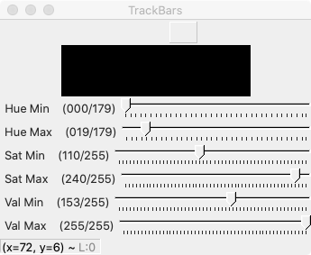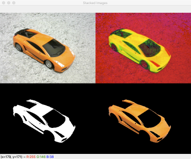

## 3. 图像阈值化

**cv.threshold()**

**cv.adaptiveThreshold()**

~~~ python
cv.threshold(): 
    参数：
        img:图像对象，必须是灰度图
        thresh:阈值
        maxval：最大值
        type:
            cv.THRESH_BINARY:     小于阈值的像素置为0，大于阈值的置为maxval
            cv.THRESH_BINARY_INV： 小于阈值的像素置为maxval，大于阈值的置为0
            cv.THRESH_TRUNC：      小于阈值的像素不变，大于阈值的置为thresh
            cv.THRESH_TOZERO       小于阈值的像素置0，大于阈值的不变
            cv.THRESH_TOZERO_INV   小于阈值的不变，大于阈值的像素置0
返回两个值
    ret:阈值
    img：阈值化处理后的图像
    
cv.adaptiveThreshold() 自适应阈值处理，图像不同部位采用不同的阈值进行处理
    参数：
        img: 图像对象，8-bit单通道图
        maxValue:最大值
        adaptiveMethod: 自适应方法
            cv.ADAPTIVE_THRESH_MEAN_C     ：阈值为周围像素的平均值
            cv.ADAPTIVE_THRESH_GAUSSIAN_C : 阈值为周围像素的高斯均值（按权重）
        threshType:
            cv.THRESH_BINARY:     小于阈值的像素置为0，大于阈值的置为maxValuel
            cv.THRESH_BINARY_INV:  小于阈值的像素置为maxValue，大于阈值的置为0
        blocksize: 计算阈值时，自适应的窗口大小,必须为奇数 （如3：表示附近3个像素范围内的像素点，进行计算阈值）
        C： 常数值，通过自适应方法计算的值，减去该常数值
    (mean value of the blocksize*blocksize neighborhood of (x, y) minus C)
~~~

使用示例：

~~~ python
import cv2 as cv
import matplotlib.pyplot as plt

img = cv.imread(r"C:./image/maze.png", 0)

ret, thre1 = cv.threshold(img, 127, 255, cv.THRESH_BINARY)
adaptive_thre1 = cv.adaptiveThreshold(img, 255, cv.ADAPTIVE_THRESH_MEAN_C, cv.THRESH_BINARY, 7, 2)
adaptive_thre2 = cv.adaptiveThreshold(img, 255, cv.ADAPTIVE_THRESH_GAUSSIAN_C, cv.THRESH_BINARY, 7, 2)

titles = ["img", "thre1", "adaptive_thre1", "adaptive_thre2"]
imgs = [img, thre1, adaptive_thre1, adaptive_thre2]

for i in range(4):
    plt.subplot(2, 2, i + 1), plt.imshow(imgs[i], "gray")
    plt.title(titles[i])
    plt.xticks([]), plt.yticks([])
plt.show()
~~~

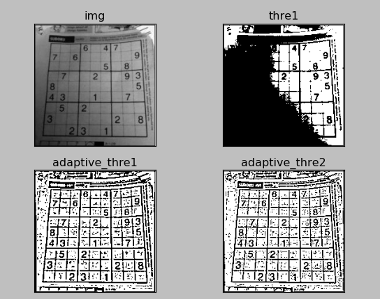

**奥斯二值化（Otsu's Binarization）**

对于一些双峰图像，奥斯二值化能找到两峰之间的像素值作为阈值，并将其返回。适用于双峰图像的阈值化，或者通过去噪而产生的双峰图像。

官网使用示例：

~~~ python
import cv2 as cv
import numpy as np
from matplotlib import pyplot as plt

img = cv.imread('noisy2.png',0)

# global thresholding
ret1,th1 = cv.threshold(img,127,255,cv.THRESH_BINARY)

# Otsu's thresholding
ret2,th2 = cv.threshold(img,0,255,cv.THRESH_BINARY+cv.THRESH_OTSU)

# Otsu's thresholding after Gaussian filtering
blur = cv.GaussianBlur(img,(5,5),0)
ret3,th3 = cv.threshold(blur,0,255,cv.THRESH_BINARY+cv.THRESH_OTSU)

# plot all the images and their histograms
images = [img, 0, th1,
          img, 0, th2,
          blur, 0, th3]
titles = ['Original Noisy Image','Histogram','Global Thresholding (v=127)',
          'Original Noisy Image','Histogram',"Otsu's Thresholding",
          'Gaussian filtered Image','Histogram',"Otsu's Thresholding"]

for i in xrange(3):
    plt.subplot(3,3,i*3+1),plt.imshow(images[i*3],'gray')
    plt.title(titles[i*3]), plt.xticks([]), plt.yticks([])
    plt.subplot(3,3,i*3+2),plt.hist(images[i*3].ravel(),256)
    plt.title(titles[i*3+1]), plt.xticks([]), plt.yticks([])
    plt.subplot(3,3,i*3+3),plt.imshow(images[i*3+2],'gray')
    plt.title(titles[i*3+2]), plt.xticks([]), plt.yticks([])
plt.show()
~~~

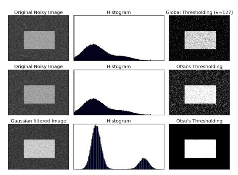

## 4. 图像形状变换

### 4.1 cv.resize()  图像缩放

缩放是对图像的大小进行调整，即使图像放大或缩小。

~~~ python
cv.resize(src, dsize, fx=0, fy=0, interpolation=cv2.INTER_LINEAR) 放大和缩小图像
    参数：
        src: 输入图像对象
        dsize：输出矩阵/图像的大小，为0时计算方式如下：dsize = Size(round(fx*src.cols),round(fy*src.rows))
        fx: 水平轴的缩放因子，为0时计算方式：  (double)dsize.width/src.cols
        fy: 垂直轴的缩放因子，为0时计算方式：  (double)dsize.heigh/src.rows
        interpolation：插值算法
            cv.INTER_NEAREST : 最近邻插值法
            cv.INTER_LINEAR   默认值，双线性插值法
            cv.INTER_AREA        基于局部像素的重采样（resampling using pixel area relation）。对于图像抽取（image decimation）来说，这可能是一个更好的方法。但如果是放大图像时，它和最近邻法的效果类似。
            cv.INTER_CUBIC        基于4x4像素邻域的3次插值法
            cv.INTER_LANCZOS4     基于8x8像素邻域的Lanczos插值
                     
    cv.INTER_AREA 适合于图像缩小， cv.INTER_CUBIC (slow) & cv.INTER_LINEAR 适合于图像放大
~~~

官网示例：

~~~ python
import cv2 as cv
from matplotlib import pyplot as plt

# 1. 读取图片
img1 = cv.imread("./image/kids.jpg")
# 2.图像缩放
# 2.1 绝对尺寸
rows, cols = img1.shape[:2]
res = cv.resize(img1, (2 * cols, 2 * rows), interpolation=cv.INTER_CUBIC)

# 2.2 相对尺寸
res1 = cv.resize(img1, None, fx=0.5, fy=0.5)

# 3 图像显示
# 3.1 使用opencv显示图像(不推荐)
cv.imshow("orignal", img1)
cv.imshow("enlarge", res)
cv.imshow("shrink）", res1)
cv.waitKey(0)

# 3.2 使用matplotlib显示图像
fig, axes = plt.subplots(nrows=1, ncols=3, figsize=(10, 8), dpi=100)
axes[0].imshow(res[:, :, ::-1])
axes[0].set_title("绝对尺度（放大）")
axes[1].imshow(img1[:, :, ::-1])
axes[1].set_title("原图")
axes[2].imshow(res1[:, :, ::-1])
axes[2].set_title("相对尺度（缩小）")
plt.show()
~~~

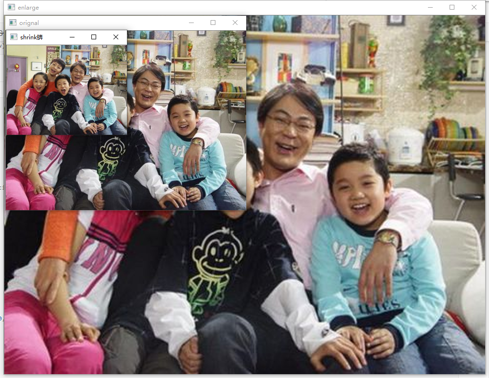

### 4.2 cv.warpAffine()   仿射变换

仿射变换（从二维坐标到二维坐标之间的线性变换，且保持二维图形的“平直性”和“平行性”。仿射变换可以通过一系列的原子变换的复合来实现，包括平移，缩放，翻转，旋转和剪切）

~~~ python
cv.warpAffine()   仿射变换（从二维坐标到二维坐标之间的线性变换，且保持二维图形的“平直性”和“平行性”。仿射变换可以通过一系列的原子变换的复合来实现，包括平移，缩放，翻转，旋转和剪切）
    参数：
        img: 图像对象
        M：2*3 transformation matrix (转变矩阵)
        dsize：输出矩阵的大小,注意格式为（cols，rows）  即width对应cols，height对应rows
        flags：可选，插值算法标识符，有默认值INTER_LINEAR，
               如果插值算法为WARP_INVERSE_MAP, warpAffine函数使用如下矩阵进行图像转dst(x,y)=src(M11*x+M12*y+M13,M21*x+M22*y+M23)
        borderMode：可选， 边界像素模式，有默认值BORDER_CONSTANT 
        borderValue:可选，边界取值，有默认值Scalar()即0
~~~

常用插值算法：

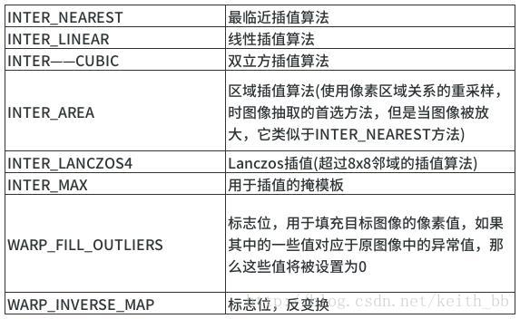

仿射变换的本质：即一个矩阵A和向量B共同组成的转变矩阵，和原图像坐标相乘来得到新图像的坐标，从而实现图像移动，旋转等。如下矩阵A和向量B组成的转变矩阵M，用来对原图像的坐标（x,y）进行转变，得到新坐标向量T

矩阵A和向量B

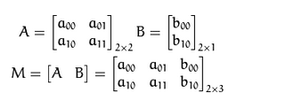

仿射变换（矩阵计算）：变换前坐标（x,y）

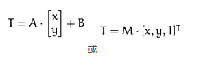

变换结果：变换后坐标（a00*x+a01 *y+b00, a10*x+a11*y+b10）

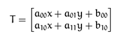

### 4.2.1 平移变换

了解了仿射变换的概念，平移变换只是采用了一个如下的转变矩阵（transformation matrix）: 从（x,y）平移到（x+tx, y+ty）

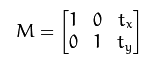

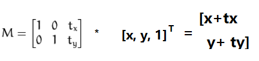

官网使用示例：向左平移100，向下平移50

~~~ python
cv.warpAffine(img, M, dsize)
    img: 输入图像
    M： 2*∗3移动矩阵
    dsize: 输出图像的大小
~~~

**注意：输出图像的大小，它应该是(宽度，高度)的形式。请记住,width=列数，height=行数**

~~~ python
import numpy as np
import cv2 as cv
import matplotlib.pyplot as plt

# 1. 读取图像
img1 = cv.imread("./image/kids.jpg")

# 2. 图像平移
rows, cols = img1.shape[:2]
M = M = np.float32([[1, 0, 100], [0, 1, 50]])  # 平移矩阵
dst = cv.warpAffine(img1, M, (cols, rows))

# 3. 图像显示
fig, axes = plt.subplots(nrows=1, ncols=2, figsize=(10, 8), dpi=100)
axes[0].imshow(img1[:, :, ::-1])
axes[0].set_title("原图")
axes[1].imshow(dst[:, :, ::-1])
axes[1].set_title("平移后结果")
plt.show()
~~~

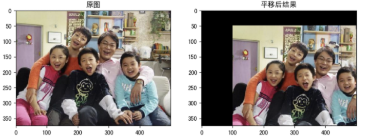

### 4.2.2 放大和缩小

放大和缩小指相对于原坐标（x,y）,变换为了（a*x, b*y）,即水平方向放大了a倍，水平方向放大了b倍，其对应的转变矩阵如下：

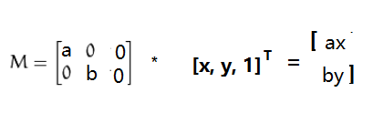

### 4.2.3 旋转变换

**图像旋转是指图像按照某个位置转动一定角度的过程，旋转中图像仍保持这原始尺寸。图像旋转后图像的水平对称轴、垂直对称轴及中心坐标原点都可能会发生变换，因此需要对图像旋转中的坐标进行相应转换。**

将（x,y），以坐标原点为中心，顺时针方向旋转α得到(x1,y1)， 有如下关系x1 = xcosα-ysinα, y1 =xsinα+ycosα; 因此可以构建对应的转变矩阵如下：

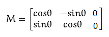

opencv将其扩展到，任意点center为中心进行顺时针旋转α，放大scale倍的，转变矩阵如下：

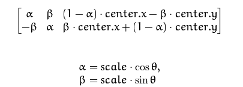

通过getRotationMatrix2D()能得到转变矩阵

~~~ python
cv.getRotationMatrix2D()  返回2*3的转变矩阵（浮点型）
    参数：
        center：旋转的中心点坐标
        angle：旋转角度，单位为度数，证书表示逆时针旋转
        scale：同方向的放大倍数
~~~

~~~ python
import numpy as np
import cv2 as cv
import matplotlib.pyplot as plt

# 1 读取图像
img = cv.imread("./image/kids.jpg")

# 2 图像旋转
rows, cols = img.shape[:2]
# 2.1 生成旋转矩阵
M = cv.getRotationMatrix2D((cols / 2, rows / 2), 90, 1)
# 2.2 进行旋转变换
dst = cv.warpAffine(img, M, (cols, rows))

# 3 图像展示
fig, axes = plt.subplots(nrows=1, ncols=2, figsize=(10, 8), dpi=100)
axes[0].imshow(img[:, :, ::-1])
axes[0].set_title("原图")
axes[1].imshow(dst[:, :, ::-1])
axes[1].set_title("旋转后结果")
plt.show()
~~~

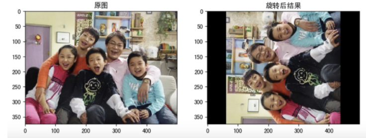

#### 4.2.4 仿射变换矩阵的计算

通过上述的平移，缩放，旋转的组合变换即实现了仿射变换，上述多个变换的变换矩阵相乘即能得到组合变换的变换矩阵。同时该变换矩阵中涉及到六个未知数（2*3的矩阵），通过变换前后对应三组坐标，也可以求出变换矩阵，opencv提供了函数getAffineTransform()来计算变化矩阵

1. 矩阵相乘：将平移，旋转和缩放的变换矩阵相乘，最后即为仿射变换矩阵
2. getAffineTransform()：根据变换前后三组坐标计算变换矩阵　　　　

~~~ python
cv.getAffineTransform()  返回2*3的转变矩阵
    参数：
        src：原图像中的三组坐标，如np.float32([[50,50],[200,50],[50,200]])
        dst: 转换后的对应三组坐标，如np.float32([[10,100],[200,50],[100,250]])
~~~

~~~ python
import numpy as np
import cv2 as cv
import matplotlib.pyplot as plt

# 1 图像读取
img = cv.imread("./image/kids.jpg")

# 2 仿射变换
rows, cols = img.shape[:2]
# 2.1 创建变换矩阵
pts1 = np.float32([[50, 50], [200, 50], [50, 200]])
pts2 = np.float32([[100, 100], [200, 50], [100, 250]])
M = cv.getAffineTransform(pts1, pts2)
# 2.2 完成仿射变换
dst = cv.warpAffine(img, M, (cols, rows))

# 3 图像显示
fig, axes = plt.subplots(nrows=1, ncols=2, figsize=(10, 8), dpi=100)
axes[0].imshow(img[:, :, ::-1])
axes[0].set_title("原图")
axes[1].imshow(dst[:, :, ::-1])
axes[1].set_title("仿射后结果")
plt.show()
~~~

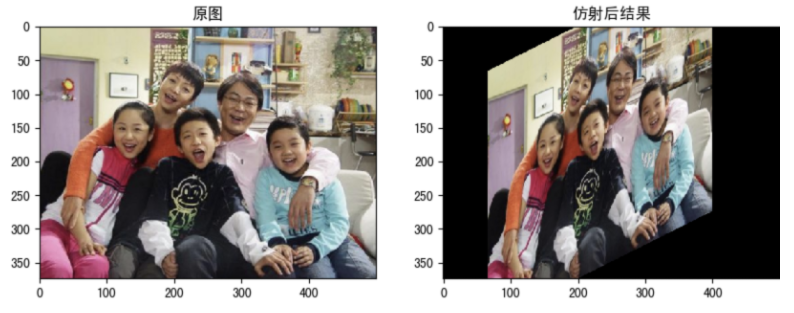

### 4.3 透视变换(persperctive transformation)

仿射变换都是在二维空间的变换，透视变换（投影变换）是在三维空间中发生了旋转。需要前后四组坐标来计算对应的转变矩阵，opencv提供了函数getPerspectiveTransform()来计算转变矩阵，cv2.wrapPerspective()函数来进行透视变换。其对应参数如下：　

~~~ python
cv.getPerspectiveTransform()   返回3*3的转变矩阵
    src：原图像中的四组坐标，如 np.float32([[56,65],[368,52],[28,387],[389,390]])
    dst: 转换后的对应四组坐标，如np.float32([[0,0],[300,0],[0,300],[300,300]])
   
cv.wrapPerspective()
	src: 图像对象
    M：3*3 transformation matrix (转变矩阵)
    dsize：输出矩阵的大小，注意格式为（cols，rows）  即width对应cols，height对应rows
    flags：可选，插值算法标识符，有默认值INTER_LINEAR，如果插值算法为WARP_INVERSE_MAP, warpAffine函数使用如下矩阵进行图像转dst(x,y)=src(M11*x+M12*y+M13,M21*x+M22*y+M23)
    borderMode：可选， 边界像素模式，有默认值BORDER_CONSTANT 
    borderValue:可选，边界取值，有默认值Scalar()即0
~~~

使用示例：

~~~ python
import cv2 as cv
import numpy as np
# 1 读取图像

img = cv.imread("./image/poker.jpg")

width, height = 250, 350
# 2 创建变换矩阵
# 找到扑克牌中的四个点
pts1 = np.float32([[111, 219],[287, 188],[154, 482],[352, 440]])
pts2 = np.float32([[0, 0], [width, 0], [0, height], [width, height]])
matrix = cv.getPerspectiveTransform(pts1, pts2)
# 3 进行变换
imgOutput = cv.warpPerspective(img, matrix, (width, height))

# 4 图像显示
cv.imshow("Image", img)
cv.imshow("Output", imgOutput)

cv.waitKey(0)
~~~

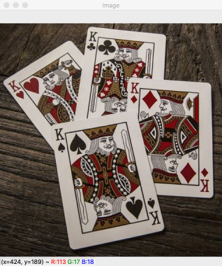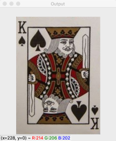

从上图中可以透视变换的一个应用，如果能找到原图中纸张的四个顶点，将其转换到新图中纸张的四个顶点，能将歪斜的roi区域转正，并进行放大；如在书籍，名片拍照上传后进行识别时，是一个很好的图片预处理方法。

## 5. 形态学操作

形态学转换是基于图像形状的一些简单操作。它通常在二进制图像上执行。腐蚀和膨胀是两个基本的形态学运算符。然后它的变体形式如开运算，闭运算，礼帽黑帽等。

### 5.1 腐蚀和膨胀

腐蚀和膨胀是最基本的形态学操作，腐蚀和膨胀都是针对白色部分（高亮部分）而言的。

膨胀就是使图像中高亮部分扩张，效果图拥有比原图更大的高亮区域；腐蚀是原图中的高亮区域被蚕食，效果图拥有比原图更小的高亮区域。膨胀是求局部最大值的操作，腐蚀是求局部最小值的操作。

1. **腐蚀**

   具体操作是：用一个结构元素扫描图像中的每一个像素，用结构元素中的每一个像素与其覆盖的像素做“与”操作，如果都为1，则该像素为1，否则为0。如下图所示，结构A被结构B腐蚀后：

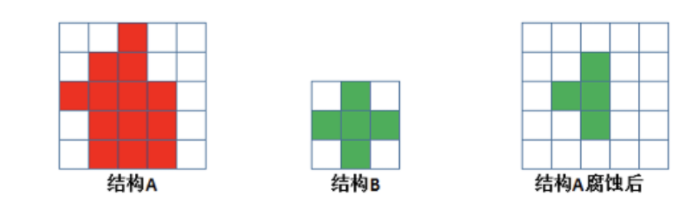

腐蚀的作用是消除物体边界点，使目标缩小，可以消除小于结构元素的噪声点。

**API**：

~~~ python
cv.erode(img,kernel,iterations)
    img: 要处理的图像
    kernel: 核结构
    iterations: 腐蚀的次数，默认是1
~~~

2. **膨胀**

具体操作是：用一个结构元素扫描图像中的每一个像素，用结构元素中的每一个像素与其覆盖的像素做“与”操作，如果都为0，则该像素为0，否则为1。如下图所示，结构A被结构B腐蚀后：

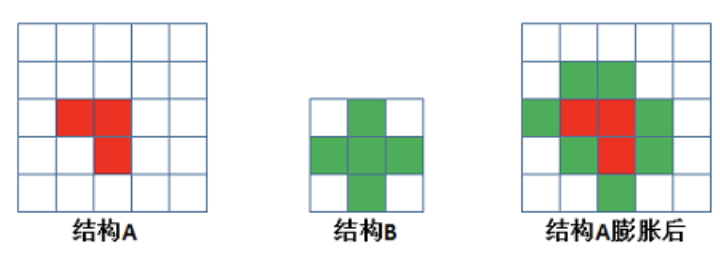

膨胀的作用是将与物体接触的所有背景点合并到物体中，使目标增大，可添补目标中的孔洞。

**API**：

~~~ python
cv.dilate(img,kernel,iterations)
  img: 要处理的图像
  kernel: 核结构
  iterations: 腐蚀的次数，默认是1
~~~

**示例**

我们使用一个5*5的卷积核实现腐蚀和膨胀的运算：

~~~ python
import numpy as np
import cv2 as cv
import matplotlib.pyplot as plt

# 1 读取图像
img = cv.imread("./image/letter.png")
# 2 创建核结构
kernel = np.ones((5, 5), np.uint8)

# 3 图像腐蚀和膨胀
erosion = cv.erode(img, kernel)  # 腐蚀
dilate = cv.dilate(img, kernel)  # 膨胀

# 4 图像展示
fig, axes = plt.subplots(nrows=1, ncols=3, figsize=(10, 8), dpi=100)
axes[0].imshow(img)
axes[0].set_title("原图")
axes[1].imshow(erosion)
axes[1].set_title("腐蚀后结果")
axes[2].imshow(dilate)
axes[2].set_title("膨胀后结果")
plt.show()
~~~

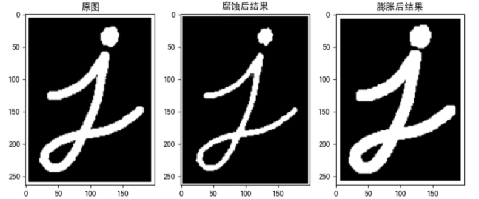

### 5.2 开闭运算

开运算和闭运算是将腐蚀和膨胀按照一定的次序进行处理。 但这两者并不是可逆的，即先开后闭并不能得到原来的图像。

1. **开运算**
   开运算是先腐蚀后膨胀，其**作用**是：分离物体，消除小区域。**特点**：消除噪点，去除小的干扰块，而不影响原来的图像。

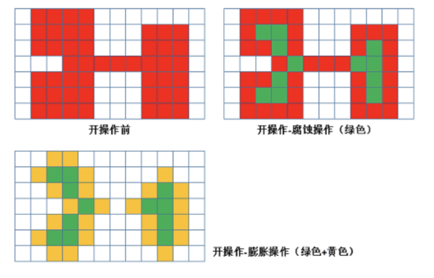

2. **闭运算**
   闭运算与开运算相反，是先膨胀后腐蚀，**作用**是消除/“闭合”物体里面的孔洞，**特点**：可以填充闭合区域。

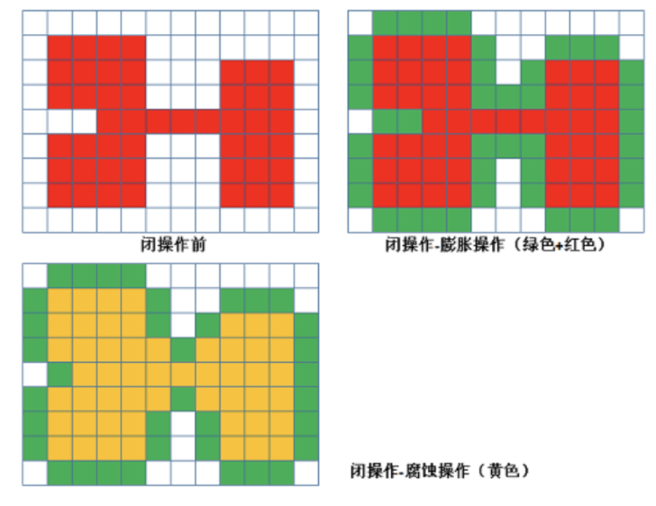

3. **API**

~~~ python
cv.morphologyEx(img, op, kernel)
    img: 要处理的图像
    op: 处理方式：若进行开运算，则设为cv.MORPH_OPEN，若进行闭运算，则设为cv.MORPH_CLOSE
    Kernel： 核结构
~~~

**示例**
使用10*10的核结构对卷积进行开闭运算的实现。

~~~ python
import numpy as np
import cv2 as cv
import matplotlib.pyplot as plt

# 1 读取图像
img1 = cv.imread("./image/letter1.png")
img2 = cv.imread("./image/letter2.png")
# 2 创建核结构
kernel = np.ones((10, 10), np.uint8)
# 3 图像的开闭运算
cvOpen = cv.morphologyEx(img1, cv.MORPH_OPEN, kernel)  # 开运算
cvClose = cv.morphologyEx(img2, cv.MORPH_CLOSE, kernel)  # 闭运算
# 4 图像展示
fig, axes = plt.subplots(nrows=2, ncols=2, figsize=(10, 8))
axes[0, 0].imshow(img1)
axes[0, 0].set_title("原图")
axes[0, 1].imshow(cvOpen)
axes[0, 1].set_title("开运算结果")
axes[1, 0].imshow(img2)
axes[1, 0].set_title("原图")
axes[1, 1].imshow(cvClose)
axes[1, 1].set_title("闭运算结果")
plt.show()
~~~

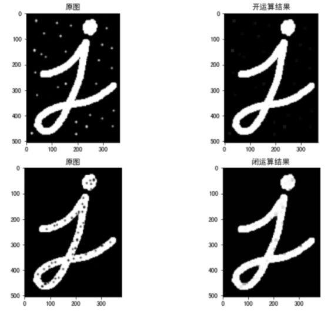

### 5.3 礼帽和黑帽

1. **礼帽运算**
   原图像与“开运算“的结果图之差，如下式计算：

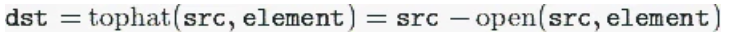

因为开运算带来的结果是放大了裂缝或者局部低亮度的区域，因此，从原图中减去开运算后的图，得到的效果图突出了比原图轮廓周围的区域更明亮的区域，且这一操作和选择的核的大小相关。
　　礼帽运算用来分离比邻近点亮一些的斑块。当一幅图像具有大幅的背景的时候，而微小物品比较有规律的情况下，可以使用顶帽运算进行背景提取。

2. **黑帽运算**
   为”闭运算“的结果图与原图像之差。数学表达式为：

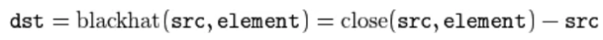
黑帽运算后的效果图突出了比原图轮廓周围的区域更暗的区域，且这一操作和选择的核的大小相关。
黑帽运算用来分离比邻近点暗一些的斑块。

3. **API**

~~~ python
cv.morphologyEx(img, op, kernel)
    img: 要处理的图像
    op: 处理方式：
    Kernel： 核结构
~~~

**参数：**

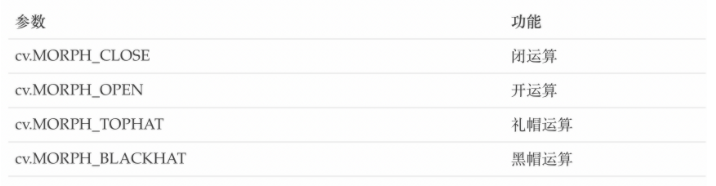

**示例:**

~~~ python
import numpy as np
import cv2 as cv
import matplotlib.pyplot as plt

# 1 读取图像
img1 = cv.imread("./image/letter.png")
img2 = cv.imread("./image/letter.png")
# 2 创建核结构
kernel = np.ones((10, 10), np.uint8)
# 3 图像的礼帽和黑帽运算
cvOpen = cv.morphologyEx(img1, cv.MORPH_TOPHAT, kernel)  # 礼帽运算
cvClose = cv.morphologyEx(img2, cv.MORPH_BLACKHAT, kernel)  # 黑帽运算
# 4 图像显示
fig, axes = plt.subplots(nrows=2, ncols=2, figsize=(10, 8))
axes[0, 0].imshow(img1)
axes[0, 0].set_title("原图")
axes[0, 1].imshow(cvOpen)
axes[0, 1].set_title("礼帽运算结果")
axes[1, 0].imshow(img2)
axes[1, 0].set_title("原图")
axes[1, 1].imshow(cvClose)
axes[1, 1].set_title("黑帽运算结果")
plt.show()
~~~

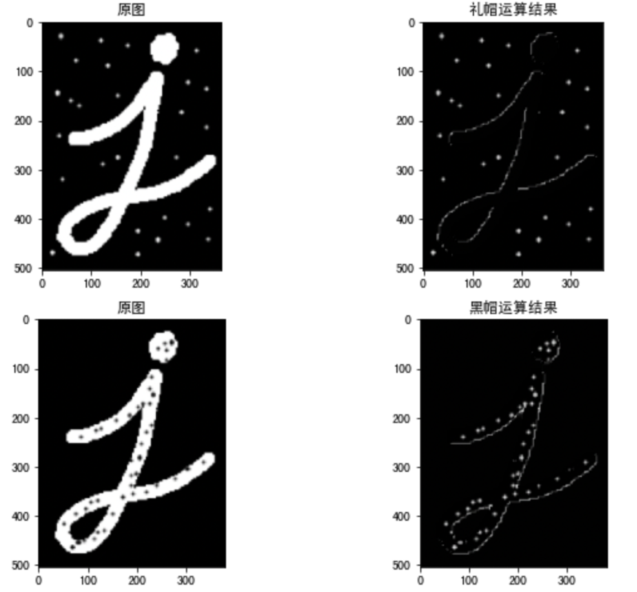

[Opencv (yuque.com)的第6节](https://www.yuque.com/models/yvphv7/ak4ohq#pjBRl)

