# 分类算法

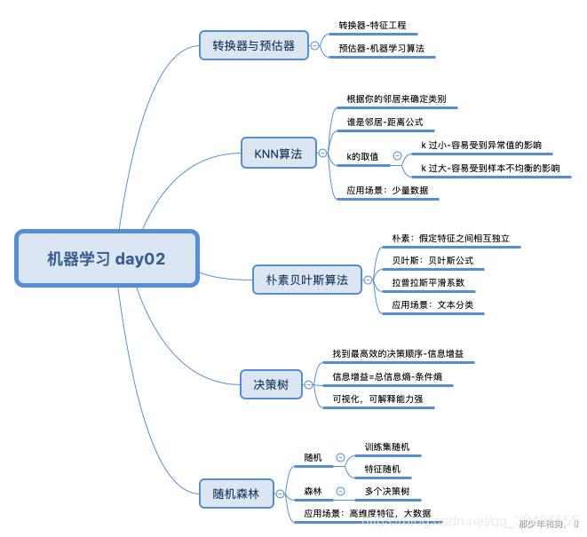

## sklearn转换器与预估器

### 转换器（特征工程时使用）

- 转换器是特征工程的父类

- - 实例化 (实例化的是一个转换器类transformer)
  - 调用fit_transform() (对于文档建立分类词频矩阵, 不能同时使用)

- - - 标准化 : ((x - mean) / std)
    - fit_transform()
    - fit() : 计算每一列的平均值 , 标准差
    - transform() : (x - mean) / std进行最终的转换

~~~ python
In [1]: from sklearn.preprocessing import StandardScaler

In [2]: std1 = StandardScaler()

In [3]: a = [[1,2,3], [4,5,6]]

In [4]: std1.fit_transform(a)
Out[4]:
array([[-1., -1., -1.],
       [ 1.,  1.,  1.]])

In [5]: std2 = StandardScaler()

In [6]: std2.fit(a)
Out[6]: StandardScaler(copy=True, with_mean=True, with_std=True)

In [7]: std2.transform(a)
Out[7]:
array([[-1., -1., -1.],
       [ 1.,  1.,  1.]])

# 从中可以看出，fit_transform的作用相当于transform加上fit。但是为什么还要提供单独的fit呢, 我们还是使用原来的std2来进行标准化看看

In [8]: b = [[7,8,9], [10, 11, 12]]

In [9]: std2.transform(b)
Out[9]:
array([[3., 3., 3.],
       [5., 5., 5.]])

In [10]: std2.fit_transform(b)
Out[10]:
array([[-1., -1., -1.],
       [ 1.,  1.,  1.]])

1.fit和transform没有任何关系，仅仅是数据处理的两个不同环节，之所以出来fit_transform这个函数名，仅仅是为了写代码方便，会高效一点。
2.sklearn里的封装好的各种算法使用前都要fit，fit相对于整个代码而言，为后续API服务。fit之后，然后调用各种API方法，transform只是其中一个API方法，所以当你调用transform之外的方法，也必须要先fit。
3.fit原义指的是安装、使适合的意思，其实有点train的含义，但是和train不同的是，它并不是一个训练的过程，而是一个适配的过程，过程都是确定的，最后得到一个可用于转换的有价值的信息。
~~~

### 预估器（训练模型时使用）

- 预估器 (sklearn机器学习算法的实现)

- - 估计器工作流程 (estimator)

- - - 实例化一个estimator预估器类
    - estimator.fit(x_train, y_train) 计算 , 进行训练 , 调用完毕 , 模型生成
    - 模型评估

1. 1. 1. 直接比对真实值和预测值
         y_predict = estimator.predict(x_test)
         y_test == y_predict

      2. 计算准确率
         accuracy = estimator.score(x_test, y_test)

         

         **预估器工作流程**

         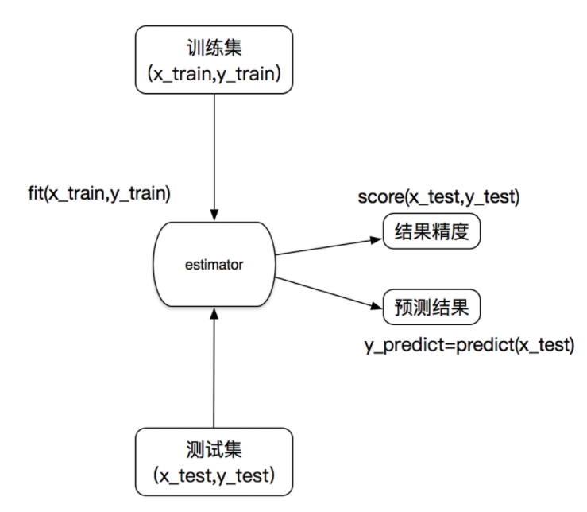

## K-近邻算法

如果一个样本在特征空间中的**k个最相似(即特征空间中最邻近)的样本中的大多数属于某一个类别**，则该样本也属于这个类别。

**核心思想**：根据你的"邻居"推断出你的类别

### 1. KNN算法流程总结

1. 计算已知类别数据集中的点与当前点之间的距离
2. 按距离递增次序排序
3. 选取与当前点距离最小的k个点
4. 统计前k个点所在的类别出现的频率
5. 返回前k个点出现频率最高的类别作为当前点的预测分类

### 2. 距离度量

**2.1 欧式距离(Euclidean Distance)**

**2.2 曼哈顿距离(Manhattan Distance)**

**2.3 切比雪夫距离 (Chebyshev Distance)**

**2.4 闵可夫斯基距离(Minkowski Distance)**

其中p是一个变参数：

- 当p=1时，就是曼哈顿距离；
- 当p=2时，就是欧氏距离；
- 当p→∞时，就是切比雪夫距离。

根据p的不同，闵氏距离可以表示某一类/种的距离。

**2.5 闵氏距离，包括曼哈顿距离、欧氏距离和切比雪夫距离，都存在明显的缺点:**

1. 将各个分量的量纲(scale)，也就是“单位”相同的看待了
2. 未考虑各个分量的分布(期望，方差等)可能是不同的。

**2.6 “连续属性”和“离散属性”的距离计算**

我们常将属性划分为"连续属性" (continuous attribute)和"离散属性" (categorical attribute)，前者在定义域上有无穷多个可能的取值，后者在定义域上是有限个取值.

- 若属性值之间存在序关系，则可以将其转化为连续值，例如：身高属性“高”“中等”“矮”，可转化为{1, 0.5, 0}。
- 若属性值之间不存在序关系，则通常将其转化为向量的形式，例如：性别属性“男”,“女”，可转化为{(1,0), (0,1)}。

### 3. k值的选择

**K值过小**: 容易受到异常点的影响, **K值的减小意味着整体模型变得复杂，容易发生过拟合**

**k值过大**: 受到样本均衡的问题, **K值的增大意味着整体的模型变得简单**

在**实际应用中，K值一般取一个比较小的数值**，例如采用交叉验证法来选择最优的K值。

### 4. kd树

根据**KNN**每次需要预测一个点时，我们都需要计算训练数据集里每个点到这个点的距离，然后选出距离最近的k个点进行投票。**当数据集很大时，这个计算成本非常高，针对N个样本，D个特征的数据集，其算法复杂度为**  。

**kd树**：为了避免每次都重新计算一遍距离，算法会把距离信息保存在一棵树里，这样在计算之前从树里查询距离信息，尽量避免重新计算。其基本原理是，**如果A和B距离很远，B和C距离很近，那么A和C的距离也很远**。有了这个信息，就可以在合适的时候跳过距离远的点。这样优化后的算法复杂度可降低到  。

1989年，另外一种称为**Ball Tree**的算法，在kd Tree的基础上对性能进一步进行了优化。

#### 4.1 构造方法

1. **构造根结点，使根结点对应于K维空间中包含所有实例点的超矩形区域；**
2. **通过递归的方法，不断地对k维空间进行切分，生成子结点。**在超矩形区域上选择一个坐标轴和在此坐标轴上的一个切分点，确定一个超平面，这个超平面通过选定的切分点并垂直于选定的坐标轴，将当前超矩形区域切分为左右两个子区域（子结点）；这时，实例被分到两个子区域。
3. **上述过程直到子区域内没有实例时终止（终止时的结点为叶结点）**。在此过程中，将实例保存在相应的结点上。

**在构建KD树时，关键需要解决2个问题**：

1. **选择向量的哪一维进行划分**: 可以是随机选择某一维或按顺序选择，但是**更好的方法应该是在数据比较分散的那一维进行划分（分散的程度可以根据方差来衡量）**。
2. **如何划分数据**: 选择训练实例点在坐标轴上的中位数为切分点，这样得到的kd树是平衡的（平衡二叉树：它是一棵空树，或其左子树和右子树的深度之差的绝对值不超过1，且它的左子树和右子树都是平衡二叉树）。

#### 4.2 kd树的搜索过程

1. **二叉树搜索比较待查询节点和分裂节点的分裂维的值**, (小于等于就进入左子树分支，大于就进入右子树分支直到叶子结点)
2. **顺着“搜索路径”找到最近邻的近似点**
3. **回溯搜索路径**，并判断搜索路径上的结点的其他子结点空间中是否可能有距离查询点更近的数据点，如果有可能，则需要跳到其他子结点空间中去搜索
4. **重复这个过程直到搜索路径为空**

### 5. 案例：鸢尾花种类预测

Iris数据集是常用的分类实验数据集，由Fisher, 1936收集整理。Iris也称鸢尾花卉数据集，是一类多重变量分析的数据集。

**步骤分析**

1. 获取数据集
2. 数据基本处理
3. 特征工程
4. 机器学习(模型训练)
5. 模型评估

#### 5.1 scikit-learn数据集API介绍

##### 5.1.1 sklearn.datasets: 加载获取流行数据集

- datasets.load_*() : 获取小规模数据集，数据包含在datasets里

~~~ python
sklearn.datasets.load_iris()
~~~

- datasets.fetch_*(data_home=None, subset=‘train’) : 获取大规模数据集，需要从网络上下载，`data_home`表示数据集下载的目录 ,默认是 `~/scikit_learn_data/`; `subset`: 表示选择要加载的数据集, 'train', 'test', 'all'。

~~~ python
sklearn.datasets.fetch_20newsgroups(data_home=None,subset=‘train’)
~~~

##### 5.1.2  sklearn数据集返回值介绍

load 和 fetch 返回的数据类型datasets.base.Bunch(字典格式)

- data：特征数据数组，是 [n_samples * n_features] 的二维 numpy.ndarray 数组
- target：标签数组，是 n_samples 的一维 numpy.ndarray 数组
- DESCR：数据描述
- feature_names：特征名, 新闻数据,手写数字,回归数据集没有
- target_names：标签名

##### 5.1.3 查看数据分布

~~~ python
import seaborn as sns
import matplotlib.pyplot as plt
import pandas as pd
from sklearn.datasets import load_iris

iris = load_iris()
# 把数据转换成dataframe的格式
iris_d = pd.DataFrame(iris['data'], columns = ['Sepal_Length', 'Sepal_Width', 'Petal_Length', 'Petal_Width'])
iris_d['Species'] = iris.target
sns.lmplot(x = 'Petal_Width', y =  'Sepal_Length', data = iris_d, hue = "Species", fit_reg = False)
plt.title('鸢尾花种类分布图')
plt.show()
~~~

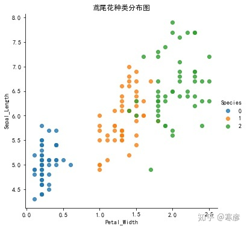

#### 5.2 数据集的划分

机器学习一般的数据集会划分为两个部分：

- 训练数据：用于训练，**构建模型**
- 测试数据：在模型检验时使用，用于**评估模型是否有效**

划分比例：

- 训练集：70% 80% 75%
- 测试集：30% 20% 25%

**数据集划分api**: `sklearn.model_selection.train_test_split(arrays, *options)`

- 参数：

- - x 数据集的特征值
  - y 数据集的标签值
  - test_size 测试集的大小，一般为float
  - random_state 随机数种子,不同的种子会造成不同的随机采样结果。相同的种子采样结果相同。

- return

- - x_train, x_test, y_train, y_test

~~~ python
from sklearn.datasets import load_iris
from sklearn.model_selection import train_test_split

# 1、获取鸢尾花数据集
iris = load_iris()
# 对鸢尾花数据集进行分割
x_train, x_test, y_train, y_test = train_test_split(iris.data, iris.target, random_state=22)
print("x_train:\n", x_train.shape)
~~~

#### 5.3 特征工程-特征预处理

特征预处理: 通过**一些转换函数**将特征数据**转换成更加适合算法模型**的特征数据过程

**特征预处理API**: `sklearn.preprocessing`

##### 5.3.1 归一化

通过对原始数据进行变换把数据映射到(默认为[0,1])之间 

>  作用于每一列，max为一列的最大值，min为一列的最小值,那么X’’为最终结果，mx，mi分别为指定区间值默认mx为1,mi为0

**sklearn.preprocessing.MinMaxScaler(feature_range=(0,1)… )**

- MinMaxScalar.fit_transform(X)
- X: numpy array 格式的数据 [n_samples, n_features]
- 返回值：转换后的形状相同的array

最大值与最小值非常容易受异常点影响，**所以归一化方法鲁棒性较差，只适合传统精确小数据场景。**

##### 5.3.2 标准化

通过对原始数据进行变换把数据变换到均值为0,标准差为1范围内 $$ X^{\prime}=\frac{x-\text { mean }}{\sigma} $$

 作用于每一列，mean为平均值，σ为标准差

**sklearn.preprocessing.StandardScaler( )**

- 处理之后每列来说所有数据都聚集在均值0附近标准差差为1
- StandardScaler.fit_transform(X)
- X: numpy array 格式的数据 [n_samples,n_features]
- 返回值：转换后的形状相同的array

在已有样本足够多的情况下比较稳定，适合现代嘈杂大数据场景。

#### 5.4 K-近邻算法API

**sklearn.neighbors.KNeighborsClassifier(n_neighbors=5,algorithm='auto')**

**n_neighbors**：int,可选（默认= 5），k_neighbors查询默认使用的邻居数

**algorithm**：{‘auto’，‘ball_tree’，‘kd_tree’，‘brute’}

- 快速k近邻搜索算法，默认参数为auto，可以理解为算法自己决定合适的搜索算法。除此之外，用户也可以自己指定搜索算法ball_tree、kd_tree、brute方法进行搜索，
- brute是蛮力搜索，也就是线性扫描，当训练集很大时，计算非常耗时。
- kd_tree，构造kd树存储数据以便对其进行快速检索的树形数据结构，kd树也就是数据结构中的二叉树。以中值切分构造的树，每个结点是一个超矩形，在维数小于20时效率高。
- ball tree是为了克服kd树高维失效而发明的，其构造过程是以质心C和半径r分割样本空间，每个节点是一个超球体。

~~~ python
from sklearn.datasets import load_iris
from sklearn.model_selection import train_test_split
from sklearn.preprocessing import StandardScaler
from sklearn.neighbors import KNeighborsClassifier

def knn_iris():
    """
    用KNN算法对鸢尾花进行分类
    :return:
    """
    # 1）获取数据
    iris = load_iris()

    # 2）划分数据集
    x_train, x_test, y_train, y_test = train_test_split(iris.data, iris.target, random_state=22)

    # 3）特征工程：标准化
    transfer = StandardScaler()
    x_train = transfer.fit_transform(x_train)
    x_test = transfer.transform(x_test)

    # 4）KNN算法预估器
    estimator = KNeighborsClassifier(n_neighbors=3)
    estimator.fit(x_train, y_train)

    # 5）模型评估
    # 方法1：直接比对真实值和预测值
    y_predict = estimator.predict(x_test)
    print("y_predict:\n", y_predict)
    print("直接比对真实值和预测值:\n", y_test == y_predict)

    # 方法2：计算准确率
    score = estimator.score(x_test, y_test)
    print("准确率为：\n", score)

    return None

y_predict:
 [0 2 1 2 1 1 1 2 1 0 2 1 2 2 0 2 1 1 1 1 0 2 0 1 2 0 2 2 2 2 0 0 1 1 1 0 0 0]
直接比对真实值和预测值:
 [ True  True  True  True  True  True  True  True  True  True  True  True
  True  True  True  True  True  True False  True  True  True  True  True
  True  True  True  True  True  True  True  True  True  True  True  True
  True  True]
准确率为：
 0.9736842105263158
~~~

### 6. KNN算法总结

#### 6.1优点

- **简单有效**
- **重新训练的代价低**
- **适合类域交叉样本**
- **KNN方法主要靠周围有限的邻近的样本**,而不是靠判别类域的方法来确定所属类别的，因此对于类域的交叉或重叠较多的待分样本集来说，KNN方法较其他方法更为适合。
- **适合大样本自动分类**
- 该算法比较**适用于样本容量比较大的类域的自动分类**，而那些**样本容量较小的类域采用这种算法比较容易产生误分**。

#### 6.2 缺点

- **惰性学习**
- KNN算法是懒散学习方法（lazy learning,基本上不学习），一些积极学习的算法要快很多
- **类别评分不是规格化**
- 不像一些通过概率评分的分类
- **输出可解释性不强**
- 例如决策树的输出可解释性就较强
- **对不均衡的样本不擅长**
- 当样本不平衡时，如一个类的样本容量很大，而其他类样本容量很小时，有可能导致当输入一个新样本时，该样本的K个邻居中大容量类的样本占多数。该算法只计算“最近的”邻居样本，某一类的样本数量很大，那么或者这类样本并不接近目标样本，或者这类样本很靠近目标样本。无论怎样，数量并不能影响运行结果。可以采用权值的方法（和该样本距离小的邻居权值大）来改进。
- **计算量较大**
- 目前常用的解决方法是事先对已知样本点进行剪辑，事先去除对分类作用不大的样本。

### 7. 模型选择与调优

#### 7.1 交叉验证

- **目的：****为了让被评估的模型更加准确可信**
- **定义**：将拿到的训练数据，分为训练和验证集。以下图为例：将数据分成5份，其中一份作为验证集。然后经过5次(组)的测试，每次都更换不同的验证集。即得到5组模型的结果，取平均值作为最终结果。又称5折交叉验证。

我们之前知道数据分为训练集和测试集，但是**为了让从训练得到模型结果更加准确。**做以下处理

- 训练集：训练集+验证集
- 测试集：测试集

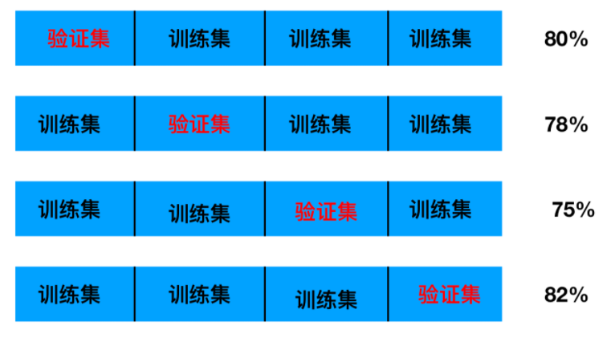

**问题：**那么这个只是对于参数得出更好的结果，那么怎么选择或者调优参数呢？

#### 7.2 超参数搜索 - 网格搜索 (Grid Search)

通常情况下，**有很多参数是需要手动指定的（如k-近邻算法中的K值），这种叫超参数**。但是手动过程繁杂，所以需要对模型预设几种超参数组合。**每组超参数都采用交叉验证来进行评估。最后选出最优参数组合建立模型。**

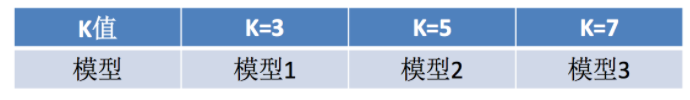

- API

- - sklearn.model_selection.GridSearchCV(estimator, param_grid=None,cv=None)

- - - 对估计器的指定参数值进行详尽搜索
    - estimator：估计器对象
    - param_grid：估计器参数(dict){“n_neighbors”:[1,3,5]}
    - cv：指定几折交叉验证
    - fit：输入训练数据
    - score：准确率
    - FaceBook案例
    - 结果分析：

- - - - 最佳参数：best_params_
      - 最佳结果：best_score_
      - 最佳估计器：best_estimator_
      - 交叉验证结果：cv_results_

~~~ python
def knn_iris_gscv():
    """
    用KNN算法对鸢尾花进行分类，添加网格搜索和交叉验证
    :return:
    """
    # 1）获取数据
    iris = load_iris()

    # 2）划分数据集
    x_train, x_test, y_train, y_test = train_test_split(iris.data, iris.target, random_state=22)

    # 3）特征工程：标准化
    transfer = StandardScaler()
    x_train = transfer.fit_transform(x_train)
    x_test = transfer.transform(x_test)

    # 4）KNN算法预估器
    estimator = KNeighborsClassifier()

    # 加入网格搜索与交叉验证
    # 参数准备
    param_dict = {"n_neighbors": [1, 3, 5, 7, 9, 11]}
    estimator = GridSearchCV(estimator, param_grid=param_dict, cv=10)
    estimator.fit(x_train, y_train)

    # 5）模型评估
    # 方法1：直接比对真实值和预测值
    y_predict = estimator.predict(x_test)
    print("y_predict:\n", y_predict)
    print("直接比对真实值和预测值:\n", y_test == y_predict)

    # 方法2：计算准确率
    score = estimator.score(x_test, y_test)
    print("准确率为：\n", score)

    # 最佳参数：best_params_
    print("最佳参数：\n", estimator.best_params_)
    # 最佳结果：best_score_
    print("最佳结果：\n", estimator.best_score_)
    # 最佳估计器：best_estimator_
    print("最佳估计器:\n", estimator.best_estimator_)
    # 交叉验证结果：cv_results_
    print("交叉验证结果:\n", estimator.cv_results_)

    return None

y_predict:
 [0 2 1 2 1 1 1 2 1 0 2 1 2 2 0 2 1 1 1 1 0 2 0 1 2 0 2 2 2 2 0 0 1 1 1 0 0 0]
直接比对真实值和预测值:
 [ True  True  True  True  True  True  True  True  True  True  True  True
  True  True  True  True  True  True False  True  True  True  True  True
  True  True  True  True  True  True  True  True  True  True  True  True
  True  True]
准确率为：
 0.9736842105263158
最佳参数：
 {'n_neighbors': 3}
最佳结果：
 0.9553030303030303
最佳估计器:
 KNeighborsClassifier(n_neighbors=3)
交叉验证结果:
 {'mean_fit_time': array([0.00089834, 0.00079894, 0.00080106, 0.0010052 , 0.00089417,
       0.00129735]), 'std_fit_time': array([0.00053816, 0.00039947, 0.00040058, 0.00044723, 0.0006968 ,
       0.00089766]), 'mean_score_time': array([0.00180643, 0.00180976, 0.00159762, 0.00139034, 0.00180302,
       0.00220156]), 'std_score_time': array([0.00075188, 0.00073786, 0.00048882, 0.00065752, 0.00059935,
       0.00107433]), 'param_n_neighbors': masked_array(data=[1, 3, 5, 7, 9, 11],
             mask=[False, False, False, False, False, False],
       fill_value='?',
            dtype=object), 'params': [{'n_neighbors': 1}, {'n_neighbors': 3}, {'n_neighbors': 5}, {'n_neighbors': 7}, {'n_neighbors': 9}, {'n_neighbors': 11}], 'split0_test_score': array([0.91666667, 0.91666667, 1.        , 1.        , 0.91666667,
       0.91666667]), 'split1_test_score': array([1., 1., 1., 1., 1., 1.]), 'split2_test_score': array([0.90909091, 0.90909091, 0.90909091, 0.90909091, 0.90909091,
       0.90909091]), 'split3_test_score': array([0.90909091, 1.        , 0.90909091, 0.90909091, 0.90909091,
       1.        ]), 'split4_test_score': array([1., 1., 1., 1., 1., 1.]), 'split5_test_score': array([0.90909091, 0.90909091, 0.90909091, 0.90909091, 0.90909091,
       0.90909091]), 'split6_test_score': array([0.90909091, 0.90909091, 0.90909091, 1.        , 1.        ,
       1.        ]), 'split7_test_score': array([0.90909091, 0.90909091, 0.81818182, 0.81818182, 0.81818182,
       0.81818182]), 'split8_test_score': array([1., 1., 1., 1., 1., 1.]), 'split9_test_score': array([1., 1., 1., 1., 1., 1.]), 'mean_test_score': array([0.94621212, 0.95530303, 0.94545455, 0.95454545, 0.94621212,
       0.95530303]), 'std_test_score': array([0.04397204, 0.0447483 , 0.06030227, 0.06098367, 0.05988683,
       0.0604591 ]), 'rank_test_score': array([4, 1, 6, 3, 4, 1])}
~~~

#### 7.3 例题

数据介绍：将根据用户的位置，准确性和时间戳预测用户正在查看的业务。

~~~ tex
train.csv，test.csv 
row_id：登记事件的ID
xy：坐标
准确性：定位准确性 
时间：时间戳
place_id：业务的ID，这是您预测的目标
~~~

> 官网：https://www.kaggle.com/navoshta/grid-knn/data

~~~ python
import pandas as pd
from sklearn.model_selection import train_test_split
from sklearn.preprocessing import StandardScaler
from sklearn.neighbors import KNeighborsClassifier

"""
缩小数据集范围
DataFrame.query()

处理日期数据
pd.to_datetime
pd.DatetimeIndex

删除没用的日期数据
DataFrame.drop

将签到位置少于 n 个用户的删除
place_count = data.groupby('place_id').count()
tf = place_count[place_count.row_id>3].reset_index()
data = data[data['place_id'].isin(tf.place_id)]

"""

def knncls():
    """
    K近邻算法预测入住位置类别
    :return:
    """
    # 一、处理数据以及特征工程
    # 1、读取收，缩小数据的范围
    data = pd.read_csv("D:/Python3天快速入门机器学项目资料/机器学xiday2资料/02-代码/FBlocation/train.csv")

    # 数据逻辑筛选操作 df.query()
    data = data.query("x > 1.0 & x < 1.25 & y > 2.5 & y < 2.75")

    # 删除time这一列特征
    data = data.drop(['time'], axis=1)

    print(data)

    # 删除入住次数少于三次位置
    place_count = data.groupby('place_id').count()

    tf = place_count[place_count.row_id > 3].reset_index()

    data = data[data['place_id'].isin(tf.place_id)]

    # 3、取出特征值和目标值
    y = data['place_id']
    # y = data[['place_id']]

    x = data.drop(['place_id', 'row_id'], axis=1)

    # 4、数据分割与特征工程?

    # （1）、数据分割
    x_train, x_test, y_train, y_test = train_test_split(x, y, test_size=0.3)

    # (2)、标准化
    std = StandardScaler()

    # 队训练集进行标准化操作
    x_train = std.fit_transform(x_train)
    print(x_train)

    # 进行测试集的标准化操作
    x_test = std.fit_transform(x_test)

    # 二、算法的输入训练预测
    # K值：算法传入参数不定的值    理论上：k = 根号(样本数)
    # K值：后面会使用参数调优方法，去轮流试出最好的参数[1,3,5,10,20,100,200]
    knn = KNeighborsClassifier(n_neighbors=1)

    # 调用fit()
    knn.fit(x_train, y_train)

    # 预测测试数据集，得出准确率
    y_predict = knn.predict(x_test)

    print("预测测试集类别：", y_predict)

    print("准确率为：", knn.score(x_test, y_test))

    return None

# 结果
y_predict:
 [0 2 1 2 1 1 1 2 1 0 2 1 2 2 0 2 1 1 1 1 0 2 0 1 2 0 2 2 2 2 0 0 1 1 1 0 0 0]
直接比对真实值和预测值:
 [ True  True  True  True  True  True  True  True  True  True  True  True
  True  True  True  True  True  True False  True  True  True  True  True
  True  True  True  True  True  True  True  True  True  True  True  True
  True  True]
准确率为：
 0.9736842105263158
最佳参数：
 {'n_neighbors': 3}
最佳结果：
 0.9553030303030303
最佳估计器:
 KNeighborsClassifier(n_neighbors=3)
交叉验证结果:
 {'mean_fit_time': array([0.00089834, 0.00079894, 0.00080106, 0.0010052 , 0.00089417,
       0.00129735]), 'std_fit_time': array([0.00053816, 0.00039947, 0.00040058, 0.00044723, 0.0006968 ,
       0.00089766]), 'mean_score_time': array([0.00180643, 0.00180976, 0.00159762, 0.00139034, 0.00180302,
       0.00220156]), 'std_score_time': array([0.00075188, 0.00073786, 0.00048882, 0.00065752, 0.00059935,
       0.00107433]), 'param_n_neighbors': masked_array(data=[1, 3, 5, 7, 9, 11],
             mask=[False, False, False, False, False, False],
       fill_value='?',
            dtype=object), 'params': [{'n_neighbors': 1}, {'n_neighbors': 3}, {'n_neighbors': 5}, {'n_neighbors': 7}, {'n_neighbors': 9}, {'n_neighbors': 11}], 'split0_test_score': array([0.91666667, 0.91666667, 1.        , 1.        , 0.91666667,
       0.91666667]), 'split1_test_score': array([1., 1., 1., 1., 1., 1.]), 'split2_test_score': array([0.90909091, 0.90909091, 0.90909091, 0.90909091, 0.90909091,
       0.90909091]), 'split3_test_score': array([0.90909091, 1.        , 0.90909091, 0.90909091, 0.90909091,
       1.        ]), 'split4_test_score': array([1., 1., 1., 1., 1., 1.]), 'split5_test_score': array([0.90909091, 0.90909091, 0.90909091, 0.90909091, 0.90909091,
       0.90909091]), 'split6_test_score': array([0.90909091, 0.90909091, 0.90909091, 1.        , 1.        ,
       1.        ]), 'split7_test_score': array([0.90909091, 0.90909091, 0.81818182, 0.81818182, 0.81818182,
       0.81818182]), 'split8_test_score': array([1., 1., 1., 1., 1., 1.]), 'split9_test_score': array([1., 1., 1., 1., 1., 1.]), 'mean_test_score': array([0.94621212, 0.95530303, 0.94545455, 0.95454545, 0.94621212,
       0.95530303]), 'std_test_score': array([0.04397204, 0.0447483 , 0.06030227, 0.06098367, 0.05988683,
       0.0604591 ]), 'rank_test_score': array([4, 1, 6, 3, 4, 1])}
~~~

## 朴素贝叶斯算法

- **定义：**通过朴素贝叶斯算法得出的分类结果，取概率大的作为最终的结果

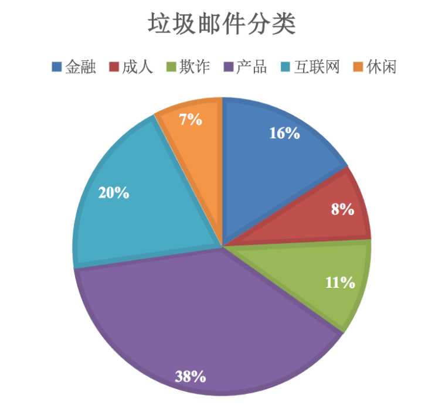

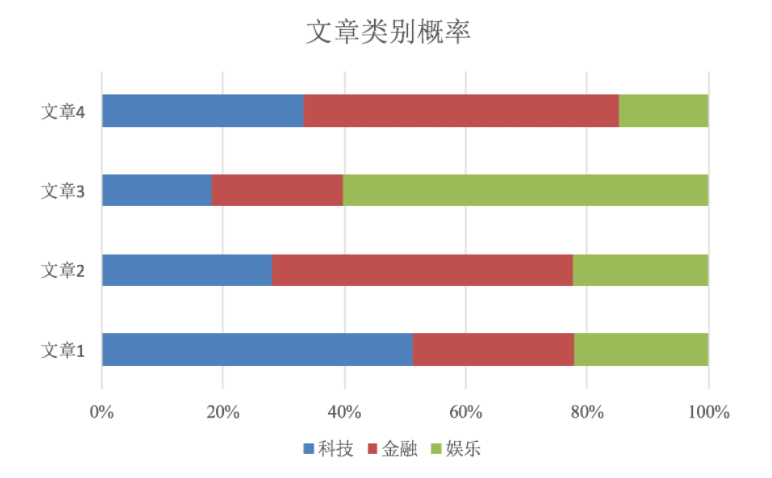

+ 概率基础

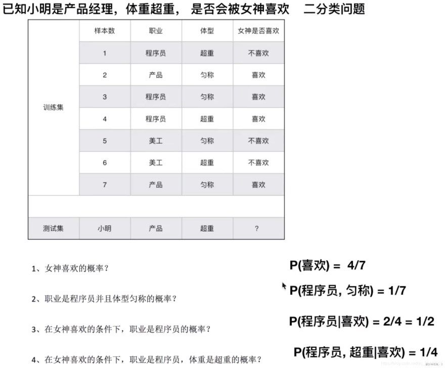

- 概率：一件事情发生的可能性。
- 联合概率和条件概率

- - 联合概率：包含多个条件，且所有条件同时成立的概率

- - - 记作：P(A,B)
    - 特性：P(A, B) = P(A)P(B)

- - 条件概率：就是事件A在另外一个事件B已经发生条件下的发生概率

- - - 记作：P(A|B)
    - 特性：P(A1,A2|B) = P(A1|B)P(A2|B)

> 注意：此条件概率的成立，**是由于A1,A2相互独立的结果**(记忆)

这样我们计算结果为：

~~~ tex
p(程序员, 匀称) =  P(程序员)P(匀称) =3/7*(4/7) = 12/49 
P(产品, 超重|喜欢) = P(产品|喜欢)P(超重|喜欢)=1/2 *  1/4 = 1/8
~~~

### 1. 贝叶斯公式

- 朴素：假设特征与其他特征之间相互独立
- 贝叶斯公式

- - W 为给定文档的特征值（频数统计、预测文档提供），C 为文档类别
  - 公式可理解为：
  - P(C)：每个文档类别的概率（某个文档类别数/总文档数量）
  - P(W|C)：给定类别下特征（被预测文档中出现的词）的概率

- - - 计算方法：P(F1|C)=Ni/N（训练文档中计算）
    - Ni 为该 F1 词在 C 类所有文档中出现的次数
    - N 为所属类C下的文档所有词出现的次数和

- - P(F1,F2...)：预测文档中每个词的概率

- 计算结果为 0 时，解决方法为拉普拉斯平滑系数

- - 
  - a 为指定的系数，一般为 1，m 为训练文档中统计出的特征词个数

### 2. 文章分类计算

假设我们从**训练数据集**得到如下信息

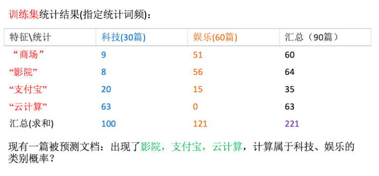

计算结果

~~~ tex
科技：P(科技|影院,支付宝,云计算) = 𝑃(影院,支付宝,云计算|科技)∗P(科技)=(8/100)∗(20/100)∗(63/100)∗(30/90) = 0.00456109
娱乐：P(娱乐|影院,支付宝,云计算) = 𝑃(影院,支付宝,云计算|娱乐)∗P(娱乐)=(56/121)∗(15/121)∗(0/121)∗(60/90) = 0
~~~

**问题：**我们计算出来某个概率为0，合适吗？

### 3. 拉普拉斯平滑系数

- **目的：**防止计算出的分类概率为0
- 应用场景：文本分类、单词作为特征

Ni：该 F1 词在 C类别所有文档中出现的次数
N：所属类别 C 下的文档所有词出现的次数和

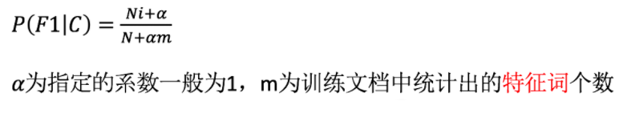

~~~ tex
P(娱乐|影院,支付宝,云计算) =P(影院,支付宝,云计算|娱乐)P(娱乐) =P(影院|娱乐)*P(支付宝|娱乐)*P(云计算|娱乐)P(娱乐)=(56+1/121+4)(15+1/121+4)(0+1/121+1*4)(60/90) = 0.00002
~~~

- API

- - sklearn.naive_bayes.MultinomialNB(alpha = 1.0)

- - - 朴素贝叶斯分类
    - alpha：拉普拉斯平滑系数

- 案例 ：20类新闻分类

~~~ python
def nb_news():
    """
    用朴素贝叶斯算法对新闻进行分类
    :return:
    """
    # 1）获取数据
    news = fetch_20newsgroups(subset="all")

    # 2）划分数据集
    x_train, x_test, y_train, y_test = train_test_split(news.data, news.target)

    # 3）特征工程：文本特征抽取-tfidf
    transfer = TfidfVectorizer()
    x_train = transfer.fit_transform(x_train)
    x_test = transfer.transform(x_test)

    # 4）朴素贝叶斯算法预估器流程
    estimator = MultinomialNB()
    estimator.fit(x_train, y_train)

    # 5）模型评估
    # 方法1：直接比对真实值和预测值
    y_predict = estimator.predict(x_test)
    print("y_predict:\n", y_predict)
    print("直接比对真实值和预测值:\n", y_test == y_predict)

    # 方法2：计算准确率
    score = estimator.score(x_test, y_test)
    print("准确率为：\n", score)

    return None
~~~

**优缺点**

- **优点：**
  朴素贝叶斯模型发源于古典数学理论，有稳定的分类效率，对缺失数据不太敏感，算法也比较简单，常用于文本分类，分类准确度高，速度快
- **缺点：**
  由于使用了样本属性独立性的假设，所以如果特征属性有关联时其效果不好

**总结：**条件概率、联合概率计算方式与特征独立的关系贝叶斯公式的计算

## 决策树

决策树思想的来源非常朴素，程序设计中的条件分支结构就是if-then结构，最早的决策树就是利用这类结构分割数据的一种分类学习方法

怎么理解这句话？通过一个对话例子

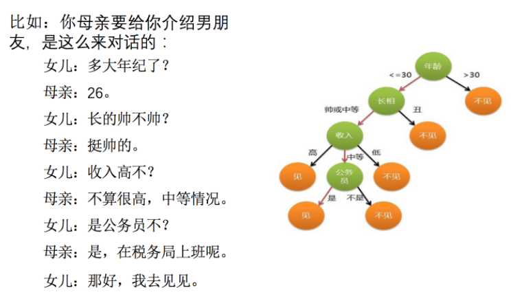

想一想这个女生为什么把年龄放在最上面判断！！！！！！！！！

- **是一种树形结构，本质是一颗由多个判断节点组成的树**
- **其中每个内部节点表示一个属性上的判断，**
- **每个分支代表一个判断结果的输出，**
- **最后每个叶节点代表一种分类结果**。

### 1. 决策树分类原理

#### 1.1 熵

物理学上，**熵 Entropy** 是“混乱”程度的量度。**系统越有序，熵值越低；系统越混乱或者分散，熵值越高**。

1948年香农提出了**信息熵**（Entropy）的概念。

##### 信息理论

**从信息的完整性上进行的描述:**

当**系统的有序状态一致时**，数据越集中的地方熵值越小，数据越分散的地方熵值越大。

**从信息的有序性上进行的描述:**

当**数据量一致时**，**系统越有序，熵值越低；系统越混乱或者分散，熵值越高**。

"信息熵" (information entropy)是度量样本集合纯度最常用的一种指标。

假定当前样本集合 D 中第 k 类样本所占的比例为， ，D 为样本的所有数量， ，为第 k 类样本的数量。

则 D 的信息熵定义为（log是以2为底，lg是以10为底）: 

其中：Ent(D) 的值越小，则 D 的纯度越高.

#### 1.2 决策树的划分依据一: 信息增益

**信息增益：**以某特征划分数据集前后的熵的差值。熵可以表示样本集合的不确定性，熵越大，样本的不确定性就越大。因此可以**使用划分前后集合熵的差值来衡量使用当前特征对于样本集合D划分效果的好坏**。

 注：信息增益表示得知特征X的信息而使得类Y的信息熵减少的程度

特征 a 对训练数据集 D 的信息增益Gain(D,a), 定义为**集合D的信息熵Ent(D)**与**给定特征a条件下D的信息条件熵 Ent(D|a) 之差**，即公式如下:

信息熵的计算：

条件熵的计算： 

 其中：

 表示 a 属性中第 v 个分支节点包含的样本数；

 表示 a 属性中第 v 个分支节点包含的样本数中，第 k 个类别下包含的样本数 

一般而言，信息增益越大，则意味着**使用属性 a 来进行划分所获得的"纯度提升"越大**。因此，我们可用信息增益来进行决策树的划分属性选择，著名的 ID3 决策树学习算法 [Quinlan， 1986] 就是以信息增益为准则来选择划分属性。

>  其中，ID3 名字中的 ID 是 Iterative Dichotomiser (迭代二分器)的简称

#### 1.3 决策树的划分依据二: 信息增益率

**信息增益准则对可取值数目较多的属性有所偏好**，为减少这种偏好可能带来的不利影响，著名的 **C4.5 决策树算法 [Quinlan, 1993J 不直接使用信息增益，而是使用"增益率" (gain ratio) 来选择最优划分属性.**

**增益率：**增益率是用前面的信息增益Gain(D, a)和属性a对应的"固有值"(intrinsic value) [Quinlan , 1993J的比值来共同定义的。

>  属性 a 的可能取值数目越多(即 V 越大)，则 IV(a) 的值通常会越大.

##### 为什么使用C4.5要好

1. **用信息增益率来选择属性**

克服了用信息增益来选择属性时偏向选择值多的属性的不足。

2. **采用了一种后剪枝方法**

避免树的高度无节制的增长，避免过度拟合数据

3. **对于缺失值的处理**

在某些情况下，可供使用的数据可能缺少某些属性的值。假如〈x，c(x)〉是样本集S中的一个训练实例，但是其属性A的值A(x)未知。

处理缺少属性值的一种策略是赋给它结点n所对应的训练实例中该属性的最常见值；

另外一种更复杂的策略是为A的每个可能值赋予一个概率。

例如，给定一个布尔属性A，如果结点n包含6个已知A=1和4个A=0的实例，那么A(x)=1的概率是0.6，而A(x)=0的概率是0.4。于是，实例x的60\%60%被分配到A=1的分支，40\%40%被分配到另一个分支。

C4.5就是使用这种方法处理缺少的属性值。

4. **可以处理连续数值型属性**

##### **C4.5算法的优缺点**

优点：

产生的分类规则易于理解，准确率较高。

缺点：

在构造树的过程中，需要对数据集进行多次的顺序扫描和排序，因而导致算法的低效。

此外，C4.5只适合于能够驻留于内存的数据集，当训练集大得无法在内存容纳时程序无法运行。

#### 1.4 决策树的划分依据三: 基尼值和基尼指数

CART 决策树 [Breiman et al., 1984] 使用"基尼指数" (Gini index)来选择划分属性.

 CART 是Classification and Regression Tree的简称，这是一种著名的决策树学习算法,分类和回归任务都可用

**基尼值Gini(D)：**从数据集D中随机抽取两个样本，其类别标记不一致的概率。**故 Gini(D) 值越小，数据集D的纯度越高。**

数据集 D 的纯度可用基尼值来度量: 

>  ，D为样本的所有数量，$C^k$ 为第 k 类样本的数量

**基尼指数Gini_index(D)：**一般，选择使划分后基尼系数最小的属性作为最优化分属性。

>  CART算法相比C4.5算法的分类方法，采用了简化的二叉树模型，同时特征选择采用了近似的基尼系数来简化计算。

#### 1.5 决策树变量的两种类型

1. 数字型（Numeric）：变量类型是整数或浮点数，如前面例子中的“年收入”。用“>=”，“>”,“<”或“<=”作为分割条件（排序后，利用已有的分割情况，可以优化分割算法的时间复杂度）。
2. 名称型（Nominal）：类似编程语言中的枚举类型，变量只能从有限的选项中选取，比如前面例子中的“婚姻情况”，只能是“单身”，“已婚”或“离婚”，使用“=”来分割。

### 2. cart剪枝

剪枝 (pruning)是**决策树学习算法对付"过拟合"的主要手段**。

在决策树学习中，为了尽可能正确分类训练样本，结点划分过程将不断重复，有时会造成决策树分支过多，这时就可能因训练样本学得"太好"了，以致于把训练集自身的一些特点当作所有数据都具有的一般性质而导致过拟合。因此，可通过**主动去掉一些分支来降低过拟合的风险**。

**剪枝原因**

- 噪声、样本冲突，即错误的样本数据
- 特征即属性不能完全作为分类标准
- 巧合的规律性，数据量不够大。

#### 2.1 常用的减枝方法

决策树剪枝的基本策略有"预剪枝" (pre-pruning)和"后剪枝"(post- pruning) 。

- 预剪枝是**指在决策树生成过程中，对每个结点在划分前先进行估计，若当前结点的划分不能带来决策树泛化性能提升，则停止划分并将当前结点标记为叶结点;**
- 后剪枝则是**先从训练集生成一棵完整的决策树，然后自底向上地对非叶结点进行考察**，若将该结点对应的子树替换为叶结点能带来决策树泛化性能提升，则将该子树替换为叶结点。

**预剪枝**

- 在构建树的过程中，同时剪枝
- 限制节点最小样本数
- 指定数据高度
- 指定熵值的最小值

**后剪枝**

- 把一棵树，构建完成之后，再进行从下往上的剪枝

**对比两种剪枝方法**

- 后剪枝决策树通常比预剪枝决策树保留了更多的分支。
- 一般情形下，后剪枝决策树的欠拟合风险很小，泛化性能往往优于预剪枝决策树。
- 但后剪枝过程是在生成完全决策树之后进行的。 并且要自底向上地对树中的所有非叶结点进行逐一考察，因此其训练时间开销比未剪枝决策树和预剪枝决策树都要大得多.

### 3. 决策树算法api

~~~ python
class sklearn.tree.DecisionTreeClassifier(criterion=’gini’, max_depth=None, random_state=None)
~~~

- criterion: 特征选择标准

"gini"或者"entropy"，前者代表基尼系数，后者代表信息增益。一默认"gini"，即CART算法。

- min_samples_split: 内部节点再划分所需最小样本数

这个值限制了子树继续划分的条件，如果某节点的样本数少于min_samples_split，则不会继续再尝试选择最优特征来进行划分。 默认是2. 如果样本量不大，不需要管这个值。如果样本量数量级非常大，则推荐增大这个值。

- min_samples_leaf: 叶子节点最少样本数

这个值限制了叶子节点最少的样本数，如果某叶子节点数目小于样本数，则会和兄弟节点一起被剪枝。 默认是1,可以输入最少的样本数的整数，或者最少样本数占样本总数的百分比。如果样本量不大，不需要管这个值。如果样本量数量级非常大，则推荐增大这个值。

- max_depth: 决策树最大深度

决策树的最大深度，默认可以不输入，如果不输入的话，决策树在建立子树的时候不会限制子树的深度。一般来说，数据少或者特征少的时候可以不管这个值。如果模型样本量多，特征也多的情况下，推荐限制这个最大深度，具体的取值取决于数据的分布。常用的可以取值10-100之间

- random_state: 随机数种子

### 4. 泰坦尼克号乘客生存预测

案例：[https://www.kaggle.com/c/titanic/overview](http://link.zhihu.com/?target=https%3A//www.kaggle.com/c/titanic/overview)

数据：[http://biostat.mc.vanderbilt.edu/wiki/pub/Main/DataSets/titanic.txt](http://link.zhihu.com/?target=http%3A//biostat.mc.vanderbilt.edu/wiki/pub/Main/DataSets/titanic.txt)

经过观察数据得到:

- **1 乘坐班是指乘客班（1，2，3），是社会经济阶层的代表。**
- **2 其中age数据存在缺失。**

~~~ python
import pandas as pd
import numpy as np
from sklearn.feature_extraction import DictVectorizer
from sklearn.model_selection import train_test_split
from sklearn.tree import DecisionTreeClassifier, export_graphviz

# 1、获取数据
titan = pd.read_csv("http://biostat.mc.vanderbilt.edu/wiki/pub/Main/DataSets/titanic.txt")
# 2.数据基本处理
# 2.1 确定特征值,目标值
x = titan[["pclass", "age", "sex"]]
y = titan["survived"]
# 2.2 缺失值处理
x['age'].fillna(x['age'].mean(), inplace=True)
# 2.3 数据集划分
x_train, x_test, y_train, y_test = train_test_split(x, y, random_state=22)
# 3. 特征工程(字典特征抽取)
# 特征中出现类别符号，需要进行one-hot编码处理(DictVectorizer)
# 对于x转换成字典数据x.to_dict(orient="records")
# [{"pclass": "1st", "age": 29.00, "sex": "female"}, {}]
transfer = DictVectorizer(sparse=False)
x_train = transfer.fit_transform(x_train.to_dict(orient="records"))
x_test = transfer.fit_transform(x_test.to_dict(orient="records"))
# 4.决策树模型训练和模型评估
# 4.机器学习(决策树)
estimator = DecisionTreeClassifier(criterion="entropy", max_depth=5)
estimator.fit(x_train, y_train)
# 5.模型评估
estimator.score(x_test, y_test)
estimator.predict(x_test)
~~~

### 5. 回归决策树

决策树也可以分为两大类型：

- **分类决策树和回归决策树。**
- **前者主要用于处理离散型数据，后者主要用于处理连续型数据。**

#### 5.1 原理概述

不管是回归决策树还是分类决策树，都会存在两个核心问题：

- 如何选择划分点？
- 如何决定叶节点的输出值？

一个回归树对应着输入空间（即特征空间）的一个划分以及在划分单元上的输出值。分类树中，我们采用信息论中的方法，通过计算选择最佳划分点。

而在回归树中，采用的是启发式的方法。**假如我们有n个特征，每个特征有** **个取值，那我们遍历所有特征，尝试该特征所有取值，对空间进行划分，直到取到特征 j 的取值 s，使得损失函数最小，这样就得到了一个划分点。**描述该过程的公式如下：

 假设将输入空间划分为M个单元： 那么每个区域的输出值就是： 也就是该区域内所有点y值的平均数。

#### 5.2 算法描述

-  输入：训练数据集D:
-  输出：回归树f(x).
-  在训练数据集所在的输入空间中，递归的将每个区域划分为两个子区域并决定每个子区域上的输出值，构建二叉决策树：
-  （1）选择最优切分特征j与切分点s，求解

遍历特征$j$, 对固定的切分特征$j$扫描切分点$s$,选择使得上式达到最小值的对$(j,s)$.

-  （2）用选定的对$(j,s)$划分区域并决定相应的输出值：

-  （3）继续对两个子区域调用步骤（1）和（2），直至满足停止条件。

-  （4）将输入空间划分为M个区域R_1, R_2,..., R_M*R*1,*R*2,...,*RM*, 生成决策树：

#### 5.3 回归决策树和线性回归对比

~~~ python
import numpy as np
import matplotlib.pyplot as plt
from sklearn.tree import DecisionTreeRegressor
from sklearn import linear_model

# 生成数据
x = np.array(list(range(1, 11))).reshape(-1, 1)
y = np.array([5.56, 5.70, 5.91, 6.40, 6.80, 7.05, 8.90, 8.70, 9.00, 9.05])
# 训练模型
model1 = DecisionTreeRegressor(max_depth=1)
model2 = DecisionTreeRegressor(max_depth=3)
model3 = linear_model.LinearRegression()
model1.fit(x, y)
model2.fit(x, y)
model3.fit(x, y)
# 模型预测
X_test = np.arange(0.0, 10.0, 0.01).reshape(-1, 1)  # 生成1000个数,用于预测模型
X_test.shape
y_1 = model1.predict(X_test)
y_2 = model2.predict(X_test)
y_3 = model3.predict(X_test)
# 结果可视化
plt.figure(figsize=(10, 6), dpi=100)
plt.scatter(x, y, label="data")
plt.plot(X_test, y_1,label="max_depth=1")
plt.plot(X_test, y_2, label="max_depth=3")
plt.plot(X_test, y_3, label='liner regression')
plt.xlabel("data")
plt.ylabel("target")
plt.title("Decision Tree Regression")
plt.legend()
plt.show()
~~~

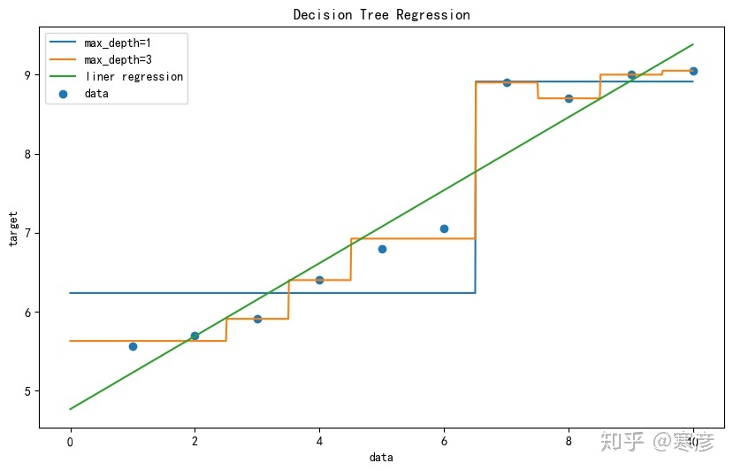

**总结**

- 优点：简单的理解和解释，树可视化
- 缺点：决策树学习者可以创建不能很好推广数据的过于复杂的树，这被称为过拟合

**改进**：减枝 cart 算法；随机森林

**应用场景**：企业重要决策，由于分析能力很好，在决策过程应用较多，可以选择特征

## 随机森林

- 集成学习方法
  通过建立几个模型组合来解决单一预测问题，它的工作原理是生成多个分类器/模型，各自独立的学习和做出预测，这些预测最后结合成组合预测，因此优于任何一个单分类做出的预测

- 随机森林
  是一个包含多个决策树的分类器，并且其输出的类别是由个别树输出的类别的众数而定，例如, 如果你训练了5个树, 其中有4个树的结果是True, 1个数的结果是False, 那么最终投票结果就是True

- 随机森林原理过程两个随机

- - 训练集随机 - N 个样本中随机有放回的抽取 N 个样本
    bootstrap-随机有放回抽样
  - 特征随机 - M 个特征中抽取 m 个特征
    M >> m：降维

- 

- API

- - class sklearn.ensemble.RandomForestClassifier(n_estimators=10, criterion=’gini’, max_depth=None, bootstrap=True, random_state=None, min_samples_split=2)

- - - 随机森林分类器
    - n_estimators：integer，optional（default = 10）森林里的树木数量120,200,300,500,800,1200
    - criteria：string，可选（default =“gini”）分割特征的测量方法
    - max_depth：integer或None，可选（默认=无）树的最大深度 5,8,15,25,30
    - max_features="auto”,每个决策树的最大特征数量

- - - - If "auto", then `max_features=sqrt(n_features)`.
      - If "sqrt", then `max_features=sqrt(n_features)` (same as "auto").
      - If "log2", then `max_features=log2(n_features)`.
      - If None, then `max_features=n_features`.

- - - bootstrap：boolean，optional（default = True）是否在构建树时使用放回抽样
    - min_samples_split:节点划分最少样本数
    - min_samples_leaf:叶子节点的最小样本数

- - 超参数：n_estimator, max_depth, min_samples_split,min_samples_leaf

- 

- 随机森林预测案例
  随机森林对泰坦尼克号乘客生存进行预测

~~~ python
from sklearn.model_selection import train_test_split
from sklearn.feature_extraction import DictVectorizer
import pandas as pd
from sklearn.ensemble import RandomForestClassifier
from sklearn.model_selection import GridSearchCV

def decision():
    """
    随机森林对泰坦尼克号进行预测生死情况
    """
    
    # 1、获取数据
    titanic = pd.read_csv("http://biostat.mc.vanderbilt.edu/wiki/pub/Main/DataSets/titanic.txt")
    
    # 筛选特征值和目标值
    x = titanic[["pclass", "age", "sex"]]
    y = titanic["survived"]
    
    # 2、数据处理
    # 2.1 缺失值处理
    x["age"].fillna(x["age"].mean(), inplace=True)
    
    # 2.2 转换成字典
    x = x.to_dict(orient="records")
    
    # 3、数据集划分
    x_train, x_test, y_train, y_test = train_test_split(x, y, test_size=0.25)
    
    # 4、字典特征抽取
    transfer = DictVectorizer()
    x_train = transfer.fit_transform(x_train)
    x_test = transfer.transform(x_test)
    
    # 随机森林
    estimator = RandomForestClassifier()
    
    # 添加网格搜索与交叉验证
    # 参数准备
    param_dict = {"n_estimators": [20, 30, 40, 50, 60, 100], "max_depth":[5, 8, 15, 25, 30]}
    GridSearchCV(estimator, param_grid=param_dict, cv=3)
    estimator.fit(x_train, y_train)

    # 模型评估
    # 方法1 : 直接对比真实值和预测值
    y_predict = estimator.predict(x_test)
    print("y_predict  : \n", y_predict)
    print("直接对比真实值和预测值 : \n", y_test == y_predict)

    # 方法2 : 计算准确率
    score = estimator.score(x_test, y_test)
    print("准确率 : \n", score)

    # print("最佳参数 : \n", estimator.best_params_)
    # print("最佳结果 : \n", estimator.best_score_)
    # print("最佳估计器 : \n", estimator.best_estimator_)
    # print("交叉验证结果 : \n", estimator.cv_results_)

    return None
~~~

总结

- 具有极好的准确率
- 能够有效的运行在大数据集上，处理具有高维特征的数据输入样本，而且不需要降维