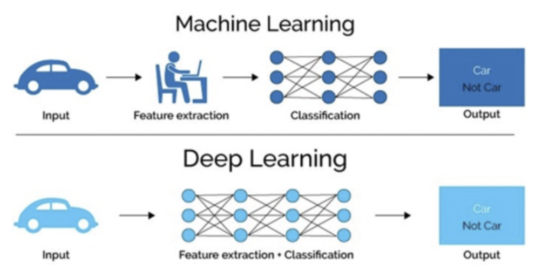

# [深度学习](https://www.yuque.com/models/yvphv7/pndpk3)

机器学习是实现人工智能的一种途径，深度学习是机器学习的一个子集，也就是说深度学习是实现机器学习的一种方法。与机器学习算法的主要区别如下图所示：

传统机器学习算术依赖人工设计特征，并进行特征提取，而深度学习方法不需要人工，而是依赖算法自动提取特征。深度学习模仿人类大脑的运行方式，从经验中学习获取知识。这也是深度学习被看做黑盒子，可解释性差的原因。

随着计算机软硬件的飞速发展，现阶段通过深度学习来模拟人脑来解释数据，包括图像，文本，音频等内容。目前深度学习的主要应用领域有：

- 智能手机
- 语音识别：比如苹果的智能语音助手siri
- 机器翻译：谷歌将深度学习方法嵌入到谷歌翻译中，能够支持100多种语言的即时翻译。
- 拍照翻译
- 自动驾驶
- 当然在其他领域也能见到深度学习的身影，比如风控，安防，智能零售，医疗领域，推荐系统等

## 常见的神经网络

### 卷积网络（convolutional neural network）

从字面上卷积神经网络可以分为卷积和神经网络。拿图片处理来说，卷积不再像神经网络那样对图片的每个像素信息输入进行处理，而是对图片上的一小块像素区域进行处理。这样可以明显减少W权重的数量。

#### 卷积神经网络应用

> 卷积神经网络属于人工神经网络的一种架构，对于图像领域能给出优秀的预测结果

### RNN循环神经网络(recurrent neuralnetwork)

循环神经网络是用于处理有序的数据的神经网络。有序的数据指的是，一些数据有关联，有顺序的。区别于普通神经网络的地方在于，rnn了解到数据之间的关联。比如语言数据，语言中每个字都有其顺序关联性。

#### RNN应用

> RNN可以应用于很多有趣的领域，比如让RNN写学术论文，让RNN写程序脚本，让RNN作曲。

### 生成对抗网络GAN（Generative Adversarial Nets）

#### 生成对抗网络简单理解

生成网络区别于其他神经网络在于它的创造性，它可以创造出数据。其过程更像人类的学习和练习不断强化某一技能，而训练就是学习过程中的纠错。GAN会根据随机数来生成有意义的数据，或者说更接近实际意义的数据。

#### GAN应用

> GAN的创造性赋予了其想象力，他能生成图片，图片合成，将文本翻译成图片。

## 总结

- 深度学习是什么

深度学习是机器学习算法的一种，通过模拟人脑实现相应的功能
