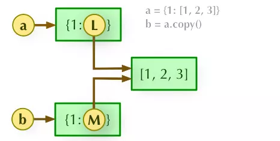
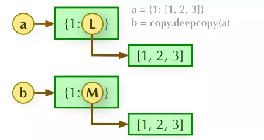

Python
<a name="dJmos"></a>
### 字典翻转
首先来看字典的翻转，假设有下面类似的一个字典对象与数据
```python
car_dict = { 
    "brand":"Tesla", 
    "model": "Model Y", 
    "year": 2017
}
```
倘若想要翻转字典当中的键值对，可以这么来做
```python
d2 = {}
for k, v in car_dict.items():
    d2[v] = k
print(d2)
```
output
```python
{'Tesla': 'brand', 'Model Y': 'model', 2017: 'year'}
```
结果的键值对就产生了对调，当然也还有更加简单的方法，代码如下
```python
d3 = dict(map(reversed, car_dict.items()))
print(d3)
```
output
```python
{'Tesla': 'brand', 'Model Y': 'model', 2017: 'year'}
```
<a name="x72ZE"></a>
### `lambda()`和`map()`
上面的代码当中用到了`map()`方法，`map()`方法可以和`lambda()`方法联用，代码如下
```python
li = [5, 10, 22, 30, 50, 65, 70]
final_list = list(map(lambda x: x*2, li))
print(final_list)
```
output
```python
[10, 20, 44, 60, 100, 130, 140]
```
先有`lambda()`方法来定义一个函数，然后通过`map()`方法映射到列表当中的每一个元素，最后仍然以列表的形式返回，
<a name="L1Kmz"></a>
### 给列表当中的字典排序
有时候也需要根据特定的条件针对列表当中的字典排序，例如
```python
dicts_lists = [ 
  { 
    "Name" :  "Tony" , 
    "Age" : 20, 
  }, 
  { 
     "Name" :  "May" , 
     "Age" : 14, 
  }, 
  { 
    "Name" :  "Katy" , 
    "Age" : 23, 
  } 
```
需要根据字典当中的“Age”字段来进行排序，代码如下
```python
dicts_lists.sort(key=lambda x:x.get('Age'))
print(dicts_lists)
```
output
```python
[{'Name': 'May', 'Age': 14}, {'Name': 'Tony', 'Age': 20}, {'Name': 'Katy', 'Age': 23}]
```
上面的结果是按照升序来进行排序的，要是需要其以降序的方式来排序，可以这么来做，代码如下
```python
dicts_lists.sort(key=lambda x:x.get('Age'), reverse = True)
print(dicts_lists)
```
output
```python
[{'Name': 'Katy', 'Age': 23}, {'Name': 'Tony', 'Age': 20}, {'Name': 'May', 'Age': 14}]
```
<a name="nk0M7"></a>
### 给列表当中的字符串排序
要是列表当中的都是字符串，而需要对其进行排序，该如何进行呢？例如
```python
my_list = ["blue", "red", "green" ]
```
根据首字母在字母表当中的顺序来排的话，代码如下
```python
my_list.sort()
print(my_list)
```
output
```python
['blue', 'green', 'red']
```
要是根据其字符串的长度来进行排序的话，可以这么来做，代码如下
```python
my_list = sorted(my_list, key=len)
print(my_list)
```
output
```python
['red', 'blue', 'green']
```
<a name="t5W3Z"></a>
### 根据别的列表来进行排序
有时候需要根据其他的列表来对本列表来一个排序，例如有下面这两个列表
```python
a = ['blue', 'green', 'orange', 'purple', 'yellow'] 
b = [3, 2, 5, 4, 1]
```
根据列表“b”来对列表“a”进行排序，具体该怎么操作呢？代码如下
```python
sorted_list = [v for _, v in sorted(dict(zip(b, a)).items(), key=lambda x:x[0])]
print(sorted_list)
```
output
```python
['yellow', 'green', 'blue', 'purple', 'orange']
```
<a name="ZHapw"></a>
### 取出列表当中最大/最小的几个数
代码如下
```python
import heapq

scores = [1, 10, 11, 2, 5, 6]
print(heapq.nlargest(3, scores))  ## 最大的3个数
print(heapq.nsmallest(3, scores))  ## 最小的3个数
```
output
```python
[11, 10, 6]
[1, 2, 5]
```
<a name="xYBoO"></a>
### `staticmethod()`函数
Python当中的`staticmethod()`函数可以将一个方法定义成类的静态方法，这样在调用的时候无需实例化，例如
```python
class MyClass(object):
    @staticmethod
    def print_name(name):
        print('My name is: ', name)
```
不需要实例化就可以使用，例如
```python
MyClass.print_name("John")
MyClass.print_name("Mike")
```
output
```python
My name is:  John
My name is:  Mike
```
当然也可以在实例化之后调用方法，例如
```python
myclass = MyClass()
myclass.print_name("John")
```
output
```python
My name is:  John
```
<a name="CtyBg"></a>
### `classmethod`函数
`classmethod`修饰符对应的函数也不需要被实例化，不需要`self`参数，取而代之的是`cls`参数用来调用类的属性、方法以及实例化对象
```python
class MyClass(object):
    test1 = 1

    def func1(self):
        print('foo')

    @classmethod
    def func2(cls):
        print('func2')
        print(cls.test1)
        cls().func1() 
```
不需要实例化对象就可以调用`func2()`方法，代码如下
```python
MyClass.func2()
```
output
```python
func2
1
foo
```
<a name="SjaRy"></a>
### 深拷贝和浅拷贝
相信有不少同学会在面试的时候被问到这个问题，来看看这两者之间的区别。<br />浅拷贝指的是拷贝父对象，不会拷贝对象的内部的子对象，具体大家可以看下图，<br /><br />`b = a.copy()`，`a`和`b`是一个独立的对象，但他们的子对象还是指向统一对象(是引用)，所以当`a`发生了变换的时候，对应的`b`也会发生变换，代码如下
```python
a = [[1, 2, 3], [4, 3, 5]]
b = list(a) # 创建一个浅拷贝
a[0][0] = 'x'

print(a)
print(b)
```
而深拷贝完全拷贝了父对象以及子对象，两者完全是独立的，因此当`a`发生了变换的时候，不会影响到`b`，<br /><br />代码如下，不过深拷贝需要调用Python内置的`copy`模块
```python
import copy
a = [[1, 2, 3], [4, 3, 5]]
b = copy.deepcopy(a)
a[0][0] = 'x'

print(a)
print(b)
```
output
```python
[['x', 2, 3], [4, 3, 5]]
[[1, 2, 3], [4, 3, 5]]
```
<a name="NEgud"></a>
### `*args`和`**kwargs`的区别
两者的区别在于`*args`用来将参数打包成`tuple`给函数体使用，如下
```python
def function(*args):
    print(args, type(args))

function(1, 2, 3)
```
output
```python
(1, 2, 3) <class 'tuple'>
```
又如
```python
def function(x, y, *args):
    print(x, y, args)

function(1, 2, 3, 4, 5, 6)
```
output
```python
1 2 (3, 4, 5, 6)
```
而`**kwargs`打包关键字参数成`dict`给函数体调用
```python
def function(**kwargs):
    print(kwargs, type(kwargs))

function(a=1)
```
output
```python
{'a': 1} <class 'dict'>
```
但要是遇到`args`、`*args`以及`**kwargs`三者同时使用的时候，顺序必须保持`(arg,*args,**kwargs)`这个顺序
```python
def function(arg,*args,**kwargs):
    print(arg,args,kwargs)

function(10, 70, 70, 90, a=11, b=12, c=13)
```
output
```python
10 (70, 70, 90) {'a': 11, 'b': 12, 'c': 13}
```
