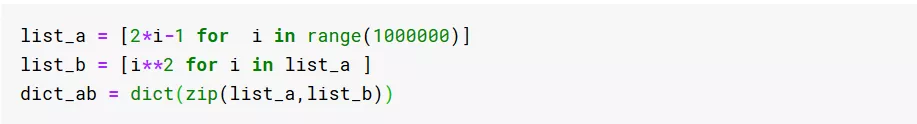

Python

### 一、分析代码运行时间

#### 第1式：测算代码运行时间
平凡方法  快捷方法（jupyter环境） 

#### 第2式：测算代码多次运行平均时间
平凡方法  快捷方法（jupyter环境） 

#### 第3式：按调用函数分析代码运行时间
平凡方法   快捷方法（jupyter环境） 

#### 第4式：按行分析代码运行时间
平凡方法     快捷方法（jupyter环境） 

### 二、加速你的查找

#### 第5式：用`set`而非`list`进行查找
低速方法   高速方法 

#### 第6式：用`dict`而非两个`list`进行匹配查找
低速方法   高速方法 

### 三、加速你的循环

#### 第7式：优先使用`for`循环而不是`while`循环
低速方法  高速方法 

#### 第8式：在循环体中避免重复计算
低速方法  高速方法 

### 四、加速你的函数

#### 第9式：用循环机制代替递归函数
低速方法  高速方法 

#### 第10式：用缓存机制加速递归函数
低速方法  高速方法 

#### 第11式：用numba加速Python函数
低速方法  高速方法 

### 五、使用标准库函数进行加速

#### 第12式：使用`collections.Counter`加速计数
低速方法  高速方法

#### 第13式：使用`collections.ChainMap`加速字典合并
低速方法   高速方法 

### 六，使用numpy向量化进行加速

#### 第14式：使用np.array代替list
低速方法  高速方法 

#### 第15式：使用`np.ufunc`代替`math.func`
低速方法  高速方法 

#### 第16式：使用`np.where`代替if
低速方法   高速方法 

### 七、加速你的Pandas

#### 第17式：使用`np.ufunc`函数代替`applymap`
低速方法  高速方法 

#### 第18式：使用预分配存储代替动态扩容
低速方法  高速方法 

#### 第19式：使用csv文件读写代替excel文件读写
低速方法

 高速方法 

#### 第20式：使用pandas多进程工具pandarallel
低速方法   高速方法 

### 八、使用Dask进行加速

#### 第21式：使用dask加速dataframe
低速方法  高速方法 

#### 第22式：使用`dask.delayed`进行加速
低速方法   高速方法 

### 九、应用多线程多进程加速

#### 第23式：应用多线程加速IO密集型任务
低速方法  高速方法 

#### 第24式：应用多进程加速CPU密集型任务
低速方法  高速方法 
