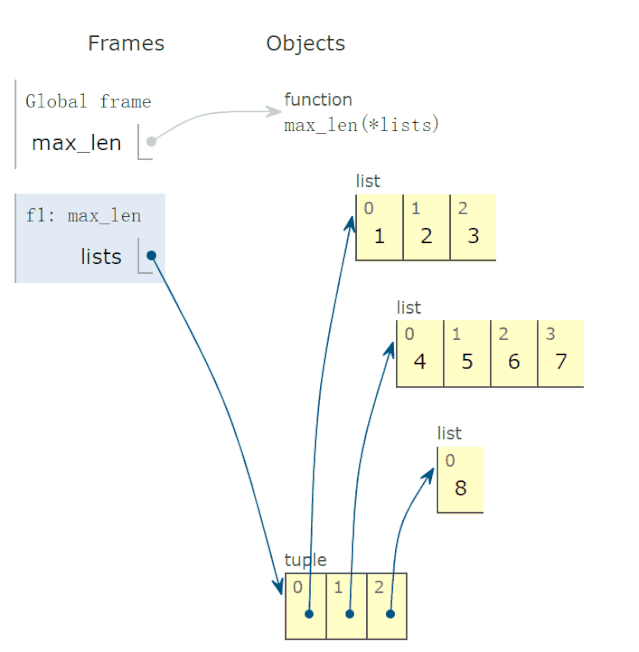

Python
<a name="mbUMl"></a>
## 一、 数字
<a name="EeTS0"></a>
### 1、求绝对值
绝对值或复数的模
```python
In [1]: abs(-6)  
Out[1]: 6
```
<a name="P5yNZ"></a>
### 2、进制转化
十进制转换为二进制：
```python
In [2]: bin(10)  
Out[2]: '0b1010'
```
十进制转换为八进制：
```python
In [3]: oct(9)  
Out[3]: '0o11'
```
十进制转换为十六进制：
```python
In [4]: hex(15)  
Out[4]: '0xf'
```
<a name="V3xFY"></a>
### 3、整数和ASCII互转
十进制整数对应的ASCII字符
```python
In [1]: chr(65)  
Out[1]: 'A'
```
查看某个ASCII字符对应的十进制数
```python
In [1]: ord('A')  
Out[1]: 65
```
<a name="hlVBX"></a>
### 4、元素都为真检查
所有元素都为真，返回 True，否则为False
```python
In [5]: all([1,0,3,6])  
Out[5]: False

In [6]: all([1,2,3])  
Out[6]: True
```
<a name="raYQl"></a>
### 5、元素至少一个为真检查
至少有一个元素为真返回True，否则False
```python
In [7]: any([0,0,0,[]])  
Out[7]: False

In [8]: any([0,0,1])  
Out[8]: True
```
<a name="ozP9x"></a>
### 6、判断是真是假
测试一个对象是True，还是False。
```python
In [9]: bool([0,0,0])  
Out[9]: True  
  
In [10]: bool([])  
Out[10]: False  
  
In [11]: bool([1,0,1])  
Out[11]: True
```
<a name="hLbBa"></a>
### 7、创建复数
创建一个复数
```python
In [1]: complex(1,2)  
Out[1]: (1+2j)
```
<a name="Ac45K"></a>
### 8、取商和余数
分别取商和余数
```python
In [1]: divmod(10,3)  
Out[1]: (3, 1)
```
<a name="VFgRI"></a>
### 9、转为浮点类型
将一个整数或数值型字符串转换为浮点数
```python
In [1]: float(3)  
Out[1]: 3.0
```
如果不能转化为浮点数，则会报ValueError:
```python
In [2]: float('a')  
# ValueError: could not convert string to float: 'a'
```
<a name="hcR5n"></a>
### 10、转为整型
`int(x, base =10)`，x可能为字符串或数值，将x 转换为一个普通整数。如果参数是字符串，那么它可能包含符号和小数点。如果超出了普通整数的表示范围，一个长整数被返回。
```python
In [1]: int('12',16)  
Out[1]: 18
```
<a name="IvYDS"></a>
### 11、次幂
base为底的exp次幂，如果mod给出，取余
```python
In [1]: pow(3, 2, 4)  
Out[1]: 1
```
<a name="x5AyJ"></a>
### 12、四舍五入
四舍五入，ndigits代表小数点后保留几位：
```python
In [11]: round(10.0222222, 3)  
Out[11]: 10.022  
  
In [12]: round(10.05,1)  
Out[12]: 10.1
```
<a name="QRUBQ"></a>
### 13、链式比较
```python
i = 3  
print(1 < i < 3)  # False  
print(1 < i <= 3)  # True
```
<a name="yvLSl"></a>
## 二、 字符串
<a name="xBBTr"></a>
### 14、字符串转字节
字符串转换为字节类型
```python
In [12]: s = "apple"                                                              
  
In [13]: bytes(s,encoding='utf-8')  
Out[13]: b'apple'
```
<a name="ghdHX"></a>
### 15、任意对象转为字符串
```python
In [14]: i = 100                                                                  
  
In [15]: str(i)  
Out[15]: '100'  
  
In [16]: str([])  
Out[16]: '[]'  
  
In [17]: str(tuple())  
Out[17]: '()'
```
<a name="KRLPf"></a>
### 16、执行字符串表示的代码
将字符串编译成Python能识别或可执行的代码，也可以将文字读成字符串再编译。
```python
In [1]: s  = "print('helloworld')"  
      
In [2]: r = compile(s,"<string>", "exec")  
      
In [3]: r  
Out[3]: <code object <module> at 0x0000000005DE75D0, file "<string>", line 1>  
      
In [4]: exec(r)  
helloworld
```
<a name="VPn9Z"></a>
### 17、计算表达式
将字符串str 当成有效的表达式来求值并返回计算结果取出字符串中内容
```python
In [1]: s = "1 + 3 +5"  
    ...: eval(s)  
    ...:  
Out[1]: 9
```
<a name="CLyey"></a>
### 18、字符串格式化
格式化输出字符串，`format(value, format_spec)`实质上是调用了value的`__format__(format_spec)`方法。
```python
In [1]: print("i am {0},age{1}".format("tom",18))  
Out[1]:i am tom,age18  
```
| 3.1415926 | {:.2f} | 3.14 | 保留小教点后两位 |
| --- | --- | --- | --- |
| 3.1415926 | {:+.2f} | +3.14 | 带符号保留小数点后两位 |
| -1 | {:+.2f} | -1.00 | 带符号保留小数点后两位 |
| 2.71828 | {:.0f} | 3 | 不带小数 |
| 5 | {:0>2d} | 05 | 数字补零[填充左边，宽度为2] |
| 5 | {:x<4d} | 5xxx | 数字补x[填充右边，宽度为4] |
| 10 | {:x<4d} | 10xx | 数字补x[填充右边，宽度为4] |
| 1000000 | {:,} | 1,000,000 | 以逗号分隔的数字格式 |
| 0.25 | {:.2%} | 25.00% | 百分比格式 |
| 1000000000 | {:.2e} | 1.00e+09 | 指数记法 |
| 18 | {:>10d} | '18' | 右对齐(默认，宽度为10) |
| 18 | {:<10d} | '18' | 左对齐(宽度为10) |
| 18 | {:^10d} | '18' | 中间对齐(宽度为10) |

<a name="gJ28D"></a>
## 三、 函数
<a name="k9SuF"></a>
### 19、拿来就用的排序函数
排序：
```python
In [1]: a = [1,4,2,3,1]  
  
In [2]: sorted(a,reverse=True)  
Out[2]: [4, 3, 2, 1, 1]  
  
In [3]: a = [{'name':'xiaoming','age':18,'gender':'male'},{'name':'  
     ...: xiaohong','age':20,'gender':'female'}]  
In [4]: sorted(a,key=lambda x: x['age'],reverse=False)  
Out[4]:  
[{'name': 'xiaoming', 'age': 18, 'gender': 'male'},  
 {'name': 'xiaohong', 'age': 20, 'gender': 'female'}]
```
<a name="kHhvj"></a>
### 20、求和函数
求和：
```python
In [181]: a = [1,4,2,3,1]  
  
In [182]: sum(a)  
Out[182]: 11  

In [185]: sum(a,10) #求和的初始值为10  
Out[185]: 21
```
<a name="CARwV"></a>
### 21、nonlocal用于内嵌函数中
关键词`nonlocal`常用于函数嵌套中，声明变量i为非局部变量；如果不声明，`i+=1`表明`i`为函数`wrapper`内的局部变量，因为在`i+=1`引用(reference)时，i未被声明，所以会报unreferenced variable的错误。
```python
def excepter(f):  
    i = 0  
    t1 = time.time()  
    def wrapper():  
        try:  
            f()  
        except Exception as e:  
            nonlocal i  
            i += 1  
            print(f'{e.args[0]}: {i}')  
            t2 = time.time()  
            if i == n:  
                print(f'spending time:{round(t2-t1,2)}')  
    return wrapper
```
<a name="XhqLR"></a>
### 22、global 声明全局变量
先回答为什么要有`global`，一个变量被多个函数引用，想让全局变量被所有函数共享。有的伙伴可能会想这还不简单，这样写：
```python
i = 5  
def f():  
    print(i)  
  
def g():  
    print(i)  
    pass  
  
f()  
g()
```
f和g两个函数都能共享变量i，程序没有报错，所以他们依然不明白为什么要用`global`。<br />但是，如果想要有个函数对i递增，这样：
```python
def h():  
    i += 1  
  
h()
```
此时执行程序出错了！抛出异常：UnboundLocalError，原来编译器在解释`i+=1`时会把i解析为函数`h()`内的局部变量，很显然在此函数内，编译器找不到对变量i的定义，所以会报错。<br />global就是为解决此问题而被提出，在函数h内，显式地告诉编译器i为全局变量，然后编译器会在函数外面寻找i的定义，执行完i+=1后，i还为全局变量，值加1：
```python
i = 0  
def h():  
    global i  
    i += 1  
  
h()  
print(i)
```
<a name="ZyHcO"></a>
### 23、交换两元素
```python
def swap(a, b):  
    return b, a  

print(swap(1, 0))
```
输出：
```python
(0, 1)
```
<a name="GgpWl"></a>
### 24、操作函数对象
```python
In [31]: def f():  
    ...:     print('i'm f')  
    ...:  
  
In [32]: def g():  
    ...:     print('i'm g')  
    ...:  
  
In [33]: [f,g][1]()  
i'm g
```
创建函数对象的list，根据想要调用的index，方便统一调用。
<a name="Tjfts"></a>
### 25、生成逆序序列
```python
list(range(10,-1,-1)) # [10, 9, 8, 7, 6, 5, 4, 3, 2, 1, 0]
```
第三个参数为负时，表示从第一个参数开始递减，终止到第二个参数(不包括此边界)
<a name="iXPgh"></a>
### 26、函数的五类参数使用例子
python五类参数：位置参数，关键字参数，默认参数，可变位置或关键字参数的使用。
```python
def f(a,*b,c=10,**d):  
    print(f'a:{a},b:{b},c:{c},d:{d}')
```
默认参数c不能位于可变关键字参数d后。<br />调用f:
```python
In [10]: f(1,2,5,width=10,height=20)  
a:1,b:(2, 5),c:10,d:{'width': 10, 'height': 20}
```
可变位置参数b实参后被解析为元组(2,5)；而c取得默认值10；d被解析为字典。<br />再次调用f:
```python
In [11]: f(a=1,c=12)  
a:1,b:(),c:12,d:{}
```
a=1传入时a就是关键字参数，b,d都未传值，c被传入12，而非默认值。<br />注意观察参数a，既可以f(1)，也可以f(a=1) 其可读性比第一种更好，建议使用f(a=1)。如果要强制使用f(a=1)，需要在前面添加一个星号:
```python
def f(*,a,**b): 
    print(f'a:{a},b:{b}')
```
此时f(1)调用，将会报错：TypeError: f() takes 0 positional arguments but 1 was given<br />只能`f(a=1)`才能OK。<br />说明前面的*发挥作用，它变为只能传入关键字参数，那么如何查看这个参数的类型呢？借助python的inspect模块：
```python
In [22]: for name,val in signature(f).parameters.items():  
    ...:     print(name,val.kind)  
    ...:  
a KEYWORD_ONLY  
b VAR_KEYWORD
```
可看到参数a的类型为`KEYWORD_ONLY`，也就是仅仅为关键字参数。<br />但是，如果f定义为：
```python
def f(a,*b):  
    print(f'a:{a},b:{b}')
```
查看参数类型：
```python
In [24]: for name,val in signature(f).parameters.items():  
    ...:     print(name,val.kind)  
    ...:  
a POSITIONAL_OR_KEYWORD  
b VAR_POSITIONAL
```
可以看到参数`a`既可以是位置参数也可是关键字参数。
<a name="pk8j9"></a>
### 27、使用slice对象
生成关于蛋糕的序列cake1：
```python
In [1]: cake1 = list(range(5,0,-1))  
  
In [2]: b = cake1[1:10:2]  
  
In [3]: b  
Out[3]: [4, 2]  
  
In [4]: cake1  
Out[4]: [5, 4, 3, 2, 1]
```
再生成一个序列：
```python
In [5]: from random import randint  
   ...: cake2 = [randint(1,100) for _ in range(100)]  
   ...: # 同样以间隔为2切前10个元素，得到切片d  
   ...: d = cake2[1:10:2]  
In [6]: d  
Out[6]: [75, 33, 63, 93, 15]
```
使用同一种切法，分别切开两个蛋糕cake1,cake2。后来发现这种切法极为经典，又拿它去切更多的容器对象。<br />那么，为什么不把这种切法封装为一个对象呢？于是就有了slice对象。<br />定义slice对象极为简单，如把上面的切法定义成slice对象：
```python
perfect_cake_slice_way = slice(1,10,2)  
#去切cake1  
cake1_slice = cake1[perfect_cake_slice_way]  
cake2_slice = cake2[perfect_cake_slice_way]  
  
In [11]: cake1_slice  
Out[11]: [4, 2]  
  
In [12]: cake2_slice  
Out[12]: [75, 33, 63, 93, 15]
```
与上面的结果一致。<br />对于逆向序列切片，slice对象一样可行：
```python
a = [1,3,5,7,9,0,3,5,7]  
a_ = a[5:1:-1]  
  
named_slice = slice(5,1,-1)  
a_slice = a[named_slice]  
  
In [14]: a_  
Out[14]: [0, 9, 7, 5]  
  
In [15]: a_slice  
Out[15]: [0, 9, 7, 5]
```
频繁使用同一切片的操作可使用slice对象抽出来，复用的同时还能提高代码可读性。
<a name="FJktI"></a>
### 28、lambda 函数的动画演示
比如，下面求这个 lambda函数：
```python
def max_len(*lists):  
    return max(*lists, key=lambda v: len(v))
```
有两点疑惑：

- 参数v的取值？
- lambda函数有返回值吗？如果有，返回值是多少？

调用上面函数，求出以下三个最长的列表：
```python
r = max_len([1, 2, 3], [4, 5, 6, 7], [8])  
print(f'更长的列表是{r}')
```
程序完整运行过程，动画演示如下：<br /><br />结论：

- 参数v的可能取值为*lists，也就是 tuple 的一个元素。
- lambda函数返回值，等于lambda v冒号后表达式的返回值。
<a name="uZ1TT"></a>
## 四、 数据结构
<a name="U0ztG"></a>
### 29、转为字典
创建数据字典
```python
In [1]: dict()  
Out[1]: {}  
  
In [2]: dict(a='a',b='b')  
Out[2]: {'a': 'a', 'b': 'b'}  
  
In [3]: dict(zip(['a','b'],[1,2]))  
Out[3]: {'a': 1, 'b': 2}  
  
In [4]: dict([('a',1),('b',2)])  
Out[4]: {'a': 1, 'b': 2}
```
<a name="tBV17"></a>
### 30、冻结集合
创建一个不可修改的集合。
```python
In [1]: frozenset([1,1,3,2,3])  
Out[1]: frozenset({1, 2, 3})
```
因为不可修改，所以没有像`set`那样的`add`和`pop`方法
<a name="eWyEb"></a>
### 31、转为集合类型
返回一个set对象，集合内不允许有重复元素：
```python
In [159]: a = [1,4,2,3,1]  
  
In [160]: set(a)  
Out[160]: {1, 2, 3, 4}
```
<a name="F5GCJ"></a>
### 32、转为切片对象
```python
class slice(start, stop[, step])
```
返回一个表示由 `range(start, stop, step)` 所指定索引集的 slice对象，它让代码可读性、可维护性变好。
```python
In [1]: a = [1,4,2,3,1]  
  
In [2]: my_slice_meaning = slice(0,5,2)  
  
In [3]: a[my_slice_meaning]  
Out[3]: [1, 2, 1]
```
<a name="bpmYc"></a>
### 33、转元组
`tuple()` 将对象转为一个不可变的序列类型
```python
In [16]: i_am_list = [1,3,5]  
In [17]: i_am_tuple = tuple(i_am_list)  
In [18]: i_am_tuple  
Out[18]: (1, 3, 5)
```
<a name="DE5yV"></a>
## 五、 类和对象
<a name="NQiel"></a>
### 34、是否可调用
检查对象是否可被调用
```python
In [1]: callable(str)  
Out[1]: True  
  
In [2]: callable(int)  
Out[2]: True

In [18]: class Student():  
    ...:     def __init__(self,id,name):  
    ...:         self.id = id   
    ...:         self.name = name   
    ...:     def __repr__(self):  
    ...:         return 'id = '+self.id +', name = '+self.name   
    ...  
  
In [19]: xiaoming = Student('001','xiaoming')  
  
In [20]: callable(xiaoming)  
Out[20]: False
```
如果能调用`xiaoming()`，需要重写Student类的`__call__`方法：
```python
In [1]: class Student():  
    ...:     def __init__(self,id,name):  
    ...:         self.id = id  
    ...:         self.name = name  
    ...:     def __repr__(self):  
    ...:         return 'id = '+self.id +', name = '+self.name  
    ...:     def __call__(self):  
    ...:         print('I can be called')  
    ...:         print(f'my name is {self.name}')  
    ...:  
  
In [2]: t = Student('001','xiaoming')  
  
In [3]: t()  
I can be called  
my name is xiaoming
```
<a name="uVigb"></a>
### 35、ascii 展示对象
调用对象的 `__repr__` 方法，获得该方法的返回值，如下例子返回值为字符串
```python
>>> class Student():  
    def __init__(self,id,name):  
        self.id = id  
        self.name = name  
    def __repr__(self):  
        return 'id = '+self.id +', name = '+self.name
```
调用：
```python
>>> xiaoming = Student(id='1',name='xiaoming')  
>>> xiaoming  
id = 1, name = xiaoming  
>>> ascii(xiaoming)  
'id = 1, name = xiaoming'
```
<a name="dy645"></a>
### 36、类方法
`classmethod` 装饰器对应的函数不需要实例化，不需要 self 参数，但第一个参数需要是表示自身类的 cls 参数，可以来调用类的属性，类的方法，实例化对象等。
```python
In [1]: class Student():  
    ...:     def __init__(self,id,name):  
    ...:         self.id = id  
    ...:         self.name = name  
    ...:     def __repr__(self):  
    ...:         return 'id = '+self.id +', name = '+self.name  
    ...:     @classmethod  
    ...:     def f(cls):  
    ...:         print(cls)
```
<a name="yOIei"></a>
### 37、动态删除属性
删除对象的属性
```python
In [1]: delattr(xiaoming,'id')  
  
In [2]: hasattr(xiaoming,'id')  
Out[2]: False
```
<a name="WjyvK"></a>
### 38、一键查看对象所有方法
不带参数时返回当前范围内的变量、方法和定义的类型列表；带参数时返回参数的属性，方法列表。
```python
In [96]: dir(xiaoming)  
Out[96]:  
['__class__',  
 '__delattr__',  
 '__dict__',  
 '__dir__',  
 '__doc__',  
 '__eq__',  
 '__format__',  
 '__ge__',  
 '__getattribute__',  
 '__gt__',  
 '__hash__',  
 '__init__',  
 '__init_subclass__',  
 '__le__',  
 '__lt__',  
 '__module__',  
 '__ne__',  
 '__new__',  
 '__reduce__',  
 '__reduce_ex__',  
 '__repr__',  
 '__setattr__',  
 '__sizeof__',  
 '__str__',  
 '__subclasshook__',  
 '__weakref__',  
   
 'name']
```
<a name="Ga3O8"></a>
### 39、动态获取对象属性
获取对象的属性
```python
In [1]: class Student():  
   ...:     def __init__(self,id,name):  
   ...:         self.id = id  
   ...:         self.name = name  
   ...:     def __repr__(self):  
   ...:         return 'id = '+self.id +', name = '+self.name  
  
In [2]: xiaoming = Student(id='001',name='xiaoming')  
In [3]: getattr(xiaoming,'name') # 获取xiaoming这个实例的name属性值  
Out[3]: 'xiaoming'
```
<a name="ynNRa"></a>
### 40、对象是否有这个属性
```python
In [1]: class Student():  
   ...:     def __init__(self,id,name):  
   ...:         self.id = id  
   ...:         self.name = name  
   ...:     def __repr__(self):  
   ...:         return 'id = '+self.id +', name = '+self.name  
  
In [2]: xiaoming = Student(id='001',name='xiaoming')  
In [3]: hasattr(xiaoming,'name')  
Out[3]: True  
  
In [4]: hasattr(xiaoming,'address')  
Out[4]: False
```
<a name="z1Hb5"></a>
### 41、对象门牌号
返回对象的内存地址
```python
In [1]: id(xiaoming)  
Out[1]: 98234208
```
<a name="tN46c"></a>
### 42、`isinstance`
判断_object_是否为类_classinfo_的实例，是返回true
```python
In [1]: class Student():  
   ...:     def __init__(self,id,name):  
   ...:         self.id = id  
   ...:         self.name = name  
   ...:     def __repr__(self):  
   ...:         return 'id = '+self.id +', name = '+self.name  
  
In [2]: xiaoming = Student(id='001',name='xiaoming')  
  
In [3]: isinstance(xiaoming,Student)  
Out[3]: True
```
<a name="p9sPk"></a>
### 43、父子关系鉴定
```python
In [1]: class undergraduate(Student):  
    ...:     def studyClass(self):  
    ...:         pass  
    ...:     def attendActivity(self):  
    ...:         pass  
  
In [2]: issubclass(undergraduate,Student)  
Out[2]: True  
  
In [3]: issubclass(object,Student)  
Out[3]: False  
  
In [4]: issubclass(Student,object)  
Out[4]: True
```
如果class是classinfo元组中某个元素的子类，也会返回True
```python
In [1]: issubclass(int,(int,float))  
Out[1]: True
```
<a name="fwV4i"></a>
### 44、所有对象之根
object 是所有类的基类
```python
In [1]: o = object()  
  
In [2]: type(o)  
Out[2]: object
```
<a name="mtBFv"></a>
### 45、创建属性的两种方式
返回 property 属性，典型的用法：
```python
class C:  
    def __init__(self):  
        self._x = None  
  
    def getx(self):  
        return self._x  
  
    def setx(self, value):  
        self._x = value  
  
    def delx(self):  
        del self._x  
    # 使用property类创建 property 属性  
    x = property(getx, setx, delx, "I'm the 'x' property.")
```
使用Python装饰器，实现与上完全一样的效果代码：
```python
class C:  
    def __init__(self):  
        self._x = None  
  
    @property  
    def x(self):  
        return self._x  
  
    @x.setter  
    def x(self, value):  
        self._x = value  
  
    @x.deleter  
    def x(self):  
        del self._x
```
<a name="mp2OB"></a>
### 46、查看对象类型
```python
class type(name, bases, dict)
```
传入一个参数时，返回 object 的类型：
```python
In [1]: class Student():  
   ...:     def __init__(self,id,name):  
   ...:         self.id = id  
   ...:         self.name = name  
   ...:     def __repr__(self):  
   ...:         return 'id = '+self.id +', name = '+self.name  
   ...:  
  
In [2]: xiaoming = Student(id='001',name='xiaoming')  
In [3]: type(xiaoming)  
Out[3]: __main__.Student  
  
In [4]: type(tuple())  
Out[4]: tuple
```
<a name="QtrEO"></a>
### 47、元类
xiaoming, xiaohong, xiaozhang 都是学生，这类群体叫做 Student。<br />Python 定义类的常见方法，使用关键字 class
```python
In [36]: class Student(object):  
    ...:     pass
```
xiaoming, xiaohong, xiaozhang 是类的实例，则：
```python
xiaoming = Student()  
xiaohong = Student()  
xiaozhang = Student()
```
创建后，xiaoming 的 `__class__` 属性，返回的便是 Student类
```python
In [38]: xiaoming.__class__  
Out[38]: __main__.Student
```
问题在于，Student 类有 __class__属性，如果有，返回的又是什么？
```python
In [39]: xiaoming.__class__.__class__  
Out[39]: type
```
程序没报错，返回 type<br />那么，不妨猜测：Student 类，类型就是 type<br />换句话说，Student类就是一个对象，它的类型就是 type<br />所以，Python 中一切皆对象，类也是对象<br />Python 中，将描述 Student 类的类被称为：元类。<br />按照此逻辑延伸，描述元类的类被称为：_元元类_，开玩笑了~ 描述元类的类也被称为元类。<br />聪明的朋友会问了，既然 Student 类可创建实例，那么 type 类可创建实例吗？如果能，它创建的实例就叫：类 了。<br />说对了，type 类一定能创建实例，比如 Student 类了。
```python
In [40]: Student = type('Student',(),{})  
  
In [41]: Student  
Out[41]: __main__.Student
```
它与使用 class 关键字创建的 Student 类一模一样。<br />Python 的类，因为又是对象，所以和 xiaoming，xiaohong 对象操作相似。支持：

- 赋值
- 拷贝
- 添加属性
- 作为函数参数
```python
In [43]: StudentMirror = Student # 类直接赋值 # 类直接赋值  
In [44]: Student.class_property = 'class_property' # 添加类属性  
In [46]: hasattr(Student, 'class_property')  
Out[46]: True
```
元类，确实使用不是那么多，也许先了解这些，就能应付一些场合。就连 Python 界的领袖 Tim Peters 都说：<br />“元类就是深度的魔法，99%的用户应该根本不必为此操心。
<a name="HHNpn"></a>
## 六、工具
<a name="vV5lA"></a>
### 48、枚举对象
返回一个可以枚举的对象，该对象的`next()`方法将返回一个元组。
```python
In [1]: s = ["a","b","c"]  
    ...: for i ,v in enumerate(s,1):  
    ...:     print(i,v)  
    ...:  
1 a  
2 b  
3 c
```
<a name="F2KVN"></a>
### 49、查看变量所占字节数
```python
In [1]: import sys  
  
In [2]: a = {'a':1,'b':2.0}  
  
In [3]: sys.getsizeof(a) # 占用240个字节  
Out[3]: 240
```
<a name="padFC"></a>
### 50、过滤器
在函数中设定过滤条件，迭代元素，保留返回值为True的元素：
```python
In [1]: fil = filter(lambda x: x>10,[1,11,2,45,7,6,13])  
  
In [2]: list(fil)  
Out[2]: [11, 45, 13]
```
<a name="XrGMR"></a>
### 51、返回对象的哈希值
返回对象的哈希值，值得注意的是自定义的实例都是可哈希的，list, dict, set等可变对象都是不可哈希的(unhashable)
```python
In [1]: hash(xiaoming)  
Out[1]: 6139638  
  
In [2]: hash([1,2,3])  
# TypeError: unhashable type: 'list'
```
<a name="L6bFS"></a>
### 52、一键帮助
返回对象的帮助文档
```python
In [1]: help(xiaoming)  
Help on Student in module __main__ object:  
  
class Student(builtins.object)  
 |  Methods defined here:  
 |  
 |  __init__(self, id, name)  
 |  
 |  __repr__(self)  
 |  
 |  Data descriptors defined here:  
 |  
 |  __dict__  
 |      dictionary for instance variables (if defined)  
 |  
 |  __weakref__  
 |      list of weak references to the object (if defined)
```
<a name="bc52u"></a>
### 53、获取用户输入
获取用户输入内容
```python
In [1]: input()  
aa  
Out[1]: 'aa'
```
<a name="pMQB3"></a>
### 54、创建迭代器类型
使用`iter(obj, sentinel)`，返回一个可迭代对象，sentinel可省略(一旦迭代到此元素，立即终止)
```python
In [1]: lst = [1,3,5]  
  
In [2]: for i in iter(lst):  
    ...:     print(i)  
    ...:  
1  
3  
5

In [1]: class TestIter(object):  
    ...:     def __init__(self):  
    ...:         self.l=[1,3,2,3,4,5]  
    ...:         self.i=iter(self.l)  
    ...:     def __call__(self):  #定义了__call__方法的类的实例是可调用的  
    ...:         item = next(self.i)  
    ...:         print ("__call__ is called,fowhich would return",item)  
    ...:         return item  
    ...:     def __iter__(self): #支持迭代协议(即定义有__iter__()函数)  
    ...:         print ("__iter__ is called!!")  
    ...:         return iter(self.l)  
In [2]: t = TestIter()  
In [3]: t() # 因为实现了__call__，所以t实例能被调用  
__call__ is called,which would return 1  
Out[3]: 1  
  
In [4]: for e in TestIter(): # 因为实现了__iter__方法，所以t能被迭代  
    ...:     print(e)  
    ...:  
__iter__ is called!!  
1  
3  
2  
3  
4  
5
```
<a name="cXvBO"></a>
### 55、打开文件
返回文件对象
```python
In [1]: fo = open('D:/a.txt',mode='r', encoding='utf-8')  
  
In [2]: fo.read()  
Out[2]: '\ufefflife is not so long,\nI use Python to play.'
```
mode取值表：

| 字符 | 意义 |
| --- | --- |
| 'r' | 读取（默认） |
| 'w' | 写入，并先截断文件 |
| 'x' | 排它性创建，如果文件已存在则失败 |
| 'a' | 写入，如果文件存在则在末尾追加 |
| 'b' | 二进制模式  |
| 't' | 文本模式（默认） |
| '+' | 打开用于更新（读取与写入) |

<a name="Htbvr"></a>
### 56、创建range序列

1. `range(stop)`
2. `range(start, stop[,step])`

生成一个不可变序列：
```python
In [1]: range(11)  
Out[1]: range(0, 11)  
  
In [2]: range(0,11,1)  
Out[2]: range(0, 11)
```
<a name="UX9ZA"></a>
### 57、反向迭代器
```python
In [1]: rev = reversed([1,4,2,3,1])  
  
In [2]: for i in rev:  
     ...:     print(i)  
     ...:  
1  
3  
2  
4  
1
```
<a name="UTm1w"></a>
### 58、聚合迭代器
创建一个聚合了来自每个可迭代对象中的元素的迭代器：
```python
In [1]: x = [3,2,1]  
In [2]: y = [4,5,6]  
In [3]: list(zip(y,x))  
Out[3]: [(4, 3), (5, 2), (6, 1)]  

In [4]: a = range(5)  
In [5]: b = list('abcde')  
In [6]: b  
Out[6]: ['a', 'b', 'c', 'd', 'e']  
In [7]: [str(y) + str(x) for x,y in zip(a,b)]  
Out[7]: ['a0', 'b1', 'c2', 'd3', 'e4']
```
<a name="Q8ZEt"></a>
### 59、链式操作
```python
from operator import (add, sub)  
  
  
def add_or_sub(a, b, oper):  
    return (add if oper == '+' else sub)(a, b)  
  
  
add_or_sub(1, 2, '-')  # -1
```
<a name="JqKTt"></a>
### 60、对象序列化
对象序列化，是指将内存中的对象转化为可存储或传输的过程。很多场景，直接一个类对象，传输不方便。<br />但是，当对象序列化后，就会更加方便，因为约定俗成的，接口间的调用或者发起的 web 请求，一般使用 json 串传输。<br />实际使用中，一般对类对象序列化。先创建一个 Student 类型，并创建两个实例。
```python
class Student():  
    def __init__(self,**args):  
        self.ids = args['ids']  
        self.name = args['name']  
        self.address = args['address']  
xiaoming = Student(ids = 1,name = 'xiaoming',address = '北京')  
xiaohong = Student(ids = 2,name = 'xiaohong',address = '南京')
```
导入 json 模块，调用 dump 方法，就会将列表对象 [xiaoming,xiaohong]，序列化到文件 json.txt 中。
```python
import json  
  
with open('json.txt', 'w') as f:  
    json.dump([xiaoming,xiaohong], f, default=lambda obj: obj.__dict__, ensure_ascii=False, indent=2, sort_keys=True)
```
生成的文件内容，如下：
```json
[  
  {  
    "address":"北京",  
    "ids":1,  
    "name":"xiaoming"  
  },  
  {  
    "address":"南京",  
    "ids":2,  
    "name":"xiaohong"  
  }  
]
```
