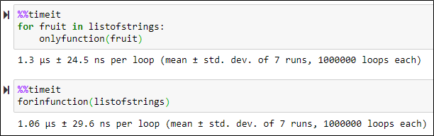

Python
<a name="PM9Er"></a>
## 反转列表
Python 中通常有两种反转列表的方法：切片或 `reverse()` 函数调用。这两种方法都可以反转列表，但需要注意的是内置函数 `reverse()` 会更改原始列表，而切片方法会创建一个新列表。<br />但是他们的表现呢？哪种方式更有效？看一下下面的例子：
<a name="v6rIf"></a>
### 使用切片：
```bash
$ python -m timeit -n 1000000 -s 'import numpy as np' 'mylist=list(np.arange(0, 200))' 'mylist[::-1]'
1000000 loops, best of 5: 15.6 usec per loop
```
<a name="PqHTo"></a>
### 使用 `reverse()`：
```bash
$ python -m timeit -n 1000000 -s 'import numpy as np' 'mylist=list(np.arange(0, 200))' 'mylist.reverse()'
1000000 loops, best of 5: 10.7 usec per loop
```
这两种方法都可以反转列表，但需要注意的是内置函数 `reverse()` 会更改原始列表，而切片方法会创建一个新列表。<br />显然，内置函数 `reverse()` 比列表切片方法更快！
<a name="NJKnK"></a>
## 交换两个值
用一行代码交换两个变量值是一种更具有 Python 风格的方法。<br />与其他编程语言不同，Python 不需要使用临时变量来交换两个数字或值。举个简单的例子：
```python
variable_1 = 100 
variable_2 = 500
```
要交换 variable_1 和 variable_2 的值，只需要一行代码。
```python
variable_1, variable_2 = variable_2, variable_1
```
也可以对字典使用相同的技巧：
```python
md[key_2], md[key_1] = md[key_1], md[key_2]
```
该技巧可以避免多次迭代和复杂的数据转换，从而减少执行时间。
<a name="Bhfnw"></a>
## 在函数内部循环
都喜欢创建自定义函数来执行自己的特定任务。然后使用 for 循环遍历这些函数，多次重复该任务。<br />但是，在 for 循环中使用函数需要更长的执行时间，因为每次迭代都会调用该函数。<br />相反，如果在函数内部实现了 for 循环，则该函数只会被调用一次。<br />为了更清楚地解释，举个例子！<br />首先创建一个简单的字符串列表：
```python
list_of_strings = ['apple','orange','banana','pineapple','grape']
```
创建两个函数，函数内部和外部都有 for 循环，从简单的开始。
```python
def only_function(x):
    new_string = x.capitalize()
    out_putstring = x + " " + new_string
    print(output_string)
```
和一个带有循环的 `for` 函数：
```python
def for_in_function(listofstrings):
    for x in list_of_strings:
        new_string = x.capitalize()
        output_string = x + " " + new_string
        print(output_string)
```
显然，这两个函数的输出是一样的。<br />然后比较一下，哪个更快？<br /><br />在函数内使用 `for` 循环会稍微快一些。
<a name="O4gnu"></a>
## 减少函数调用次数
判断对象的类型时，使用 `isinstance()` 最好，其次是对象类型标识 `id()`，对象值 `type()` 最后。
```python
# Check if num an int type
type(num) == type(0) # Three function calls
type(num) is type(0) # Two function calls
isinstance(num,(int)) # One function call
```
不要将重复操作的内容作为参数放在循环条件中，避免重复操作。
```python
# Each loop the len(a) will be called
while i < len(a):
    statement
# Only execute len(a) once
m = len(a)
while i < m:
    statement
```
要在模块 X 中使用函数或对象 Y，请直接使用 `from X import Y` 而不是 `import X; then X.Y`。这减少了使用 Y 时的一次查找（解释器不必先查找 X 模块，然后在 X 模块的字典中查找 Y）。
