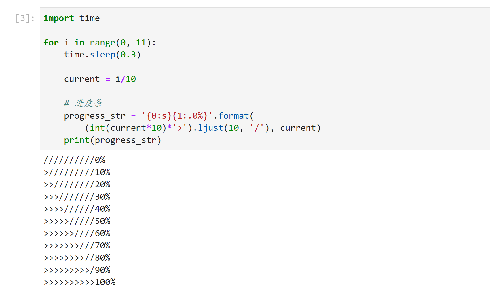

Python
<a name="gGZr2"></a>
## 反转数字
**问题场景** 把数字 789 转换为 987。<br />典型的数字翻转问题。<br />**解决思路** 将数字的百位十位个位拆解出来，就解开了<br />**编码如下**
```python
def reverse_number(number):
    baiwei = int(number/100)
    shiwei = int(number%100/10)
    gewei = int(number%10)
    return gewei*100+shiwei*10+baiwei

new_number = reverse_number(789)
print(new_number)
```
<a name="iGX3g"></a>
## 类的说明文档
**问题场景** 给新创建的类添加说明文档<br />**解决思路** 在类名下使用三引号即可添加说明文档，使用 `类名.__doc__` 可调用该文档<br />**编码如下**
```python
class My_Class(object):
    """你好"""

print(My_Class.__doc__)
```
<a name="HE8PM"></a>
## 设置 Python 文件的编码
**问题场景** Python 文件设置默认编码。<br />**解决思路** Python 脚本文件默认是使用 UTF-8 编码格式进行编码的，一般无需指定编码，但也可自行设置编码，Python2 代码文件一般都带该行注释。设置方式是使用一行注释，要求格式需满足下述正则表达式。<br />**编码如下**
```python
coding[=:]\s*([-\w.]+)
```
声明位置在 Python 文件的第一行或者第二行，注意 `:` 或 `=` 前**没有**空格。例如下述代码：
```python
# -*- coding:utf-8 -*-
```
也可以使用大写
```python
# -*- coding:UTF-8 -*-
```
<a name="TMM9F"></a>
## 旋转字符串
**问题场景** 一个字符串，一个数字，完成如下操作

- 字符串为 abcde，数字为 3，则输出 cdeab；- 字符串为 abcde，数字为 1，则输出 eabcd；- 字符串为 abcde，数字为 0，则输出 abcde；- ……**解决思路** 一个字符串切片运用的问题。

**编码如下**
```python
def reverse_str(my_str,offset):
    # 如果数字为 0，顺序默认不变
    if offset ==0:
        return my_str

    left = my_str[:len(my_str)-offset]
    right = my_str[len(my_str)-offset:]
    return right + left
```
<a name="iUrQG"></a>
## 实现控制台滚动条
**问题场景** 在控制台输出滚动条。<br />**解决思路** 使用字符串格式化进行实现，例如用 `&gt;` 表示进展，用 `/` 表示未完成的进展，使用 `ljust()` 方法返回一个原字符串左对齐，并使用填充字符（默认空格）填充至指定长度的新字符串。<br />**编码如下** 逐步实现
```python
# 打印一行 &gt;&gt;&gt;
progress_str = ">" * 100
print(progress_str)
```
填充一部分 `&gt;`，再填充另一部分 `/`。
```python
# 打印一行 &gt;&gt;&gt;
progress_str = ">"*20
# 填充50个 -
progress_str = progress_str.ljust(100,'/')
print(progress_str)
```
实现循环操作
```python
import time

for i in range(0, 11):
    time.sleep(0.3)

    current = i/10

    # 进度条
    progress_str = '{0:s}{1:.0%}'.format(
        (int(current*10)*'>').ljust(10, '/'), current)
    print(progress_str)
```
<br />为了让其在一行出现，可以修改代码为如下格式，注意最后一行代码。
```python
import time

for i in range(0, 11):
    time.sleep(0.3)

    current = i/10

    # 进度条
    progress_str = '{0:s}{1:.0%}'.format(
        (int(current*10)*'>').ljust(10, '/'), current)
    print(f'\r{<!-- -->progress_str}',end='')
```
<a name="Kzi4O"></a>
## `print` 函数直接写入文件
**问题场景** 如果不希望将 `print` 函数输出的内容，打印到控制台，而是直接输入到文件中，该如何操作？<br />**解决思路** `print()` 函数有一个参数叫做 file，用它就行。<br />**编码如下**
```python
file = open('runtime.log', 'a+', encoding='utf-8')
print('测试日志', file=file)
```
<a name="YRfSj"></a>
## 合并 2 个列表
**问题场景** 合并 2 个列表，并要求合并之后的列表有顺序。例如 `my_list1 = [1,2,3]` ， `my_list2 = [1,3,5]` ，合并之后是 `my_list = [1,1,2,3,3,5]`<br />**解决思路** 先合并 2 个列表，然后判断其各个元素大小，判断的时候使用冒泡排序即可完成任务。**编码如下**
```python
def merge(l1, l2):
    my_list = l1 + l2
    n = len(my_list)
    for i in range(n):
        for j in range(0, n - i - 1):
            if my_list[j] &gt; my_list[j + 1]:
                my_list[j], my_list[j + 1] = my_list[j + 1], my_list[j]
    print(my_list)

if __name__ == '__main__':
    my_list1 = [4, 2, 6]
    my_list2 = [1, 3]
    merge(my_list1, my_list2)
```
