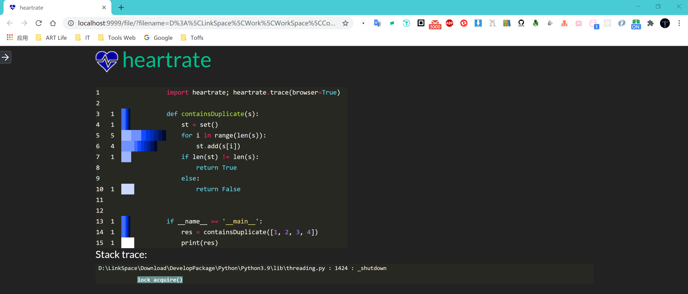

Python<br />Heartrate 是一个 Python 的工具库，可以实时可视化 Python 程序的执行过程。Heartrate的作用：

- 启动程序追踪<br />
- 在线程中启动服务器<br />
- 打开显示 trace() 被调用的文件可视化图的浏览器窗口<br />

Heartrate Github仓库地址：[https://github.com/alexmojaki/heartrate](https://github.com/alexmojaki/heartrate)
<a name="edQfR"></a>
### 安装Heartrate
```bash
pip install --user heartrate
```
<a name="lOhZj"></a>
### 使用Heartrate
```python
import heartrate; heartrate.trace(browser=True)
```
或者
```python
from heartrate import trace, files
trace(files=files.path_contains('my_app', 'my_library'))
```
The supplied functions are:

- `files.all`: trace all files.
- `files.path_contains(*substrings)` trace all files where the path contains any of the given substrings.
- `files.contains_regex(pattern)` trace all files which contain the given regex in the file itself, so you can mark files to be traced in the source code, e.g. with a comment.
<a name="UtMb6"></a>
### 示例代码
```python
import heartrate; heartrate.trace(browser=True)


def containsDuplicate(s):
    st = set()
    for i in range(len(s)):
        st.add(s[i])
    if len(st) != len(s):
        return True
    else:
        return False


if __name__ == '__main__':
    res = containsDuplicate([1, 2, 3, 4])
    print(res)

```
<a name="aYPhT"></a>
### 效果截图
程序执行完成会自动将浏览器打开显示结果<br />
