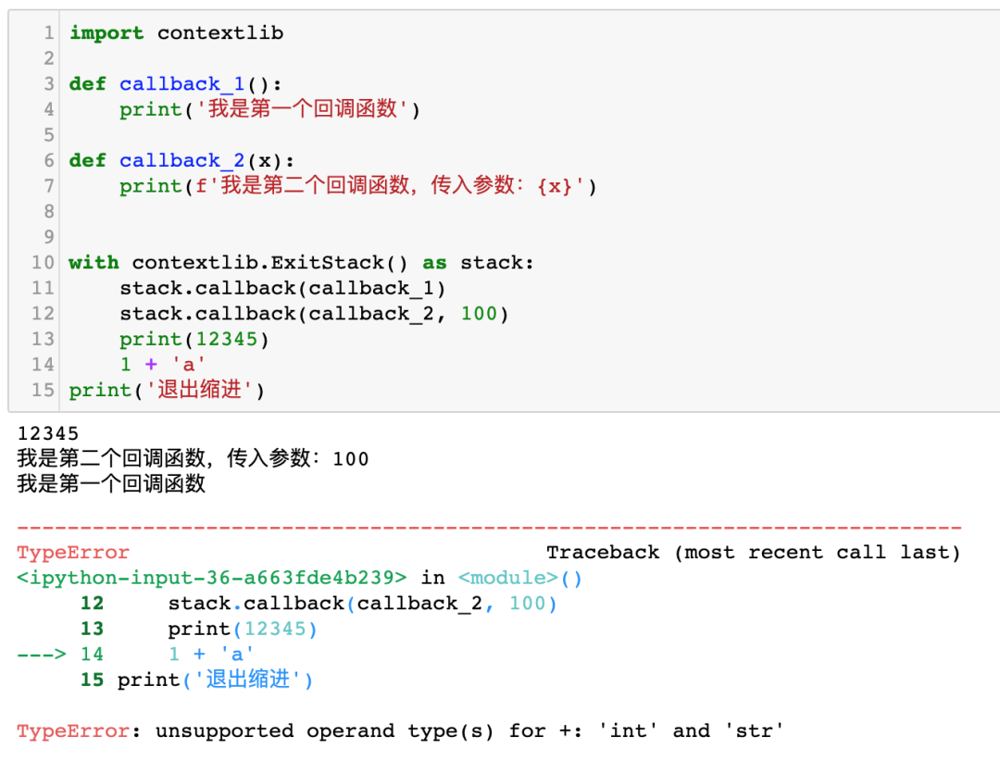

Python<br />Golang 里面有一个关键词叫做`defer`，它可以实现延迟调用。<br />实际上在 Python 里面也有相关的语法，那就是`contextlib.ExitStack`。<br />来看这样一个场景：<br />有一个函数`parse`，它的作用是从 Redis 中持续读入数据，并写入到MongoDB 中。示例代码如下：
```python
import json
import redis
import pymongo

client = redis.Redis()
handler = pymongo.MongoClient().test.data

def parse():
    data = client.lpop('test')
    if not data:
        return
    handler.insert_one(json.loads(data))
```
但现在想增加一个需求，当Redis 读取结束或者读取数据报错的时候，能把当前的时间也写入到MongoDB 中。<br />那么代码可能变成下面这样：
```python
import json
import redis
import datetime
import pymongo

client = redis.Redis()
handler = pymongo.MongoClient().test.data

def parse():
    while True:
        try:
            data = client.lpop('test')
            if not data:
                handler.insert_one({'finished': True, 'ts': datetime.datetime.now().strftime('%Y-%m-%d %H:%M:%S')})
                return
            handler.insert_one(json.loads(data))
        except Exception:
            handler.insert_one({'finished': True, 'ts': datetime.datetime.now().strftime('%Y-%m-%d %H:%M:%S'})
```
可以看到，代码变得很难看了。<br />现在，可以使用延迟调用来让代码变得更好看。<br />要实现这个目的，就可以开始使用`ExitStack`了。它可以注册多个回调函数，在退出上下文缩进时执行。<br />先来看一个简单的例子：
```python
import contextlib

def callback_1():
    print('我是第一个回调函数')

def callback_2(x):
    print(f'我是第二个回调函数，传入参数：{x}')


with contextlib.ExitStack() as stack:
    stack.callback(callback_1)
    stack.callback(callback_2, 100)
    print(12345)
    print('xxxx')
print('退出缩进')
```
运行效果如下图所示：<br /><br />可以看出以下特点：

1. 被添加的回调函数进入了一个栈，所以后添加的回调函数先调用
2. 回调函数会在结束缩进的时候被调用

现在来人工构造一个异常：<br /><br />可以看到，即使缩进里面出现了报错，回调函数仍然可以正常运行。等所有回调函数运行完成以后，Python 才会退出。<br />基于以上特点，就可以来重构最开始的代码了：
```python
import json
import redis
import datetime
import pymongo
import contextlib

client = redis.Redis()
handler = pymongo.MongoClient().test.data

def add_ts():
    handler.insert_one({'finished': True, 'ts': datetime.datetime.now().strftime('%Y-%m-%d %H:%M:%S')})

def parse():
    with contextlib.ExitStack() as stack:
        stack.callback(add_ts)
        while True:
            data = client.lpop('test')
            if not data:
                return
            handler.insert_one(json.loads(data))
```
无论是正常运行结束还是运行过程中报错，`add_ts`函数都会正常运行，确保始终增加一条日期数据。
