Python
<a name="LvBVg"></a>
## Python CLI “-m”参数
首先从 Python CLI（命令行界面）开始谈起。虽然不必编写代码来使用稍后介绍的功能，但是为了让 Python 知道要执行的内容，需要使用 Python 命令行来进行操作。<br />只要电脑上安装了 Python 环境，就可以在 Python 命令行界面输入`python --help`显示所有支持的参数。<br />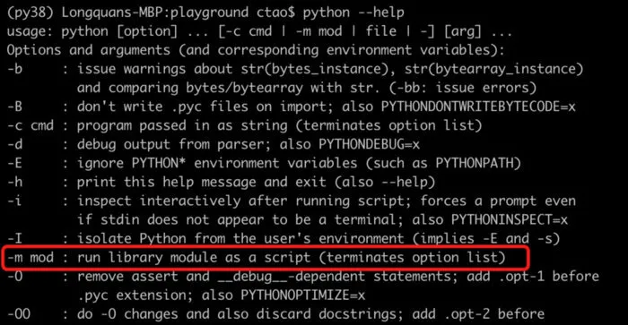<br />由于命令输出的内容太长，上图仅显示了部分内容。这里最想强调的是`-m mod`参数，它会将 Python 模块以脚本的形式运行。因此，如果该模块的实现支持命令行操作，就可以在命令行直接使用它。接下来就体验一下:)
<a name="VaDX3"></a>
## 1、服务端口测试
有时候想测试 ip 端口的出站网络流量，通常 telnet 命令是一个不错的选择。在 Windows 平台上默认没有安装 telnet 软件，使用前需要手动安装。如果只是进行简单的测试，未来使用场景也不多，安装它可能是一种资源浪费。<br />但是，如果安装了 Python，那就不必下载安装 telnet，因为 Python 内置了 telnet 对应的模块。可以对 Google 搜索网站的 443 端口进行测试。
```bash
python -m telnetlib -d 142.250.70.174 443
```
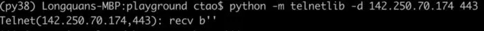<br />如上图所示，网络流量显示正常，甚至收到了来自 Google 空字符的响应。如果尝试访问 ip 的随机一个端口，则会抛出错误，如下图所示。
```bash
python -m telnetlib -d 142.250.70.174 999
```
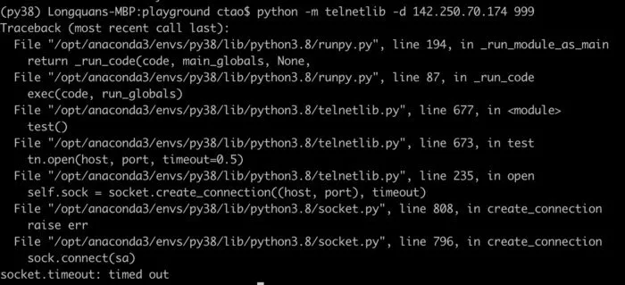
<a name="FEulB"></a>
## 2、本地启动 web 服务
很多 Python 使用者不知道这一点，当第一次听说后会感到惊讶。是的，可以使用 Python 启动 web 服务，而无需编写任何代码，只需按如下方式在命令行执行如下命令。
```bash
python -m http.server
```
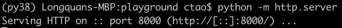<br />运行后，显示该服务监听了本地的 8000 端口，然后，就可以尝试从浏览器进行访问 http://localhost:8000/。<br />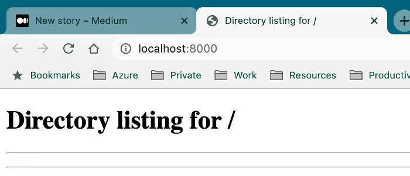<br />该 web 服务会以根目录的形式展示在命令启动路径下的本地文件系统，换句话说，无法访问它的父级目录。<br />这个功能的使用场景是什么。举一个例子，如果想跟好伙伴们分享电脑某个目录下的许多文本/PDF/图像文件/子目录文件等，那么使用这个方法就可以非常轻松地进行共享了。<br />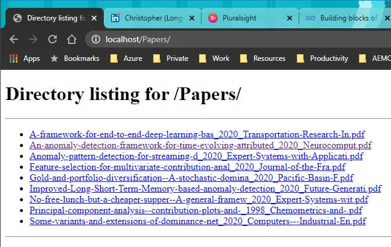
<a name="J7tTx"></a>
## 3、验证及格式化 JSON 字符串
如果有一个非常长且未经格式化的 JSON 字符串，那么阅读起来会非常困难。通常，会使用一些带有 JSON 插件的文本编辑器，比如 Sublime 或者 VS Code，来格式化 JSON 字符串。但是，如果手头没有这些工具，Python 可以临时一用。比如下面会以这个简短的 JSON 字符串进行展示。
```bash
echo '{"name": {"first_name":"Chris", "last_name":"Tao"} "age":33}'
```
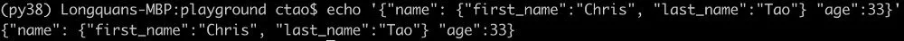<br />可以看到，当前操作系统的命令行工具只能按照原字符串的原始格式进行展示。但是，如果借助 Python 的 `json.tool`工具，JSON 字符串就会被很好的格式化。
```bash
echo '{"name": {"first_name":"Chris", "last_name":"Tao"} "age":33}' | python -m json.tool
```
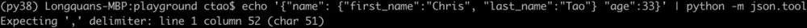<br />Oops！JSON 字符串无效，并且 `json.tool` 定位了问题。在名称对象后面漏掉了一个逗号。所以添加逗号以使该 JSON 合法有效。
```bash
echo '{"name": {"first_name":"Chris", "last_name":"Tao"}, "age":33}' | python -m json.tool
```
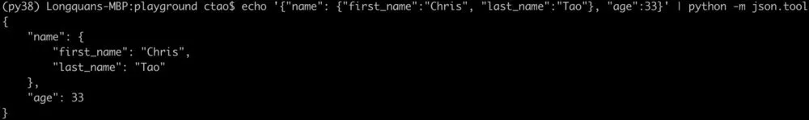<br />现在，JSON 字符串具有了完美缩进的格式化输出！更加方便阅读。
<a name="hQmvQ"></a>
## 4、创建文本编辑器
可以使用 Python 来”创建”一个文本编辑器。当然，它的功能非常有限，但是如果当前没有更好的选择，使用它会方便很多。另外，功能上肯定无法与 Vim 和 Nanos 相比，但是它完全是基于 UI 编辑器而不是命令行文本形式。这个编辑器由基于 Tkinter 实现的`idlelib` 模块创建，所以它是可以跨平台运行的。<br />假设要编写一个简单的 Python 程序来显示当前的时间，想快速编写代码而不想下载和安装庞大的代码编辑工具。现在运行下面这个命令。
```bash
mkdir get_time_apppython -m idlelib get_time_app/print_time.py
```
如果文件目录不存在，`idlelib`将无法创建，因此如果必要，需要创建一个。运行完这个命令之后，print_time.py 只有执行保存的情况下才会创建到本地。现在应该会弹出编辑器，可以在里面写一些代码， 可以看到代码是支持语法高亮的。<br />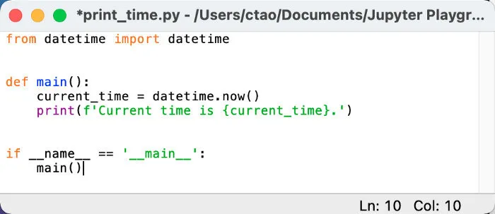<br />现在使用ctrl+s快捷键对编辑好的代码进行保存，并关闭编辑窗口。接下来使用命令行查看一下编辑好的代码文件进行验证，没有任何问题。
```bash
cat get_time_app/print_time.py
```
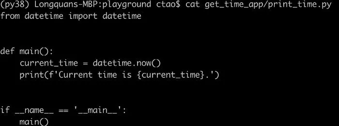
<a name="qlqse"></a>
## 5、创建可执行应用程序
如果想要创建一个简单的应用，比如前面写的获取当前时间的应用程序，不必再需要像 PyInstaller 这样的第三方工具包，Python 内置的 Zipapp 就可以做到。假设要打包成一个"Get Time"的应用，可以在命令行运行下面的命令。
```bash
python -m zipapp get_time_app -m "print_time:main"
```
在该命令中，只需要给 `zipapp`设置`get_time_app`名称，指定 Python 程序的入口文件及其程序入口函数即可。以.pyz为扩展名的文件就是创建的应用程序，至此就可以将项目作为单个文件而不是文件夹进行分发。<br />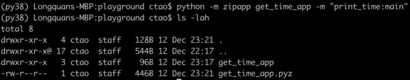<br />该程序的启动方式也很简单，直接使用 Python 进行调用即可。
```bash
python get_time_app.pyz
```
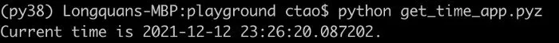
<a name="BlRhH"></a>
## 6、编码和解码字符串或文件
通过 Python CLI，可以加密字符串或文件。以有趣的 ROT13 加密算法为例进行展示。ROT13 是一种偏移 13 位的凯撒密码，它的加密原理如下图所示。<br /><br />可以使用 `encodings.rot_13` 来加密一个字符串，命令如下。
```bash
echo "I am Chris" | python -m encodings.rot_13
```
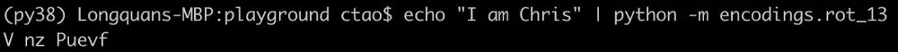<br />切记，不要将其用于任何真正的加密内容。因为英文有 26 个字母，所以再次运行这个算法可以很容易地破译这个加密字符串:)
```bash
echo 'V nz Puevf' | python -m encodings.rot_13
```
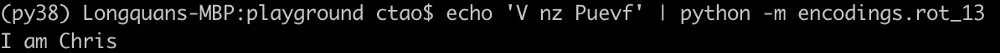<br />现在尝试一个更常见的场景——base64 编码。可以对字符串进行 base64 编码，如下所示。
```bash
echo "I am Chris" | python -m base64
```
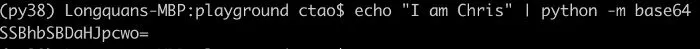<br />接下来，也可以使用`-d`参数对加密字符串进行解码。
```bash
echo "SSBhbSBDaHJpcwo=" | python -m base64 -d
```
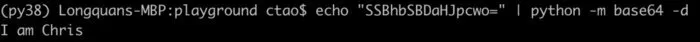<br />base64 也经常用在对图像文件的编码和解码上。也可以对文件进行如下编码。
```bash
python -m base64 get_time_app/print_time.py  
```
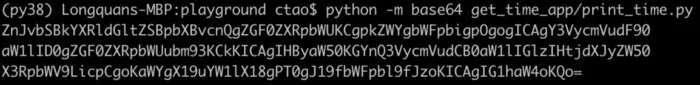<br />非常有趣的是，解码后的 Python 脚本可以即时执行，不会报错。
```bash
echo "ZnJvbSBkYXRldGltZSBpbXBvcnQgZGF0ZXRpbWUKCgpkZWYgbWFpbigpOgogICAgY3VycmVudF90aW1lID0gZGF0ZXRpbWUubm93KCkKICAgIHByaW50KGYnQ3VycmVudCB0aW1lIGlzIHtjdXJyZW50X3RpbWV9LicpCgoKaWYgX19uYW1lX18gPT0gJ19fbWFpbl9fJzoKICAgIG1haW4oKQo=" | python -m base64 -d | python
```
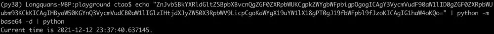
<a name="Tpvyw"></a>
## 7、获取系统元数据
如果想获取当前的系统信息，Python 提供了一种非常简便的方法。只需要运行下面的命令即可。
```bash
python -m sysconfig
```
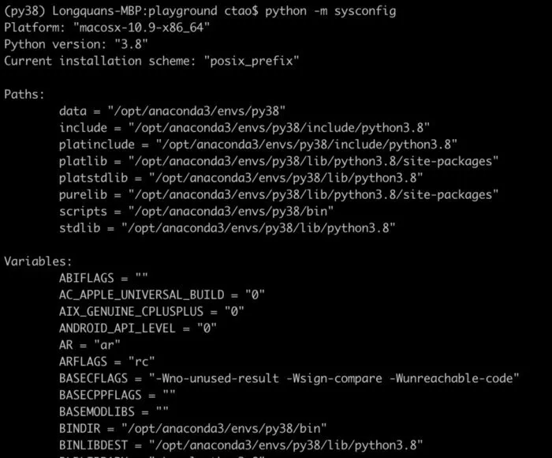<br />可以看到，这个命令执行后会显示所有的系统配置信息，比如 Python 环境路径和环境变量等。上面的截图仅仅展示了一部分内容，实际显示的内容会非常丰富。如果只想展示 Python 环境路径和当前工作路径，可以执行下面的命令。
```bash
python -m site
```
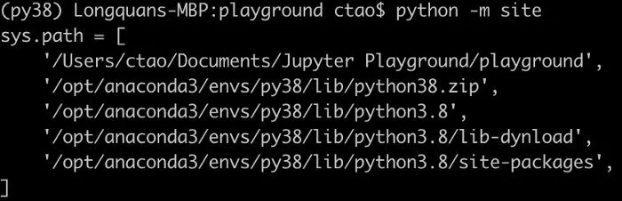
<a name="p1vPl"></a>
## 8、文件压缩
可以使用 Python 来压缩文件，而无需下载 tar/zip/gzip 等工具。举个例子，如果想压缩刚刚在第 4 节中编写的应用程序，可以运行以下命令将文件夹压缩到 zip 文件中。在命令中，选项 `-c` 代表的是“create”即创建的含义。
```bash
python -m zipfile -c get_time_app.zip get_time_app
```
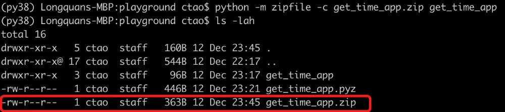<br />当然，也可以对压缩文件进行解压。紧接这上面的操作，把文件夹解压出来放到一个新目录中，这样就不会和原来的目录冲突了。在下面的命令中，选项 `-e` 代表“extract”即解压的含义。
```bash
python -m zipfile -e get_time_app.zip get_time_app_extracted
```
如果不放心，可以检验一下。
```bash
ls get_time_app_extractedcat get_time_app_extracted/get_time_app/print_time.py
```
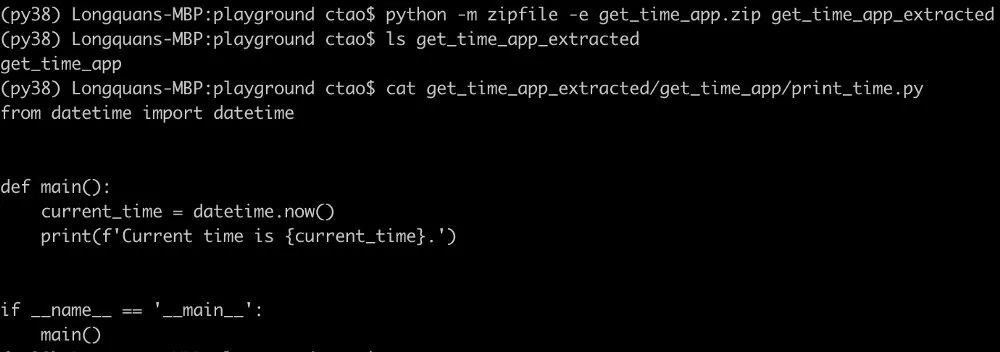<br />刚刚以 zip 文件为例进行了展示，Python 除了支持 zip 格式的解压缩以外，还支持 tar 和 gzip 的解压缩。
<a name="bI019"></a>
## 总结
这里介绍了一种无需编写任何代码即可使用 Python 内置库的方法。如果在某些场景下能够想到使用这些方法，毫无疑问可以提供很多的便利。
