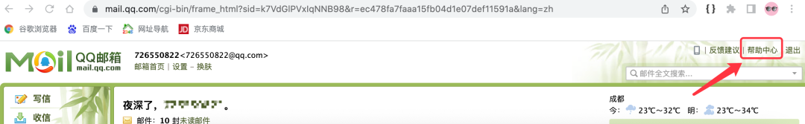
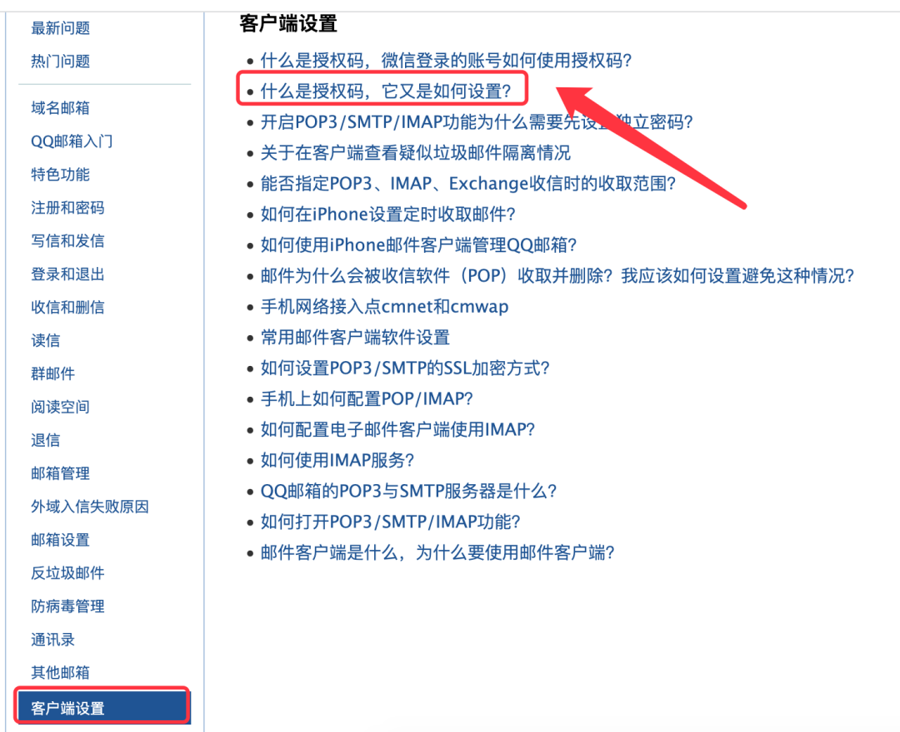
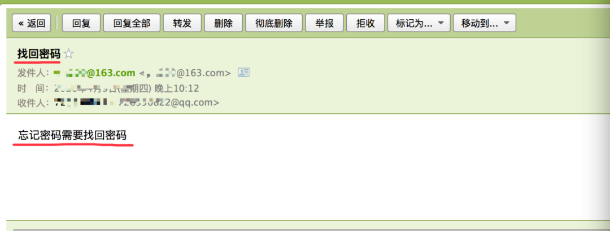
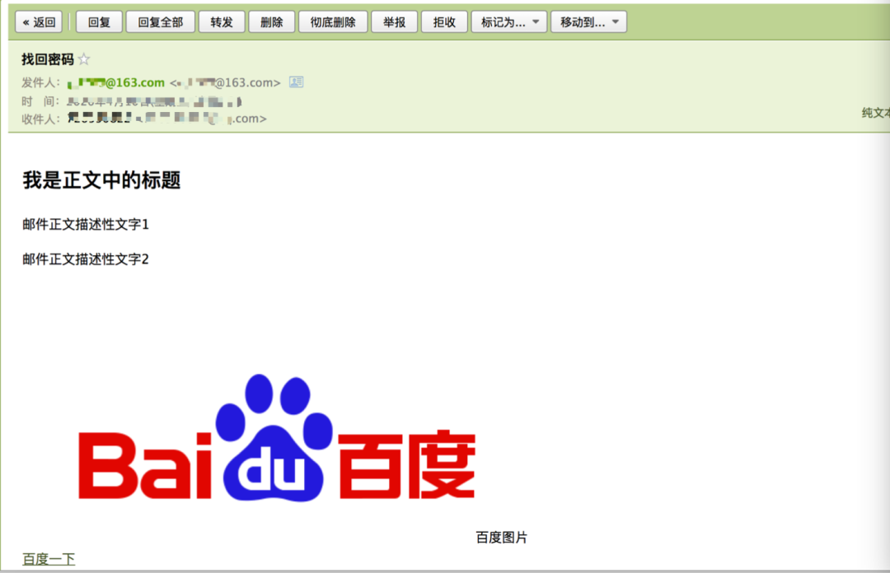
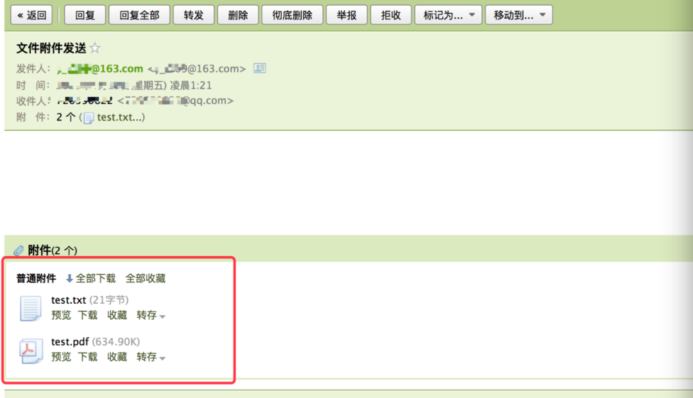

Python 邮件<br />邮件，作为最正式规范的沟通方式，在日常办公过程中经常被用到，Python内置了对 SMTP 的支持，可以发送纯文本、富文本、HTML 等格式的邮件，利用 Python 发送邮件的 3 种方式，以 126 邮箱为例，在编码之前，需要开启 SMTP 服务。然后，手动新增一个授权码。其中，账号、授权码和服务器地址用于连接登录邮箱服务器。
<a name="fySCx"></a>
## 1、smtplib
SMTP(Simple Mail Transfer Protocol)即简单邮件传输协议，它是一组用于由源地址到目的地址传送<br />邮件的规则，由它来控制信件的中转方式。python的smtplib提供了一种很方便的途径发送电子邮件。它对smtp协议进行了简单的封装。<br />smtplib是 Python 自带的依赖库，可以直接导入使用。
<a name="xDRgC"></a>
### 准备用来发送邮件的邮箱账号
准备好邮箱账号和邮箱登录授权码。不同类型邮箱获取授权码的方式大同小异，这里以QQ邮箱为例演示获取授权码步骤：<br />第一步：用网页登录QQ邮箱，找到帮助中心<br /><br />第二步：在帮助中心中选择"**客户端设置**"中的第2个问题：<br /><br />然后按照对应的要求操作，得到授权码并且保存。
<a name="uF9DP"></a>
### 发送邮件的基本步骤
代码发送邮件的步骤，和人工发送邮件步骤基本一致：**登录邮箱**  -> **准备邮件内容**   ->  **发送邮件**。
<a name="h4OCC"></a>
#### 登录邮箱
```
import smtplib
1. 连接邮箱服务器
连接对象 = smtplib.SMTP_SSL(服务器地址, 邮箱服务端口)
- 服务器地址:smtp.163.com(163邮箱)、smtp.qq.com(qq邮箱) - 邮箱服务端口:465或者25
    
2. 登录邮箱 连接对象.login(邮箱账号, 授权码)
```
<a name="DayBX"></a>
#### 准备数据
数据指的需要发送的内容。邮件内容的构建需要涉及到另外一个库**email**，它可以用来构建邮件主题以及各种形式的邮件内容(包括文字内容、图片内容、html内容、附件)等，这里先简单说一下邮件主题和文本内容，其他形式的内容在后⾯面邮件内容部分详细讲解。
```python
from email.mime.multipart import MIMEMultipart 
from email.mime.text import MIMEText
from email.header import Header
1. 创建邮件对象
邮件对象 = MIMEMultipart()
2. 设置邮件主题
主题对象 = Header(邮件标题, 编码方式).encode() 
邮件对象['Subject'] = 主题对象
3.设置邮件发送者
邮件对象['From'] = '用户名 <用户名>'
4.设置邮件接受者
邮件对象['To'] = '收件⼈1;收件⼈2;收件人3...'
5. 添加文字内容
文字内容对象 = MIMEText(内容, 类型, 编码方式) 
- 内容:就是文字字符串
- 类型:plain(简单的文字内容)、html(超文本) 邮件对象.attach(文字对象)
```
<a name="DxmCa"></a>
#### 发送邮件
```
连接对象.sendmail(发件⼈, 收件人, 邮件对象.as_string()) 
连接对象.quit()
```
<a name="bGU6t"></a>
#### 实现代码
通过邮箱账号、授权码、邮箱服务器地址初始化一个 SMTP 实例，然后进行连接
```python
def __init__(self):
    # 初始化
    self.smtp = smtplib.SMTP()
    # 连接邮箱服务器地址
    self.smtp.connect('smtp.126.com')
    # 加入主题和附件，邮件体
    self.email_body = MIMEMultipart('mixed')
    # 发件人地址及授权码
    self.email_from_username = '**@126.com'
    self.email_from_password = '授权码'
# 登录
self.smtp.login(self.email_from_username, self.email_from_password)
```
然后，将收件人列表、邮件标题、邮件正文内容、附件路径及附件文件名加入到上面定义的邮件体中
```python
def generate_email_body(self, email_to_list, email_title, email_content, attchment_path, files):
    """
    组成邮件体
    :param email_to_list:收件人列表
    :param email_title:邮件标题
    :param email_content:邮件正文内容
    :param attchment_path:附件的路径
    :param files:附件文件名列表
    :return:
    """
    self.email_body['Subject'] = email_title
    self.email_body['From'] = self.email_from_username
    self.email_body['To'] = ",".join(email_to_list)
    for file in files:
        file_path = attchment_path + '/' + file
        if os.path.isfile(file_path):
            # 构建一个附件对象
            att = MIMEText(open(file_path, 'rb').read(), 'base64', 'utf-8')
            att["Content-Type"] = 'application/octet-stream'
            att.add_header("Content-Disposition", "attachment", filename=("gbk", "", file))
            self.email_body.attach(att)
    text_plain = MIMEText(email_content, 'plain', 'utf-8')
    self.email_body.attach(text_plain)
```
接着，就可以使用 SMTP 实例对象，将邮件发送出去
```python
# 收件人列表
email_to_list = ['收件人1地址','收件人2地址']
# 发送邮件
# 注意：此处必须同时指定发件人与收件人，否则会当作垃圾邮件处理掉
self.smtp.sendmail(self.email_from_username, email_to_list, self.email_body.as_string())
```
邮件发送完毕之后，退出服务即可
```python
def exit(self):
    """
    退出服务
    :return:
    """
    self.smtp.quit()
```
<a name="V47Zl"></a>
### 各种类型邮件发送实例
<a name="dlv0q"></a>
#### 普通文字内容邮件
这类邮件的邮件正文只有普通文字信息，没有超文本也没有图片，并且没有附件：
```python
import smtplib
from email.mime.multipart import MIMEMultipart 
from email.mime.text import MIMEText
from email.header import Header
# 1. 连接邮箱服务器
con = smtplib.SMTP_SSL('smtp.163.com', 465)
# 2. 登录邮箱 
con.login('XXXX@163.com', 'XXXXX')
# 2. 准备数据
# 创建邮件对象
msg = MIMEMultipart()
# 设置邮件主题
subject = Header('找回密码', 'utf-8').encode() msg['Subject'] = subject
# 设置邮件发送者
msg['From'] = 'XXXX@163.com <XXXX@163.com>'
# 设置邮件接受者
msg['To'] = '726550822@qq.com'
# 添加文字内容
text = MIMEText('忘记密码需要找回密码', 'plain', 'utf-8') 
msg.attach(text)
# 3.发送邮件
con.sendmail('xxxx@163.com', '726550822@qq.com', msg.as_string()) 
con.quit()
```

<a name="fa3U6"></a>
#### 超文本文件内容
正文更加丰富和有趣的一种邮件，生活中接收到的来自各大平台发送的邮件都是这类邮件，核心代码格式如下：
```python
from email.mime.text import MIMEText
html文本对象 = MIMEText(html内容字符串, 'html', 编码方式) 邮件对象.attach(html文本对象)
```
具体代码：
```python
import smtplib
from email.mime.multipart import MIMEMultipart 
from email.mime.text import MIMEText
from email.header import Header
con = smtplib.SMTP_SSL('smtp.163.com', 465)
con.login('xxxx@163.com', 'xxxxxx')
msg = MIMEMultipart()
subject = Header('找回密码', 'utf-8').encode() 
msg['Subject'] = subject
msg['From'] = 'xxxx@163.com <xxxx@163.com>'
msg['To'] = '726550822@qq.com'

# 添加html内容
content = """
<h2>我是正文中的标题</h2>
<p>邮件正文描述性文字1</p>
<p>邮件正文描述性文字2</p>
 <center>百度图片</center>
<a href='https://www.baidu.com'>百度⼀下</a>
"""
html = MIMEText(content, 'html', 'utf-8') 
msg.attach(html)
# 发送邮件
con.sendmail('xxxx@163.com', '726550822@qq.com', msg.as_string()) 
con.quit()
```

<a name="Yed0e"></a>
#### 发送附件
邮件内容除了正文内容，有的时候还需要将各种文件以附件的形式单独发送，发送附件的核心代码如下：
```python
from email.mime.text import MIMEText
文文件对象 = MIMEText(文件二进制数据, 'base64', 编码⽅式) 
文件对象["Content-Disposition"] = 'attachment; filename="文件名"' 
邮件对象.attach(文件对象)
```
具体代码：
```python
import smtplib
from email.mime.multipart import MIMEMultipart 
from email.mime.text import MIMEText
from email.mime.image import MIMEImage
from email.header import Header
from email.mime.message import MIMEMessage from copy import deepcopy

con = smtplib.SMTP_SSL('smtp.163.com', 465)
con.login('xxxx@163.com', 'xxxxxx')

msg = MIMEMultipart()
subject = Header('文文件附件发送', 'utf-8').encode() msg['Subject'] = subject
msg['From'] = 'xxxx@163.com <xxxx@163.com>'
msg['To'] = '726550822@qq.com'

# 添加文文件附件
file1 = MIMEText(open('files/test.txt', 'rb').read(), 'base64', 'utf-8') 
file1["Content-Disposition"] = 'attachment; filename="test.txt"' 
msg.attach(file1)
file2 = MIMEText(open('files/pyecharts的使⽤用.pdf', 'rb').read(), 'base64', 'utf-8')
file2["Content-Disposition"] = 'attachment; filename="test.pdf"' 
msg.attach(file2)
# 发送邮件
con.sendmail('xxxx@163.com', '726550822@qq.com', msg.as_string()) 
con.quit()
```

<a name="GU95I"></a>
## 2、zmail
Zmail 项目创建目的是，使邮件处理变得更简单<br />使用 Zmail 发送接收邮件方便快捷，不需要手动添加服务器地址、端口以及适合的协议，可以轻松创建 MIME 对象和头文件
:::warning
**注意：Zmail 仅支持 Python3，不支持 Python2**
:::
首先，安装依赖库
```bash
# 安装依赖库
pip3 install zmail
```
然后，使用邮箱账号、授权码创建一个邮箱服务对象
```python
class ZMailObject(object):
    def __init__(self):
        # 邮箱账号
        self.username = '**@126.com'
        # 邮箱授权码
        self.authorization_code = '授权码'
        # 构建一个邮箱服务对象
        self.server = zmail.server(self.username, self.authorization_code)
```
接着，将邮件主题、邮件内容、包含的附件路径加入到一个字典中，组成邮件主体
```python
# 邮件主体
mail_body = {
        'subject': '测试报告',
        'content_text': '这是一个测试报告',  # 纯文本或者HTML内容
        'attachments': ['./attachments/report.png'],
}
```
最后，将调用send_mail()函数，将邮件发送出去即可
```python
# 收件人
# 可以指定一个人，字符串；也可以是多个人，列表
mail_to = "收件人1"
# 发送邮件
self.server.send_mail(mail_to, mail_body)
```
<a name="lg9kS"></a>
## 3、yagmail
yagmail 只需要几行代码，就能实现发送邮件的功能，相比 zmail，yagmail 实现发送邮件的方式更加简洁优雅<br />首先，安装依赖库
```bash
# 安装依赖库
pip3 install yagmail
```
然后，通过账号、授权码和服务器地址连接邮箱服务器，返回一个服务对象
```python
import yagmail
# 连接服务器
# 用户名、授权码、服务器地址
yag_server = yagmail.SMTP(user='**@126.com', password='授权码', host='smtp.126.com')
```
接着，通过 send() 函数，将邮件发送出去
```python
# 发送对象列表
email_to = ['**@qq.com', ]
email_title = '测试报告'
email_content = "这是测试报告的具体内容"
# 附件列表
email_attachments = ['./attachments/report.png', ]
# 发送邮件
yag_server.send(email_to, email_title, email_content, email_attachments)
```
邮件发送完毕之后，关闭连接即可
```python
# 关闭连接
yag_server.close()
```
<a name="d981e034"></a>
### 发送单个邮件
基本代码逻辑如下
> `yagmail.SMTP(user=用户名, host=SMTP服务器域名)`
> `yagmail.SMTP(user=用户名, password=授权码, host=SMTP服务器域名)`
> `mail.send(收件人用户名，邮件标题，邮件内容)`

所以登陆邮箱并发送一封邮件的代码可以这样写👇
```python
import yagmail
mail = yagmail.SMTP(user='**@163.com', host='smtp.163.com') 
contents = ['第一段内容', '第二段内容'] 
mail.send('chenx595@163.com', '这是一封邮件', contents)
```
:::danger
注意：yagmail基础设置中服务器地址需要和所用的邮箱对应！
:::
<a name="6b5cef0e"></a>
### 群发邮件
**将收件的邮箱组合成列表形式**，即可给多个联系人群发邮件
```python
import yagmail
mail = yagmail.SMTP(user='**@163.com', host='smtp.163.com') 
contents = ['第一段内容', '第二段内容'] 
received = ['123@qq.com', '123@gmail.com', '3254@126.com']
mail.send(received, '这是一封邮件', contents)
```
<a name="32c57ec7"></a>
### 发送带有HTML样式的邮件
需要具备一定的前端知识，这里以附带链接为例`<a href=链接网址>链接显示的文字</a>`
```python
import yagmail
mail = yagmail.SMTP(user='**@163.com', host='smtp.163.com') 
contents = ['第一段', '第二段', '<a href="https://www.baidu.com">某度</a>'] 
mail.send('chenx595@163.com', '带HTML样式的邮件', contents)
```
<a name="3d7f1ca2"></a>
### 发送带有附件的邮件
yagmail非常智能，可以**识别**`**contents**`**列表中本地路径作为附件**
```python
import yagmail
mail = yagmail.SMTP(user='**@163.com', host='smtp.163.com') 
contents = ['第一段', '第二段', r'C:\xxx\xxx'] 
mail.send('chenx595@163.com', '带HTML样式的邮件', contents)
```
<a name="4a0f97f4"></a>
### 给邮件正文嵌入图片
这里就出现问题了，往往把图片存在本地，如果按上述的代码在内容列表中放图片路径的话，会以附件形式存图片。<br />那么，如何用代码将图片嵌入正文中呢，用到的代码为：`yagmail.inline('图片路径')]`
```python
import yagmail
mail = yagmail.SMTP(user='**@163.com', host='smtp.163.com') 
contents = ['第一段', '第二段', yagmail.inline(r'C:\xxx\xxx')] 
mail.send('chenx595@163.com', '带HTML样式的邮件', contents)
```
对添加附件的代码稍加改动，将需要发送的图片路径替换即可！
