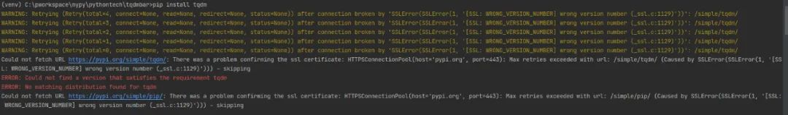
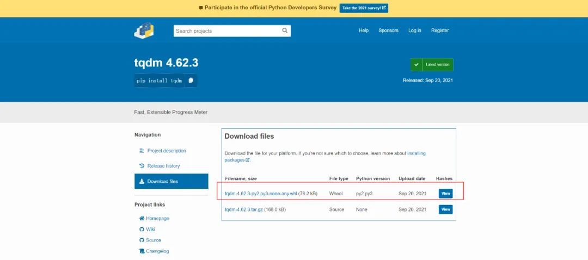
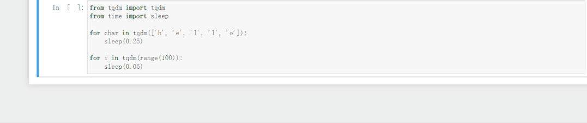
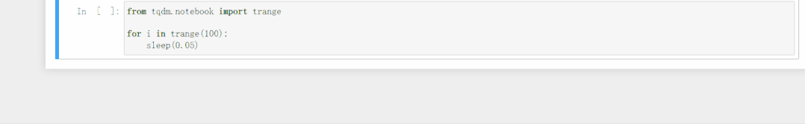
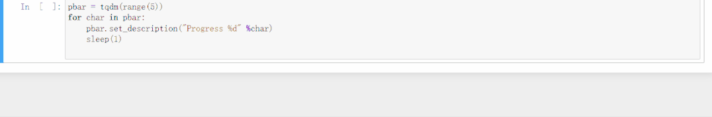
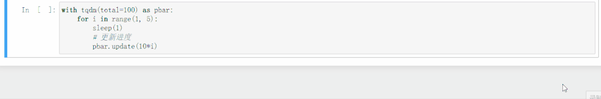
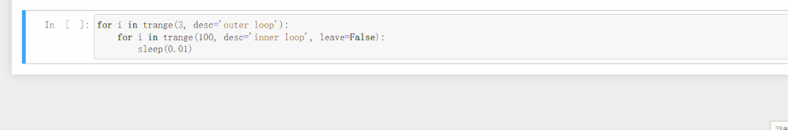

作为程序员经常会遇到比较耗时的操作，这个时候大多数人会无助地等待程序执行完成。<br />但是，也可以选择另一种方式——用一个炫酷的进度条，来观察处理进度，也可以及时了解程序运行的情况，做到心中有数。<br />介绍 Python 的一个库—— tqdm ，它就能非常完美的支持和解决这些问题，可以实时输出处理进度而且占用的CPU资源非常少，支持windows、Linux、mac等系统，支持循环处理、多进程、递归处理、还可以结合Linux的命令来查看处理情况，等进度展示。
<a name="K3B8L"></a>
## 安装
常见的安装方式是直接 pip 安装：
```bash
pip install tqdm
```
但是用这种方式安装的时候报错：<br /><br />看报错的意思是这个 pypi.org 不是可信网站，于是加上了：
```bash
pip install tqdm  --trusted-host pypi.org
```
结果还是这个报错。<br />接着尝试使用豆瓣的源来进行安装：
```bash
pip install -i https://pypi.douban.com/simple tqdm
```
还是一样的报错。<br />但是浏览器访问这个网站没问题：[https://pypi.org/project/tqdm/](https://pypi.org/project/tqdm/)<br />既然这样，就把文件下载下来再安装吧。<br /><br />下载下来之后，将 whl 文件放在项目目录，然后使用命令行安装：
```bash
pip install --trusted-host pypi.org tqdm-4.62.3-py2.py3-none-any.whl
```
这回安装没报错。再用命令检查一下安装是否成功：
```bash
pip show tqdm
```
命令行成功显示信息：
```
Name: tqdm
Version: 4.62.3
Summary: Fast, Extensible Progress Meter
Home-page: https://tqdm.github.io
Author: None
Author-email: None
License: MPLv2.0, MIT Licences
Location: c:\pworkspace\mypy\venv\lib\site-packages
Requires: colorama
Required-by:
```
折腾了半天，终于安装成功了！
<a name="L3ds1"></a>
## 使用实例
本文的示例都是在 jupyter notebook 环境下运行的，不同环境运行的效果会有差别。<br />进入 tqdm 的源码，可以找到 `__init__` 方法：
```python
def __init__(self, iterable=None, desc=None, total=None, leave=True, file=None,
             ncols=None, mininterval=0.1, maxinterval=10.0, miniters=None,
             ascii=None, disable=False, unit='it', unit_scale=False,
             dynamic_ncols=False, smoothing=0.3, bar_format=None, initial=0,
             position=None, postfix=None, unit_divisor=1000, write_bytes=None,
             lock_args=None, nrows=None, colour=None, delay=0, gui=False,
             **kwargs):
```
从中可以看到 tqdm 支持很多参数，下面列一些常见的参数：

- `iterable`：可迭代的对象，在手动更新时不需要进行设置。
- `desc`：字符串，左边进度条描述文字。
- `total`：总的项目数。
- `leave`：布尔值，迭代完成后是否保留进度条。
- `file`：输出指向位置，默认是终端，一般不需要设置。
- `ncols`：调整进度条宽度，默认是根据环境自动调节长度，如果设置为0，就没有进度条，只有输出的信息。
- `unit`：描述处理项目的文字，默认是'it'，例如: 100 it/s，处理照片的话设置为'img' ，则为 100 img/s。
- `unit_scale`：自动根据国际标准进行项目处理速度单位的换算，例如 100000 it/s >> 100k it/s。
<a name="wLxTU"></a>
### 基于可迭代对象使用
直接将可迭代对象传入作为参数，来看一下例子：
```python
from tqdm import tqdm
from time import sleep

for char in tqdm(['h', 'e', 'l', 'l', 'o']):
    sleep(0.25)

for i in tqdm(range(100)):
    sleep(0.05)
```
实现的进度条效果如下：<br /><br />这里面的 `tqdm(range())` 也可以用 tqdm 提供的 `trange()` 来代替，可以简化代码。
```python
from tqdm.notebook import trange

for i in trange(100):
    sleep(0.05)
```
实现的进度条效果如下：<br /><br />还可以为进度条添加描述：
```python
pbar = tqdm(range(5))
for char in pbar:
    pbar.set_description("Progress %d" %char)
    sleep(1)
```
实现的进度条效果如下：<br /><br />接下来，要改变一下进度条的颜色：
<a name="GdbNu"></a>
### 手动控制进度条
可以使用 `with` 语句来手动控制进度条。
```python
with tqdm(total=100) as pbar:
    for i in range(1, 5):
        sleep(1)
        # 更新进度
        pbar.update(10*i)
```
这里设置进度条的更新的间隔，设置总数为 total=100，然后分四次，使得进度条按 10%，20%，30%，40%的间隔来更新。<br />实现的进度条效果如下：<br /><br />接下来， 要改变一下进度条的颜色：
```python
with tqdm(total=100, colour='yellow') as pbar:
    for i in range(1, 5):
        sleep(1)
        # 更新进度
        pbar.update(10*i)
```
把进度条改为了黄色。<br /><br />接下来，来个嵌套进度条玩玩。
```python
for i in trange(3, desc='outer loop'):
    for i in trange(100, desc='inner loop', leave=False):
        sleep(0.01)
```
这里用两层 for 循环实现了嵌套，并且将内层的 参数 leave 设置为 False ，意思是内层的进度条每执行一次都会消失。<br />来看看最终运行的效果：<br />
<a name="zJmcF"></a>
## 总结
这个进度条库的使用方法是不是很简单，几行代码就能为程序增色不少。心动不如行动，赶快用起来吧！
