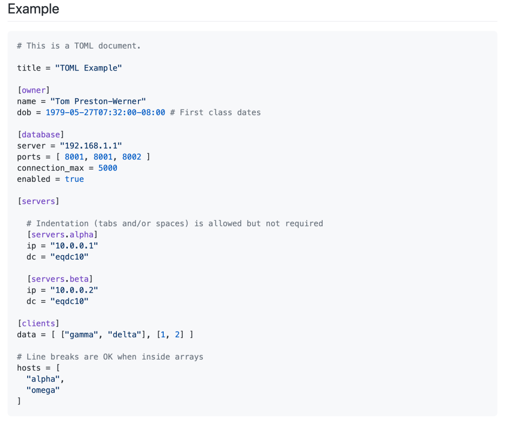

Python 
<a name="UKh8d"></a>
### 配置文件的作用
在开发过程中，常常会用到一些固定参数或者是常量。对于这些较为固定且常用到的部分，往往会将其写到一个固定文件中，避免在不同的模块代码中重复出现从而保持核心代码整洁。<br />这个固定文件可以直接写成一个 `.py` 文件，例如 `settings.py` 或 `config.py`，这样的好处就是能够在同一工程下直接通过 `import` 来导入当中的部分；但如果需要在其他**非 Python 的平台**进行配置文件共享时，写成单个 `.py` 就不是一个很好的选择。这时就应该选择通用的配置文件类型来作为存储这些固定的部分。目前常用且流行的配置文件格式类型主要有 `ini`、`json`、`toml`、`yaml`、`xml` 等，这些类型的配置文件都可以通过标准库或第三方库来进行解析。
<a name="k0nPD"></a>
### ini
`ini` 即 Initialize 初始化之意，早期是在 Windows 上配置文件的存储格式。`ini` 文件的写法通俗易懂，往往比较简单，通常由节（Section）、键（key）和值（value）组成，就像以下形式：
```diff
[localdb]
host     = 127.0.0.1
user     = root
password = 123456
port     = 3306
database = mysql
```
Python 本身内置的 `configparser` 标准库，直接就可以用来对 `ini` 文件进行解析。将上述内容保存在一个名为 `db.ini` 的文件中，然后使用 `read()` 方法来进行解析和读取，最后通过 `items()` 方法来获取指定节点下的所有键值对。
```python
>>> from configparser import ConfigParser
>>> cfg = ConfigParser()
>>> cfg.read("/Users/Bobot/db.ini")
['/Users/Bobot/db.ini']
>>> cfg.items("localdb")
[('host', '127.0.0.1'), ('user', 'root'), ('password', '123456'), ('port', '3306'), ('database', 'mysql')]
```
需要注意的是，`configparser` 默认将值**以字符串的形式**呈现，所以这也就是为什么在 `db.ini` 文件中没有加引号而是直接将字面量写在上面的原因。<br />获取到键值对后，其实直接就将其转换成字典，然后通过解包的方式进行穿参，保持代码简洁：
```python
#!pip install pymysql
import pymysql
from configparser import ConfigParser
cfg = ConfigParser()
cfg.read("/Users/Bobot/db.ini")
db_cfg = dict(cfg.items("localdb"))
con = pymysql.connect(**db_cfg)
```
<a name="6KVf6"></a>
### json
`json` 格式可以说是常见的一种文件形式了，也是目前在互联网较为流行的一种数据交换格式。除此之外，`json` 有时也是配置文件的一种。<br />比如 `npm`（JavaScript 包管理工具类似 Python 的 `pip`）、以及微软出品的目前被广泛使用的 VSCode 编辑器，都使用 `json` 编写配置参数。<br />和 `configparser` 一样，Python 也内置了 `json` 标准库，可以通过 `load()` 和 `loads()` 方法来导入文件式和字符串的 `json` 内容。
```json
{
    "localdb":{
        "host": "127.0.0.1",
        "user": "root",
        "password": "123456",
        "port": 3306,
        "database": "mysql"
    }
}
```
将上述内容保存为 `db.json` 后进行读取和解析，`json` 库读取 json 文件相对简单容易，而且很容易解析成 Python 的字典对象。
```python
>>> import json
>>> from pprint import pprint
>>> 
>>> with open('/Users/Bobot/db.json') as j:
...     cfg = json.load(j)['localdb']
... 
>>> pprint(cfg)
{'database': 'mysql',
 'host': '127.0.0.1',
 'password': '123456',
 'port': 3306,
 'user': 'root'}
```
使用 `json` 文件配置的缺点就是语法标准严格限制，为人所诟病之一的就是**无法在当中写注释**，除非采取 `json` 类型的其他**超集**作为替代方案（VSCode 中能写注释的 `json` 参数配置文件便是代替方案的一种）；同时存在**嵌套过深**的问题，容易导致出错，不宜用来写过长或复杂的参数配置信息。
<a name="toml"></a>
### toml
`toml` 格式（或 `tml` 格式）是 Github 联合创始人 Tom Preston-Werner 所提出的一种配置文件格式。根据维基百科的资料，`toml` 最开始提出时是在 2013年7月份，距今已有七年时间；它在某些方面也与后面要谈到的 `yaml` 文件有些类似，但如果知道 yaml 的规范有几十页（没有错，真的就是几十页……）的时候，可能真的就不太愿意去写那么复杂的配置文件，`toml` 格式则倒是个不错的选择。<br />`toml` 格式大致如下：<br /><br />从这里可以看出 `toml` 有点类似于前面所讲的 `ini` 文件。但是它比 `ini` 扩展了更多的内容。<br />在样例图片中可以看到，除了基本的字符串以外，例如时间戳、布尔值、数组等都进一步支持，而且样式和 Python 的原生写法十分类似。<br />当然这里不会过多介绍 `toml` 格式的一些规范说明，有人已经对官方的规范文档进行了翻译，有兴趣的朋友可以直接查阅。<br />这么契合 Python 方式的配置文件类型已经有开发者造出了相应的「轮子」，目前在 Github 上 Stars 数最多的是则 `uiri/toml` 的版本，不过该版本仅通过了 v0.5 版本 `toml` 规范，但在使用上还是蛮简洁的，可以通过 `pip` 命令进行安装
```bash
pip install toml
```
该库的解析方式很简单，也有点类似于 `json` 库的解析用法，即通过`load()` 或 `loads()` 来进行解析；同理转换并导出也是同样类似的用法。<br />比如现在将以下内容写入到 `config.toml` 中：
```python
[mysql]
host     = "127.0.0.1"
user     = "root"
port     = 3306
database = "test"
[mysql.parameters]
pool_size = 5
charset   = "utf8"
[mysql.fields]
pandas_cols = [ "id", "name", "age", "date"]
```
紧接着就可以通过 `toml` 库中的 `load()` 方法来进行读取：
```python
>>> import toml
>>> import os
>>> from pprint import pprint
>>> cfg = toml.load(os.path.expanduser("~/Desktop/config.toml"))
>>> pprint(cfg)
{'mysql': {'database': 'test',
           'fields': {'pandas_cols': ['id', 'name', 'age', 'date']},
           'host': '127.0.0.1',
           'parameters': {'charset': 'utf8', 'pool_size': 5},
           'port': 3306,
           'user': 'root'}}
```
可以看到 `toml` 文件被间接地转化成了字典类型，当然这也就是 `json` 版的写法（将单引号替换成双引号即可），方便后续调用或者传参。
<a name="rkCB5"></a>
### yaml
`yaml` 格式（或 `yml` 格式）是目前较为流行的一种配置文件，它早在 2001 由一个名为 Clark Evans 的人提出；同时它也是目前被广泛使用的配置文件类型，典型的就是 Docker 容器里的 `docker-compose.yml` 配置文件，如果经常使用 Docker 进行部署的人对此不会陌生。<br />`yaml` 文件的设计从 Python、XML 等地方获取灵感，所以在使用时能很清楚地看到这些部分的影子。 `yaml` 的规范内容可以说是冗长和复杂。<br />YAML 官方早已经提供了相应的 Python 库进行支持，即 `PyYAML`；当然也同样需要事先进行安装：
```bash
pip install pyyaml
```
同 `json` 库和 `toml` 库一样，通过 `load()` 方法来进行加载。<br />需要注意的是，使用 `load()` 方法**会存在一定的安全隐患**，如果加载了未知或不信任的 `yaml` 文件，那么有可能会存在被攻击的风险和网络安全隐患，因为它能够直接调用相应的 Python 函数来执行为攻击者所需要的命令，比如说在 `yaml` 文件中写入这么一段：
```yaml
# 使用Linux和macOS的朋友不要轻易尝试
!!python/object/apply:os.system ["rm -rf /"]
```
因此最好是使用 `safe_load()` 来代替 `load()` 方法。<br />这和 Python 内置的 `string` 标准库中 `Template` 类的 `substitute()` 模板方法一样存在着同样的安全隐患，所以使用 `safe_substitute()` 来替代是一样的道理。<br />如现在将之前的一些配置信息写入 `config.yaml` 文件中：
```yaml
mysql:
  host: "127.0.0.1"
  port: 3306
  user: "root"
  password: "123456"
  database: "test"
  parameter:
    pool_size: 5
    charset: "utf8"
  fields:
    pandas_cols: 
      - id
      - name
      - age
      - date
```
然后通过 `safe_load()` 方法进行解析：
```python
>>> import os
>>> from pprint import pprint
>>> 
>>> with open(os.path.expanduser("~/config.yaml"), "r") as config:
...     cfg = yaml.safe_load(config)
... 
>>> pprint(cfg)
{'mysql': {'database': 'test',
           'fields': {'pandas_cols': ['id', 'name', 'age', 'date']},
           'host': '127.0.0.1',
           'parameter': {'charset': 'utf8', 'pool_size': 5},
           'password': '123456',
           'port': 3306,
           'user': 'root'}}
```
可以看到最后结果和前面的 `toml` 库的解析结果基本一致。
<a name="IBlQz"></a>
### 总结
列举了一些主流且常见的配置文件类型及其 Python 的读取方法，当中没有 `xml` 格式类型的内容。对于 `xml` 配置文件可能与 Java 系语言打交道的朋友遇见得会多一些，但 `xml` 文件的可读性实在是让人望而生畏；对 `xml` 文件不了解的朋友可以使用 Chrome 浏览器随便进入一个网站然后按下 F12 进入开发者后查看那密密麻麻的 html 元素便是 `.xml` 的缩影。<br />除了这些主流的配置文件类型之外，像一些 `.cfg`、`.properties` 等都可以作为配置文件，甚至和开头提到的那样，单独用一个 `.py` 文件来书写各类配置信息作为配置文件进行导入都是没问题，只是在跨语言共享时可能会有些障碍。<br />列举的配置文件类型其复杂性由上到下依次增加：`ini < json ≈ toml < yaml`，它们之间各有优劣，可以根据自己实际的需求和团队协作要求来具体选择。
