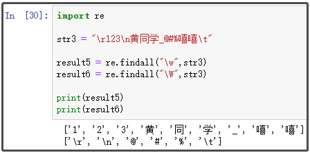

Python
<a name="Ov8oZ"></a>
## 7个普通元字符
首先介绍的是7个普通元字符，详细介绍如下图，它们在正则表达式中，都有着自己特殊的含义。<br />
<a name="qj4q0"></a>
### 1、`[ ]`符号
<br />**案例如下：**
```python
import re

str1 = "acb azb abb a6b aab"

result1 = re.findall("a[a-z]b",str1) ①
result2 = re.findall("a[0-9]b",str1) ②
result3 = re.findall("a[za6]b",str1) ③

print(result1)
print(result2)
print(result3)
```
结果如下：<br /><br />**代码解释：**不管是①②③，表示匹配开头是a，末尾是b。唯一不同的就是[ ]符号中匹配值不同。

- ①处表示中间的字符，只要是a-z字母中任何一个，都可以被匹配到。
- ②处表示中间的字符，只要是0-9数字中任何一个，都可以被匹配到。
- ③处表示中间的字符，只能是z或a或6这三者中任何一个，才能被匹配到。
<a name="tOnMk"></a>
### 2、`|`或运算符
<br />**案例如下：**
```python
import re

str2 = "我是孙悟空，您可以称呼我为齐天大圣！"

result1 = re.findall("孙悟空|齐天大圣",str2)

print(result1)
```
结果如下：<br /><br />**代码解释：**要么匹配孙悟空，要么匹配齐天大圣。
<a name="jUmMq"></a>
### 3、\转义字符
<br />**案例如下：**
```python
import re

str3 = "\n123456" ①
str4 = "\\n123456" ②
str5 = r"\n123456" ③

result3 = re.findall("n",str3)
result4 = re.findall("n",str4)
result5 = re.findall("n",str5)

print(result3)
print(result4)
print(result5)
```
结果如下：<br /><br />**代码解释：**观察①②③处的区别，分别注意`\`的个数和r的用法。

- ①处一个转义字符 + 字母n，是一个特殊整体`\n`，用于表示换行符，因此匹配不到n这个字母。
- ②处两个转义字符 + 字母n，其中\n是一个特殊整体，再加上一个转义符号`\`，就将其变为一个普通字母n，因此匹配到了n。
- ③处其实和②的含义一样，也可以将特殊整体`\n`，变为一个普通字母n，因此同样可以匹配到n。
<a name="LUFHQ"></a>
### 4、`^`和`$`符号
<br />**案例如下：**
```python
import re

str6 = "你来自哪里？我来自湖北省"

result7 = re.findall("^你",str6)
result8 = re.findall("^来",str6)

result9 = re.findall("省$",str6)
result10 = re.findall("湖北$",str6)

print(result7)
print(result8)
print(result9)
print(result10)
```
结果如下：<br /><br />**代码解释：**一个用于匹配开头，一个用于匹配结尾。只有开头或结尾与要匹配的值一致，才能被匹配到。
<a name="jIp3u"></a>
### 5、.*?符号
<br />**案例如下：**
```python
import re

str6 = "abcdaabb"

result10 = re.findall("a.b",str7) ①
result11 = re.findall("a*b",str7) ②
result12 = re.findall("a?b",str7) ③

result13 = re.findall("a.*b",str7) ④
result14 = re.findall("a.*?b",str7) ⑤

print(result10)
print(result11)
print(result12)
print(result13)
print(result14)
```
结果如下：<br /><br />**代码解释：**点号一般与*号和?号搭配使用。仔细观察①-⑤处的正则表达式，开头和结尾都是a、b，唯一不同的就是它们之间的符号。

- ①处点号表示匹配（除了换行符）任意单个字符。因此，只要开头是a，结尾是b，中间是任何一个单个字符，都会被匹配上。
- ②处*号表示匹配前面一个字符0或多次，在这里 * 号前面是a。因此，只要结尾是b，前面是>=0个a的值，都会被匹配上。
- ③处?号表示匹配前面一个字符最多一次，在这里 * 号前面是a。因此，前面是大于等于0、小于等于1个a的值，都会被匹配上。
- ④.*组合 ，称为“贪婪匹配”，是因为它会匹配到尽可能多的内容。原本开头是a，那么只要找到b，就是一个返回值。但是贪婪匹配不这样，它会一直朝后面走，直到找到最后一个b才肯罢休，然后返回一个超级长的字符串。
- ⑤.*?组合 ，称为“非贪婪匹配”，就是为了制止贪婪匹配而生的。它不贪得无厌，只要开头是a，你后面不是想要b吗，碰到第一个就给你返回了。
<a name="ZVVAi"></a>
### 6、( )符号
<br />**案例如下：**
```python
import re

str8 = "a321b木头人c"

result15 = re.findall("a(\d+)b([\u4e00-\u9fa5]+)c",str8)

print(result15)
```
结果如下：<br /><br />**代码解释：**`()`表示一个组，只要是()中的内容，最后都会被返回。
<a name="O3xbB"></a>
## 6个特殊字符
接着介绍的是6个常用字母，它们与转义符号搭配，有着自己独特的含义；<br />
<a name="mTC3t"></a>
### 1、`\d`与`\D`
<br />**案例如下：**
```python
import re

str1 = "123\n黄同学@#%嘻嘻\t"

result1 = re.findall("\d",str1)
result2 = re.findall("\D",str1)

print(result1)
print(result2)
```
结果如下：<br /><br />**代码解释：**`\d`仅匹配数字，`\D`用于匹配非数字，很好理解。
<a name="bEt8m"></a>
### 2、`\s`与`\S`
<br />**案例如下：**
```python
import re

str2 = "\r123\n黄同学@#%嘻嘻\t"

result3 = re.findall("\s",str2)
result4 = re.findall("\S",str2)

print(result3)
print(result4)
```
结果如下：<br /><br />**代码解释：**`\s`仅匹配空白字符，`\S`用于匹配非空白字符（这个更常用）。
<a name="EW8HP"></a>
### 3、`\w`与`\W`
<br />**案例如下：**
```python
import re

str3 = "\r123\n黄同学_@#%嘻嘻\t"

result5 = re.findall("\w",str3)
result6 = re.findall("\W",str3)

print(result5)
print(result6)
```
结果如下：<br /><br />**代码解释：**`\w`相当于`[A-Za-Z0-9_]`，超好用（值得注意），`\W`匹配非单词字符，了解即可。
