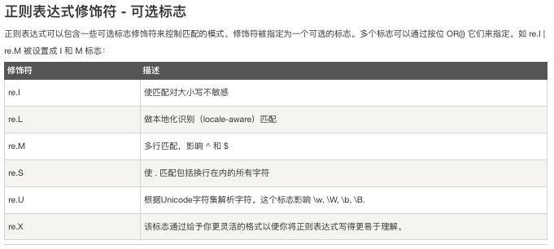

Python<br />
<a name="VA6dE"></a>
## 什么是正则表达式修饰符？
正则表达式可以包含一些可选标志修饰符来控制匹配的模式。<br />修饰符被指定为一个**「可选的标志」**。<br />本文将使用 **「概念」** + **「Python代码」** 的方式说明几个经常使用修饰符，保证比runoob上更易食用。
<a name="J5nzz"></a>
## `re.I` (忽略大小写标志)
<a name="ci4bm"></a>
### 概念
`re.I`：忽略大小写标志。当使用该标志时，正则表达式匹配时将不区分大小写。
<a name="vUCTz"></a>
### 例子
假设要查找一个字符串中是否包含"hello"这个单词，但是不想区分大小写，可以使用以下代码：
```python
import re
text = "Hello, World!"
pattern = r"hello"
matches = re.findall(pattern, text, re.I)
print(matches)
```
输出结果为：
```
['Hello']
```
由于使用了`re.I`标志，正则表达式中的"h"和"e"可以匹配字符串中的"H"和"e"，因此可以匹配到"Hello"。
<a name="VTcwq"></a>
## `re.M` (多行标志)
<a name="FKDBE"></a>
### 概念
`re.M`：多行标志。当使用该标志时，正则表达式中的^和$将分别匹配行的开头和结尾，而不是整个字符串的开头和结尾。
<a name="KXbEv"></a>
### 例子
假设有以下多行文本：
```python
# text = "line 1\nline 2\nline 3"
# 想要匹配其中以"line"开头的行，可以使用以下代码：

import re
pattern = r"^line.*"
matches = re.findall(pattern, text, re.M)
print(matches)
```
输出结果为：
```
['line 1', 'line 2', 'line 3']
```
由于使用了`re.M`标志，正则表达式中的"`^`"可以匹配行的开头，因此可以匹配到以"line"开头的行。
<a name="DFu6H"></a>
## `re.X` (详细模式标志)
<a name="lRHpf"></a>
### 概念
re.X：详细模式标志。当使用该标志时，正则表达式可以包含注释和空白符，这些注释和空白符将被忽略掉，从而使正则表达式更易于阅读和维护。<br />假设有以下复杂的正则表达式：
```python
pattern = r"(?P<first_name>[A-Za-z]+)\s+(?P<last_name>[A-Za-z]+)\s*,\s*(?P<age>\d+)\s*,\s*(?P<email>[A-Za-z0-9._%+-]+@[A-Za-z0-9.-]+\.[A-Za-z]{2,})"
```
该正则表达式用于匹配一个包含姓名、年龄和电子邮件地址的字符串，并将每个匹配的部分分别命名为"first_name"、"last_name"、"age"和"email"。 由于该正则表达式比较长且包含注释，可以使用`re.X`标志来使其更易于阅读和维护，代码如下：
```python
import re
pattern = r"""
    (?P<first_name>[A-Za-z]+)  # 匹配名字
    \s+                       # 匹配一个或多个空格
    (?P<last_name>[A-Za-z]+)   # 匹配姓氏
    \s*,\s*                   # 匹配一个逗号和零个或多个空格
    (?P<age>\d+)              # 匹配年龄
    \s*,\s*                   # 匹配一个逗号和零个或多个空格
    (?P<email>[A-Za-z0-9._%+-]+@[A-Za-z0-9.-]+\.[A-Za-z]{2,})  # 匹配电子邮件地址
"""
text = "John Doe, 30, john.doe@example.com\nJane Smith, 25, jane.smith@example.com"
matches = re.findall(pattern, text, re.X)
print(matches)
```
输出结果为：
```
[('John', 'Doe', '30', 'john.doe@example.com'), ('Jane', 'Smith', '25', 'jane.smith@example.com')]
```
<a name="S7X8X"></a>
## `re.U` (Unicode标志)
<a name="DemRu"></a>
### 概念
`re.U`：Unicode标志。当使用该标志时，正则表达式将使用Unicode字符集来匹配文本。
<a name="mpvM4"></a>
### 例子
假设有以下字符串：
```python
text = "你好，世界！"
# 想要匹配其中的中文字符，可以使用以下代码：

import re
pattern = r"[\u4e00-\u9fa5]"
matches = re.findall(pattern, text, re.U)
print(matches)
```
输出结果为：
```
['你', '好', '世', '界']
```
由于使用了`re.U`标志，正则表达式中的"\u4e00"和"\u9fa5"可以匹配Unicode编码中的中文字符范围，因此可以匹配到字符串中的中文字符。
<a name="cFaaw"></a>
## `re.S` (点任意匹配标志)
<a name="EaaEM"></a>
### 概念
`re.S`："dot-all"标志，也被称为"single-line"标志。<br />当使用该标志时，点字符"."可以匹配包括换行符在内的任何字符。
<a name="YyB1J"></a>
### 例子
假设有以下字符串：
```
text = "line 1\nline 2\nline 3"
```
想要匹配其中的所有行，可以使用以下代码：
```python
import re

text = "line 1\nline 2\nline 3"
pattern = r".*"
matches = re.findall(pattern, text, re.S)
print(matches)
```
输出结果为：
```
['line 1\nline 2\nline 3', '']
```
由于使用了`re.S`标志，正则表达式中的"`.`"可以匹配任何字符（包括换行符），因此可以匹配到所有的行。<br />注意输出结果中的空字符串，这是因为正则表达式最后的"`.`*"也匹配了输入字符串末尾的换行符。
<a name="Qb6Lh"></a>
## `re.A` (ASCII标志)
<a name="noki3"></a>
### 概念
`re.A`：强制使用ASCII字符集，即将正则表达式中的特殊字符仅作为ASCII字符解释。
<a name="RZMC1"></a>
### 例子
假设有以下字符串：
```
text = "Hello, world!"
```
想要匹配其中的字母和空格，可以使用以下代码：
```python
import re

text = "Hello, world!"
pattern = r"[a-z\s]"
matches = re.findall(pattern, text, re.A)
print(matches)
```
输出结果为：
```
['e', 'l', 'l', 'o', ' ', 'w', 'o', 'r', 'l', 'd']
```
由于使用了`re.A`标志，正则表达式中的"`[a-z\s]`"只能匹配ASCII字符集中的字母和空格，因此只能匹配到字符串中的字母和空格。
