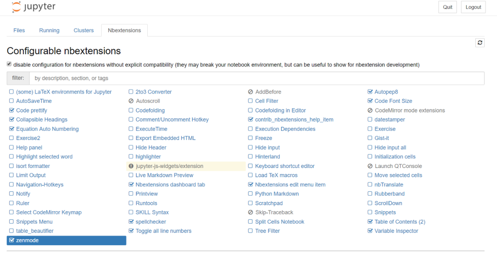
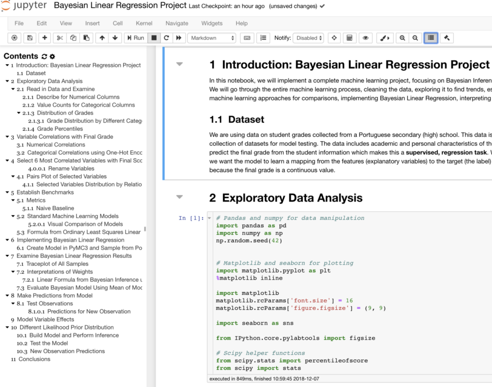
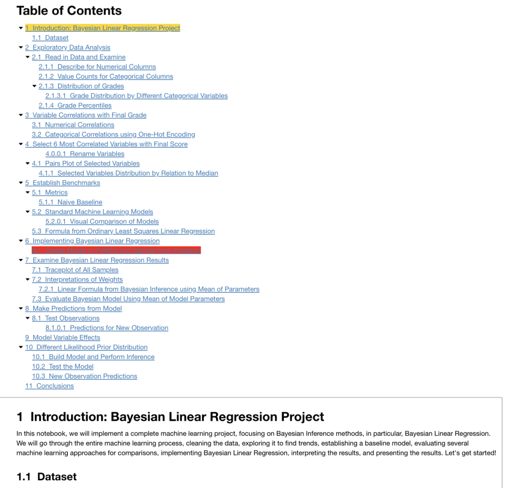
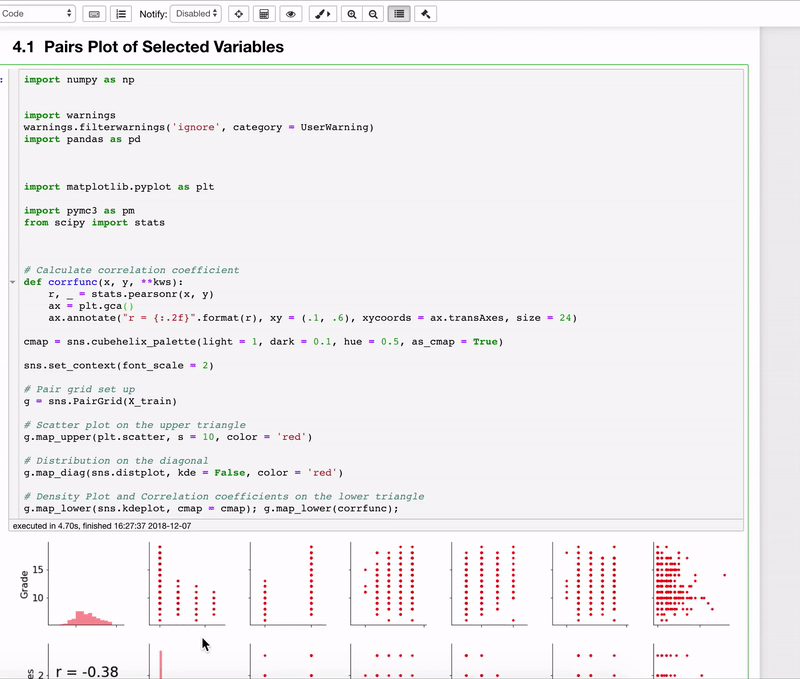
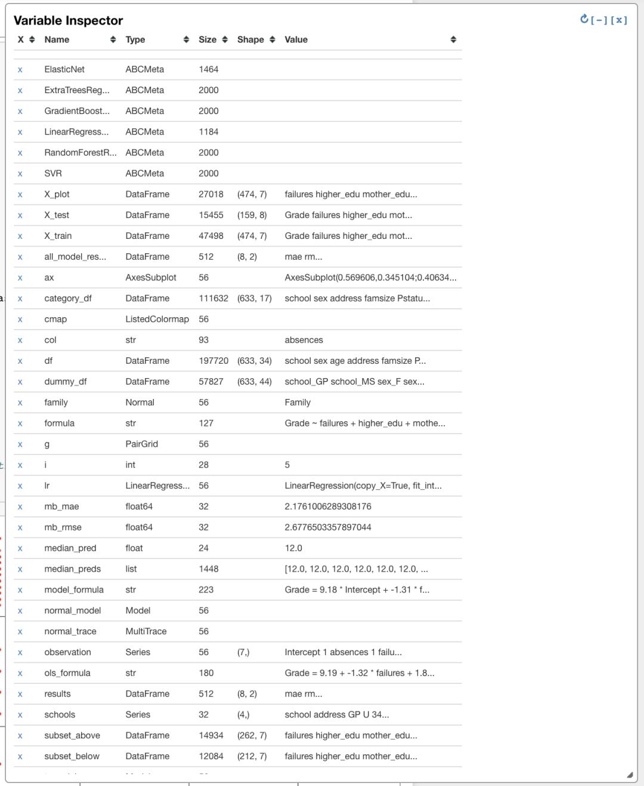
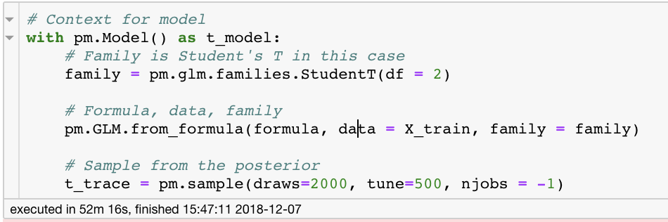
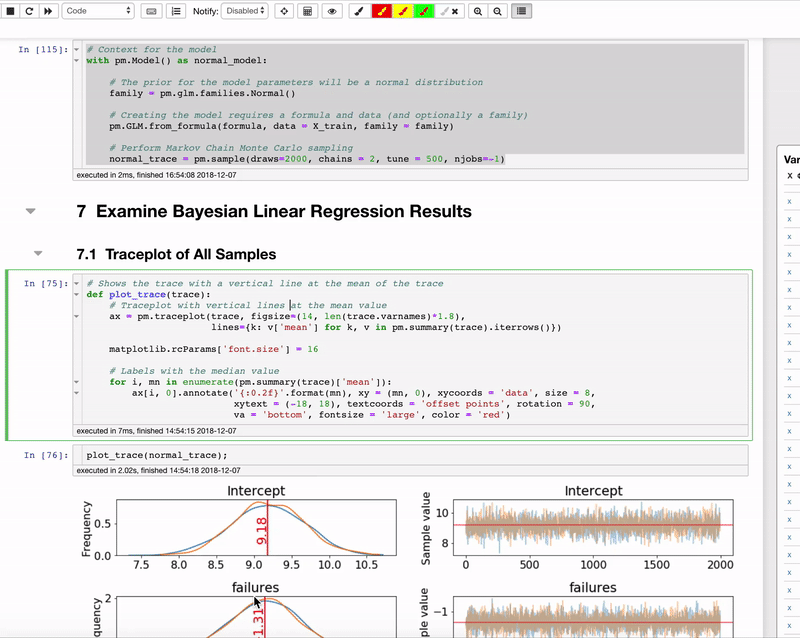

Python Jupyter Notebook<br />Jupyter Notebook 是一个很棒的教学、探索和编程环境，但其功能不足也是出了名的。幸好，有许多方法可以改进这个不错的工具，如 Jupyter Notebook 扩展工具。
<a name="Lo2gg"></a>
## 极简版教程
在命令提示符中运行以下命令：
```bash
pip install jupyter_contrib_nbextensions && jupyter contrib nbextension install
```
启动 Jupyter Notebook，并导航至新的 Nbextensions 选项卡：<br />
<a name="QBSVf"></a>
### Jupyter Notebook 扩展选项
选择想要的扩展功能，享受它带来的优势。<br />（如果没看到扩展选项，打开 notebook，单击「edit」，然后点「nbextensions config」）<br />在 notebook 的工具栏里可以看到扩展插件：<br />
<a name="pgilm"></a>
## 较长版教程
如果觉得上面的教程太简单，可以看看下面的复杂版。
<a name="nu2ZQ"></a>
### 什么是 notebook 扩展插件？
Jupyter Notebook 扩展插件是扩展 notebook 环境基本功能的简单插件。它们用 JavaScript 语言编写，会自动套用代码格式或者在单元格完成后发送浏览器通知。扩展插件目前仅支持 Jupyter Notebook（不支持 Jupyter Lab）。<br />为什么要使用扩展插件？Jupyter Notebook 是一个很好用的工具，可用于教学、学习、原型设计、探索和尝试新方法（甚至可用于 Netflix 的生产过程中）。但是，原版 notebook 功能有限，有时令人挫败。虽然 Jupyter Notebook 扩展插件没有完全解决这个问题，但它们确实能让工作变得更轻松。
<a name="nh9c2"></a>
### 该用哪些扩展插件？
以下是最常用的五种 Jupyter Notebook 扩展插件：
<a name="RG19j"></a>
## 1、Table of Contents
<a name="uOkzu"></a>
### 更容易导航
如果在一个 Jupyter Notebook 中同时开启了十几个单元格，那跟踪所有单元格就会有些困难。Table of Contents 通过添加 TOC 链接解决了这个问题，通过 TOC 链接可以定位到页面中的任何位置。<br />
<a name="siQLT"></a>
### Table of Contents 界面
还可以使用该扩展插件在 notebook 的顶部添加一个链接目录。这样会显示选择了哪一个目录以及哪一个正在运行：<br />
<a name="buUTb"></a>
## 2、Autopep8
<a name="UJRt2"></a>
### 轻轻一击就能获得简洁代码
都应该编写符合 pep8 标准的代码，但有时会陷入分析，难以坚持这种标准。所以当写完代码后，只要单击这个选项，就可以让代码变得简洁漂亮。<br /><br />这个插件可以称得上是最好的插件了，仅需点击一下，就能完成一项耗时又乏味的工作，可以专注于思考。
<a name="k3G65"></a>
## 3、variable inspector
<a name="lOB9M"></a>
### 跟踪工作空间
variable inspector 会显示在 notebook 中创建的所有变量的名称，以及它们的类型、大小、形状和值。<br /><br />这个工具对于从 RStudio 迁移过来的数据科学家来说是无价之宝。如果不想继续打印 df.shape 或无法重新调用 x 的 type，这个工具同样重要。
<a name="ng5Ft"></a>
## 4、ExecuteTime：显示单元格的耗时
经常不知道某个单元格需要运行多久或者最后一次运行一个打开好几天的 notebook 是什么时候。ExecuteTime 完美解决这个问题，它会显示单元格的运行完成时间和所耗时长。<br /><br />的确有更好的计时方法，如 %%timeit，但 ExecuteTime 易于实现，且可以覆盖 notebook 中的所有单元格。
<a name="tajMb"></a>
## 5、隐藏代码输入
<a name="XYcri"></a>
### 隐藏过程，展示结果
虽然有些人喜欢看到某项艰苦工作的具体分析，但有些人却只想看到结果。隐藏所有输入的插件能够立即隐藏 notebook 中的所有代码，只保留结果。<br /><br />下一次如果有人说他们只想看结果，只要单击一下就可以了。（不过还是得经常检查代码。）<br />以上是最常用的五种扩展插件，还可以尝试其他扩展插件。
<a name="QyFkI"></a>
## 结论
安装 Jupyter Notebook 扩展插件，花点时间弄清楚哪些有用，然后提高自己的工作效率。虽然这些功能不至于改变人生，但它们带来的益处也是值得的。而且累积起来节约了很多宝贵的开发时间。
