PythonJupyter Notebook<br />分享一个Jupyter Notebook插件**visualpython**：

- 通过界面拖拽生成Python代码，以最少的编码技能即可把玩爬虫、数据分析、AI等；
- 面向非专业程序员，减少学习编码技能的时间；
- 轻松保存和重用代码。

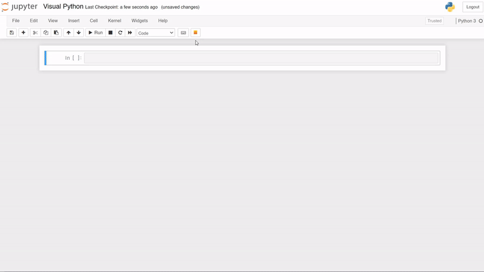

---

<a name="vkAGI"></a>
### 1、安装
在终端操作，输入以下命令行，安装visualpython
```bash
pip install visualpython
```
<a name="gYv9e"></a>
### 2、激活
在终端操作，输入以下命令行，激活visualpython
```bash
visualpy install
```
打开jupyter notebook，出现图中**橙色按钮**表示安装成功～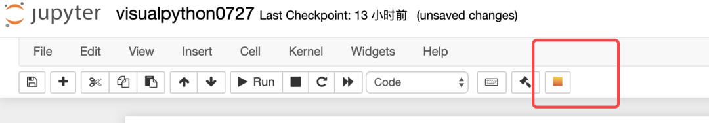
<a name="inSw3"></a>
### 3、主界面介绍
单击橙色按钮出现下面**visualpython主界面**，功能还是很强大的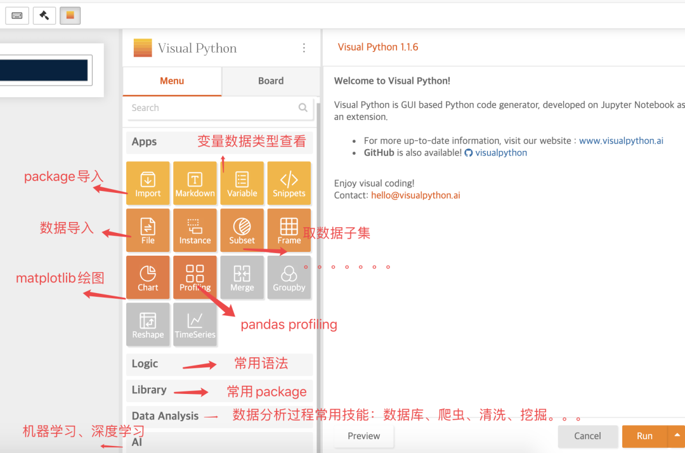仔细看看<br />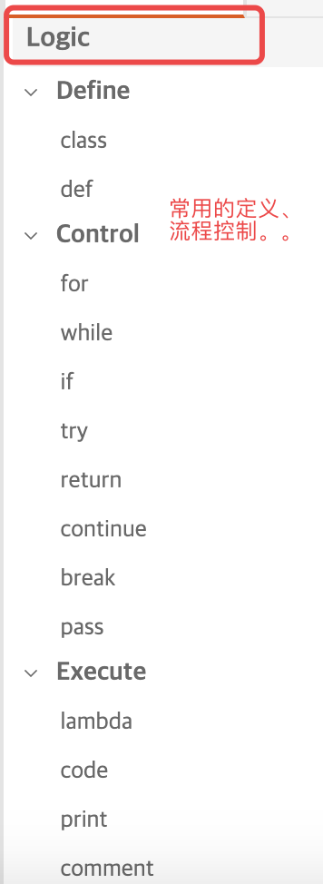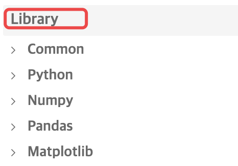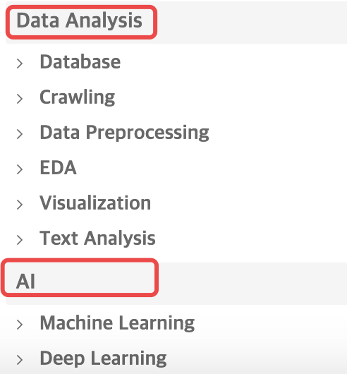
<a name="I52a2"></a>
### 4、简单把玩一番
<a name="dMYgh"></a>
#### 导入常用package
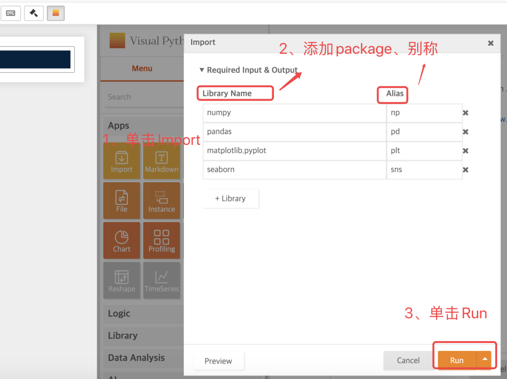
<a name="ebgoR"></a>
#### 导入数据集
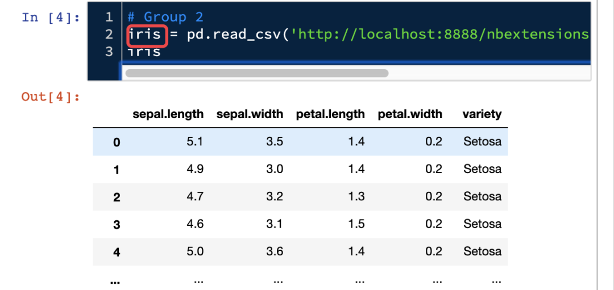
<a name="a8FeA"></a>
#### pandas_profiling快速探索数据
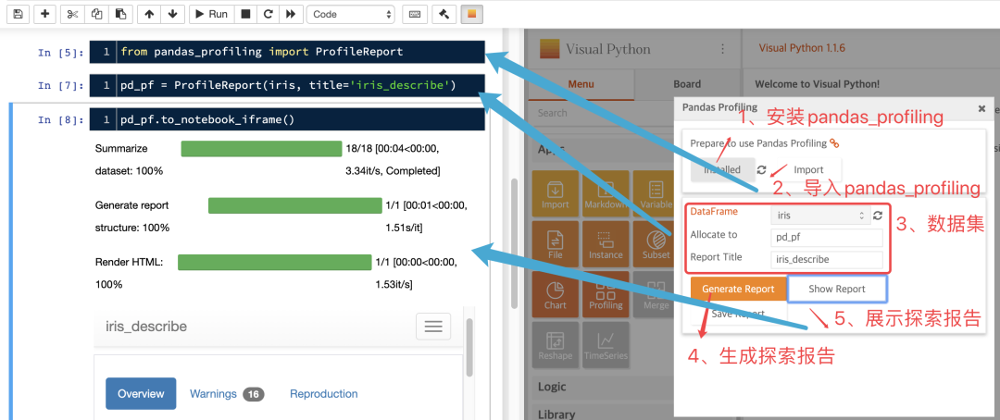生成的详细探索报告：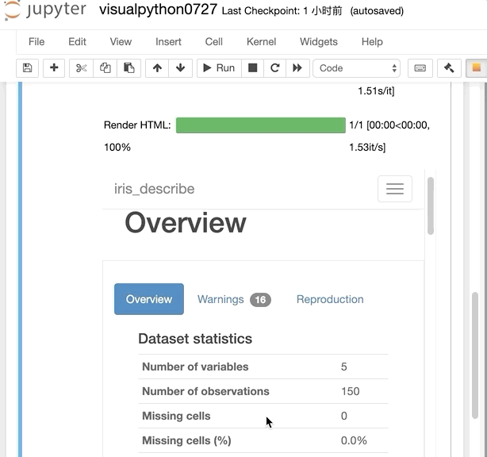
<a name="WSvfQ"></a>
#### 数据可视化-使用matplotlib
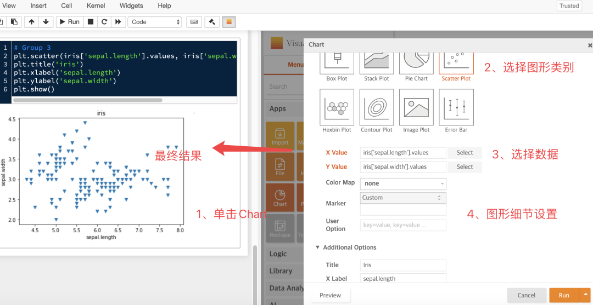
<a name="j3i3n"></a>
#### 数据可视化-使用pandas
感兴趣的同学可以自行玩一玩。<br />GitHub：[https://github.com/visualpython/visualpython](https://github.com/visualpython/visualpython)
