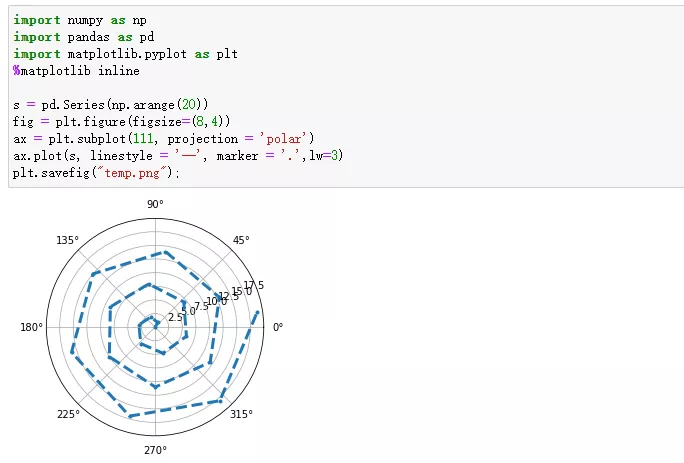
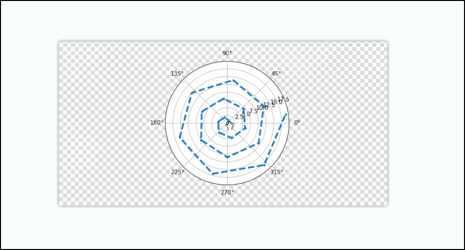
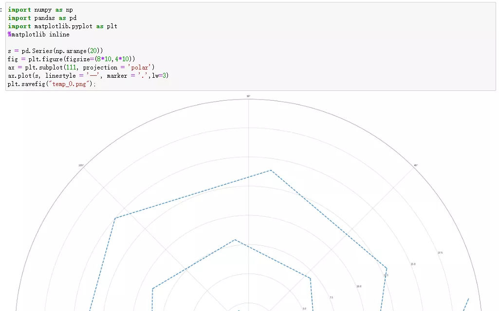
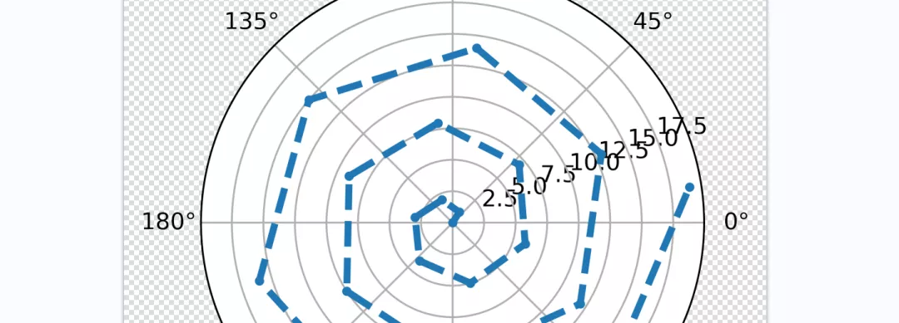
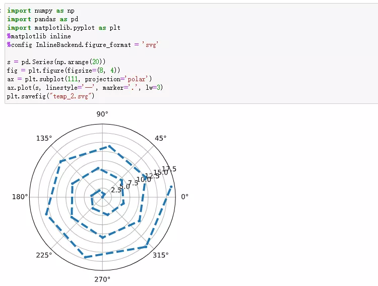
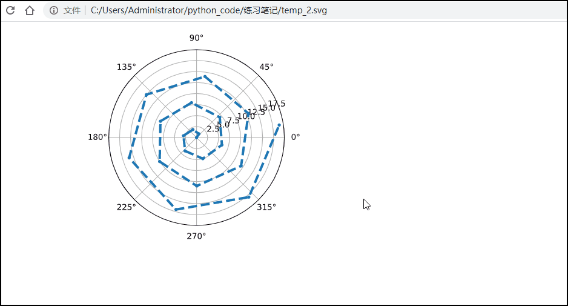

Python Jupyter NoteBook<br />先举个小例子，用 Matplotlib 绘制极坐标图：
```python
import numpy as np
import pandas as pd
import matplotlib.pyplot as plt
%matplotlib inline

s = pd.Series(np.arange(20))
fig = plt.figure(figsize=(8, 4))
ax = plt.subplot(111, projection='polar')
ax.plot(s, linestyle='--', marker='.', lw=3)
plt.savefig("temp.png")
```
<br />打开保存到当前工作目录里的temp.png，放大之后就会发现确实“像素略渣”<br /><br />修改图像像素尺寸不就行了。<br />确实可以，不过要记得同时修改所有的像素尺寸，而不是只改图像大小，否则就会像下面一样👇<br /><br />可以在保存图像时，增加一些参数。<br />比如`dpi`就是分辨率，每英寸的点数。
```python
s = pd.Series(np.arange(20))
fig = plt.figure(figsize=(8, 4))
ax = plt.subplot(111, projection='polar')
ax.plot(s, linestyle='--', marker='.', lw=3)
plt.savefig("temp_1.png", dpi=500, bbox_inches='tight')
```
另一个参数`bbox_inches`：只有图形给定部分会被保存。设置为“tight”用以恰当的匹配所保存的图形。<br />这样生成的图像就足够高清了。<br /><br />想让图像高清，还有另外一种方法。<br />比如`%matplotlib inline` 可以在Ipython编译器里直接使用，功能是可以内嵌绘图，并且可以省略掉`plt.show()`这一步。<br />可以再增加一行配置，就能让 Matplotlib 在 Jupyter Notebook 上面输出高清矢量图了。
```python
%config InlineBackend.figure_format = 'svg'
```
输出的格式是svg，这样浏览器就可以渲染出矢量图了。<br /><br />更改保存格式，就得到了高清的矢量图。<br /><br />第二种方法使用了Jupyter notebook 中的魔法命令，可以设定显示图片的分辨率。<br />同样的参数设置还有：
```python
%config InlineBackend.figure_format = "png"

%config InlineBackend.figure_format = "svg"

%config InlineBackend.figure_format = "retina"
```
在分辨率较高的屏幕（例如 Retina 显示屏）上，Jupyter Notebook 中的默认图像可能会显得模糊。<br />可以在 `%matplotlib inline` 之后使用`%config InlineBackend.figure_format = "retina"`来呈现分辨率较高的图像。
