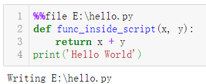
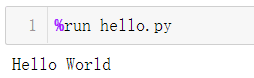
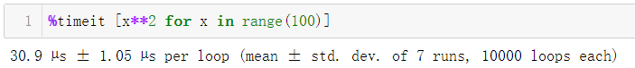
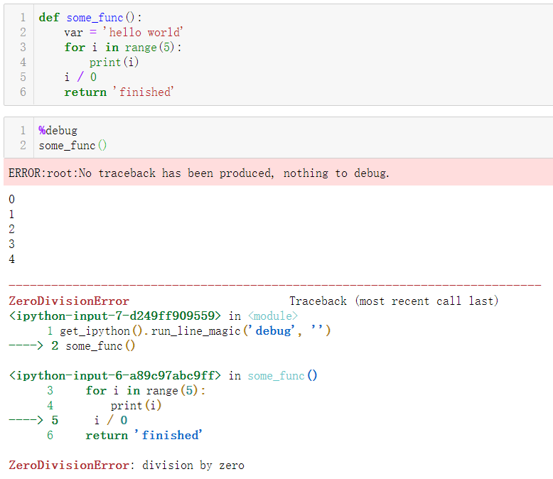

Jupyter notebook<br />Jupyter notebook是一个交互式的Python shell，也就是IPython的封装版，非常适合用来进行数据分析和机器学习。<br />Jupyter notebook中有很多实用且鲜为人知的功能，可以实现有趣的操作，这次举5个简单的例子。
<a name="RxosW"></a>
## **1、脚本代码写入本地文件**
`%%file`方法可以将脚本代码写入本地Py文件。
```python
%%file E:\hello.py
def func_inside_script(x, y):
    return x + y
print('Hello World')
```

<a name="OabgS"></a>

## **2、执行Py文件**
在notebook中可以直接执行Py文件，通过%run方法来实现。
```python
%run hello.py
```

<a name="NImns"></a>

## **3、监测代码运行时间**
如果代码需要精确的时间控制，那么`%timeit`方法可以起作用。
```python
%timeit [x**2 for x in range(100)] 
```


## **4、使用系统命令行**
在windows中，使用命令行需要打开cmd窗口，如果使用notebook，则可以通过`!`方法轻松执行命令行代码。
```python
# 新建文件夹
my_dir = 'new_dir'
!mkdir $my_dir
```


## **5、快速debug**
bug是让人头疼的事，在notebook中可以轻松进行debug，使用`%debug`命令即可。
```python
def some_func():
	var = 'hello world'
	for i in range(5):
		print(i)
		i / 0
		return 'finished'
	
	%debug
some_func()
```
<br />Jupyter notebook中还有很多有趣的魔法命令，感兴趣可以多摸索下。
