Jypyter

### Jupyter Notebook 简介
Jupyter Notebook是编写和迭代Python代码进行数据分析的强大方式。Jupyter Notebook基于IPython构建，内核运行计算并与Jupyter Notebook前端接口通信。这张Jupyter Notebook速查表将帮助你找到著名的笔记本应用程序，这是Jupyter项目的一个子项目。 Jupyter Notebook是一个开源web应用程序，允许您创建和共享包含实时代码、方程式、可视化和叙述文本的文档。它用于数据清理和转换、数值模拟、统计建模、数据可视化、机器学习等。 本Jupyter Notebook 速查表是Jupyter Notebook中使用的工具栏和键盘快捷键的指南。 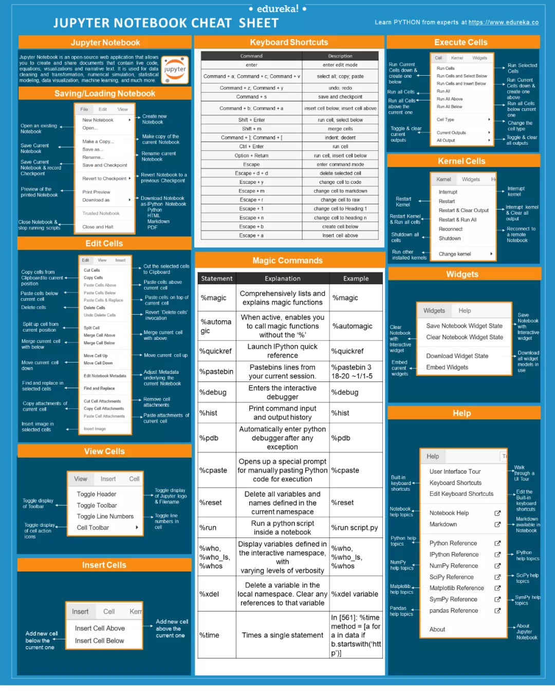

### 速查表主要内容

#### Saving/Loading Notebooks
从保存或加载JupyterNotebook开始 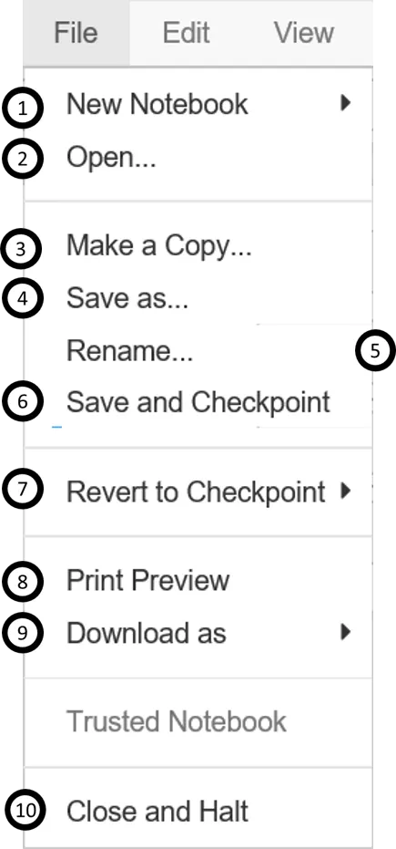

#### Keyboard Shortcuts
以下是运行Python内核的Jupyter笔记本最常用的键盘快捷键。此列表经常更改。检查笔记本中的“帮助->键盘快捷键”以获取最新的快捷键。 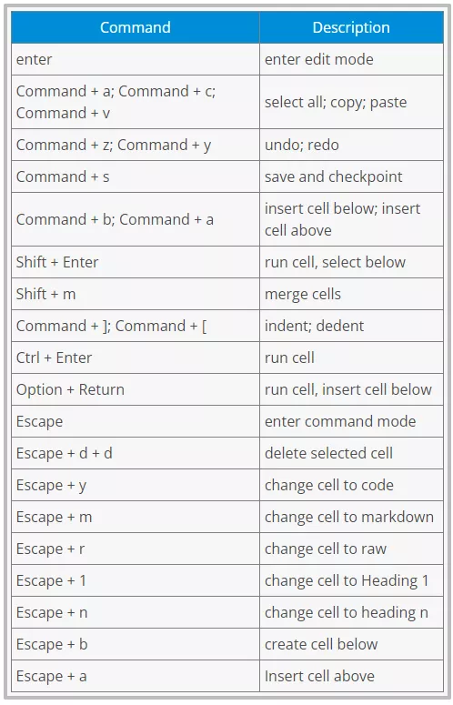

#### Edit Cells
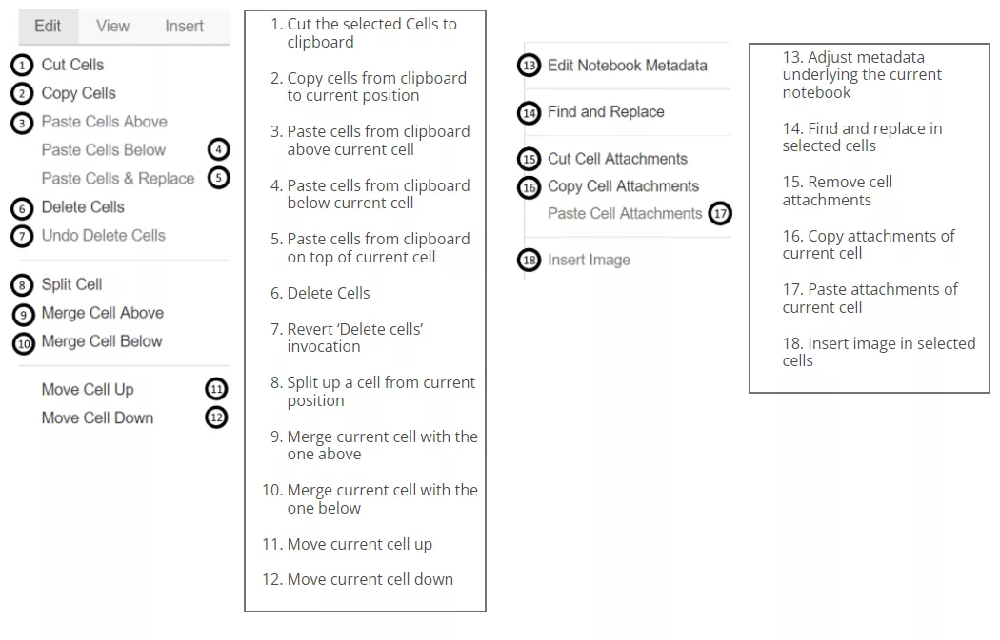

#### View Cells
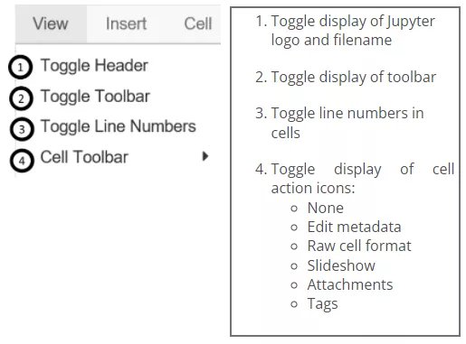

#### Insert Cells
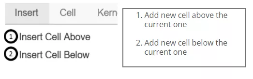

#### Execute Cells
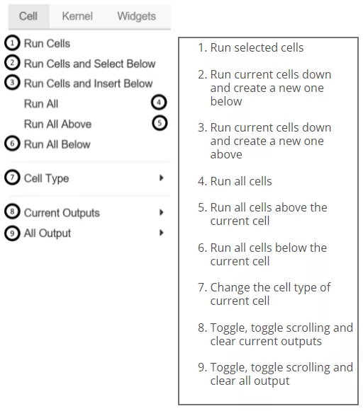

#### Working with Different Programming Languages
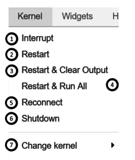

#### Widgets
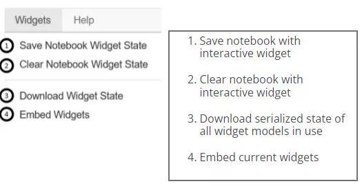

#### Magic Commands
以下是jupyter笔记本中常用的一些魔术命令。 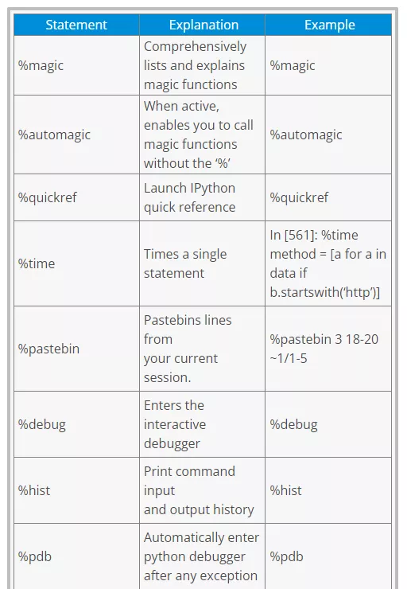 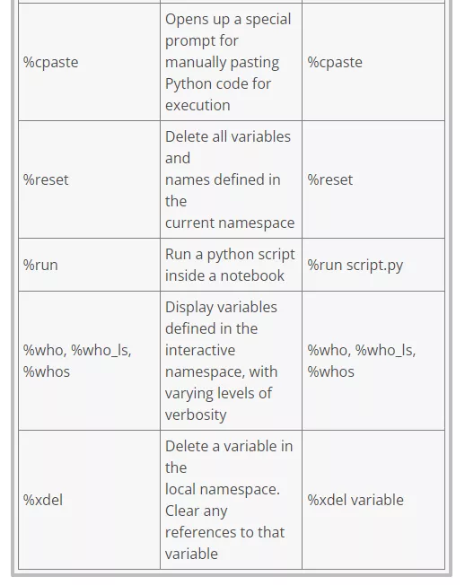 内核提供与笔记本电脑等前端接口的计算和通信。安装Jupyter笔记本将自动安装IPython内核。 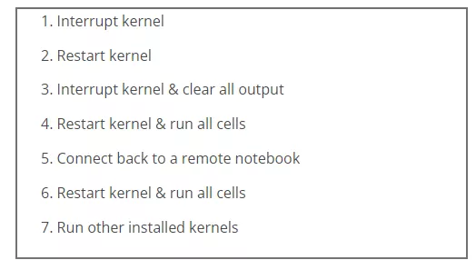

#### Help
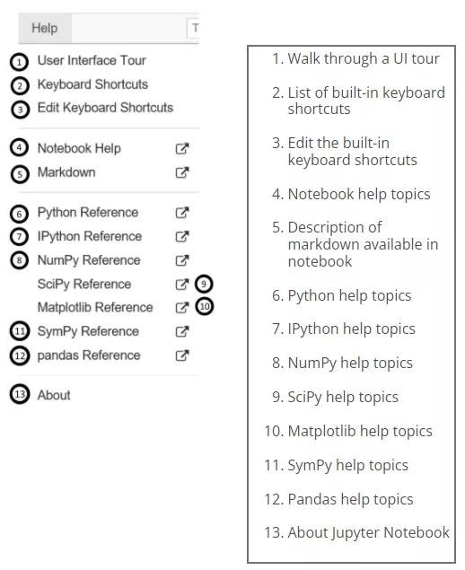
