Jupyter Jupyter Notebook 是基于网页的用于交互计算的应用程序。其可被应用于全过程计算：开发、文档编写、运行代码和展示结果。非常适合在学习的过程中边写代码边写文档，还能写公式~ 因此，快速掌握 Jupyter Notebook 的操作非常必要！首先放出这张速查表的整体面貌： 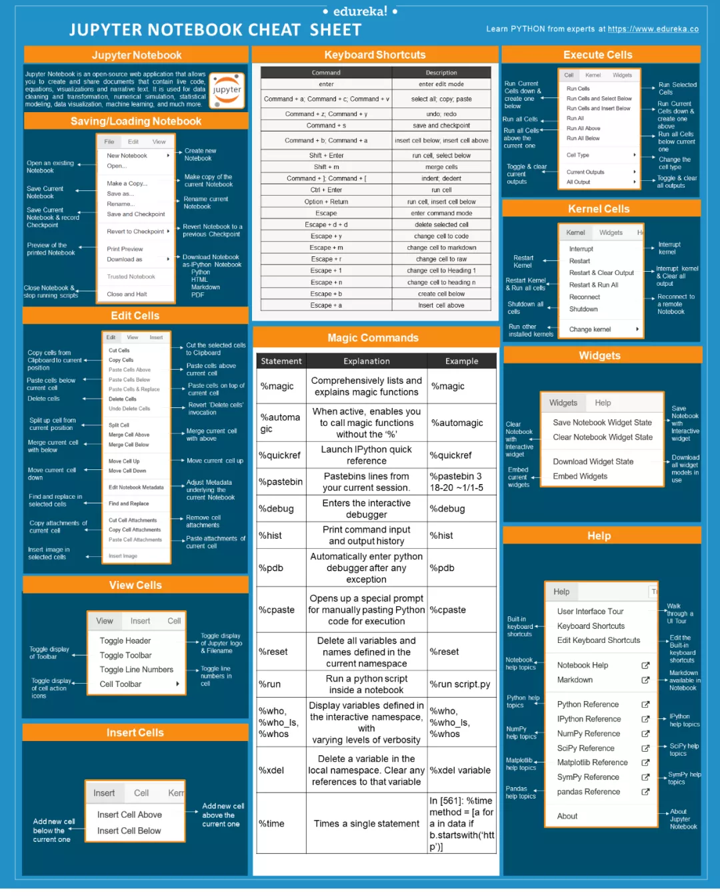

### 1、保存/导入Notebook
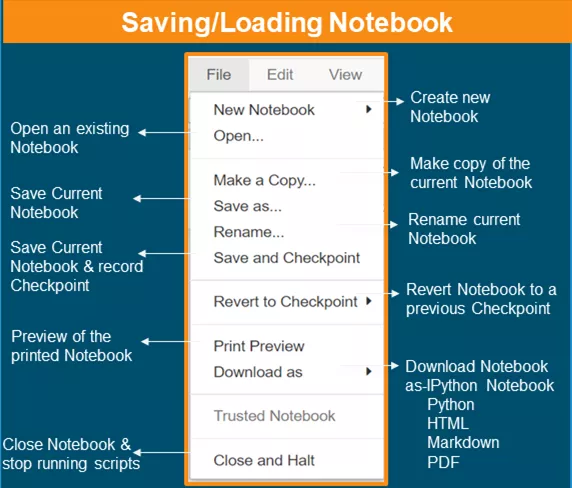

### 2、编辑单元格
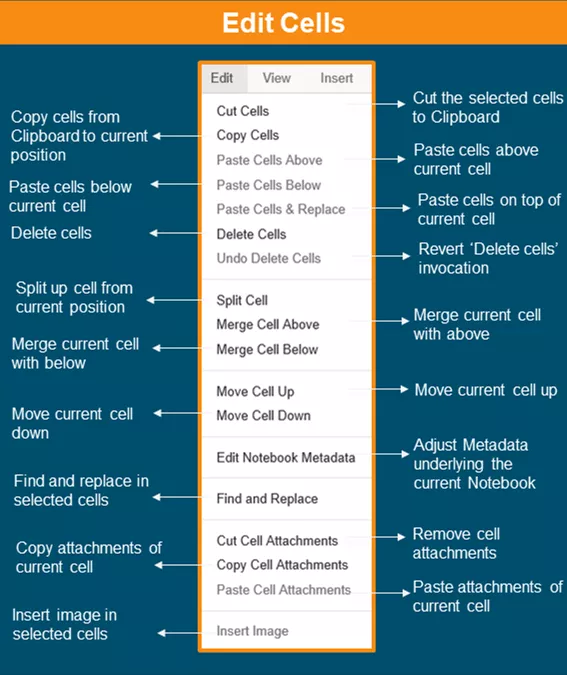

### 3、视图单元格
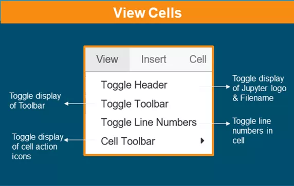

### 4、插入单元格
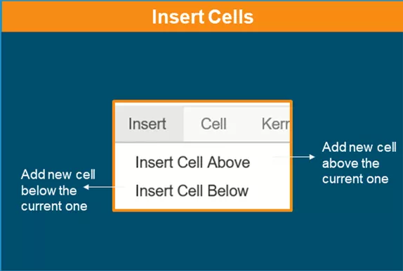

### 5、键盘快捷键
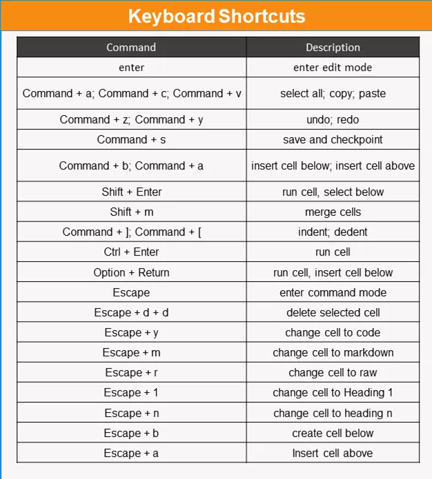 Jupyter Notebook 的快捷键经常用到，这部分是重点！

### 6、魔法命令
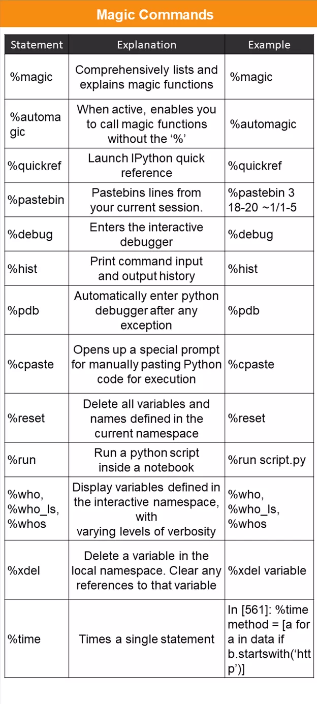

### 7、执行单元格
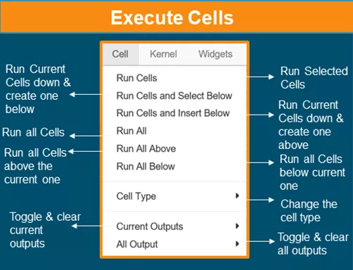

### 8、核单元格
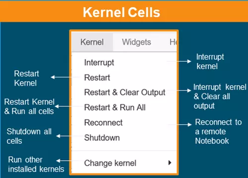

### 9、窗口部件
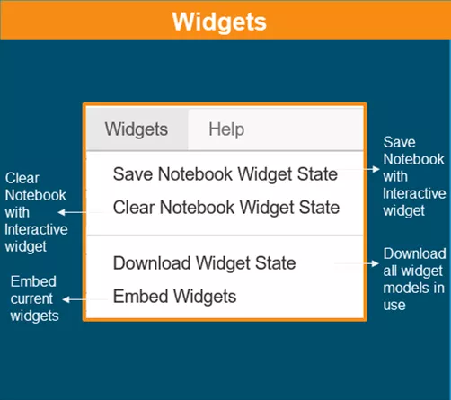

### 10、帮助
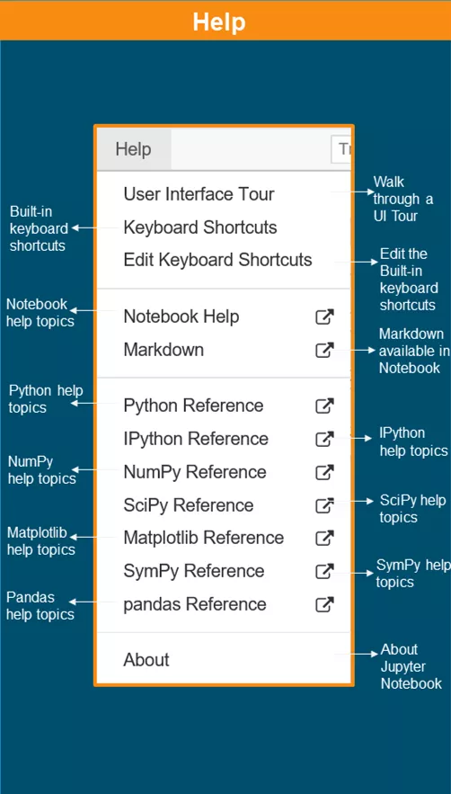
