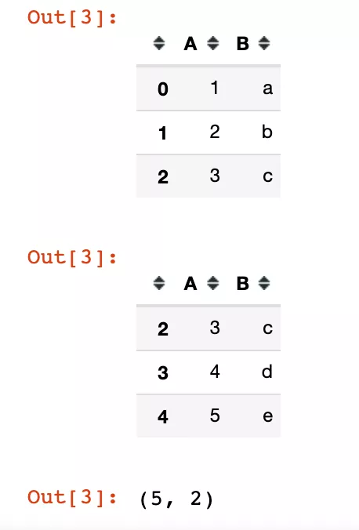
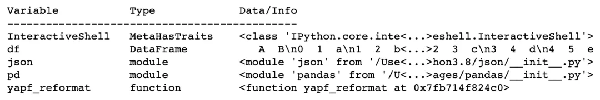
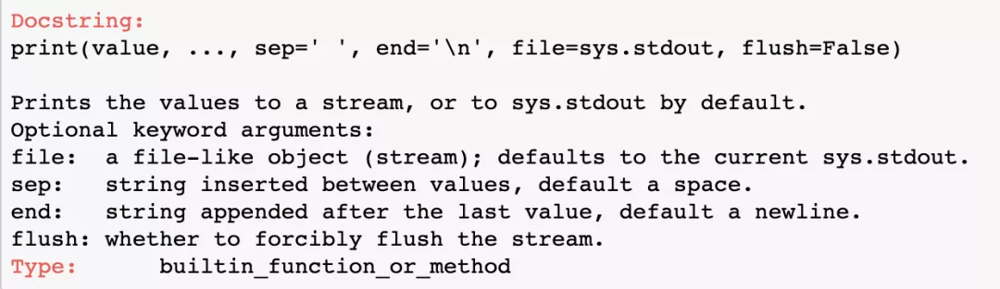
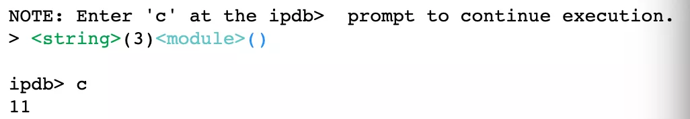
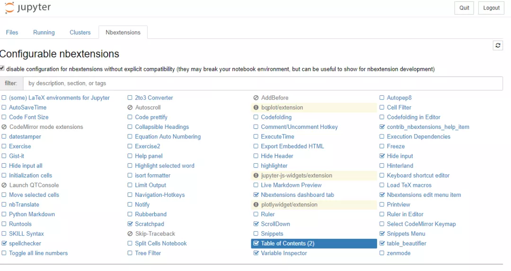

Python Jupyter NoteBook
<a name="lXxQJ"></a>
## 简 介
目前非常多的数据科学工作还是基于Notebook和Pycharm一起进行的，很多时候会在Notebook上面验证一些想法，然后再模块化代码写入到工程中，分享一些Notebook一些不为人知的技巧，方便大家的大大加速适用Notebook的效率。

- 多个结果单个单元一起输出
- 输出所有变量
- 函数文档快速查询
- Notebook的Debug
- 代码快捷键
- Notebook执行shell命令
- Cell执行时间查询
- Notebook写书
- Notebook显示Slides
- 所有Magic命令
<a name="GZnOW"></a>
## 十大Notebook使用技巧
<a name="vkEMp"></a>
### 1、多个结果单个单元一起输出
使用Notebook的时候，Notebook一般只会看到最后一个需要输出的结果，而忽略前面的结果，例如：

- 在同一单元格中有多行，“df.head(3)”,"df.tail(3)"和“df.shape”。那么往往只能看到"`df.shape`"的结果；

这可能并不是希望看到的，此处仅需加入两行代码，即可将多个结果一起输出。具体地，如下：
```python
import pandas as pd
df = pd.DataFrame({'A':[1,2,3,4,5], 'B':['a','b','c','d','e']})
df.head(3)
df.tail(3)
df.shape
# (5, 2)

from IPython.core.interactiveshell import InteractiveShell 
InteractiveShell.ast_node_interactivity = "all"
df.head(3)
df.tail(3)
df.shape
```

<a name="Rv0yy"></a>
### 2、输出所有变量
在一些情况下，写了非常多的代码，这个时候有什么变量之类的可能已经记不清楚了，那么如何显示当前Notebook中有多少变量呢？只需要进行下面的操作就可以知晓所有的变量。
```python
%whos
```

<a name="cZxPA"></a>
### 3、函数文档快速查询
有的时候想要知道一些函数的文档，尤其是当初次使用该函数，需要知道这个函数的功能和变量等信息，此时只需要在该函数前面加入?即可。
```python
?print
```

<a name="hkMSw"></a>
### 4、Notebook的Debug
在Pycharm里面可以方便的Debug，但是在Notebook中往往依赖于直觉和不断的结果输出来调节代码，如何在Notebook中进行Debug呢？很简单，加入下面的一行代码即可。
```python
%%debug

def _add_1(x):
    return x+1

print(_add_1(10))
```

<a name="poeR6"></a>
### 5、代码快捷键

- Ctrl + Enter - 运行当前的cell
- Shift + Enter - 运行当前的cell并进入下一个cell
- Space: 向下滑动cell
- a - 在上面插入一个cell
- b - 在下面插入一个cell
- m - 将cell转化为markdown
- y - 将cell转化为code
- x - 裁剪选中的cell
- c - 对选中的cell进行拷贝
- v - 对选中的cell进行黏贴
- z - 撤销cell的删除
<a name="eSLVB"></a>
### 6、Notebook执行shell命令
在cell的前面加入感叹号"`!`"即可运行shell命令，例如现实当前目录下面的文件，
```bash
!ls
```
<a name="EEprl"></a>
### 7、Cell执行时间查询
很多时候，在数据较大或者算法较慢的情况下，希望知道其运行时间，可以通过time工具包进行计算，但是在Notebook中，还可以通过下面的快捷指令进行计算。
```python
%%time
for i in range(1000000):
    x = i+1
# CPU times: user 95.9 ms, sys: 2.66 ms, total: 98.6 ms
# Wall time: 98.1 ms
```
<a name="XSXBz"></a>
### 8、Notebook写书
Notebook除了可以写Markdown和代码，还可以排版成写书的感觉，只需要安装Notebook Extensions插件然后在Nbextension中选择对应功能即可。
```python
! pip install jupyter_contrib_nbextensions
! jupyter contrib nbextension install --system
```

<a name="o0eRZ"></a>
### 9、Notebook显示Slides
可以通过“View->Cell Toolbar -> Slideshow”，然后为Notebook中的每个单元格选择幻灯片配置，创建Jupyter笔记本的幻灯片演示文稿。

最后，通过转到终端并键入以下命令，就可以看到Slides了。
```bash
pip install jupyter_contrib_nbextensions 
jupyter nbconvert my_notebook_name.ipynb --to slides --post serve
```
<a name="xvnzV"></a>
### 10、所有Magic命令
Notebook中存在非常多的magic命令，可以直接通过输入下面命令进行显示。
```bash
%lsmagic

# Available line magics:
# %alias  %alias_magic  %autoawait  %autocall  %automagic  %autosave  %bookmark  %cat  %cd  %clear  %colors  %conda  %config  %connect_info  %cp  %debug  %dhist  %dirs  %doctest_mode  %ed  %edit  %env  %gui  %hist  %history  %killbgscripts  %ldir  %less  %lf  %lk  %ll  %load  %load_ext  %loadpy  %logoff  %logon  %logstart  %logstate  %logstop  %ls  %lsmagic  %lx  %macro  %magic  %man  %matplotlib  %mkdir  %more  %mv  %notebook  %page  %pastebin  %pdb  %pdef  %pdoc  %pfile  %pinfo  %pinfo2  %pip  %popd  %pprint  %precision  %prun  %psearch  %psource  %pushd  %pwd  %pycat  %pylab  %qtconsole  %quickref  %recall  %rehashx  %reload_ext  %rep  %rerun  %reset  %reset_selective  %rm  %rmdir  %run  %save  %sc  %set_env  %store  %sx  %system  %tb  %time  %timeit  %unalias  %unload_ext  %who  %who_ls  %whos  %xdel  %xmode

# Available cell magics:
# %%!  %%HTML  %%SVG  %%bash  %%capture  %%debug  %%file  %%html  %%javascript  %%js  %%latex  %%markdown  %%perl  %%prun  %%pypy  %%python  %%python2  %%python3  %%ruby  %%script  %%sh  %%svg  %%sx  %%system  %%time  %%timeit  %%writefile

# Automagic is ON, % prefix IS NOT needed for line magics.
```
