Jupyter
<a name="bb1at"></a>
## **为什么 Jupyter 需要 Debug？**
Jupyter 这种工具虽然有很好的交互性能，但其也明白，对于大型代码库，最好还是用传统的 IDE 比较靠谱。<br />因此为了弥补这一缺陷，Jupyter 项目在过去几年也希望通过 JupyterLab 来加强对大型代码库的处理过程。<br />然而，JupyterLab 还是有一大缺陷，它不能通过可视化的方式进行 Debug，这限制了进一步的调试。这几天，Jupyter 团队表示，经过几个月的开发，他们很高兴能第一次发布 Jupyter 可视化 Debugger。<br />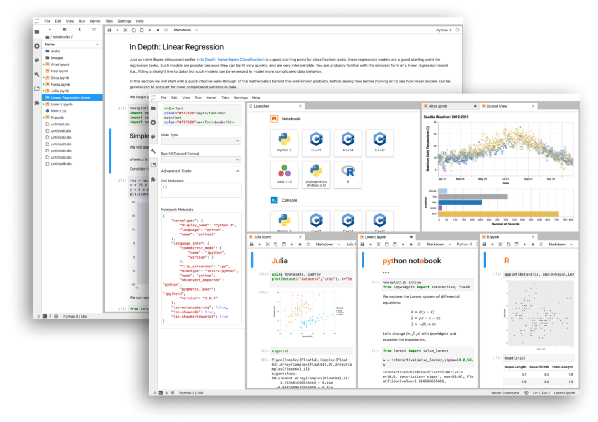<br />虽然这只是第一版，但目前已经可以设置常见的断点 Debug，查看各种变量、执行模块等信息。<br /><br />新工具的用法也很简单，很常见的 Debug 方式差不多。如果要安装这个新工具，那么首先需要为 JupyterLab 装前端插件：
```bash
jupyter labextension install @jupyterlab/debugger
```
至于后端 Kernel，Jupyter 团队表示目前 kernel 需要实现 Jupyter Debug Protocol，因此暂时只能用xeus-python：
```bash
conda install xeus-python -c conda-forge
```
只要装好前端与后端，就可以直接使用了。开发者还提供了 Debug 的线上体验版，不需要安装任何东西就能体验。<br />在线 Debug 环境：<br />[https://hub.gke.mybinder.org/user/jupyterlab-debugger-hwxovlw4/lab/tree/examples/index.ipynb](https://hub.gke.mybinder.org/user/jupyterlab-debugger-hwxovlw4/lab/tree/examples/index.ipynb)
<a name="SVy1Y"></a>
## Xeus-python
<a name="Wyn8J"></a>
### 第一个支持 Jupyter Debug 的内核
Xeus 是 Jupyter kernel protocol 的 C++实现，它本身并不是一个内核，而是能帮助构建内核的库。当开发者希望构建 Python、Lua 等拥有 C、C++ API 的语言内核时，它非常有用。<br />目前已经有一些内核使用 xeus 进行开发，Xeus-python 内核是做 Python 开发时可选的一个内核，它去年就已经有发布。Xeus-python 之所以被 Jupyter 团队选为第一个实现 Debug 的内核，主要是它有以下两大优势：

- **Xeus-python 具有可插拔的并发模型，它允许在不同的线程中运行 Control channel 的处理过程；**
- **Xeus-python 有非常轻量级的代码库，因此迭代与更新都非常方便。**

短期内，xeus-python 还会有进一步提升的计划，例如添加 Ipython 魔术方法，优化 xeus-python 的 PyPI 等。
<a name="RQP1x"></a>
## **深入至 debugger 的前端架构**
JupyterLab 的 debugger 扩展针对用户对 IDE 的使用习惯提供了通常性功能：

- **带有资源管理器的侧边栏，无序列表，源预览以及允许导航至调用堆栈**
- **可直接在代码旁（即在代码单元以及代码控制台中）设置断点的功能**
- **可视化的标记，指示当前执行停止的位置**

当使用 Jupyter 笔记本时，执行的状态保存在内核中。但是如果执行了一个 cell，然后又把整个 cell 删了，那么用户在 Dubug 的时候希望运行到那些代码又怎么办？<br />如下动图所示，该插件支持特定用例，并能在只读模式下查看以前执行过的 cell。<br />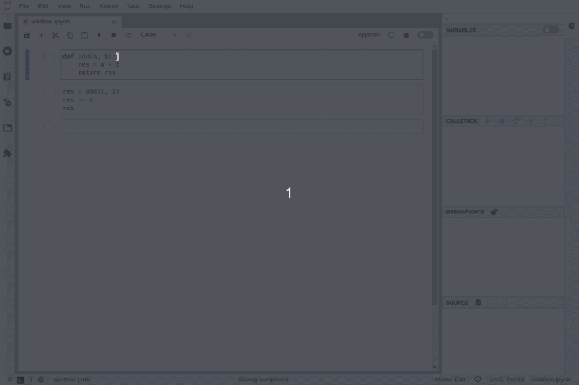<br />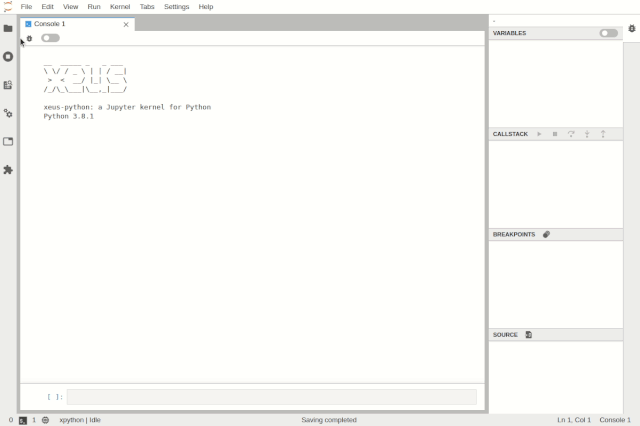<br />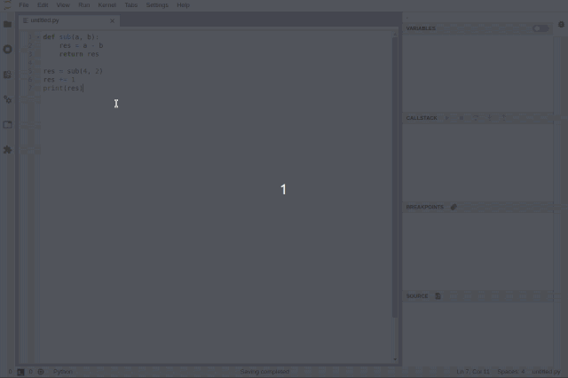<br />可以在 notebook 级别上启用调试，用户可以在调试 notebook 的同时在另一个 notebook 上工作。<br />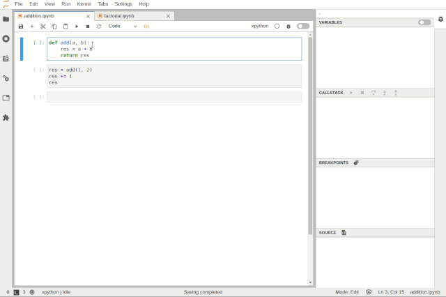<br />可以使用树状查看器和表状查看器检查变量：<br />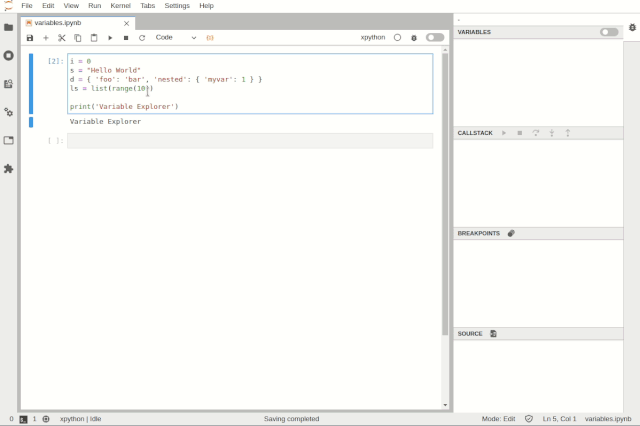<br />JupyterLab 的 debugger 插件目标是与任何支持调试内核一并使用。通过 Debug Adapter Protocol，debugger 插件可以抽象出针对于特定语言的功能，并为用户提供匹配的调试界面。<br />并且团队计划在 2020 年对 debugger 的体验进行重大改进，例如在变量浏览器中支持丰富的渲染，在 UI 中支持条件断点。
<a name="PVmxr"></a>
## **VS Code 可视化 Debug 工具**
Debug 是条漫漫长路，不久前介绍过一款 VS Code 实时可视化 debug 工具，在此也可以作为参考。以一种更优雅、更简洁的 debug 方式帮用户找到代码问题所在是未来优化的方向之一，而之前所介绍这款可视化 debug 能够快速展示数据结构。<br />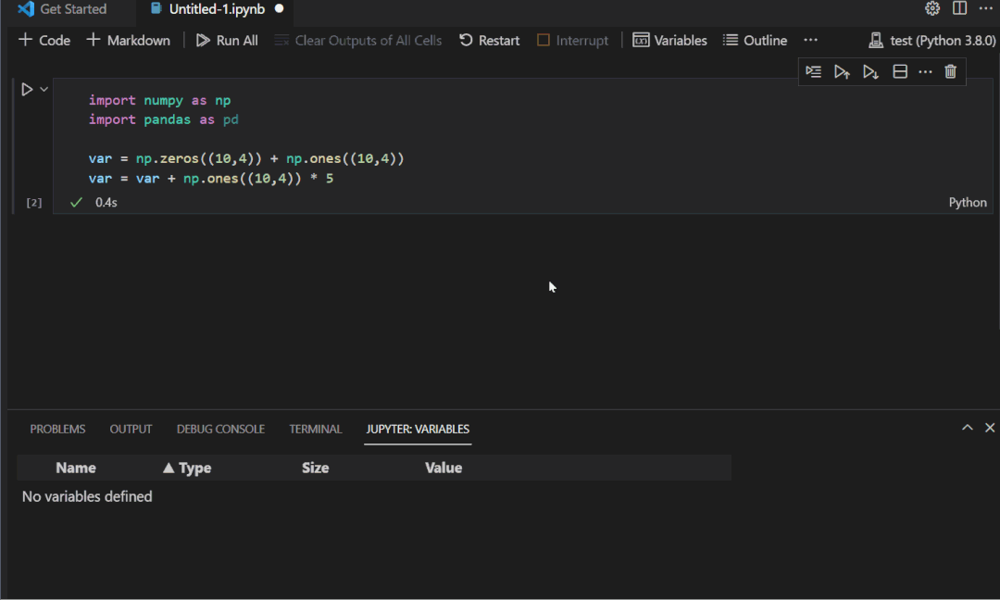<br />从效果层面上看此款工具更加惊艳，而且跟以往传统 debug 方式的展示形式完全不同，比如将断点设置为第 32 行定义双向链表，随后一行行运行代码就会在右图展现出对应的数据结构图。<br />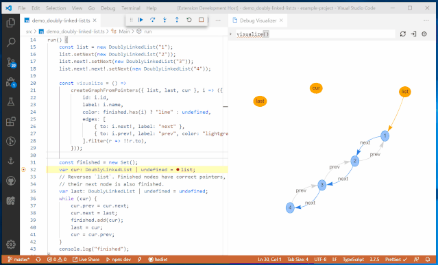<br />同时也会根据数据结构以不同的方式展现，例如树形、表格、曲线和图等。<br />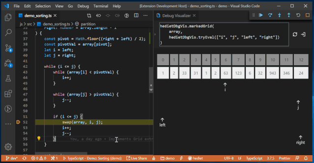<br />同时还内置了其他可自定义的可视化调节器，可以根据面对不同的处理对象，可选择更易于理解的可视化方式。比如图表可视化，Plotly 可视化，Tree 可视化，网格可视化，文本可视化等等。<br />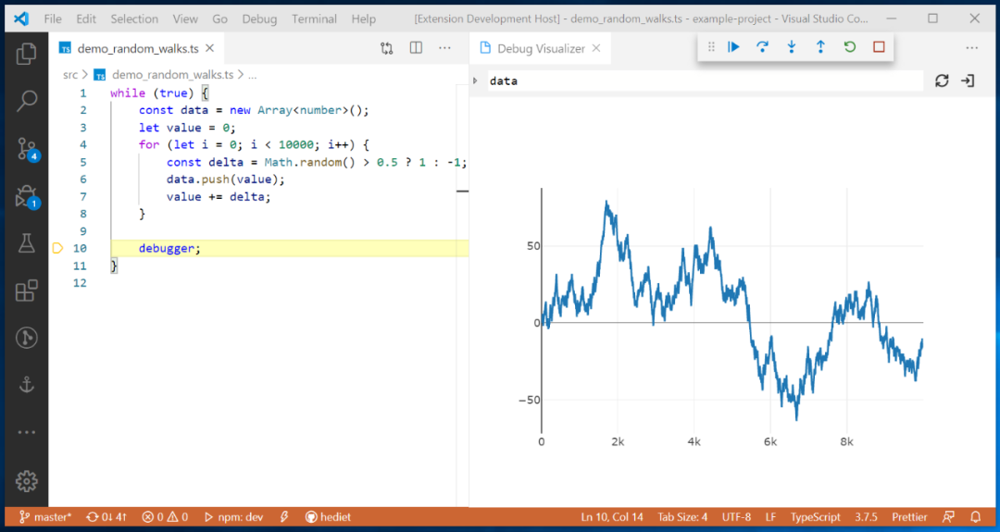<br />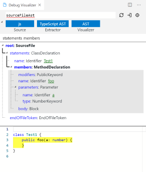<br />不过这款 VS Code 的 debug 工具开发者正在探讨其对 Python 的支持，而对于 Python 的完美支持会使得该项目更加便捷且适用。<br />而对于 debug 来说，不管最终是采用的是 print() 大法，或是善用 assert 语句，亦或是以直接设置断点，包括各种新推出的 debug 工具。单从辅助工具角度层面看，只要它能够提高工作效率，不管是哪款 debug 工具，找到适合你的那便是值得一试。
