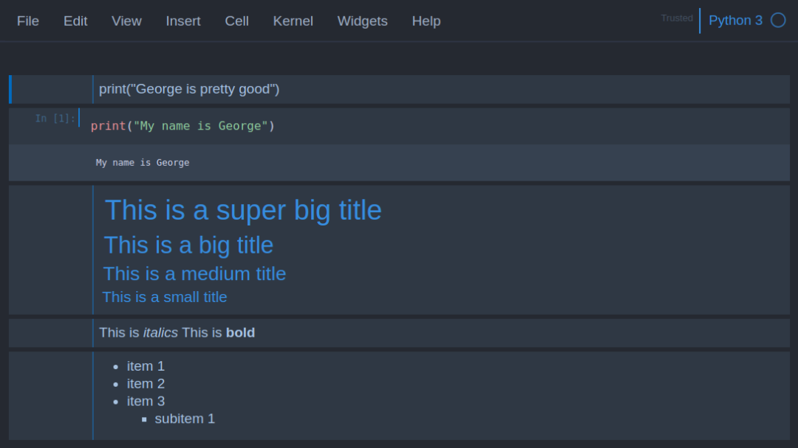
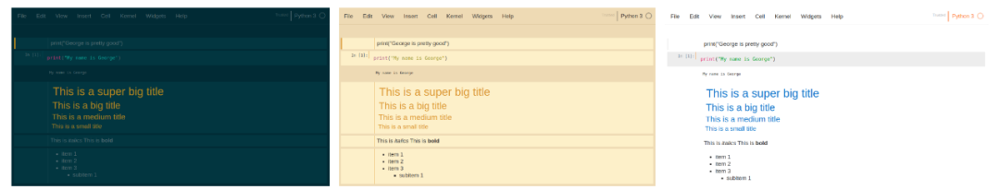
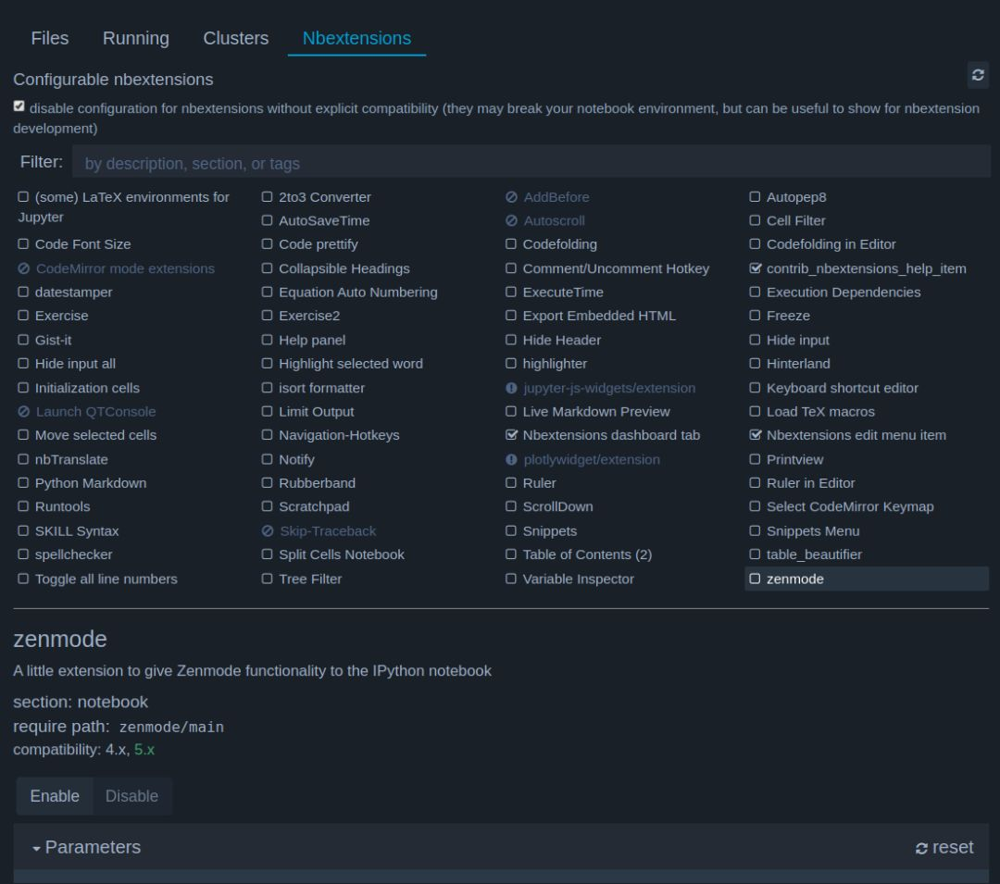
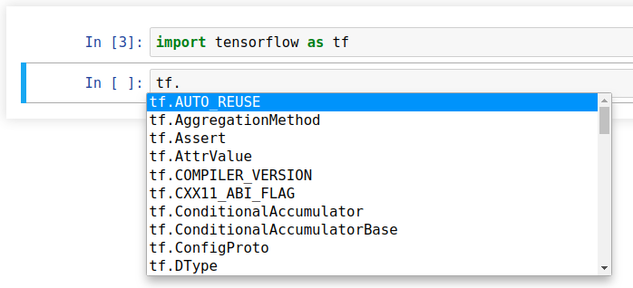
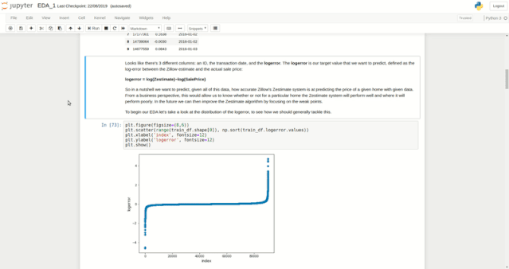
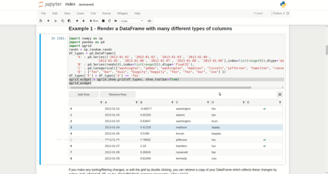

Python<br />介绍强化 Jupyter Notebook 功能的 4 种方法。
<a name="OwqSg"></a>
## 1、执行 Shell 命令
在技术或编程文本中，shell 表示使用文本与计算机进行交互的方式。最流行的 Unix shell 是 Bash（Bourne Again SHell），Bash 是 Linux 机器上终端默认的 shell。<br />在使用 Python 工作时，会经常在写 Python 代码和使用 shell 命令之间来回切换。例如，想使用 Python 读取磁盘中的某份文件，而这需要确认文件名。通常情况下，需要在终端输入 ls，获得当前目录的所有文件和文件夹列表。但这样来回切换非常繁琐低效。<br />很炫酷的是，Jupyter 能够执行 Shell 命令，甚至无需离开浏览器。只需要在 shell 命令前加一个感叹号!，Jupyter 会将其转换为 Bash。在任一命令前加感叹号!，它们就可以在 Python Jupyter Notebook 中运行。
```bash
# Listing folder contents
>>> !ls
mynotebook.ipynb stuff.txt# Getting the current directory
>>> !pwd
/home/george/github/project_1# Printing from Bash 
>>> !echo "Pizza is delicious!"
Pizza is delicious!
```
还可以将 shell 命令的输出分配给 Python 变量，如下所示：
```bash
# Getting the current directory. 
# The variable "X" now contains ["/home/george/github/project_1"]
X = !pwd
```
<a name="h208l"></a>
## 2、更换主题
<br />很多文本编辑器和编程 IDE 都有自定义主题。开发者最喜欢的主题之一是暗黑主题（如 monaki），因为对于整天盯着屏幕的开发者而言，暗黑主题看起来比较舒适。幸运的是，Jupyter 有一个插件，允许用户自行选择主题。<br />要想安装该插件，只需在终端中运行以下 pip 命令：
```bash
pip install jupyterthemes
```
运行以下命令，可得到可用的主题列表：
```bash
jt -l
```
可选择的主题包括：
```bash
chesterish
grade3
gruvboxd
gruvboxl
monokai
oceans16
onedork
solarizedd
solarizedl
```
查看这些主题，如下图所示，拥有大量不同的颜色选择。<br />
<a name="eiVde"></a>
## 3、Notebook 扩展插件
Jupyter Notebook 扩展插件（nbextensions）是一些 JavaScript 模块，可以使用它们强化 Notebook 的功能以及使用。扩展插件本质上修改了 Jupyter UI，以实现更稳健的功能。<br />首先通过 pip 安装 nbextensions：
```bash
pip install jupyter_contrib_nbextensions 

jupyter contrib nbextension install
```
安装完成后，启动 Jupyter。将看到一个新选项——NBextensions。选择它之后，会看到大量 Jupyter Notebook 扩展插件选项。<br /><br />通过快速搜索，可以查看这些扩展插件的功能。下面将介绍几个最重要的插件。
<a name="fcPGK"></a>
### Table of Contents
正如其名称所描述的那样，Table of Contents 基于 notebook 中 # 创建的标题自动生成目录。例如在 notebook 中创建了以下标题：
```
# This is a super big title
## This is a big title
### This is a medium title
#### This is a small title
```
则左侧会生成目录。双击标题，可链接至对应章节内容。当 notebook 规模很大，选项很多时，这个功能非常方便！
<a name="kVSET"></a>
### Hinterland
代码补全是大部分 IDE 都具备的常见功能，比如 PyCharm。开发者喜欢这个功能，因为这使得他们的工作更加简单，开发者无需记住每一个命令，IDE 会准备好一切。<br />Hinterland 可在 Jupyter Notebook 内完成代码补全。在键入过程中，会看到一些代码补全建议。尤其是当搜索外部库的命令时（示例如下所示）。这简直太方便了！<br />
<a name="WDDl1"></a>
### 拆分单元格（Split Cells）
拆分单元格允许开发者并排查看 2 个单元格。当有两个相关单元格时（比如描述及其对应的图示），这个功能非常方便。<br />
<a name="PK3Wh"></a>
## 4、使用 Qgrid 探索 Dataframes
最后一站是 Qgrid，该工具允许开发者在不使用复杂 Pandas 代码的情况下，探索和编辑数据帧。Qgrid 可在 Jupyter notebook 中以交互的方式渲染 pandas 数据帧，这样就可以执行一些直观的控制，如滚动、排序和筛选，以及双击单元格编辑数据帧。<br />首先安装 Qgrid：
```bash
pip install qgrid
jupyter nbextension enable --py --sys-prefix widgetsnbextension
```
要想使用 Qgrid 渲染数据帧，开发者只需导入 Qgrid，然后将数据帧输入到 show_grid 函数：
```python
import qgrid
qgrid_widget = qgrid.show_grid(df, show_toolbar=True)
qgrid_widget
```
这样，可以对数据帧执行大量交互式操作：

- 添加和删除行；
- 筛选行；
- 编辑单元格。

将更多参数输入 show_grid 函数可以执行其他交互式操作。关于 Qgrid 的全部功能，参见：[https://github.com/quantopian/qgrid](https://github.com/quantopian/qgrid)。<br /><br />以上就是强化 Jupyter Notebook 功能的 4 种方法。
