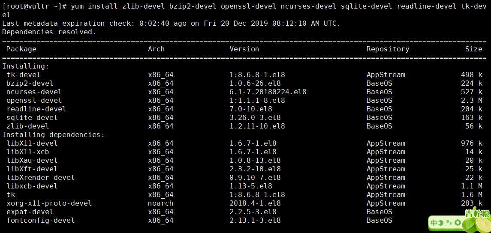
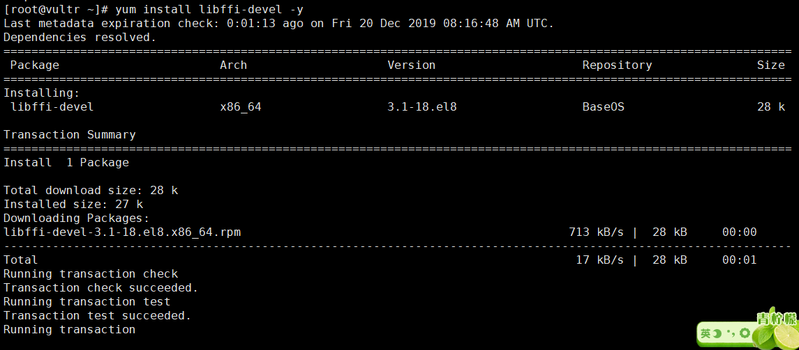
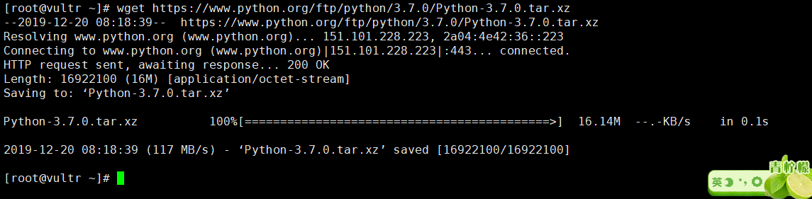

Linux CentOS Python
<a name="bb6ID"></a>
### 1、安装编译相关工具
```bash
[root@vultr ~]# yum -y groupinstall "Development tools"
 # 安装make需要的依赖包
[root@vultr ~]# yum install zlib-devel bzip2-devel openssl-devel ncurses-devel sqlite-devel readline-devel tk-devel
 # 安装python3.7需要的依赖包
[root@vultr ~]# yum install libffi-devel -y
```
一键式脚本
```bash
yum -y groupinstall "Development tools"
yum install zlib-devel bzip2-devel openssl-devel ncurses-devel sqlite-devel readline-devel tk-devel
yum install libffi-devel -y
```

<a name="dSUU7"></a>
### 2、下载安装包解压
```bash
#回到用户目录
[root@vultr ~]# cd ~
[root@vultr ~]# wget https://www.python.org/ftp/python/3.7.0/Python-3.7.0.tar.xz
[root@vultr ~]# tar -xvJf  Python-3.7.0.tar.xz
```

<a name="vXHEn"></a>
### 3、编译安装
```bash
[root@vultr ~]# mkdir /usr/local/python3 #创建编译安装目录
[root@vultr ~]# cd Python-3.7.0
[root@vultr Python-3.7.0]# ./configure --prefix=/usr/local/python3
[root@vultr Python-3.7.0]# make && make install
```
<a name="lpSmb"></a>
### 4、创建软连接
```bash
[root@vultr Python-3.7.0]# ln -s /usr/local/python3/bin/python3 /usr/local/bin/python3
[root@vultr Python-3.7.0]# ln -s /usr/local/python3/bin/pip3 /usr/local/bin/pip3
```
<a name="jxmzr"></a>
### 5、验证安装
```bash
[root@vultr Python-3.7.0]# python3 -V
[root@vultr Python-3.7.0]# pip3 -V
```

