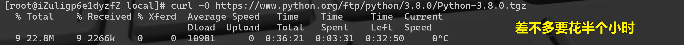
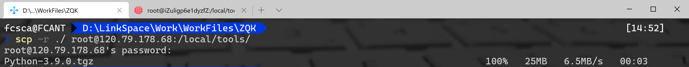
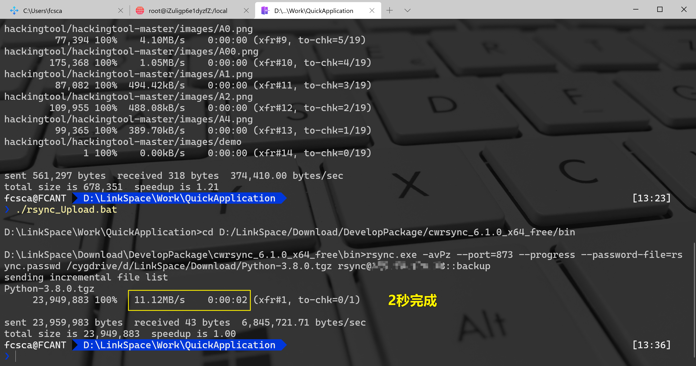
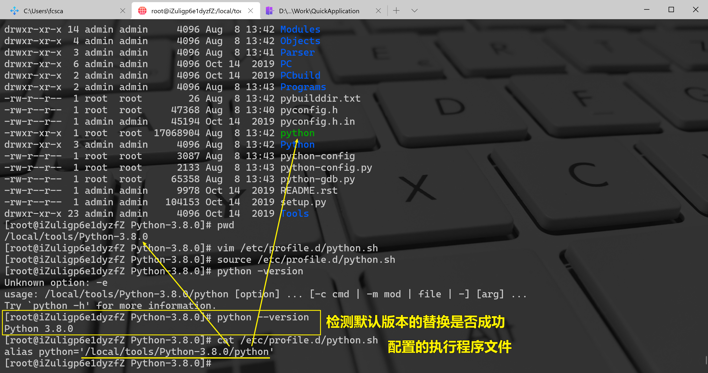

Linux CentOS Python
:::danger
安装Python之前需要安装（否则有的地方还需要安装，会报错，需要重新编译）
:::
```bash
yum -y install libffi-devel
yum -y groupinstall "Development tools"
yum install zlib-devel bzip2-devel openssl-devel ncurses-devel sqlite-devel readline-devel tk-devel
```
<a name="qEdmj"></a>
### 1、安装Python3
如果通过curl下载比较慢可以下载下面的Python安装包使用FTP工具上传至Linux系统下<br />[Python-3.8.0.tgz](https://www.yuque.com/attachments/yuque/0/2020/tgz/396745/1602727831963-d58370ed-d11f-48a5-9149-79c21e3681f1.tgz?_lake_card=%7B%22uid%22%3A%221596864966691-0%22%2C%22src%22%3A%22https%3A%2F%2Fwww.yuque.com%2Fattachments%2Fyuque%2F0%2F2020%2Ftgz%2F396745%2F1602727831963-d58370ed-d11f-48a5-9149-79c21e3681f1.tgz%22%2C%22name%22%3A%22Python-3.8.0.tgz%22%2C%22size%22%3A23949883%2C%22type%22%3A%22application%2Fx-compressed%22%2C%22ext%22%3A%22tgz%22%2C%22progress%22%3A%7B%22percent%22%3A99%7D%2C%22status%22%3A%22done%22%2C%22percent%22%3A0%2C%22id%22%3A%22khsCw%22%2C%22refSrc%22%3A%22https%3A%2F%2Fwww.yuque.com%2Fattachments%2Fyuque%2F0%2F2020%2Ftgz%2F396745%2F1596864974055-77390aaf-0d20-4198-8e07-17cff3c1b2f5.tgz%22%2C%22card%22%3A%22file%22%7D)<br />[Python-3.9.0.tgz](https://www.yuque.com/attachments/yuque/0/2020/tgz/396745/1603867917405-3697e9c6-e190-4bb6-88f8-79ade5679990.tgz?_lake_card=%7B%22uid%22%3A%221603867908161-0%22%2C%22src%22%3A%22https%3A%2F%2Fwww.yuque.com%2Fattachments%2Fyuque%2F0%2F2020%2Ftgz%2F396745%2F1603867917405-3697e9c6-e190-4bb6-88f8-79ade5679990.tgz%22%2C%22name%22%3A%22Python-3.9.0.tgz%22%2C%22size%22%3A26724009%2C%22type%22%3A%22application%2Fx-compressed%22%2C%22ext%22%3A%22tgz%22%2C%22progress%22%3A%7B%22percent%22%3A99%7D%2C%22status%22%3A%22done%22%2C%22percent%22%3A0%2C%22id%22%3A%222yA74%22%2C%22card%22%3A%22file%22%7D)<br />**通过curl以及Window的xsync上传对比**
<a name="L0oVO"></a>
##### 通过curl进行下载

<a name="Vh6zU"></a>
##### 通过scp进行上传
<br />
```bash
yum -y install yum-utils
yum-builddep python
curl -O https://www.python.org/ftp/python/3.8.0/Python-3.8.0.tgz
tar xf Python-3.8.0.tgz
cd Python-3.8.0
./configure --prefix=/local/tools/Python-3.8.0
make && make install
```
<a name="uHx7g"></a>
### 2、设置Python3为默认版本
<a name="RAxDw"></a>
#### A.通过设置别名配置
```bash
vim /etc/profile.d/python.sh         #编辑用户自定义配置，输入alias参数

alias python='/usr/local/bin/python3.8/python'　　#这里写python的安装路径以及Python的可执行文件名

source /etc/profile.d/python.sh     #重启会话使配置生效
```

<a name="tPjX7"></a>
#### B.通过创建软链接设置
```bash
[root@vultr Python-3.8.0]# ln -s /local/dev/Python-3.8.0/python /usr/local/bin/python3
[root@vultr Python-3.8.0]# python3 -V
```
<a name="eXv60"></a>
### 3、Python3编译安装后bin目录有pip3，只需要创建软链接即可
```bash
[root@iZuligp6e1dyzfZ bin]# ln -s /local/dev/Python-3.8.0/bin/pip3 /usr/local/bin/pip3
[root@iZuligp6e1dyzfZ bin]# pip3 -V
pip 19.2.3 from /local/tools/Python-3.8.0/lib/python3.8/site-packages/pip (python 3.8)
```
<a name="6Mr01"></a>
### 4、CentOS一键安装Python脚本
:::tips
需要将对应的Python安装包放在脚本同目录下，并修改脚本中安装的Python的文件名（无文件后缀）
:::
```bash
PATH=`pwd`
PYTHON_VERSION='Python-3.8.0'
PYTHON_PATH=${PATH}"/"${PYTHON_VERSION}
echo 当前安装的Python版本是:${PYTHON_VERSION}
yum -y install libffi-devel
yum -y install yum-utils
tar xf ${PYTHON_VERSION}.tgz
cd ./${PYTHON_VERSION}
./configure --prefix=${PYTHON_PATH}
make && make install
ln -s ${PYTHON_PATH}/python /usr/local/bin/python3
ln -s ${PYTHON_PATH}/bin/pip3 /usr/local/bin/pip3
python3 -V
```
