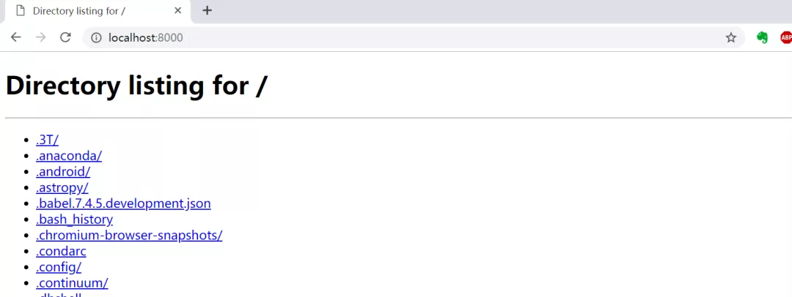

Python<br />在命令行中使用 Python 时，它可以接收大约 20 个选项（option），语法格式如下：
```bash
python [-bBdEhiIOqsSuvVWx?] [-c command | -m module-name | script | - ] [args]
```
这里看看比较特殊的“`-m`”选项：**关于它的典型用法、原理解析与发展演变的过程。**<br />首先，用“--help”来看看它的解释：<br /><br />-m  mod run library module as a script (terminates option list)<br />"mod"是“module”的缩写，即“-m”选项后面的内容是 module（模块），其作用是把模块当成脚本来运行。<br />“terminates option list”意味着“-m”之后的其它选项不起作用，在这点上它跟“-c”是一样的，都是“终极选项”。官方把它们定义为“接口选项”（Interface options），需要区别于其它的普通选项或通用选项。
<a name="KLUuD"></a>
## `-m` 选项的五个典型用法
Python 中有很多使用 -m 选项的场景，相信大家可能会用到或者看见过，在这里分享 5 个。<br />在 Python3 中，只需一行命令就能实现一个简单的 HTTP 服务：
```bash
python -m http.server 8000

# 注:在 Python2 中是这样
python -m SimpleHTTPServer 8000
```
<br />执行后，在本机打开“http://localhost:8000”，或者在局域网内的其它机器上打开“http://本机ip:8000”，就能访问到执行目录下的内容，例如下图就是本机的内容：<br /><br />与此类似，只需要一行命令“`python -m pydoc -p xxx`”，就能生成 HTML 格式的官方帮助文档，可以在浏览器中访问。<br /><br />上面的命令执行了 pydoc 模块，会在 9000 端口启动一个 http 服务，在浏览器中打开，结果如下：<br /><br />它的第三个常见用法是执行 pdb 的调试命令“`python -m pdb xxx.py`”，以调试模式来执行“xxx.py”脚本：<br /><br />第四个同样挺有用的场景是用 timeit 在命令行中测试一小段代码的运行时间。以下的 3 段代码，用不同的方式拼接 “0-1-2-……-99” 数字串。可以直观地看出它们的效率差异：<br /><br />最后，还有一种常常被人忽略的场景：“`python -m pip install xxx`”们可能会习惯性地使用“pip install xxx”，或者做了版本区分时用“`pip3 install xxx`”，总之不在前面用`“python -`m”做指定。但这种写法可能会出问题。<br />很巧合的是，在本月初（2019.11.01），Python 的核心开发者、第一届指导委员会五人成员之一的 Brett Cannon 专门写了一篇博客《Why you should use "python -m pip"》，提出应该使用“`python -m pip`”的方式，并做了详细的解释。<br />他的主要观点是：在存在多个 Python 版本的环境中，这种写法可以精确地控制三方库的安装位置。例如用“`python3.8 -m pip`”，可以明确指定给 3.8 版本安装，而不会混淆成其它的版本。
<a name="T4LoV"></a>
## `-m` 选项的两种原理解析
看了前面的几种典型用法，是否开始好奇：**“**`**-m**`**”是怎么运作的？它是怎么实现的？**<br />对于“`python -m name`”，一句话解释：**Python 会检索sys.path ，查找名字为“name”的模块或者包（含命名空间包），并将其内容当成“**`**__main__**`**”模块来执行。**
<a name="MhU8V"></a>
### 1、对于普通模块
以“.py”为后缀的文件就是一个模块，在“`-m`”之后使用时，只需要使用模块名，不需要写出后缀，但前提是该模块名是有效的，且不能是用 C 语言写成的模块。<br />在“`-m`”之后，如果是一个无效的模块名，则会报错“No module named xxx”。<br />如果是一个带后缀的模块，则首先会导入该模块，然后可能报错：Error while finding module specification for 'xxx.py' (AttributeError: module 'xxx' has no attribute '__path__'。<br /><br />对于一个普通模块，有时候这两种写法表面看起来是等效的：<br /><br />两种写法都会把定位到的模块脚本当成主程序入口来执行，即在执行时，该脚本的`__name__`都是"`__main__`"“，跟 import 导入方式是不同的。<br />但它的前提是：在执行目录中存在着“test.py”，且只有唯一的“test”模块。对于本例，如果换一个目录执行的话，“`python test.py`”当然会报找不到文件的错误，然而，`“python -m tes`t”却不会报错，因为解释器在遍历`sys.path`时可以找到同名的“test”模块，并且执行：<br /><br />由此差异，其实可以总结出“`-m`”的用法：**已知一个模块的名字，但不知道它的文件路径，那么使用“**`**-m**`**”就意味着交给解释器自行查找，若找到，则当成脚本执行。**<br />以前文的“`python -m http.server 8000`”为例们也可以找到“server”模块的绝对路径，然后执行，尽管这样会变得很麻烦。<br /><br />那么，“`-m`”方式与直接运行脚本相比，在实现上有什么不同呢？

- 直接运行脚本时，相当于给出了脚本的完整路径（不管是绝对路径还是相对路径），解释器根据**文件系统的查找机制，** 定位到该脚本，然后执行
- 使用“`-m`”方式时，解释器需要在不 import 的情况下，在**所有模块命名空间** 中查找，定位到脚本的路径，然后执行。为了实现这个过程，解释器会借助两个模块：pkgutil 和 runpy，前者用来获取所有的模块列表，后者根据模块名来定位并执行脚本
<a name="jzQLt"></a>
### 2、对于包内模块
如果“`-m`”之后要执行的是一个包，那么解释器经过前面提到的查找过程，先定位到该包，然后会去执行它的“__main__”子模块，也就是说，在包目录下需要实现一个“__main__.py”文件。<br />换句话说，假设有个包的名称是“pname”，那么，**“**`**python -m pname**`**”，其实就等效于“**`**python -m pname.__main__**`**”。**<br />仍以前文创建 HTTP 服务为例，“http”是 Python 内置的一个包，它没有“__main__.py”文件，所以使用“-m”方式执行时，就会报错：No module named http.__main__; 'http' is a package and cannot be directly executed。<br /><br />作为对比，可以看看前文提到的 pip，它也是一个包，为什么“`python -m pip`”的方式可以使用呢？当然是因为它有“__main__.py”文件：<br /><br />“`python -m pip`”实际上执行的就是这个`“__main__.p`y”文件，它主要作为一个调用入口，调用了核心的"pip._internal.main"。<br />http 包因为没有一个统一的入口模块，所以采用了“`python -m 包.模块`”的方式，而 pip 包因为有统一的入口模块，所以加了一个“`__main__.py`”文件，最后只需要写“`python -m 包`”，简明直观。
<a name="yC4vq"></a>
## `-m` 选项的十年演变过程
最早引入 `-m` 选项的是 Python 2.4 版本（2004年），当时功能还挺受限，只能作用于普通的内置模块（如 pdb 和 profile）。<br />随后，知名开发者 Nick Coghlan 提出的《PEP 338 -- Executing modules as scripts》把它的功能提升了一个台阶。这个 PEP 在 2004 年提出，最终实现在 2006 年的 2.5 版本。<br />（插个题外话：Nick Coghlan 是核心开发者中的核心之一，也是第一届指导委员会的五人成员之一。记得当初看材料，他是在 2005 年被选为核心开发者的，这时间与 PEP-338 的时间紧密贴合）<br /><br />这个 PEP 的几个核心点是：

- 结合了 PEP-302 的新探针机制（new import hooks），提升了解释器查找包内模块的能力
- 结合了其它的导入机制（例如`zipimport`和冻结模块(frozen modules)），拓展了解释器查找模块的范围与精度
- 开发了新的`runpy.run_module(modulename)`来实现本功能，而不用修改 CPython 解释器，如此可方便移植到其它解释器

至此，`-m` 选项使得 Python 可以在所有的命名空间内定位到命令行中给定的模块。<br />2009 年，在 Python 3.1 版本中，只需给定包的名称，就能定位和运行它的“__main__”子模块。2014 年，`-m` 扩展到支持命名空间包。<br />至此，经过十年的发展演变，`-m` 选项变得功能齐全，羽翼丰满。<br />`-m` 选项可能看似不起眼，但它绝对是最特别的选项之一，它使得在命令行中，使用内置模块、标准包与三方库时变得更轻松便利。
<a name="i200e"></a>
## 参考材料
[https://docs.python.org/3.7/using/cmdline.html#cmdoption-m](https://docs.python.org/3.7/using/cmdline.html#cmdoption-m)<br />[https://snarky.ca/why-you-should-use-python-m-pip](https://snarky.ca/why-you-should-use-python-m-pip)<br />[https://www.python.org/dev/peps/pep-0338](https://www.python.org/dev/peps/pep-0338)
