Python 众所周知，Python 是一门简单易学、具有强大功能的编程语言，在各种用户使用统计榜单中总是名列前茅。相应地，围绕 Python，研究者开发了各种便捷工具，以更好的服务于这门语言。 编译器充当着高级语言与机器之间的翻译官，不同版本的 Python 编译器已被开发出来，下面将介绍一款新的高性能 Python 编译器：Codon。该项目上线短短几天，已收获 2.2k 星。 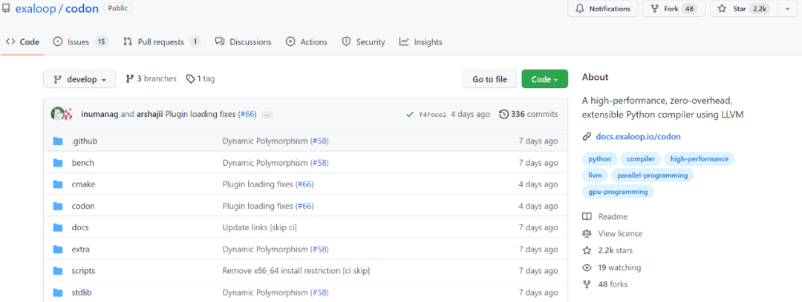 项目地址：[https://github.com/exaloop/codon](https://github.com/exaloop/codon) 作为高性能 Python 编译器，Codon 可将 Python 代码编译为本机机器代码，而无需任何运行时开销。在单线程上，Python 的典型加速大约为 10-100 倍或更多。Codon 的性能通常与 C/C++ 的性能相当。与 Python 不同，Codon 支持本机多线程，这可以使速度提高很多倍。Codon 可通过插件基础结构进行扩展，它允许用户合并新的库、编译器优化甚至关键字。 Codon 框架是完全模块化和可扩展的，允许无缝集成新模块、编译器优化、领域特定语言等，并积极为生物信息学和量化金融等多个领域开发新的 Codon 扩展。 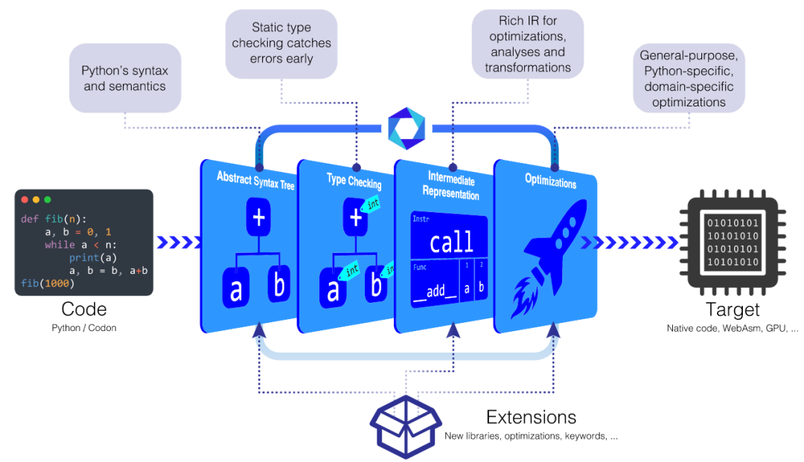 这个一经发布就疯狂揽星的编译器效果如何呢？下面来看看一些基准测试结果。

## 基准测试
以下是来自 Codon 基准测试套件的结果，比较了 Python、PyPy、C++ 和 Codon 在一系列任务和应用程序上的表现。 基准测试在以下设置上运行： 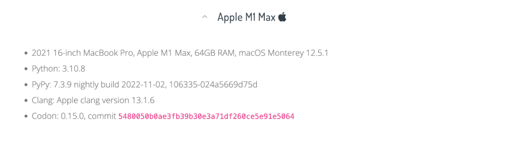 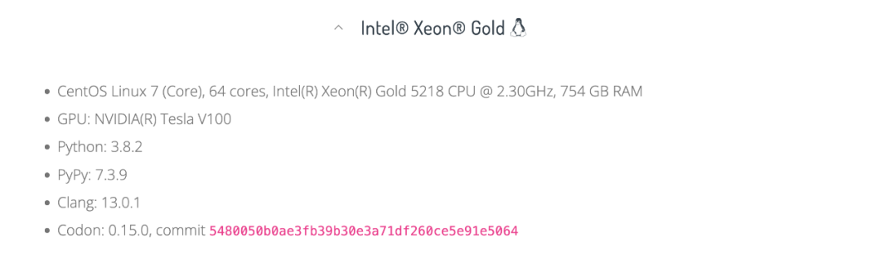

### Python、PyPy、Codon 的对比
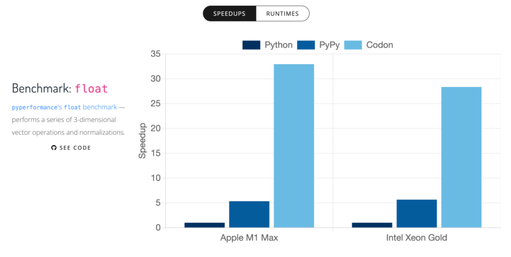 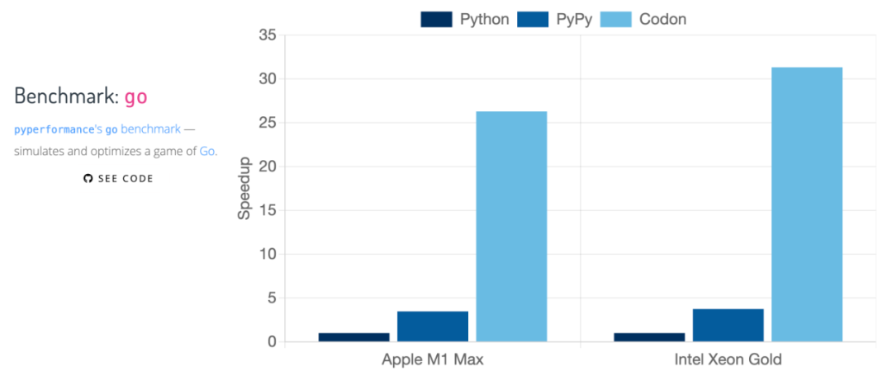 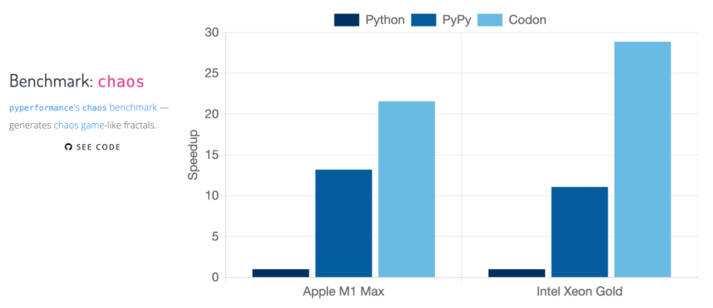 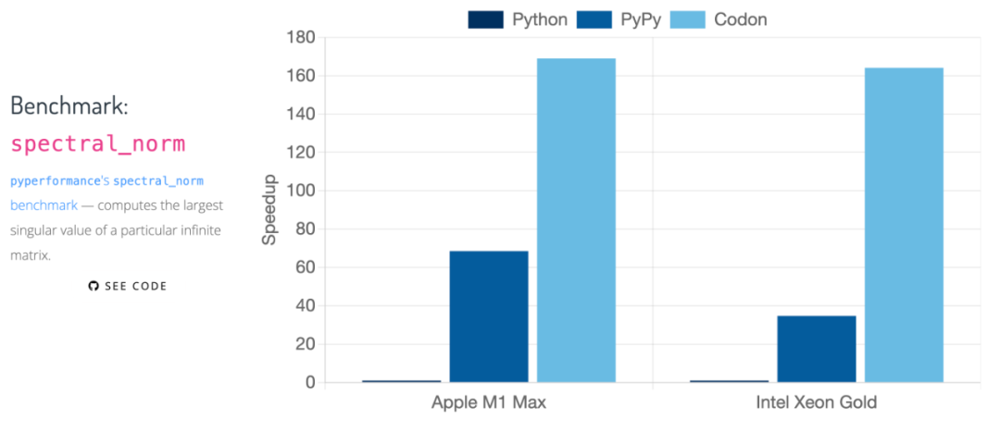 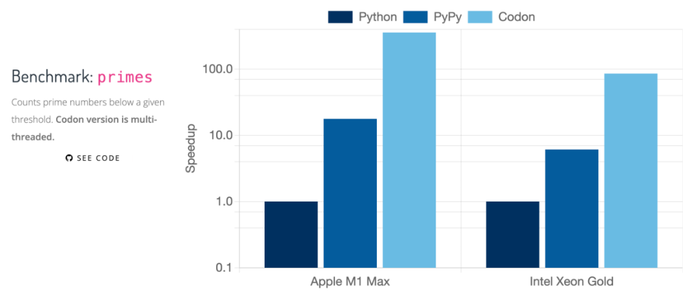 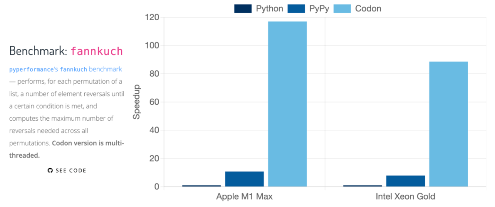 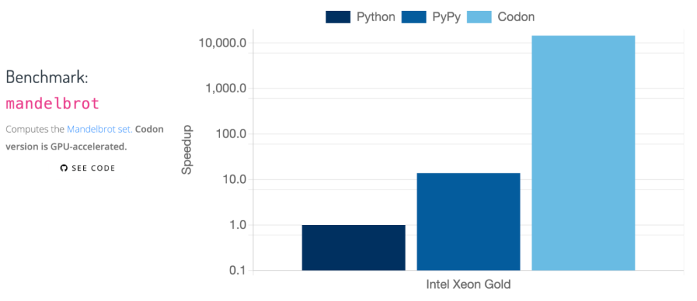

### Python、PyPy、C++ 、Codon 的对比
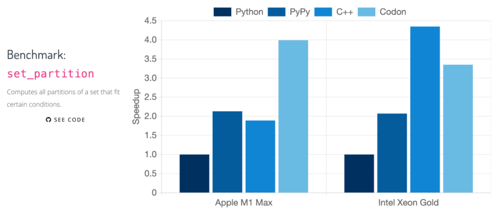 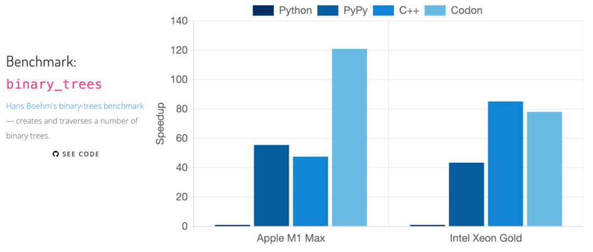 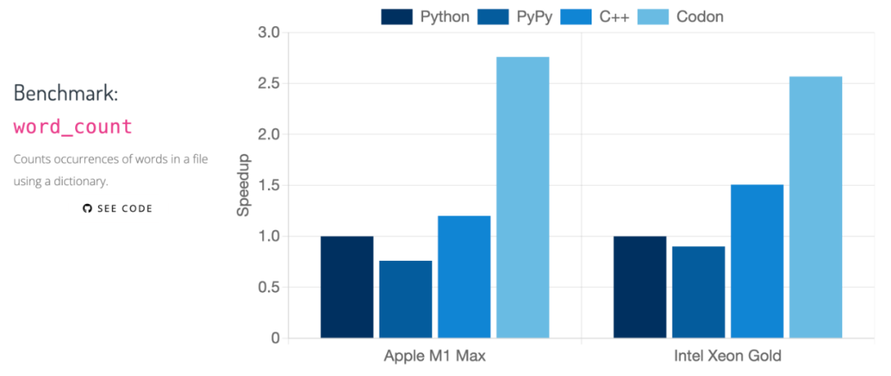 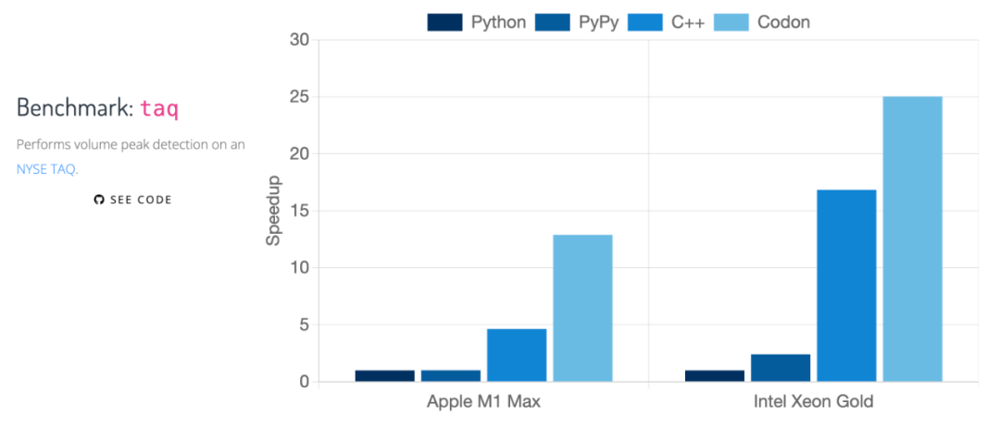 几种语言的具体对比如下： Codon 尽可能地遵循 CPython 语法、语义和 API，但在一些特殊情况下，考虑性能原因，Codon 与 CPython 会有些不同，例如 Codon 为 64 位 int，CPython 是任意宽度 int。在性能方面，CPython 的加速通常是 10-100 倍的加速。 虽然 Codon 确实提供了一个类似于 Numba 的 JIT 装饰器，但 Codon 通常是一个提前（ahead-of-time）编译器，可以将端到端程序编译为本机代码。它还支持编译更广泛的 Python 构造和库集。 PyPy 的目标是成为 CPython 的简易替代品，而 Codon 在一些地方有所不同，这些不同主要体现在消除动态运行时或虚拟机上，从而获得更好的性能。 Codon 通常生成与等效的 C 或 C++ 程序相同的代码，有时可以生成比 C/C++ 编译器更好的代码。原因有很多，例如更好的容器实现，Codon 不使用目标文件和内联所有库代码，或者不使用 C 执行的特定于 Codon 的编译器优化或 C++。 Codon 的编译过程实际上更接近 C++ 而不是 Julia。Julia 是一种动态类型语言，它执行类型推断作为优化，而 Codon 类型是提前检查整个程序。Codon 还试图通过采用 Python 的语法和语义来规避新语言的学习曲线。

## 常见问题解答
虽然 Codon 几乎支持 Python 的所有语法，但它并不是一个简单的替代品，大型代码库可能需要修改才能通过 Codon 编译器运行。例如，一些 Python 的模块还没有在 Codon 中实现，一些 Python 的动态特性是不允许的。Codon 编译器会生成详细的错误消息，以帮助识别和解决任何不兼容问题。Codon 支持无缝的 Python 互操作性，以处理需要特定 Python 库或动态性的情况。

### 我想使用 Codon，但我有一个大型 Python 代码库且不想移植，怎么办？
可以通过 @codon.jit 装饰器来使用 Codon，这将只编译带注释的函数，并自动处理与 Codon 之间的数据转换。它还允许使用任何特定于 Codon 的模块或扩展，例如多线程。

### 与其他语言和框架的互通性如何？
互通性是 Codon 的优先事项。我们不希望使用 Codon 使用户无法使用现有的其他优秀框架和库。Codon 支持与 Python 和 C/C++ 的完全互通。

### Codon 是否使用垃圾收集？
是的，Codon 使用了 Boehm 垃圾收集器。

### Codon 不支持 Python 模块 X 或函数 Y？
虽然 Codon 涵盖了 Python 标准库的一个相当大的子集，但它还没有涵盖每个模块的每个函数。请注意，仍然可以通过 Python 调用缺少的函数 from python import。许多缺少 Codon 本地实现的函数（例如 I/O 或 OS 相关功能）通常不会实现 Codon 的实质性加速。

### 对于我的应用程序，Codon 并不比 Python 快？
大部分时间用在 C 语言实现的库代码中的应用程序通常不会在 Codon 中看到实质性的性能提升。同样地，受 I/O 或网络限制的应用程序在 Codon 中也会遇到相同的瓶颈。

### 对于我的应用程序，Codon 比 Python 慢？
如果是这样，请将 Codon 明显比 Python 慢的情况报告给问题跟踪器。

### Codon 是免费的吗？
对于非生产用途，Codon 始终是免费的。用户可以免费将 Codon 用于个人、学术或其他非商业应用。

### Codon 是开源的吗？
Codon 是根据商业源代码许可证 (BSL) 获得许可的，它的源代码是公开可用的，并且可以免费用于非生产用途。BSL 在技术上不是「开源」许可证，尽管在许多情况下你仍然可以像对待任何其他开源项目一样对待 Codon。重要的是，根据 BSL，每个版本的 Codon 都会在 3 年后转换到实际的开源许可证（特别是 Apache）。
