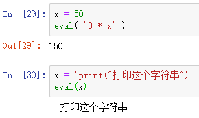

Python 内置函数
<a name="tD5Go"></a>
## 内置函数简介
Python 解释器自带的函数叫做“内置函数”，这些函数不需要import 导入就可以直接使用。<br />这是为什么呢？<br />运行Python代码需要一个叫做“Python解释器”的东西，这个解释器也是一个程序，它为Python使用者提供了一些常用的功能，并取了独一无二的名字，这就是“内置函数”。<br />就是由于Python内置函数，伴随着Python解释器一起启动，因此内置函数不需要导入，就可以直接使用。
<a name="EHpq6"></a>
## 常用的十种“内置函数” 
<a name="vIkN4"></a>
### ① `input`
`input()`：该函数接受一个标准输入数据，返回为 string 类型。
```python
x = input("请输入你的姓名：")
print(f"我的名字是{x}")
```
结果如下：<br />
<a name="zkjVd"></a>
### ② `enumerate()`
`enumerate()`：该函数获取一个集合（例如，元组），并将其作为枚举对象返回。
```python
x = ["张三","李四","王五"]
for index, value in enumerate(x):
    print(f"我叫{value}，我在列表中的索引是{index}")
```
结果如下：<br />
<a name="VTllG"></a>
### ③ `eval()`
`eval()`：该函数用来执行一个字符串表达式，并返回表达式的值。
```python
x = 50
eval( '3 * x' )

x = 'print("打印这个字符串")'
eval(x)
```
结果如下：<br />
<a name="CIUYQ"></a>
### ④ `format()`
`format()`：该函数用于字符串格式化。
```python
"{:.2f}".format(3.1415926)

"{0} {1}".format("hello", "world")
```
结果如下：<br />
<a name="cIKAq"></a>
### ⑤ `map()`
`map()`：该函数会根据提供的函数，对指定序列做映射。
```python
list(map(func,[1,2,3,4,5]))

list(map(lambda x: x * 2, [1, 2, 3, 4, 5]) )
```
结果如下：<br />
<a name="gYugE"></a>
### ⑥ `print()`
`print()`：该函数用于打印输出，最常见的一个函数。
```python
print("Hello World")  

print("www","baidu","com",sep=".")  # 设置间隔符
```
结果如下：<br />
<a name="S84Ge"></a>
### ⑦ `range()`
`range()`：在Python3中，该函数返回的是一个可迭代对象（类型是对象），而不是列表类型， 所以打印的时候不会打印列表。
```python
list(range(1,10))

list(range(1,10,2)) # 指定步长
```
结果如下：<br />
<a name="URfat"></a>
### ⑧ `reversed()`
`reversed()`：该函数没有返回值，但是会对列表的元素进行反向排序。
```python
x = ["a", "b", "c", "d"]
for i in reversed(x):
    print(i)
```
结果如下：<br />
<a name="uRReI"></a>
### ⑨ `sorted()`
`sorted()` ：该函数函数返回指定的可迭代对象的排序列表。
```python
a = ("b", "g", "a", "d", "f", "c", "h", "e")
x = sorted(a)
print(x)
```
结果如下：<br />
<a name="ZyoeQ"></a>
### ⑩  `zip()`
`zip()`：该函数用于将可迭代的对象作为参数，将对象中对应的元素打包成一个个元组，然后返回由这些元组组成的对象，这样做的好处是节约了不少的内存。
```python
a = [1,2,3]
b = [4,5,6]

list(zip(a,b))

for i,j in zip(a,b):
    print(f"打印{i}，再打印{j}")
```
结果如下：<br />
