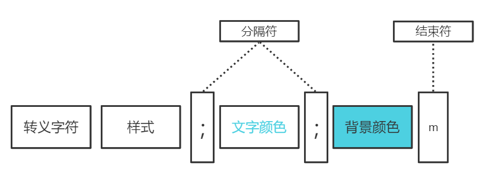
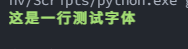
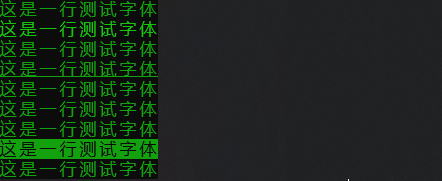
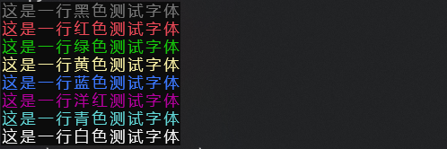
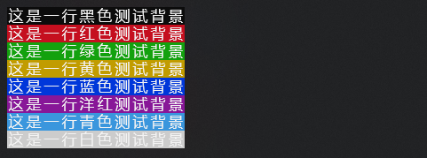
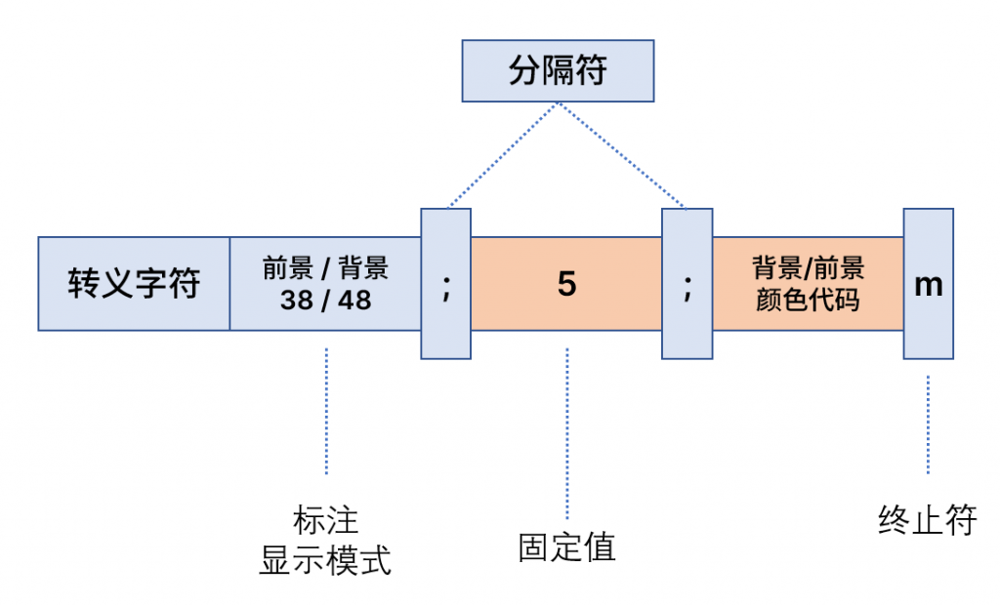
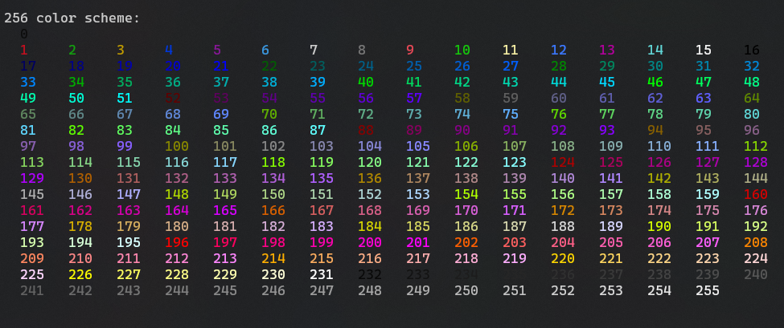

Python<br />在终端中，输出的字体总是单一颜色的，黑底白字。但是在一些场景并不能很好的满足输出的需求，比如在大量而快速输出中，输出一些提示性或者警告性的信息，普通的黑底白字输出可能或起不到作用。<br />这里将介绍如何输出颜色字体到终端界面中。
<a name="uZDTS"></a>
## 1、ANSI 转义序列
其实终端不仅能够显示程序的输出。它可以显示移动光标、为文本着色、清除整个屏幕，并且不仅仅是静态输出。比如颜色字体或者闪烁的光标或者是进度条。<br />通过使用特殊的输出字符串改变终端的输出行为，最简单的例子便是换行这个例子：`\n`
<a name="IPcyL"></a>
## 2、配色方案
有两种配色方案广泛应用于终端中：

- 16 色 （8 背景 + 8 前景）前景即是字体本身的颜色
- 255 色
<a name="oVasf"></a>
### 16 色
16色的配色方案包含两个颜色设置，每个8色，一个是背景色一个是字体色（也即前景色），这个配色方案的语法格式如下：<br /><br />首先举一个例子 ：
```bash
\033[1;32;40m
```
这里 `\033[` 是转义字符 `1` 代表高亮，`32` 代表前景色为绿色，背景色为黑色<br />输出到终端则是这个效果：<br />
<a name="XiOx0"></a>
#### 转义字符
转义字符可以有三种形式

- 十六进制：`\x16[`
- Unicode：`\u001b[`
- 八进制：`\033[`
<a name="jJsaa"></a>
#### 样式
这个样式指的是字体的显示样式：<br />0（默认值）、1（高亮）、22（非粗体）<br />4（下划线）、24（非下划线）、 5（闪烁）<br />25（非闪烁）、7（反显）、27（非反显）
```python
print('\033[0;32;40m这是一行测试字体\033[0m')
print('\033[1;32;40m这是一行测试字体\033[0m')
print('\033[22;32;40m这是一行测试字体\033[0m')
print('\033[4;32;40m这是一行测试字体\033[0m')
print('\033[24;32;40m这是一行测试字体\033[0m')
print('\033[5;32;40m这是一行测试字体\033[0m')
print('\033[25;32;40m这是一行测试字体\033[0m')
print('\033[7;32;40m这是一行测试字体\033[0m')
print('\033[27;32;40m这是一行测试字体\033[0m')
```
具体效果看下面的动图：<br /><br />需要注意的是具体的效果可能收到使用的终端的限制，目前在CMD中输出并不会被识别，但是在window terminal中是成功的输出以上内容。
<a name="kk3oj"></a>
#### 颜色设置
**前景色**：30（黑色）、31（红色）、32（绿色）、 33（黄色）、34（蓝色）、35（洋 红）、36（青色）、37（白色）<br />**背景色**：40（黑色）、41（红色）、42（绿色）、 43（黄色）、44（蓝色）、45（洋 红）、46（青色）、47（白色）<br />前景色，即字体颜色的展示：
```python
print('\033[1;30;40m这是一行黑色测试字体\033[0m')
print('\033[1;31;40m这是一行红色测试字体\033[0m')
print('\033[1;32;40m这是一行绿色测试字体\033[0m')
print('\033[1;33;40m这是一行黄色测试字体\033[0m')
print('\033[1;34;40m这是一行蓝色测试字体\033[0m')
print('\033[1;35;40m这是一行洋红测试字体\033[0m')
print('\033[1;36;40m这是一行青色测试字体\033[0m')
print('\033[1;37;40m这是一行白色测试字体\033[0m')
```
<br />背景色：
```python
print('\033[1;37;40m这是一行黑色测试背景\033[0m')
print('\033[1;37;41m这是一行红色测试背景\033[0m')
print('\033[1;37;42m这是一行绿色测试背景\033[0m')
print('\033[1;37;43m这是一行黄色测试背景\033[0m')
print('\033[1;37;44m这是一行蓝色测试背景\033[0m')
print('\033[1;37;45m这是一行洋红测试背景\033[0m')
print('\033[1;37;46m这是一行青色测试背景\033[0m')
print('\033[1;37;47m这是一行白色测试背景\033[0m')
```

<a name="Ld5zk"></a>
### Colorama 一个颜色输出的模块
每次输入输出都需要如此配置是非常麻烦的事，Colorama 提供方便的字体颜色输出的配置
```python
from colorama import init, Fore, Back, Style

# Initializes Colorama
init(autoreset=True)

print(Style.BRIGHT + Back.YELLOW + Fore.RED + "from colorama import init, Fore, Back, Style

# Initializes Colorama
init(autoreset=True)

print(Style.BRIGHT + Back.YELLOW + Fore.RED + "Colorama ")")
```

<a name="cRb49"></a>
### 简单的变色函数
```python
background_color_dict={
    'BLACK':40,
    'RED':41,
    'GREEN':42,
    'YELLOW':43,
    'BLUE':44,
    'MAGENTA':45,
    'CYAN':46,
    'WHITE':47
}

text_color_dict={
    'BLACK':30,
    'RED':31,
    'GREEN':32,
    'YELLOW':33,
    'BLUE':34,
    'MAGENTA':35,
    'CYAN':36,
    'WHITE':37
}

style_dict={
    'normal':0,
    'bold':1,
    'light':2,
    'italicize':3,
    'underline':4,
    'blink':5
}

def set_text_color(str_text, style, text_color, background_color):
    str = str_text
    style_code = style_dict[style]
    text_color_code = text_color_dict[text_color]
    back_color_code = background_color_dict[background_color]
    print_text = f'\033[{style_code};{text_color_code};{back_color_code}m{str}\033[0m'
    return print_text
```
<a name="DSVtk"></a>
### 256色
256色的输出格式和16色的有点不一样<br /><br />转义字符和上面的是一样的：

- 十六进制：`\x16[`
- Unicode：`\u001b[`
- 八进制：`\033[`

标注显示模式则是38或者48选择一个表名后面颜色代码是前景色还是背景色。<br />如果想要同时修改，则使用两个这样的语句即可：
```python
print("\033[48;5;160m\033[38;5;231m背景前景修改ABCDE \033[38;5;226m前景修改ABCDE\033[0;0m")
```
<br />输出一下所有的前景颜色
```python
def print_colors_256(color_code):
    num1 = str(color_code)
    num2 = str(color_code).ljust(3, ' ')
    if color_code % 16 == 0:
        return(f"\033[38;5;{num1}m {num2} \033[0;0m\n")
    else:
        return(f"\033[38;5;{num1}m {num2} \033[0;0m")

print("256 color scheme:")
print('',end=' ')
print(' '.join([print_colors_256(x) for x in range(256)]))
```
<br />这个效果可能和终端输出不一致，这可能是因为这里终端使用了不同的主题，对颜色有着不同的修改。<br />原文链接：[https://www.kleinlam.space/%E5%8D%9A%E5%AE%A2/python/python-%E7%BB%88%E7%AB%AF%E8%BE%93%E5%87%BA%E9%A2%9C%E8%89%B2%E5%AD%97%E4%BD%93/](https://www.kleinlam.space/%E5%8D%9A%E5%AE%A2/python/python-%E7%BB%88%E7%AB%AF%E8%BE%93%E5%87%BA%E9%A2%9C%E8%89%B2%E5%AD%97%E4%BD%93/)
