Python 函数

## 1、函数是对象
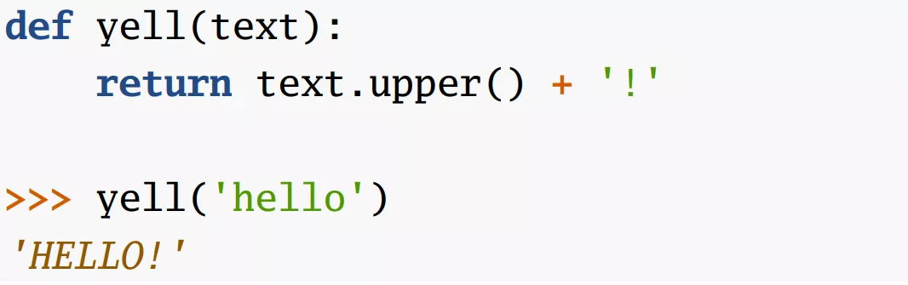 这意味着，`yell` 能赋值给 `bark`，如下所示：  而`bark`轻松被赋予`yell`的功能 

## 2、删除函数
函数既然是对象，可以删除函数，如下： 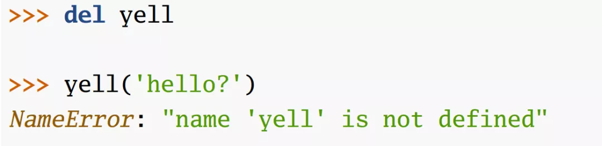 但是`bark`还是能够正常调用： 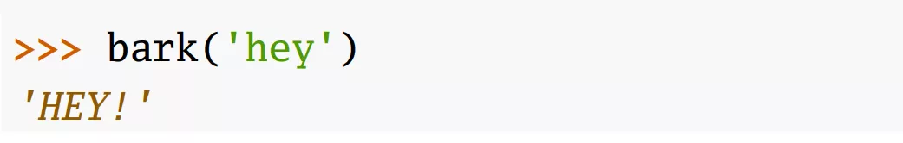

## 3、这说明：函数名字和函数本身完全是分开的

## 4、函数既然是对象，就可以结合数据结构使用
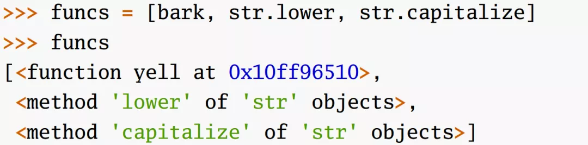 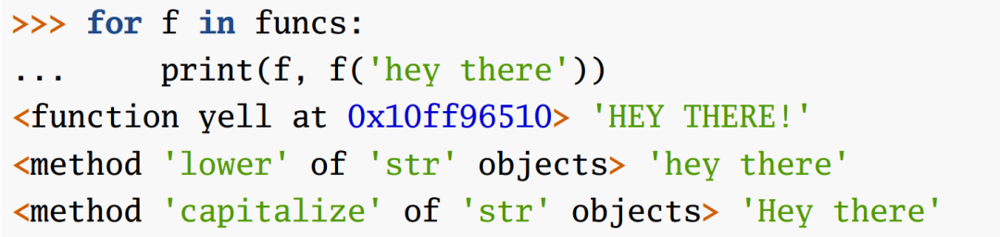

## 5、函数既然是对象，就可以作为函数参数
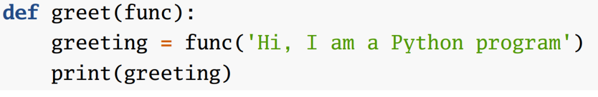 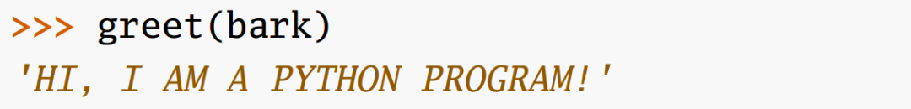

## 6、函数既然是对象，就可以在嵌套在函数体内
如下所示，函数内再定义2个函数对象 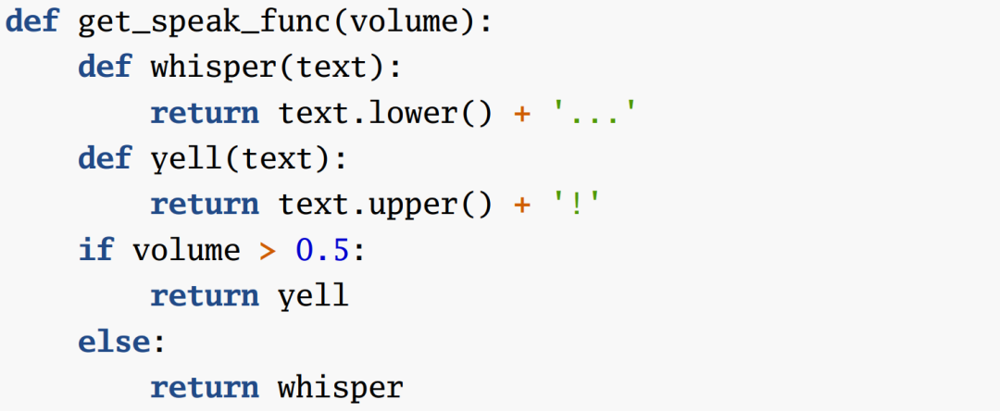

## 7、内层函数对象能够记忆住父函数的变量
官方术语：闭包，记住这个例子： 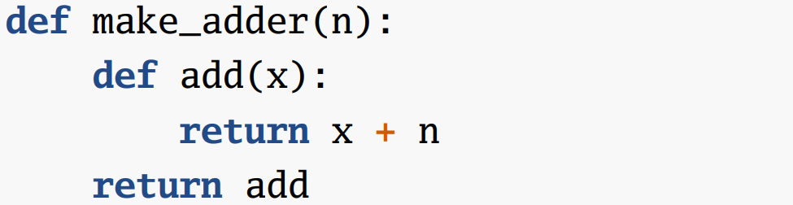  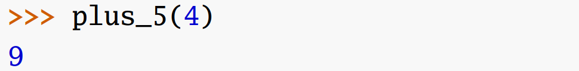

## 8、所有的函数都是对象，但是所有的对象并不一定都是函数

## 9、对象成为函数需要实现`__call__`协议
实现`__call__`协议后，`plus_3`对象便成为函数，可以`plus_3(4)`了！强大。 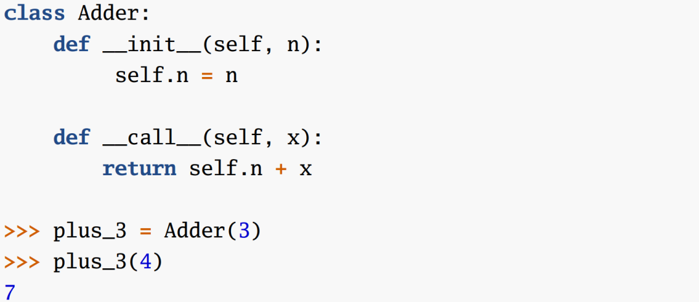
