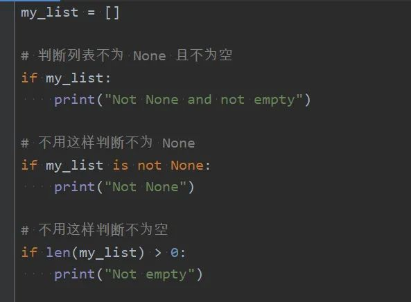

Python<br />Python 在涉及真值判断（Truth Value Testing）时，语法很简便。<br />比如，在判断某个对象是否不为 None 时，或者判断容器对象是否不为空时，并不需要显示地写出判断条件，只需要在 if 或 while 关键字后面直接写上该对象即可。<br />下图以列表为例，if my_list 这个简短的写法可以表达出两层意思：<br /><br />如果需要作出相反的判断，即“如果为 None 或为空”，只需要写成if not my_list 即可。
<a name="n5NOi"></a>
## 与众不同的真值判断方式
通常而言，当一个值本身是布尔类型时，写成"if xxx"（如果真），在语义上就很好理解。如果 xxx 本身不是布尔类型时，写成“if xxx”（如果某东西），则在语义上并不好理解。<br />在 C/C++/Java 之类的静态语言中，通常要先基于 xxx 作一个比较操作，比如“if (xxx == null)”，以此得到一个布尔类型的值的结果，然后再进行真值判断。否则的话，若“if xxx”中有非布尔类型的值，则会报类型错误。<br />Python 这门动态语言在这种场景中表现出了一种灵活性，那么问题来了：**为什么 Python 不需要先做一次比较操作，直接就能对任意对象作真值判断呢？**<br />先来看看文档 中对真值判断的描述：<br /><br />**简单而言，Python 的任何对象都可以用在 if 或 while 或布尔操作（and、or、not）中，默认情况下认为它是 true，除非它有**`**__bool__()**`** 方法返回False 或者有**`**__len__()**`** 方法返回0 。**<br />对于前面的例子，my_list 没有`__bool__()` 方法，但是它有`__len__()` 方法，所以它是否为 true，取决于这个方法的返回值。
<a name="GSavw"></a>
## 真值判断的字节码
接着，继续刨根问底：**Python 为什么可以支持如此宽泛的真值判断呢？在执行if xxx 这样的语句时，它到底在做些什么？**<br />对于第一个问题，Python 有个内置的 `bool()` 类型，可以将任意对象转化成布尔值。那么，这是否意味着 Python 在进行真值判断时，会隐式地 调用 `bool()` 呢（即转化成`if bool(xxx)`）？（答案为否，下文有分析）<br />对于第二个问题，可以先用dis 模块来查看下：<br /><br />POP_JUMP_IF_FALSE指令对应的是 if 语句那行，它的含义是：
> If TOS is false, sets the bytecode counter to _target_. TOS is popped.

如果栈顶元素为 false，则跳转到目标位置。<br />这里只有跳转动作的描述，仍看不到一个普通对象是如何变成布尔对象的。<br />Python 在解释器中到底是如何实现真值判断的呢？
<a name="fJX6D"></a>
## 真值判断的源码实现
找到了 CPython 的源码（文件：ceval.c、object.c）：<br /><br /><br />可以看出，对于布尔类型的对象（即 Py_True 和 Py_False），代码会进入到快速处理的分支；而对于其它对象，则会用 PyObject_IsTrue() 计算出一个 int 类型的值。<br />PyObject_IsTrue() 函数在计算过程中，依次会获取 nb_bool、mp_length 和 sq_length 的值，对应的应该就是 `__bool__()` 和 `__len__()` 这两个魔术方法的返回值。<br />这个过程就是前文中所引用的官方文档的描述，正是想要找的答案！<br />另外，对于内置的 `bool()`，它的核心实现逻辑正是上面的  PyObject_IsTrue() 函数，源码如下（boolobject.c）：<br /><br />所以，Python 在对普通对象作真值判断时，并没有隐式地调用 bool()，相反它调用了一个独立的函数（PyObject_IsTrue()），而这个函数又被 bool() 所使用。<br />也就是说，`**bool()**`** 与 if/while 语句对普通对象的真值判断，事实上是基本相同的处理逻辑。** 知道了原理，就会明白`if bool(xxx)` 这种写法是多此一举的了（曾见到过）。<br />至此，已经回答了前文中提出的问题。
<a name="NnNQC"></a>
## 验证真值判断的过程
接下来，有 3 个测试例子，可以作进一步的验证：<br /><br />可以暂停而思考下：`bool(Test1)` 与 `bool(Test1())` 各是什么结果？然后依次判断剩下的两个类，结果又会是什么？<br />揭晓答案：
```python
bool(Test1)    # True
bool(Test2)    # True
bool(Test3)    # True

bool(Test1())  # True
bool(Test2())  # False
bool(Test3())  # True
```
原因如下：

- 类对象没被实例化时，`bool()` 不会调用它的 `__bool__()` 或 `__len__()` 这两个魔术方法
- 类对象被实例化后，若同时存在 `__bool__()` 或 `__len__()` 魔术方法，则 `bool()` 会先调用 `__bool__()` 方法（PS：这个方法要求返回值必须为 bool 类型，因此只要有它，就必然不需要再用`__len__()` 方法来判断真假）
<a name="lI0PD"></a>
## 数字类型如何作真值判断？
除了这 3 个例子，还有一种情况值得验证，那就是**对于数字类型，它们是怎么做真值判断的呢？**<br />可以验证一下数字类型是否拥有那两个魔术方法：
```python
hasattr(2020, "__bool__")
hasattr(2020, "__len__")
```
不难验证出，数字拥有的是 `__bool__()` 魔术方法，并没有`__len__()` 魔术方法，而且所有类型的数字其实被分成了两类：

- `__bool__()` 返回 False：所有表示 0 的数字，例如0, 0.0, 0j, Decimal(0), Fraction(0, 1)
- `__bool__()` 返回 True：所有其它非 0 的数字
<a name="vQPTz"></a>
## 小结
Python 中if xxx 这种简便的写法，虽然是正规的真值判断语法，并它但并不符合常规的语义。在 C/C++/Java 之类的语言中，要么 xxx 本身是布尔类型的值，要么是一种可返回布尔类型值的操作，但是在 Python 中，这个“xxx”竟然还可以是**任意的 Python 对象！**<br />本文通过对文档、字节码和 CPython 解释器的源码逐步分析，发现了 Python 的真值判断过程并不简单，可以提炼出以下的几个要点：

- **if/while 是隐性的布尔操作符：** 它们除了有“判断”真假的作用，还具有隐式地将普通对象计算出布尔结果的功能。实际的操作是解释器根据“POP_JUMP_IF_FALSE”指令来完成的，其核心逻辑跟内置的 `bool()` 是共用了一个底层方法
- **真值判断过程依赖两个魔术方法：** 除非被判断对象有`__bool__()` 方法返回False 或者有`__len__()` 方法返回0 ，否则布尔操作的结果都是 True。两个魔术方法总是会先计算`__bool__()`
- **数字类型也可做真值判断：** 数字有`__bool__()` 魔术方法，但没有`__len__()` 魔术方法，除了表示 0 的数字为 False，其它数字都为 True
