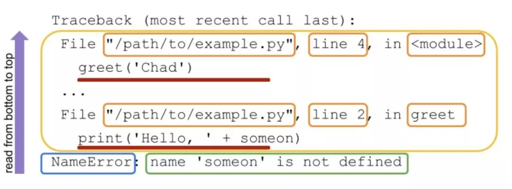

Python 异常<br />在写 Python 代码的时候,当代码中出现错误，会在输出的时候打印 Traceback  错误信息，很多初学者看到那一堆错误信息，往往都会处于懵逼状态，脑中总会冒出一句，这都是些啥玩意。如果第一次看到它，也许不知道它在告诉你什么。虽然 Python 的 Traceback  提示信息看着挺复杂，但是里面丰富的信息，可以帮助你诊断和修复代码中引发异常的原因，以及定位到具体哪个文件的哪行代码出现的错误，所以说学会看懂 Traceback  信息是非常重要的，另外在面试的时候也经常会问到 Python 中的异常类型及其含义，那么，接下来就对其进行详细理解。
<a name="O3ltK"></a>
### 什么是 Traceback
Traceback 是 Python  错误信息的报告。在其他编程语言中有着不同的叫法包括 stack trace, stack  traceback, backtrac  等名称, 在 Python  中，使用的术语是 Traceback。后面提到的错误信息等词都表示Traceback。当程序导致异常时，Python 将打印 Traceback 以帮助你知道哪里出错了。下面是一个例子来说明这种情况
```python
# example.py 
def  greet(someone ):
    print('Hello, ' + someon )

greet('Chad')
```
这里首先定义了函数 greet,然后传入参数 someone，然后函数内，一个 print  语句其中 someon  是一个没有定义的变量，然后通过 `greet ('Chad')`,调用刚才定义的 greet  函数,运行之后会出现如下错误信息。(Python 中的错误信息开头就是 Traceback。)
```python
Traceback  (most  recent  call  last ):
  File  "/Users/chenxiangan/pythonproject/demo/exmpale.py", line  5, in  <module>
    greet ('Chad')
  File  "/Users/chenxiangan/pythonproject/demo/exmpale.py", line  3, in  greet 
    print ('Hello, ' + someon )
NameError: name  'someon' is  not  defined 
```
此错误输出包含诊断问题所需的所有信息。错误输出的最后一行一般会告诉你引发了什么类型的异常，以及关于该异常的一些相关信息。错误信息的前几行指出了引发异常的代码文件以及行数。在上面的错误信息中，异常类型是 NameError，意思是名称使用了一个没定义的名称(变量、函数、类)的引用。在本例中，引用的名称是 someon。一般情况下看错误信息的最后一行就能定位到错误的原因。然后在代码中搜索错误提示中的名称"someon"，然后发现这是一个拼写错误，然后改成 someone  即可。然而，有些代码的错误信息要比这个复杂的多。
<a name="Ukhw1"></a>
### 如何阅读 Python 的 Traceback  信息？
当你想确定代码为什么引发异常的时侯，可以根据 Python  的 Traceback  获取许多有用的信息。下面，将列举一些常见的 Traceback，以便理解 Tracebac 中包含的不同信息。
<a name="fYuIU"></a>
#### Python Traceback 信息一览
每个 Python 的 Traceback  信息都有几个重要的部分。下图显示了各个组成部分:<br />

- 蓝框:Traceback 的最后一行为错误消息行。其中包含引发的异常名称。
- 绿框：异常名称后面是错误消息。此消息通常包含有用的信息，用于了解引发异常的原因。
- 黄色方框:阅读顺序由下而上,最下面的信息，是抛出错误的最外层的位置，越往上代码调用深度越深。然后每个出错的文件会有两条错误信息，第一行是 File 后面紧跟着文件的路径，然后是行数，最后是模块或者方法名。在 Pycharm  中点击文件的链接即可定位到错误的位置。
- 红色下划线：第二行就是实际执行的代码语句了。
<a name="Rhczl"></a>
#### 一个具体的🌰
通过一些特定的 Traceback 信息，可以帮助更好地理解并查看 Traceback 将提供什么信息。通过下面的示例代码来说明 Python 中 Traceback 所提供的信息
```python
def  who_to_greet(person ):
    return  person  if  person  else  input ('Greet  who? ')

def  greet(someone, greeting='Hello'):
    print(greeting  + ', ' + who_to_greet (someone ))

def  greet_many(people):
    for  person  in  people:
        try:
            greet(person )
        except  Exception:
            print ('hi, ' + person )
```
定义一个 who_to_greet  函数，然后接受一个值 person，并根据 if  判断返回相应结果。然后,greet 函数接受一个 someone 和一个可选的 greeting，之后调用 print  函数,在 print 中调用 who_to_greet 函数并传入参数 someone。最后，greet_many(),将迭代 people  列表并调用 greet 函数。如果通过调用 greet()引发异常，则会打印一个简单的问候语。只要提供了正确的输入，此代码就没有任何可能导致异常被引发的错误。如果在 greetings.py  中调用 greet 函数,并传入值(例如 greet ('chad',greting ='Yo'))，那么将获得以下 Traceback  信息
```python
Traceback  (most  recent  call  last ):
  File  "/Users/chenxiangan/pythonproject/demo/greetings.py", line  17, in  <module>
    greet ('chad',greting  ='Yo')
TypeError: greet () got  an  unexpected  keyword  argument  'greting'
```
之前说过阅读 Python 的 Traceback  信息，是由下而上进行阅读的，这里再一起看一看。首先，需要看的是错误信息的最后一行，通过最后一行可以知道错误的类型以及一些错误原因。意思是说：调用 `greet()`的时候使用了一个未知的参数，这个未知参数就是 greting。好的，然后需要继续向上看，可以看到导致异常的行。在这个例子中看到的是调用 greet 方法的具体代码。它的上一行提供了代码所在文件的路径，以及代码文件的行号以及它所在的模块。(Pycharm 中通过点击文件链接可以定位到具体位置)在这个例子中，因为代码没有使用任何其他 Python  模块，所以在这里看到<module>，它表示所处位置是在执行的文件。使用不同的文件和不同的调用方式调用 greet 方法，得到的 Traceback  信息也是不同的，下面就通过文件导入的形式来执行 greet 方法。看看结果有什么区别吧
```python
# example.py 
from  greetings  import  greet 
greet (1)
```
运行之后的结果
```python
Traceback  (most  recent  call  last ):
  File  "/Users/chenxiangan/pythonproject/demo/exmpale.py", line  3, in  <module>
    greet (1)
  File  "/Users/chenxiangan/pythonproject/demo/greetings.py", line  6, in  greet 
    print (greeting  + ', ' + who_to_greet (someone ))
TypeError: can  only  concatenate  str  (not  "int") to  str 
```
在本例中引发的异常同样是一个类型错误,但这一次消息的帮助要小一些。它只是告诉你，在代码的某个地方，字符串只能和字符串拼接，不能是 int。向上移动,可以看到执行的代码行。然后是文件和行号的代码。不过，这一次得到的不是，而是正在执行的函数的名称 greet()。然后继续往上看，一行执行的代码，看到问题代码是 `greet()`函数调用时传入了一个整数。有时在引发异常之后，另一部分代码会捕获该异常并导致异常。在这种情况下，Python 将按接收顺序输出所有异常信息，最外层的异常信息处于 Traceback 内容的最下面位置。可能看起来有点懵，下面使用一个具体例子进行说明。在 greetings.py  文件中调用 greet_many  方式具体调用代码如下:
```python
greet_many (['Chad', 'Dan', 1])
```
运行之后输出的错误信息如下
```python
Hello, Chad 
Hello, Dan 
Traceback  (most  recent  call  last ):
  File  "/Users/chenxiangan/pythonproject/demo/greetings.py", line  12, in  greet_many 
    greet (person )
  File  "/Users/chenxiangan/pythonproject/demo/greetings.py", line  6, in  greet 
    print (greeting  + ', ' + who_to_greet (someone ))
TypeError: can  only  concatenate  str  (not  "int") to  str 

During  handling  of  the  above  exception, another  exception  occurred:

Traceback  (most  recent  call  last ):
  File  "/Users/chenxiangan/pythonproject/demo/greetings.py", line  17, in  <module>
    greet_many (['Chad', 'Dan', 1])
  File  "/Users/chenxiangan/pythonproject/demo/greetings.py", line  14, in  greet_many 
    print ('hi, ' + person )
TypeError: can  only  concatenate  str  (not  "int") to  str 
```
这次好像不太一样,比之前的内容多了不少，而且有两个 Traceback 块信息，这是什么意思呢？注意这句话
```python
During  handling  of  the  above  exception, another  exception  occurred:
```
它的意思是:在处理上述异常期间，发生了另一个异常。简单理解就是在 except 中的代码出现了异常。所以导致了这种现象。这个例子就是在第三次循环的时候 person=1 然后字符串 hi  和1 不能进行拼接操作，然后再次引发了异常。查看所有的错误信息输出可以帮助您了解异常的真正原因。有时，当您看到最后一个异常被引发，并由此产生错误信息时，你可能仍然看不出哪里出错了。比如这例子，直接通过最后的异常看不到问题具体出在哪,这个时候就要考虑继续往上看了。
<a name="PneVp"></a>
### Python 中有哪些常见的异常类型
在编程时，知道如何在程序引发异常时读取 Python 异常信息非常有用，如果再了解一些常见的异常类型那就更好了。有时候在面试的时候也会遇到提问 Python 中常见的异常类型，以及其含义，所以这里也建议大家都了解以下。下面就列举一些出现频次高而且非常重要的异常类型，希望大家能够有一定的印象。
<a name="ELbul"></a>
#### AttributeError
当访问一个对象的属性，但是这个属性并没有在这个对象定义的时候，就会引发 AttributeError。下面是一个引发 AttributeError 异常的示例:
```python
a  = 1
a.b 
```
运行之后引发异常
```python
Traceback  (most  recent  call  last ):
  File  "/Users/chenxiangan/pythonproject/demo/exmpale.py", line  2, in  <module>
    a.b 
AttributeError: 'int' object  has  no  attribute  'b'
```
AttributeError 的错误消息行告诉我们特定对象类型（在本例中为 int）没有访问的属性，在这个例子中属性为 b。点击文件链接可以快速定位到具体的错误代码的位置。<br />大多数情况下，引发这个异常表明你正在处理的对象可能不是期望的类型。
```python
a_list  = (1, 2)
a_list.append (3)
```
运行之后抛出异常信息
```python
Traceback  (most  recent  call  last ):
  File  "/Users/chenxiangan/pythonproject/demo/exmpale.py", line  2, in  <module>
    a_list.append (3)
AttributeError: 'tuple' object  has  no  attribute  'append'
```
这里尝试给 a_list 对象进行 append 操作但是引发了异常，这里的错误信息说，tuple 对象没有 append 属性。原因就是以为 a_list 是列表但是实际上它是元组，元组是不可变类型不支持添加元素操作所以出错了。这里也告诉大家，以后定义变量名的时候也要主要规范问题，否则就容易出现这种，期望类型错误的情况。还有一种情况就是当对 None 进行属性操作的时候，很容易引发上面的异常
```python
a_list  = None 
a_list.append (3)
```
运行抛出异常
```python
Traceback  (most  recent  call  last ):
  File  "/Users/chenxiangan/pythonproject/demo/exmpale.py", line  2, in  <module>
    a_list.append (3)
AttributeError: 'NoneType' object  has  no  attribute  'append'
```
是不是很眼熟，遇到这种情况不要慌，分析看看哪个对象是 None  就好了。
<a name="WEPU0"></a>
#### ImportError
在使用 import 导入模块时，如果要导入的模块找不到，或者从模块中导入模块中不存在的内容。这时就会触发 ImportError 类型的错误或者它的子类 ModuleNotFoundError。
```python
import  aaa 
```
运行后输出
```python
Traceback  (most  recent  call  last ):
  File  "/Users/chenxiangan/pythonproject/demo/exmpale.py", line  1, in  <module>
    import  aaa 
ModuleNotFoundError: No  module  named  'aaa'
```
在这个例子中可以看到，当使用 `import` 导入一个不存在的模块时，就会出现 ModuleNotFoundError 的错误,Traceback 最下面一句信息给出了原因，没有名为 aaa 的模块，然后再运行一个例子
```python
from  collections  import  asdf 
```
运行之后的内容
```python
Traceback  (most  recent  call  last ):
  File  "/Users/chenxiangan/pythonproject/demo/exmpale.py", line  1, in  <module>
    from  collections  import  asdf 
ImportError: cannot  import  name  'asdf' from  'collections'
```
根据前面的经验可以得知原因，不能从 collections 模块中导入名为 asdf 的模块。有时候为了程序能兼容在各个系统的时候，如果一个包找不到，找另一个的时候,比如在 windows 中不能使用 ujson ,uvloop这两个包，但是在 unix 系统上是可以运行的，这个时候就可以使用下面的方法。
```python
try:
    import  ujson  as  json 
except  ImportError  as  e:
    import  json 
```
首先导入 ujson 然后使用 as  给他重命名为 json,如果出现错误就会进入 except 模块然后导入标准库的 json 包，因为这边的库名已经叫 json 了所以不用再重命名了。记住这个技巧非常的有用哦。
<a name="pS29q"></a>
#### IndexError
尝试从序列（如列表或元组）中检索索引，但是序列中找不到该索引。此时就会引发 IndexError。例如
```python
a_list  = ['a', 'b']
a_list[3]
```
运行之后的结果
```python
Traceback  (most  recent  call  last ):
  File  "/Users/chenxiangan/pythonproject/demo/exmpale.py", line  2, in  <module>
    a_list[3]
IndexError: list  index  out  of  range 
```
通过 IndexError 的错误消息的最后一不能得到一个准确的信息，只知道一个超出范围的序列引用以及序列的类型，在本例中是一个列表。需要往上阅读错误信息，才能确定错误的具体位置。这里得知错误代码是 `a_list[3]`原因是索引3 超出了列表的范围，因为最大就是1(索引下标从0 开始的)。
<a name="W3Fyo"></a>
#### KeyError
与 IndexError 类似，当你访问映射(通常是 dict )中不包含的键时，就会引发 KeyError。
```python
a_dict={}
a_dict['b']
```
运行之后
```python
Traceback  (most  recent  call  last ):
  File  "/Users/chenxiangan/pythonproject/demo/exmpale.py", line  2, in  <module>
    a_dict['b']
KeyError: 'b'
```
KeyError 的错误消息行给出找不到关键字 b。并没有太多的内容，但是，结合上面的错误信息，就可以解决这个问题。
<a name="qBw0g"></a>
#### NameError
当你引用了变量、模块、类、函数或代码中没有定义的其他名称时，将引发 NameError。
```python
def  greet (person ):
    print (f'Hello, {persn}')
greet ('World')

运行之后
Traceback  (most  recent  call  last ):
  File  "/Users/chenxiangan/pythonproject/demo/exmpale.py", line  3, in  <module>
    greet ('World')
  File  "/Users/chenxiangan/pythonproject/demo/exmpale.py", line  2, in  greet 
    print (f'Hello, {persn}')
NameError: name  'persn' is  not  defined 
```
NameError traceback 的错误消息行给出了缺失的名称 persn。这个例子中，在 print 使用了没有定义过的变量 persn  所以出现了错误。一般在拼写变量名出现问题时会引发这种错误。
<a name="NAYFq"></a>
#### SyntaxError
当代码中有不正确的 Python 语法时，就会引发 SyntaxError。下面的问题是函数定义行末尾缺少一个冒号。
```python
def  greet (person )

运行之后
  File  "/Users/chenxiangan/pythonproject/demo/exmpale.py", line  1
    def  greet (person )
                    ^
SyntaxError: invalid  syntax 
```
SyntaxError 的错误消息行只告诉你代码的语法有问题。查看上面的行才能得到问题所在的行，通常会用一个^(插入符号)指向问题点。此外，细心的朋友会注意到，在 SyntaxError 异常内容的第一行没有了之前的(most recent  call  last )。这是因为 SyntaxError 是在 Python 尝试解析代码时引发的，实际上代码并没有执行。
<a name="nJmKz"></a>
#### TypeError
当你的代码试图对一个无法执行此操作的对象执行某些操作时，例如将字符串添加到整数中，以及一开始的例子使用 append 方法给元组添加元素，这些都会引发 TypeError。以下是引发 TypeError 的几个示例：
```python
>>> 1 + '1'
Traceback  (most  recent  call  last ):
  File  "<stdin>", line  1, in  <module>
TypeError: unsupported  operand  type (s ) for  +: 'int' and  'str'
>>> '1' + 1
Traceback  (most  recent  call  last ):
  File  "<stdin>", line  1, in  <module>
TypeError: must  be  str, not  int 
>>> len (1)
Traceback  (most  recent  call  last ):
  File  "<stdin>", line  1, in  <module>
TypeError: object  of  type  'int' has  no  len ()
```
以上所有引发类型错误的示例都会产生包含不同消息的错误消息行。它们每一个都能很好地告诉你哪里出了问题。前两个示例尝试将字符串和整数相加。然而，它们有细微的不同

- 第一个是尝试在 int 中拼接一个 str。
- 第二个是尝试在 str 中拼接一个 int。

错误消息行反映了这些差异。最后一个示例尝试在 int 上调用 `len()`。错误消息行告诉我们不能使用 int 执行此操作。
<a name="vQUY1"></a>
#### ValueError
当对象的值不正确时就会引发 ValueError。这个和前面说的因为索引的值不在序列的范围内，而导致 IndexError 异常类似。下面看两个例子
```python
>>> a, b, c  = [1, 2]
Traceback  (most  recent  call  last ):
  File  "<stdin>", line  1, in  <module>
ValueError: not  enough  values  to  unpack  (expected  3, got  2)
>>> a, b  = [1, 2, 3]
Traceback  (most  recent  call  last ):
  File  "<stdin>", line  1, in  <module>
ValueError: too  many  values  to  unpack  (expected  2)
```
这些示例中的 ValueError 错误消息行可以准确地告诉我们值的一些问题：在第一个示例中，错误信息行是没有足够多的值去 unpack (解包)。括号理面详细的写了你希望解包3个值但实际上只给了2 个。第二个示例中，错误信息行是解包太多的值。先解包3 个值但是只给了2 个变量，所以括号里提示 expected 2 就是说期望的实际是解包2 个值。上面这些错误类型，基本上都是基础遇到的，希望大家能熟悉记忆。
<a name="J7UHe"></a>
### 如何记录这些错误信息呢？
前面说了很多异常的相关知识，但是应该如何利用好呢，这里就重点说一下，如何通过记录异常信息，方便后期程序的调试。下面看一个关于使用 requests 模块的例子。首先需要导入 requests 包，使用 pip 即可。
```python
import  requests 
url  = "http://wwww.baidu.com"
response  = requests.get (url )

print (response.status_code, response.text )
```
这是一个访问百度的例子，运行之后，成功获取了他的状态码和网页源码。接下来对 url 进行修改然后再运行。
```python
import  requests 
url  = "http://urlis 233.com"
response  = requests.get (url )

print (response.status_code, response.text )
```
运行之后发现程序出现了错误，下面分析下这些错误信息<br />省略前面部分
```python
During  handling  of  the  above  exception, another  exception  occurred:

Traceback  (most  recent  call  last ):
  File  "/Users/chenxiangan/pythonproject/demo/exmpale.py", line  3, in  <module>
    response  = requests.get (url )
  File  "/Users/chenxiangan/pythonproject/demo/venv/lib/python 3.7/site-packages/requests/api.py", line  75, in  get 
    return  request ('get', url, params=params, **kwargs )
  File  "/Users/chenxiangan/pythonproject/demo/venv/lib/python 3.7/site-packages/requests/api.py", line  60, in  request 
    return  session.request (method=method, url=url, **kwargs )
  File  "/Users/chenxiangan/pythonproject/demo/venv/lib/python 3.7/site-packages/requests/sessions.py", line  533, in  request 
    resp  = self.send (prep, **send_kwargs )
  File  "/Users/chenxiangan/pythonproject/demo/venv/lib/python 3.7/site-packages/requests/sessions.py", line  646, in  send 
    r  = adapter.send (request, **kwargs )
  File  "/Users/chenxiangan/pythonproject/demo/venv/lib/python 3.7/site-packages/requests/adapters.py", line  516, in  send 
    raise  ConnectionError (e, request=request )
requests.exceptions.ConnectionError: HTTPConnectionPool (host='urlis 233.com', port=80): Max  retries  exceeded  with  url: / (Caused  by  NewConnectionError ('<urllib 3.connection.HTTPConnection  object  at  0x 10faeba 90>: Failed  to  establish  a  new  connection: [Errno  8] nodename  nor  servname  provided, or  not  known'))
```
这个错误信息很长，它引发了许多其他的异常，最终的异常类型是 requests.exceptions.ConnectionError。往前面的错误信息找可以发现问题代码，
```python
File  "/Users/chenxiangan/pythonproject/demo/exmpale.py", line  3, in  <module>
    response  = requests.get (url )
```
进而定位到错误，这个错误原因主要是不存在地址"http://urlis 233.com"，所以访问失败。<br />错误清楚了，但是一大堆的错误信息搭载控制台上，这样看很不美观，而且因为异常的原因程序中断了。这个时候就可以使用 Python  中的异常处理模块 try/except 将代码改成下面这样
```python
import  requests 
url  = "http://urlis 233.com"
try:
   response  = requests.get (url )
except  requests.exceptions.ConnectionError:
    print ("-1","链接有问题，访问失败")
else:
    print (response.status_code, response.text )
```
再次运行可以得到下面的结果
```python
-1 链接有问题，访问失败
```
程序可以正常运行了，输出的信息也美观了。但是，在大多数实际系统中，不希望只是打印捕获的错误信息到控制台上，而是希望记录这些信息，方便后面的错误排查，所以最好的方案就是通过日志的方式记录这些程序中的异常。<br />可以通过导入 logging 模块，记录这些错误，最终代码如下
```python
import  logging 
import  requests 

logger  = logging.getLogger (__name__)
url  = "http://urlis 233.com"

try:
    response  = requests.get (url )
except  requests.exceptions.ConnectionError  as  e:
    logger.exception ()
    print (-1, '链接有问题，访问失败')
else:
    print (response.status_code, response.content )
```
现在，再运行有问题的 URL 的脚本时，不仅会打印错误，同时还会在日志文件中记录这些错误信息。
<a name="uuQMw"></a>
### 总结
Python 的 Traceback 包含很多的信息，它可以帮助你找到 Python 代码中出现的问题。这些错误信息可能看起来有点令人生畏，但是一旦分解它然后去理解，就会发现它们非常的有用。
