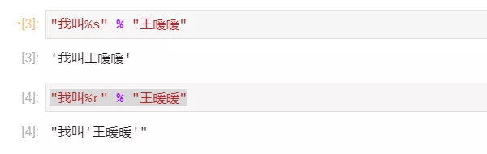

Python
<a name="Wlcku"></a>
## 一、% 格式化
<a name="gw2nu"></a>
### 1.语法
```python
"%[(name)][flags][width][.precison]type" % 待格式化数据
```
<a name="Zx4vh"></a>
### 2.参数
(1) %: 占位符；<br />(2) (name)：命名占位字符;<br />(3) flags可选:<br />    1) +: 右对齐，正数加正号，负数加负号;<br />    2) -: 左对齐，正数无符号，负数加负号;<br />    3) 空格: 右对齐(默认的对齐方式)，正数前加空格，负数前加负号;<br />    4) 0: 右对齐，以0填充，正数无符号，负数加负号，并将符号放置在0最左侧;<br />(4) width: 占位宽度，若指定宽度小于原数据长度则按原长度数据输出;<br />(5) .precison: 小数点后保留位数；在字符串中则表示截取/字符串切片;<br />(6) type: 详见如下...
<a name="zEwWD"></a>
### 3.type
(1) s: string，字符串;<br />(2) d: decimal integer，十进制数;<br />(3) i: integer，用法同%d；<br />(4) u: unsigned integer，无符号十进制数；<br />(5) f: float，浮点数(默认保留小数点后6位)；<br />(6) F: Float，浮点数(默认保留小数点后6位)；<br />(7) e: exponent，将数字表示为科学计数法(小写e，默认保留小数点后6位)；<br />(8) E: Exponent，将数字表示为科学计数法(大写E，默认保留小数点后6位)；<br />(9) o: octal，八进制数(即0-7)；<br />(10) x: hexdecimal，十六进制数(即0-9a-f)；<br />(11) X: Hexdecimal，十六进进制数(0-9A-F)；<br />(12) g: general format，通用格式，详见如下...；<br />(13) G: General format，通用格式，详见如下...；<br />(14) %c: character，将十进制数转换为所对应的unicode值；<br />(15) %r: representation，调用__repr__魔法方法输出；<br />(16) %%: 转义%，输出百分号。
<a name="LG2v8"></a>
### 4.补充
四舍五入 vs 四舍六入五双

- 四舍五入

在需要将一个"小数保留小数点后n位"或"保留n位有效数字"的时候即需要对数字进行适当的取舍，例如需要将1.125四舍五入保留到小数点后两位的结果应该为1.13。但是，如果你无论使用%还是使用format的格式化形式，得到的结果和预期的却大相近庭，如下：
```python
print("{:.2f}".format(1.125)) 
>>> 1.12

print("%.2f" % 1.125)         
>>> 1.12
```
从上面的结果可以看到，将1.125保留两位小数的结果为1.12，并非1.13，这是为什么呢？请继续往下看(四舍六入五双)...

- 四舍六入五双

精确n位数字或保留n位小数，采用如下的规则(以保留n位小数为例)：<br />a. 四舍: 保留n位小数，若第n+1位≤4，则舍去;<br />b. 六入: 保留n位小数，若第n+1位≥6，则第n位进1；<br />c. 五双: 保留n位小数，若第n+1位=5，若 如果第n+1位后面没有任何数字，则第n位数字为偶数就舍去n+1位，第n位数字为奇数则进1;<br />如果第n+1位后还存在不为0的任何数字，则第n位数字无论是奇数还是偶数都进1。<br />`print("{:.2f}".format(1.125))`需要保留两位小数(n=2)，则观察小数点后第二位数字2的后一位(n+1位)。第n+1为5，且5后没有其它数字，第n位2为偶数，所以直接舍去，故最后的结果为1.12。

- 十进制转二进制

a. 十进制整数转二进制: 除2取余，逆序排列;<br />b. 十进制浮点数转二进制: 乘基取整;

- 不精确尾数

十进制浮点数的小数部分在转换为二进制的时候有可能出现无限小数无法乘尽的情况。但计算机无法处理无限小数，会将十进制浮点数对应的二进制数最多保留53位，53位后面的数据直接截断，从而导致在将二进制浮点数转换回十进制的时候出现不精确的现象。

- Decimal

如上述所言，因为有的浮点数可能存在不精确尾数的情况，导致一些需要精密计算的数据难以处理，每个不精确的小数累积起来可能造成严重的数据失信，所以可以使用python标准模块decimal模块下的Decimal类进行处理。<br />Decimal提供了十进制浮点数的精密运算支持，使用Decimal所表示的浮点数即为精确小数，不存在不精确尾数的情况。此外，Decimal还提供了诸多用于"取舍"的模式，如`ROUND_UP`(远离0取舍)，`ROUDN_DOWN`(趋向0取舍)，`ROUND_HALF_UP`(四舍五入，half即表示5的意思，up表示远离0的方向)等。<br />Decimal(value)中value可以传递整数，字符串，元组，浮点数或另一个Decimal对象，推荐使用字符串传递参数给value，如直接传递浮点数给value依旧会存在不精确尾数。<br />所以想要实现"四舍五入"的功能即可使用Decimal，如下所示：
```python
from decimal import Decimal, ROUND_HALF_UP

print(Decimal("1.125").quantize(Decimal(".00"), rounding=ROUND_HALF_UP))
>>> 1.13
```

- `__str__` 和`__repr__`

格式化字符参数中有一个`%r`，此处的r即是调用`__repr__`魔法方法，其功能和`__str__`类似，二者区别如下：
```python
class Animal:
    def __init__(self, name):
        self.name = name
    def __str__(self):
        return "我是" + self.name

    def __repr__(self):
        return "我的名字是" + self.name
  
  
if __name__ == "__main__":
    cat = Animal("小黑")
    print(cat)
```
如果在Animal一类中既没有定义`__str__` 也没有定义`__repr__`魔法方法，那么`print`输出打印cat对象将得到cat对象的内存地址，类似`<__main__.Animal object at 0x0000017F2D384970>`；<br />如果只定义了`__str__` 或`__repr__`中的一个，那么`print(cat)`都将输出其对应的返回值，类似返回"我是小黑"或"我的名字是小黑";<br />如果既定义了`__str__`和`__repr__`两个魔法方法，那么`print(cat)`将输出`__str__`对应的返回值；`__repr__`和`__str__`的区别在于，一个侧重用户，一个侧重开发人员。如果定义了`__repr__`方法，那么在一些编辑器(Jupyter Notebook，JypyterLab)或终端中直接传递对象名即可获取`__repr__`的返回值，如下图所示:<br />
<a name="bJABr"></a>
### 5.用法详解
<a name="CopvF"></a>
#### 1、name
<a name="yK3l2"></a>
##### (1.1) 不指定name
1) 单个数据
```python
print("|我是%s" % "Fcant|") 
>>> |我是Fcant|
```
2) 多个数据: 使用元组
```python
print("|我是%s,今年%d岁|" % ("Fcant", 18)) 
>>> |我是Fcant，今年18岁|
```
<a name="SvHjJ"></a>
##### (1.2) 指定name: 使用字典
1) 单个数据
```python
print("|我是%(name)s|" % {"name": "Fcant"})
>>> |我是Fcant|
```
2) 多个数据
```python
print("|我叫%(name)s, 今年%(age)d岁。|" % {"name": "Fcant", "age": 18})
>>> |我叫Fcant, 今年18岁。|
```
<a name="AerZQ"></a>
##### (1.3) 单个数据对应多个占位
```python
# 元组内元素数量必须和占位符数量统一
print("|我是 %s %s %s!!!|" % ("Fcant", "Fcant", "Fcant"))
# 使用字典则必须指明键值对
print("|我是 %(name)s %(name)s %(name)s!!!|" % ({"name": "Fcant"}))
>>> |我是Fcant Fcant Fcant!!!|
```
<a name="wSohs"></a>
#### 2、flags + width
```python
# 依次按flags中"+", "-", " ", "0"结合width=10演示
```
<a name="FCYZK"></a>
##### (2.1) 字符串
```python
print("|%+10s|" % "Fcant") 
>>> |       Fcant| # 字符串右对齐

print("|%-10s|" % "Fcant") 
>>> |Fcant       | # 字符串左对齐

print("|% 10s|" % "Fcant") 
>>> |       Fcant| # 字符串右对齐

print("|%010s|" % "Fcant") 
>>> |       Fcant| # 字符串右对齐
```
<a name="gbblW"></a>
##### (2.2) 正整数
```python
print("|%+10d|" % 26) 
>>> |       +26| # 正整数右对齐，正数加正号

print("|%-10d|" % 26) 
>>> |26        | # 正整数左对齐，正数无符号

print("|% 10d|" % 26) 
>>> |        26| # 正整数右对齐，正数前加空格

print("|%010d|" % 26) 
>>> |0000000026| # 正整数右对齐，正数无符号，以0填充
```
<a name="KL8uM"></a>
##### (2.3) 负整数
```python
print("|%+10d|" % -26) 
>>> |       -26| # 负整数右对齐，负数加负号

print("|%-10d|" % -26) 
>>> |-26       | # 负整数左对齐，负数加负号

print("|% 10d|" % -26) 
>>> |       -26| # 负整数右对齐，负数加负号

print("|%010d|" % -26) 
>>> |-000000026| # 负整数右对齐，负数加负号, 符号和数字之前填充0
```
<a name="exvGh"></a>
##### (2.4) 正浮点数
```python
# 如未指定浮点数精度，默认保留6位小数，其余均用空格填充(如指定0则用0填充)；若width小于浮点数的数位则width无效。
print("|%+10f|" % 2.2) 
>>> | +2.200000| # 正浮点数加正号右对齐，小数部分以0填充

print("|%-10f|" % 2.2) 
>>> |2.200000  | # 正浮点数左对齐，小数点后为空格

print("|% 10f|" % 2.2) 
>>> |  2.200000| # 正浮点数右对齐，浮点数前为空格

print("|%010f|" % 2.2) 
>>> |002.200000| # 正浮点数右对齐，小数点前以0填充
```
<a name="fS386"></a>
##### (2.5) 负浮点数
```python
print("|%+10f|" % -2.2) 
>>> | -2.200000| # 负浮点数加负号右对齐，小数部分以0填充

print("|%-10f|" % -2.2) 
>>> |-2.200000 | # 负浮点数加负号左对齐，小数点后为空格

print("|% 10f|" % -2.2) 
>>> | -2.200000| # 负浮点数加负号右对齐，其余用空格填充

print("|%010f|" % -2.2) 
>>> |-02.200000| # 负浮点数加负号右对齐，其余用0填充，注意符号在最左侧
```
<a name="Kyo5n"></a>
##### (2.6) 详详解
1) 
```python
print("|%+15f|" % 22.6) 
>>> |     +22.600000|
```
    a) 未指定保留位数，故小数点后占6位，用0填充;<br />    b) 小数点占1位，"+"号占1位，共2位;<br />    c) 小数点前系数"22"占2位;<br />    c) 其余均用空格填充，故空格占5位，总计15位.<br />2) 
```python
print("|%+015f|" % 22.6) 
>>> |+0000022.600000|
```
    a) 未指定保留位数，故小数点后占6位，用0填充;<br />    b) 小数点占1位，"+"号占1位，共2位;<br />    c) 小数点前系数22占2位;<br />    d) 其余均用0填充，故小数点前的"0"占5位，总计15位;<br />    e) 注意: 此处同时使用了"+"和"0"，配合二者的功能使用。   <br />3) 
```python
print("|%+15.3f|" % 22.66)  
>>> |        +22.660|
```
    a) 指定保留小数位数为3位，不足的用0填充;<br />    b) 其余的用空格填充;<br />4) 
```python
print("|%+015.3f|" % 22.66) 
>>> |+0000000022.660|
```
    a) 指定保留小数位数为3位，不足的用0填充;<br />    b) 其余的用"0"填充;
<a name="kvGFH"></a>
#### 3、precision
<a name="OcGrm"></a>
##### (3.1) 字符串
如果待格式化数据为字符串则表示字符串截取
```python
print("|%.2s|" % "python") 
>>> |py|
```
<a name="FTxda"></a>
##### (3.2) 浮点数
保留小数点后.precision数字
```python
print("|%(num).2f|" % {"num": 0.145}) 
>>> |0.14|

print("|%(num).2f|" % {"num": 1.145}) 
>>> |1.15|

print("|%(num).2f|" % {"num": 2.145}) 
>>> |2.15|

print("|%(num).2f|" % {"num": 3.145}) 
>>> |3.15|
```
注意：此处列举的数字均存在"不精确尾数"和"四舍六入五双"两种情况
<a name="ouv2a"></a>
##### (3.3) 科学计数
```python
print("|%.3f用科学计数法表示写作%.2E|" % (40.125, 40.125))
>>> |40.125用科学计数法表示写作4.01E+01|
```
    解析: 先将40.125转为科学计数法形式: 4.0125*10^1(4.0125乘以10的1次方);<br />         而后再对4.0125精确到小数点后位，即4.01;<br />         最后用e或E分隔系数和指数，即为4.01E+01 <br />(3.4) g/G模式: 详见如下...
<a name="KwXaI"></a>
#### 4、type
<a name="OQoW2"></a>
##### (1) s: 字符串 
```python
print("|我是%s|" % "王暖暖") >>> |我是王暖暖|
```
<a name="oxEL5"></a>
##### (2) d, i, u: 十进制数字
```python
print("|我最喜欢的十进制数是%d|" % 26)
print("|我最喜欢的十进制数是%i|" % 26)
print("|我最喜欢的十进制数是%u|" % 26)
>>> |我最喜欢的十进制数是26|
```
<a name="Yu4Jw"></a>
##### (3) f: 浮点数(默认保留6位小数)
```python
# 保留小数详情见上...
print("|这是一个浮点数%f|" % 2.26)
>>> |这是一个浮点数2.260000|
```
<a name="YWHW5"></a>
##### (4) e, E: 科学计数
```python
print("|%f用科学计数法表示写作%e|" % (4.145, 4.145))
>>> |4.145000用科学计数法表示写作4.145000e+00|

print("|%.3f用科学计数法表示写作%.2E|" % (4.145, 4.145))
>>> |4.145用科学计数法表示写作4.14E+00|
```
<a name="lkK5a"></a>
##### (5) o: 八进制
```python
print("|十进制%(num)d对应的八进制数为%(num)o|" % {"num": 26}) 
>>> |十进制26对应的八进制数为32|
```
<a name="y0ihA"></a>
##### (6) x, X: 十六进制
```python
print("|十进制%(num)d对应的十六进制数为%(num)x|" % {"num": 26})
>>> |十进制26对应的十六进制数为1a|

print("|十进制%(num)d对应的十六进制数为%(num)X|" % {"num": 26})
>>> |十进制26对应的十六进制数为1A|
```
<a name="V8rW2"></a>
##### (7) g, G详见如下...
<a name="oSTa6"></a>
##### (8) c: unicode字符
```python
print("|%d对应的unicode字符为:%c|" % (226, 226))
>>> |226对应的unicode字符为:â|
```
<a name="qse1z"></a>
##### (9) `%r`: representation，调用传入对象的`__repr__`方法的返回值
经测试，无论是使用`%s`类型还是`%r`类型，使用JypyterLab均直接输出格式化结果，其二者的却别在于，使用`%r`模式会在字符串数据的左右两侧加上`''`。    
<a name="Ne4lI"></a>
##### (10) `%%`: 转义`%`。
如果有待格式化数据需要输出百分号(%)，需要使用%%进行转义
```python
print("|I'm %d%% sure.|" % 100) >>> |I'm 100% sure.|
```

<a name="f0BlP"></a>
## 二、str.format()格式化
<a name="telaz"></a>
### 1.语法
```python
"{[index][:[[fill]align][sign][#][0][width][grouping_option][.precision][type]]}".format()
```
<a name="kdlqM"></a>
### 2.参数详解
(1) `index`: 待格式化字符的索引或键，若占位符数量和参数数量不一致时必须指定索引;<br />(2) `fill`: 填充字符，可为任意字符;<br />(3) `align`: 对齐方式(常配合width使用)，可选:
```python
 # 和Excel中输入文本和数字的默认对齐方式一致
```
    1) <: 左对齐(字符串默认对齐方式);<br />    2) >: 右对齐(数字默认对齐方式);<br />    3) ^: 居中对齐;<br />    4) =: 内容右对齐，将符号(+或-)放置在填充字符的左侧，仅对数字类型有效;<br />(4) sign: 有无符号，可选：<br />    1) +: 正数加正号，负数加负号；<br />    2) -: 正数不变，负数加负号(默认)；<br />    3) 空格: 正数加空格，负数加负号； <br />(5) #: <br />       a. 对于整数，在输出值分别添加响应的0b, 0o, 0x前缀;<br />       b. 对于浮点数和复数, 在输出值保留小数点符号;<br />       c. 在g/G模式下，保留末尾的0；<br />(6) 0: 若未设置对齐方式，在width前加一个0将为数字类型启用感知正负号的零填充，等同于设置fill为0, align为"=";<br />(7) width: 字段总宽度(十进制整数), 所有前缀，分隔符和其它格式化字符之和; <br />(8) grouping_option: 设置分组(分隔):<br />       1) `","`: 使用逗号作为千位分隔符;<br />       2) `"_"`: 使用_作为分隔符:<br />          a. 对于十进制数, 使用_作为千位分隔符;<br />          b. 对于b, o, x/X，使用_每4位数插入一个下划线；<br />(9) .precision(十进制数): <br />       a. 整数型不允许设置precison, 如果设置即被转换为浮点数;<br />       b. 浮点型表示小数点"后"显示多少位小数位数;<br />       c. 以g或G格式化表示在小数点"前后"共显示多少个数位;<br />       d. 字符型表示截取多少个字符；<br />(10) {{或}}: 转义{或}，当需要输出{或}的使用使用;<br />(11) type: 详见如下...
<a name="nLvDe"></a>
### 3.type:
`format()`格式化与`%`格式化的type大同小异，以下尽挑重点来看<br />(1) b: binary, 二进制;<br />(3) g: general formatting, 详见如下...<br />(4) G: General formatting, 详见如下...
<a name="pjOnX"></a>
### 4.genaral formatting
g和G模式是一个重点。这里的g字母是general的缩写，可以查到一些资料，说某种条件下，g模式等同于f模式或e模式。但是，实际上，g与f, e这两种模式还有一些区别，详见如下:<br />(1) 给定精度<br />对于给定精度 p >= 1，会将数值舍入到p个有效数位，再将结果以小数或科学计数法进行格式化，精度0会被视为等价于精度1。<br /> 1) 对于浮点数:<br />        print("|{:.2G}|".format(3.125))<br />        先将3.125转换为科学计数法表示，即为3.125*10^0;<br />        此时，指定的精度p=2, 表示小数点前后共保留2个有效数位, 指数exp=0，则<br />        如果-4 ≤ exp < p(-4 ≤ 0 < 2)，该数将使用"f"模式和精度p-1-exp(2-1-0=1)格式化,故<br />        结果为: |3.1| <br />    2) 对于Decimal:<br />        print("|{:.2G}|".format(Decimal("4.145")))<br />        先将Decimal("4.145")转换为科学计数法表示，即为4.145*10^0;<br />        此时，指定的精度p=2, 表示小数点前后共保留2个有效数位，指数exp=0, 则<br />        如果-6 ≤ exp < p(-6 ≤ 0 < 2), 该数将使用"f"模式和精度p-1-exp(2-1-0)格式化,故<br />        结果为: |4.1|<br />    3) 如果不满足m ≤ exp < p(m=-4或-6), 则使用"e"模式和精度p-1表示:<br />        print("|{:.3G}|".format(4225.125))<br />        先将4225.125转换为科学计数法表示，即为4.225125*10^3;<br />        此时，指定的精度p=3, exp=3, 则<br />        -4 ≤ exp < p(-4 ≤ 3 < 3)不成立，所以使用"e"模式和精度p-1(3-1=2)表示，故<br />        结果为: |4.23E+03|<br />  print("|{:.3G}|".format(Decimal("4225.256")))<br />        同理如上，结果为|4.23E+3|<br />(2) 未给定精度<br /> 如未指定精度，会对浮点数采用6个有效数位的精度; 对于 Decimal，结果的系数会沿用原值的系数数位。<br />    只有很小的数字或很大的数字才会使用"e"模式表示, 其余的均用"f"模式表示:<br />        a. 绝对值小于等于1e-6(0.000001)的数使用"e"模式表示;<br />        b. 小数点前的数位大于6的数使用"e"模式表示。<br />例如：
```python
print("|{:G}|".format(0.0000002))
>>> |2E-07|
print("|{:G}|".format(5555555.6666))
>>> |5.55556E+06|
```
(3) 注意点<br /> 1)<br /> 需要注意的是，g/G和f,e/E并不完全相同，主要体现在精度的处理上。<br />    对于f而言，精度p指的是保留小数点后p位小数;<br />    对于e而言，精度p指的是将数据转换为科学计数法后保留小数点后p位;<br />    而g/G模式下，则表示小数点前后保留p位有效数字。
```python
print("|{:.3G}|".format(5555.6666)) 
>>> |5.56E+03|

print("|{:.3E}|".format(5555.6666)) 
>>> |5.556E+03|

print("|{:.3f}|".format(5555.6666)) 
>>> |5555.667|
```
2) 如果小数点之后没有数位，则小数点也会被略去，除非使用了#选项
```python
print("{:G}".format(333.0))  
>>> 333

print("{:#G}".format(333.0)) 
>>> 333.000

print("{:f}".format(333.0))  
>>> 333.000000

print("{:E}".format(333.0))  
>>> 3.330000E+02
```
<a name="UYGqy"></a>
### 5.用法详解
基于前文已经详细讲解了%格式化中各个参数的用法，此处便不再做过多赘述，更多以实例讲解，如有必要再做具体解析。
<a name="L44j3"></a>
#### 1、index
```python
print("|我叫{}, 今年{}岁.|".format("Zack", 18))   # 不指定index
print("|我叫{0}, 今年{1}岁.|".format("Zack", 18)) # 数字
print("|我叫{0[0]}, 今年{0[1]}岁.|".format(("Zack", 18, ))) # 元组 
print("|我叫{name}, 今年{age}岁.|".format(name="Zack", age=18)) # 关键字参数
info = {"name": "Zack", "age": 18}
print("|我叫{name}, 今年{age}岁.|".format(**info)) # 字典
>>> |我叫Zack, 今年18岁。|

print("|该复数的实部为{0.real}, 虚部为{0.imag}|".format(1+2j))
>>> |该复数的实部为1.0, 虚部为2.0|
```
<a name="JuGX5"></a>
#### 2、fill+width+align
```python
fill = &
align = None
width = 10
```
<a name="qRZX3"></a>
##### (1) 不指定align，无法指定fill, 默认为空格
```python
print("|{0:10}|".format("Fcant")) 
>>> |Fcant       |   # 字符串

print("|{0:10}|".format(226))    
>>> |       226|     # 数字
```
<a name="am6DU"></a>
##### (2) 指定align, fill=&, width=10
```python
print("|{0:&<10}|".format("Fcant")) 
>>> |Fcant&&&&&&&|

print("|{0:&>10}|".format("Fcant")) 
>>> |&&&&&&&Fcant|

print("|{0:&^10}|".format("Fcant")) 
>>> |&&&Fcant&&&&|

print("|{0:&=10}|".format(-226))    
>>> |-&&&&&&226|    # 符号放置最左侧
```
<a name="iC61m"></a>
#### 3、sign+align+fill+width
```python
# 均以数字演示
sign=None
align=None
fill=*
width=10
```
<a name="NkeDw"></a>
##### (1) `"+"`:
```python
print("|{0:*<+10}|".format(226))  
>>> |+226******|

print("|{0:*>+10}|".format(-226)) 
>>> |******-226|
```
<a name="Vsb00"></a>
##### (2) `"-"`: 
```python
print("|{0:*<-10}|".format(226))  
>>> |226*******|

print("|{0:*>-10}|".format(-226)) 
>>> |******-226|
```
<a name="b6PiY"></a>
##### (3) `" "`:
```python
print("|{0:*< 10}|".format(226))  
>>> |*** 226***| # 整数前有空格

print("|{0:*< 10}|".format(-226)) 
>>> |***-226***| # 负数前有负号    
```
<a name="VmgO7"></a>
#### 4、g/G
<a name="CLOEC"></a>
##### (1) b, o, x/X
```python
print("|{0:#b}|".format(226)) 
>>> |0b11100010|

print("|{0:#o}|".format(226)) 
>>> |0o342|

print("|{0:#X}|".format(226)) 
>>> |0XE2|
```
<a name="GlVcf"></a>
##### (2) 浮点数和复数
即使指定小数点后保留0位数字，依旧保留小数点
```python
print("|{:.0f}|".format(3.14))  
>>> |3|

print("|{:#.0f}|".format(3.14)) 
>>> |3.|

print("|{:.0f}|".format(1+2J))  
>>> |1+2j|

print("|{:#.0f}|".format(1+2J)) 
>>> |1.+2.j|
```
<a name="IOemV"></a>
##### (3) g/G:
```python
print("{:G}".format(333.0))  
>>> 333

print("{:#G}".format(333.0)) 
>>> 333.000
```
<a name="cDKaF"></a>
#### 5、"0"
<a name="ByRax"></a>
##### (1)若未设置对齐方式，在width前加一个0将为数字类型启用感知正负号的零填充，等同于设置fill为`0`，align为`"="`
```python
print("|{0:010}|".format(-3.14)) 
>>> |-000003.14|
```
等同于
```python
print("|{0:0=10}|".format(-3.14)) 
>>> |-000003.14|
```
注意区别于
```python
print("|{0:0>10}|".format(-3.14)) 
>>> |00000-3.14|
```
此功能等同于%格式化中的`"0"`，如下所示：
```python
print("|%010.2f|" % -3.14)        
>>> |-000003.14|
```
<a name="punp0"></a>
#### 6、group_options
<a name="pVOiK"></a>
##### (1) `","`千位分隔符
```python
print("|{0:,}|".format(3141.5926)) 
>>> |3,141.5926|
```
<a name="rZWBe"></a>
##### (2) `"_"`<br />1) 对于十进制数，使用`"_"`作为千位分隔符
```python
print("|{0:_}|".format(3141.5926)) 
>>> |3_141.5926|
```
2) 对于b, o, x/X，使用`"_"`每四位插入一个下划线
```python
print("|{0:_b}|".format(12345)) 
>>> |11_0000_0011_1001|

print("|{0:_o}|".format(12345)) 
>>> |3_0071|            
```
<a name="C91Yy"></a>
#### 7、{{或}}转义
```python
print("This is a set: {{{0}}}".format("1, 2, 3")) 
>>> This is a set: {1, 2, 3}
```
<a name="X63Er"></a>
#### 8、补充
在处理精密数据的时候，因为不精确尾数的关系，可能导致一些数据失信，如下所示，将数据保留两位小数，有的精确为0.14而有的却精确为0.15。虽然Decimal可以处理此类问题，但是经过测试，Decimal并不使用于%格式化。传入Decimal和直接传入浮点数的结果一致，并无任何区别。故，如果要处理此类问题还是需要使用str.format()形式并传递Decimal类型的数据。
```python
print("|%.2f|" % 0.145)            
>>> |0.14|

print("|%.2f|" % Decimal("0.145")) 
>>> |0.14|

print("|%.2f|" % 1.145)            
>>> |1.15|

print("|%.2f|" % Decimal("1.145")) 
>>> |1.15|

print("|{:.2f}|".format(Decimal("0.145"))) 
>>> |0.14|

print("|{:.2f}|".format(Decimal("1.145"))) 
>>> |1.14|
```
<a name="RPIiV"></a>
## 三、f-string格式化
<a name="CGvSO"></a>
### 1.语法
python3.6以后开始支持f-string字符串。f-string即formatting string，它是`str.format()`的一个变种，其语法形式之殊途同归，很多时候使用f-string可以有效减少代码量，更为清晰易懂。语法：`f"{}{}{}"`
<a name="E8rJI"></a>
### 2.示例
<a name="VrRr1"></a>
#### (1)
```python
name = "Zack"
age = 18
print(f"|我是{name}, 今年{age}岁|") 
>>> |我是Zack, 今年18岁|
```
<a name="eV6t2"></a>
#### (2)
```python
for p in range(3):
    url = f"https://www.baidu.com/s?wd=python&pn={p*10}&oq=python"
```
<a name="iMj2n"></a>
#### (3) 可直接调用对应对象的方法和属性
```python
channel = "ted"
print(f"|我喜欢观看{channel.upper()}学习英语|")
```
<a name="VdzjG"></a>
## 四、`format()`
<a name="vEuDM"></a>
### 1.语法
```python
# x为需要格式化的数据，formatter为格式化表达式，不需要指定{}。
format(x, formatter)
```
<a name="gs3fT"></a>
### 2.示例
```python
#序列号
nums = [1, 2, 3]

serial_nums = [format(x, "0>8") for x in nums]
print(serial_nums)
>>> ['00000001', '00000002', '00000003']
```
<a name="N420D"></a>
## 五、总结
python字符串格式化语法较多，不便记忆，可以在具体需要使用的时候再查询即可。%格式化可以满足大多常用的功能，但是处理一些精密化或复杂的格式化需求的时候就束手无策了，所以推荐使用`str.format()`或f-string格式化处理字符串。<br />f-string是`str.format()`的一个分支，在一些特定情况下使用可以大大减少代码量，使代码更加清晰易懂，可以有选择性的使用f-string。<br />`format()`是python的一个内置函数，其使用频率不高，语法和`str.format()`大同小异，可以结合lambda函数使用或在其它一些特定情况下使用。
