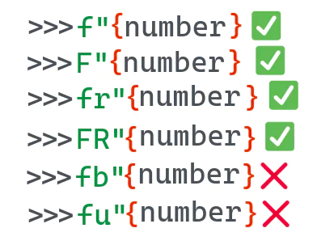
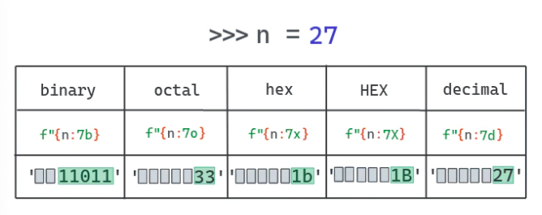
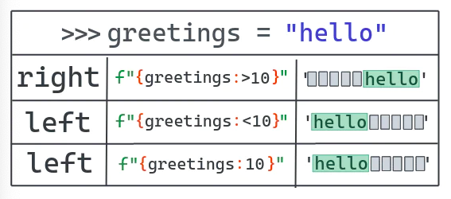
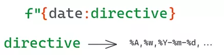

Python f-string
<a name="rnYNf"></a>
### 1、Python 中的 f-string
在 Python 的历史中，字符串格式化的发展源远流长。在 Python 2.6 之前，想要格式化一个字符串，只能使用 % 这个占位符，或者`string.Template` 模块。不久之后，出现了更灵活更靠谱的字符串格式化方式： `str.format` 方法。<br />过去使用 `%` 做字符串格式化方式的代码样例：
```python
>>> msg = 'hello world'
>>> 'msg: %s' % msg
'msg: hello world'
```
用`string.format`的样例：
```python
>>> msg = 'hello world'
>>> 'msg: {}'.format(msg)
'msg: hello world'
```
为了进一步简化格式化方法，Eric Smith 在2015年提交了 PEP 498 -- Literal String Interpolation 提案。<br />PEP 498 提出了一种新的字符串插值方法，该方法可以更简单便捷的使用 `str.format` 方法。只需要在字符串开头加上一个字母 `f`，形成 `f"  "` 的格式就可以了。<br />使用f-string的样例：
```python
>>> msg = 'hello world'
>>> f'msg: {msg}'
'msg: hello world'
```
这就可以了！再也不需要用 `string.format` 或者 `%` 了。不过 f-string 并不能完全替代 `str.format`。
<a name="mdTA3"></a>
### 2、基本的字符串格式化
使用f-string格式化字符串十分简单。唯一的要求就是给它一个有效的表达式。f-string 也可以用大写`F`开头或者与 `r` 原始字符串结合使用。但是不能将其与 `b" "` 或者 `u" "` 混用。<br />
```python
>>> book = "The dog guide"
>>> num_pages = 124
>>> f"The book {book} has{num_pages} pages"
'The book The dog guide has 124 pages'

>>> F"The book {book} has{num_pages} pages"
'The book The dog guide has 124 pages'
>>> print(Fr"The book {book} has{num_pages} pages\n")

The book The dog guide has 124 pages\n 
>>> print(FR"The book {book} has{num_pages} pages\n")
The book The dog guide has 124 pages\n
>>> print(f"The book {book} has{num_pages} pages\n")
The book The dog guide has 124 pages
```
<a name="kIYIg"></a>
### 3、f-string 的限制
虽然f-string十分的便捷，但它并不能完全代替`str.format`。f-string在表达式出现的上下文中进行求值计算。根据PEP498，这意味着该表达式可以获取所有局部和全局变量。而且该表达式是在运行时计算的表达式。如果在 `{ <expr> }` 之中使用的表达式无法被计算，就会跳出如下异常。
```python
>>> f"{name}"
---------------------------------------------------------------------------
NameError                                 Traceback(most recent call last)
<ipython-input-1-f0acc441190f> in<module>
----> 1 f"{name}"
NameError: name 'name' is not defined
```
这对 `str.format` 来说就不是问题，可以提前定义一个模板字符串，并在之后调用`.format`方法时再传递上下文信息。
```python
>>> s = "{name}"
>>> s.format(name="Python")
'Python'
>>> print(s)
{name}
```
另外还有个限制是，不能在f-string中使用行内注释。
```python
>>> f"My name is {name #name}!"
  File "<ipython-input-37-0ae1738dd871>", line 1
    f"My name is {name #name}!"
    ^
SyntaxError: f-string expression part cannot include '#'
```
<a name="XtBkC"></a>
### 4、格式化一个表达式
如果不想定义变量，可以在大括号中使用常量。Python会计算该表达式并显示最终计算结果。
```python
>>> f"4 * 4 is {4 * 4}"
'4 * 4 is 16'
```
或者可以这样
```python
>>> n = 4
>>> f"4 * 4 is {n * n}"
'4 * 4 is 16'
```
<a name="ReGYS"></a>
### 5、使用 f-string 来调试代码
调试是f-string最常见的用途之一了。Python3.8 之前，很多人会用一种非常繁杂的`hello = 42; f"hello = {hello}"`来进行调试。针对此Python3.8引入了一个新功能。可以用 `f"{hello=}"` 重写上面的代码，而python会显示`hello=42`。下面这个例子展示了在使用函数表达式时如何应用该特性，其原理与上文代码是一样的。
```python
>>> def magic_number():     ...:     return 42     ...: 
>>> f"{magic_number() = }"'magic_number() = 42'
```
<a name="a69462d3"></a>
### 6、格式化数字的不同进制
<br />f-string 还能在不同进制下显示数字。例如，不需要通过`b`来对一个`int`进行格式转化就可以显示其二进制结果。
```python
>>> f'{7:b}'
'111'
```
总结一下就是可以用f-string来格式化：<br />•  int 到二进制<br />•  int 到十六进制<br />•  int 到八进制<br />•  int 到十六进制(所有符号大写)<br />下面的例子使用缩进功能和进制格式化创建了一个表，可以显示数字在不同进制下的值。
```python
>>> bases = {
       "b": "bin", 
       "o": "oct", 
       "x": "hex", 
       "X": "HEX", 
       "d": "decimal"
}
>>> for n in range(1, 21):
     ...:     for base, desc in bases.items():
     ...:         print(f"{n:5{base}}", end=' ')
     ...:     print()

    1     1     1     1     1 
   10     2     2     2     2 
   11     3     3     3     3 
  100     4     4     4     4 
  101     5     5     5     5 
  110     6     6     6     6 
  111     7     7     7     7 
 1000    10     8     8     8 
 1001    11     9     9     9 
 1010    12     a     A    10 
 1011    13     b     B    11 
 1100    14     c     C    12 
 1101    15     d     D    13 
 1110    16     e     E    14 
 1111    17     f     F    15 
10000    20    10    10    16 
10001    21    11    11    17 
10010    22    12    12    18 
10011    23    13    13    19 
10100    24    14    14    20
```
 
<a name="H46fK"></a>
### 7、用 f-string 打印对象
可以用f-string打印自定义对象。默认设置是，如果向f-string表达式传递了一个对象，它将会显示该对象 `__str__` 方法的返回值。不过，也可以用显式转换操作标志来打印`__repr__`的值。

- !r - 使用 `repr()` 将值转化为文本.<br />
- !s - 使用 `str()` 将值转化为文本.<br />
```python
>>> class Color:
    def __init__(self, r: float = 255, g: float = 255, b: float = 255):
        self.r = r
        self.g = g
        self.b = b

    def __str__(self) -> str:
        return "A RGB color"

    def __repr__(self) -> str:
        return f"Color(r={self.r}, g={self.g}, b={self.b})"

>>> c = Color(r=123, g=32, b=255)

# 如不加任何操作符, 会打印 __str__ 的值
>>> f"{c}"
'A RGB color'

# 用`obj!r` 的话会打印 __repr__ 的值
>>> f"{c!r}"
'Color(r=123, g=32, b=255)'

# 使用!s跟默认值一样
>>> f"{c!s}"
'A RGB color'
```
Python也允许通过定义不同类型使用`__format__`方法控制格式化结果，下面的例子会展示所有可能情况。
```python

>>> class Color:
    def __init__(self, r: float = 255, g: float = 255, b: float = 255):
        self.r = r
        self.g = g
        self.b = b

    def __str__(self) -> str:
        return "A RGB color"

    def __repr__(self) -> str:
        return f"Color(r={self.r}, g={self.g}, b={self.b})"

>>> c = Color(r=123, g=32, b=255)

# When no option is passed, the __str__ result is printed
>>> f"{c}"
'A RGB color'

# When `obj!r` is used, the __repr__ output is printed
>>> f"{c!r}"
'Color(r=123, g=32, b=255)'

# Same as the default
>>> f"{c!s}"
'A RGB color'
Python also allows us to control the formatting on a per-type basis through the __format__ method. The following example shows how you can do all of that.

>>> class Color:
    def __init__(self, r: float = 255, g: float = 255, b: float = 255):
        self.r = r
        self.g = g
        self.b = b

    def __str__(self) -> str:
        return "A RGB color"

    def __repr__(self) -> str:
        return f"Color(r={self.r}, g={self.g}, b={self.b})"

    def __format__(self, format_spec: str) -> str:
        if not format_spec or format_spec == "s":
            return str(self)

        if format_spec == "r":
            return repr(self)

        if format_spec == "v":
            return f"Color(r={self.r}, g={self.g}, b={self.b}) - A nice RGB thing."

        if format_spec == "vv":
            return (
                f"Color(r={self.r}, g={self.g}, b={self.b}) "
                f"- A more verbose nice RGB thing."
            )

        if format_spec == "vvv":
            return (
                f"Color(r={self.r}, g={self.g}, b={self.b}) "
                f"- A SUPER verbose nice RGB thing."
            )

        raise ValueError(
            f"Unknown format code '{format_spec}' " "for object of type 'Color'"
        )

>>> c = Color(r=123, g=32, b=255)

>>> f'{c:v}'
'Color(r=123, g=32, b=255) - A nice RGB thing.'

>>> f'{c:vv}'
'Color(r=123, g=32, b=255) - A more verbose nice RGB thing.'

>>> f'{c:vvv}'
'Color(r=123, g=32, b=255) - A SUPER verbose nice RGB thing.'

>>> f'{c}'
'A RGB color'

>>> f'{c:s}'
'A RGB color'

>>> f'{c:r}'
'Color(r=123, g=32, b=255)'

>>> f'{c:j}'
---------------------------------------------------------------------------
ValueError                                Traceback (most recent call last)
<ipython-input-20-1c0ee8dd74be> in <module>
----> 1 f'{c:j}'

<ipython-input-15-985c4992e957> in __format__(self, format_spec)
     29                 f"- A SUPER verbose nice RGB thing."
     30             )
---> 31         raise ValueError(
     32             f"Unknown format code '{format_spec}' " "for object of type 'Color'"
     33         )

ValueError: Unknown format code 'j' for object of type 'Color'
```
最后，还有个用来转义ASCII字符的`a`操作符。更多信息可参考:<br />docs.python.org/3/library/functions.html#as..
```python
>>> utf_str = "Áeiöu"
>>> f"{utf_str!a}"
"'\\xc1ei\\xf6u'"
```
<a name="pqX3L"></a>
### 8、使用f-string设定浮点数精度
F-string可以像`str.format`那样格式化浮点数。想要实现这一点，需要加一个 `:`（冒号）再加一个 `.`（英文句号）然后跟着小数点位数最后以`f`结尾。<br />举例来说，可以通过如下代码打印一个浮点数精确到百分位的近似值。
```python
>>> num =4.123956
>>> f"num rounded to 2 decimalpalces = {num:.2f}"
'num rounded to 2 decimal palces = 4.12'
```
不加任何选项的话，则会打印浮点数本身的精确值。
```python
>>> print(f'{num}')
4.123956
```
<a name="rJve8"></a>
### 9、将一个数字格式化为百分数
Python f-string方法有个非常便捷的实现格式化百分数的操作方法。方法与浮点数格式化类似，但是要用`%`代替结尾的`f`。它会将原始数值乘以100并显示成有百分符号的固定格式。精度一样也是可以设定的。
```python
>>> total = 87

>>> true_pos = 34

>>> perc = true_pos / total

>>> perc
0.39080459770114945

>>> f"Percentage of true positive: {perc:%}"
'Percentage of true positive: 39.080460%'

>>> f"Percentage of true positive: {perc:.2%}"
'Percentage of true positive: 39.08%'
```
<a name="JV5qc"></a>
### 10、调整或者增加 f-string 的填充
可以便捷的通过 `<` 或者 `>` 符号来调整字符串填充。<br />
```python
>>> greetings = "hello"

>>> f"She says {greetings:>10}"
'She says      hello'

# Pad 10 char to the right
>>> f"{greetings:>10}"
'     hello'

>>> f"{greetings:<10}"
'hello     '

# You can omit the < for left padding
>>> f"{greetings:10}"
'hello 
```
 
```python
>>> a = "1"

>>> b = "21"

>>> c = "321"

>>> d = "4321"

>>> print("\n".join((f"{a:>10}", f"{b:>10}", f"{c:>10}", f"{d:>10}")))
         1
        21
       321
      4321
```
<a name="VeEnl"></a>
### 11、转义符号
如果想打印由大括号括起来的变量名称，而不是该变量的值，那就需要双层大括号 ``。
```python
>>> hello = "world"

>>>f"{{hello}} = {hello}"
'{hello} = world'
```
而如果想转义双引号，就需要在引号前用反斜线 `\` 做标记。
```python
>>>f"{hello} = \"hello\""
'world = "hello"'
```
<a name="mSQgj"></a>
### 12、使字符串居中
<br />想要实现字符串居中，可以通过 `var:^N` 的方式。其中var是想要打印的变量，N是字符串长度。如果N小于var的长度，会打印全部字符串。
```python
>>> hello = "world"
>>>f"{hello:^11}"

'  world   '
>>>f"{hello:*^11}"
'***world***'

# Extra padding is added to the right
>>>f"{hello:*^10}"
'**world***'

# N shorter than len(hello)
>>>f"{hello:^2}"
'world'
```
<a name="7lLfr"></a>
### 13、格式化千分位 
<br />F-string也允许自定义数字显示的格式。有个非常普遍的需求就是把数字以每3位为一个间隔使用下划线进行分隔。
```python
>>> big_num = 1234567890

>>> f"{big_num:_}"
'1_234_567_890'
```
<a name="8TmGZ"></a>
####  13.1  使用逗号千分位分隔符数字
实际上，可以随便用任何符号做千分位分隔符。所以用逗号做分隔符也完全没问题。
```python
>>> big_num = 1234567890

>>> f"{big_num:,}"
'1,234,567,890'
```
 甚至可以一次性同时搞定既有千分位分隔符又有精度设定的浮点数。
```python
>>> num =2343552.6516251625
>>> f"{num:,.3f}"
‘2,343,552.652'
```
<a name="zsaq5"></a>
#### 13.2 使用空格做千分位分隔符
用空格也可以吗？
可以用逗号做分隔符之后再用空格替换逗号。
```python
>>> big_num = 1234567890

>>> f"{big_num:,}".replace(',',' ')
'1 234 567 890'
```
还有个方法是设定本地语言环境，换成一个用空格作千位分隔符的环境比如pl_PL（波兰语环境）。更多信息可参考这个Stack Overflow链接：<br />[https://stackoverflow.com/a/17484665](https://stackoverflow.com/a/17484665)
<a name="WClwH"></a>
### 14、使用科学计数法（指数计数法）显示一个数字
可以用 e 或者 E 字符来格式化。
```python
>>> num =2343552.6516251625
>>>f"{num:e}"

'2.343553e+06'
>>> f"{num:E}"

'2.343553E+06'
>>> f"{num:.2e}"

'2.34e+06'
>>> f"{num:.4E}"
'2.3436E+06'
```
<a name="h8Ytv"></a>
### 15、在 f-string 中使用 if-else
F-string也能计算稍微复杂的运算式，比如if/else
```python
>>> a = "this is a"
>>> b = "this is b"

>>> f"{a if 10 > 5 else b}"
'this is a'

>>> f"{a if 10 < 5 else b}"
'this is b'
```
<a name="bEAqJ"></a>
### 16、在 f-string 中使用字典
可以在f-string中使用字典。唯一的要求是引起整个字符串的引号要跟内部的引号不一样。
```python
>>>color = {"R": 123, "G": 145, "B": 255}
>>> f"{color['R']}"
'123'
>>> f"RGB = ({color['R']},{color['G']}, {color['B']})"

'RGB = (123, 145, 255)’
```
<a name="1Nfpx"></a>
### 17、用 f-string 拼接字符串
合并f-string与普通字符串拼接一样，可以隐式的直接拼接，或者显式地用加号 `+`，或者使用 `str.join` 方法。
```python
# 隐式字符串拼接
>>> f"{123}" " = "f"{100}" " + " f"{20}" " + "f"{3}"
'123 = 100 + 20 + 3'

# 使用加号 + 的显式字符串拼接
>>> f"{12}" + " != "+ f"{13}"
'12 != 13'

# 使用str.join的字符串拼接
>>> "".join((f"{13}", f"{45}"))
'13 45'

>>>"#".join((f"{13}", f"{45}"))
'13#45'
```
<a name="R9oj1"></a>
### 18、格式化 datetime 对象
F-string也支持datetime对象的格式化。其过程与str.format格式化日期的方法很近似。请查阅官方文档中的表格获取更多所支持格式的相关信息。<br />
```python
>>> import datetime
>>> now = datetime.datetime.now()
>>> ten_days_ago = now -datetime.timedelta(days=10)
>>> f'{ten_days_ago:%Y-%m-%d %H:%M:%S}'

'2020-10-13 20:24:17'
>>> f'{now:%Y-%m-%d %H:%M:%S}'
'2020-10-23 20:24:17'
```
<a name="1SQ59"></a>
### 19、修复f-string的非法格式错误
如果使用不当，f-string会报格式错误。最常见的错误就是双引号里面套双引号。单引号也会引发相同错误。
```python
>>>color = {"R": 123, "G": 145, "B": 255}

>>> f"{color["R"]}"
  File"<ipython-input-43-1a7f5d512400>", line 1
   f"{color["R"]}"
   ^
SyntaxError: f-string: unmatched '['

>>> f'{color['R']}'
  File"<ipython-input-44-3499a4e3120c>", line 1
   f'{color['R']}'
   ^
SyntaxError: f-string: unmatched '['
```
还有个常见错误是在旧版本python中用f-string。python3.6才引入了f-string。如果在之前版本中使用这个方法，解释器会报格式错误 SyntaxError: invalid syntax。
```python
>>> f"this is an old version"
 File"<stdin>", line 1
   f"this is an old version"

SyntaxError: invalid syntax
```
看到这个错误的话，先确定当前使用的Python版本。检查的方法是在Python2.7下通过调用`sys.version`来获取版本号。
```python
>>> import sys;print(sys.version)
2.7.18 (default, Apr 202020, 19:27:10)
[GCC 8.3.0]
```
<a name="cfZfB"></a>
### 20、在字符串前补零
可以用`{expr:0len}` 这个方法来进行字符串补零。len是最终返回字符串的长度。还可以增加一个正负号标记。在这种情况下，用+则无论数值为正负数都将显示相应正负号。用-则只有当数值为负数时才显示负号，默认设定也是如此。更多信息可参考该链接<br />[https://docs.python.org/3/library/string.html#format-specification-mini-language](https://docs.python.org/3/library/string.html#format-specification-mini-language)
```python
>>> num = 42

>>> f"{num:05}"
'00042'

>>> f'{num:+010}'
'+000000042'

>>> f'{num:-010}'
'0000000042'

>>> f"{num:010}"
'0000000042'

>>> num = -42

>>> f'{num:+010}'
'-000000042'

>>> f'{num:010}'
'-000000042'

>>> f'{num:-010}'
'-000000042'
```
<a name="o3SKZ"></a>
### 21、处理多行f-string（换行符的处理） 
可以用换行符`\n`来打印多行文本。
```python
>>> multi_line = (f'R: {color["R"]}\nG: {color["G"]}\nB: {color["B"
    ...: ]}\n')

>>> multi_line
'R: 123\nG: 145\nB: 255\n'

>>> print(multi_line)
R: 123
G: 145
B: 255
```
还可以用三引号实现多行字符串。这样不单能增加换行符，还能有Tab。
```python
>>> other = f"""R:{color["R"]}
    ...: G:{color["G"]}
    ...: B:{color["B"]}
    ...:"""
>>> print(other)

R: 123
G: 145
B: 255
```
用 Tab 的代码样例
```python
>>> other = f'''
    ...:this is an example
    ...:
    ...:^Iof color {color["R"]}
   ...:    
    ...: '''

>>> other

'\nthis is an example\n\n\tof color 123\n    \n'

>>> print(other)
this is an example
    of color123

>>>
```
