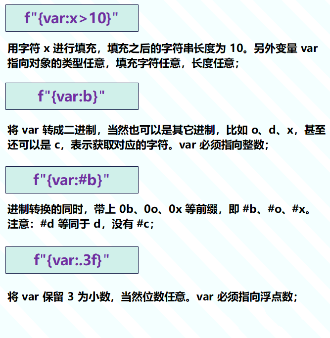

Python<br />在 Python3.6 之前，格式化字符串一般会使用百分号占位符或者 format 函数，举个例子：
```python
name = "古明地觉"
address = "地灵殿"

# 使用百分号占位符格式化字符串
print(
    "我是 %s, 来自 %s" % (name, address)
)  # 我是 古明地觉, 来自 地灵殿

# 使用format函数格式化字符串
print(
    "我是 {}, 来自 {}".format(name, address)
)  # 我是 古明地觉, 来自 地灵殿

# format 函数还支持关键字参数
print(
    "我是 {name}, 来自 {address}".format(
        address=address, name=name)
)  # 我是 古明地觉, 来自 地灵殿
但是从 3.6 开始，Python 新增了一个格式化字符串的方法，称之为 f-string。f-string 的功能非常强大，可以说是一把 "瑞士军刀"。
name = "古明地觉"
address = "地灵殿"

print(
    f"我是 {name}, 来自 {address}"
)  # 我是 古明地觉, 来自 地灵殿
```
使用 f-string 需要给字符串增加一个前缀 f，此时 `**{}**` 和它里面的内容则不再表示字符串，而是整体作为一个需要单独计算的值或者表达式、或者变量。再举个例子：
```python
print(f"1 + 1 = {1 + 1}")  # 1 + 1 = 2
print(
    f"sum([1, 2, 3]) = {sum([1, 2, 3])}"
)  # sum([1, 2, 3]) = 6
print(
    f"{'--'.join(['a', 'b', 'c', 'd'])}"
)  # a--b--c--d

try:
    print(f"{a}")
except Exception as e:
    print(e)  # name 'a' is not defined

# 在f-string中，{} 里面的内容是需要单独计算的
# 可以是常量，比如 {123}、{'hello'} 等等
# 可以是表达式，比如 {1 + 1}、{2 > 1} 等等
# 可以是变量，比如 {a}、{name}，但是变量要定义好
# 而我们上面的 a 没有定义，所以报错


# 或者定义一个变量
a = lambda x: x + 100
print(f"{a}")  # <function <lambda> at 0x000...>
print(f"{a(1)}")  # 101
```
可以看到 f-string 还是很方便的，并且和 format 功能类似，但是性能要优于 format 函数。<br />当然 f-string 的功能远没有介绍的这么简单，它支持的操作非常多，下面就来逐一介绍。
<a name="drcnN"></a>
## 实现 repr 打印
有时候在打印的时候需要带上引号。
```python
name = "古明地觉"

print(name)  # 古明地觉
print("%s" % name)  # 古明地觉
# 如果使用 %r 打印，会带上单引号
print("%r" % name)  # '古明地觉'

# 上面类似于 str 和 repr 的区别
print(str(name))  # 古明地觉
print(repr(name))  # '古明地觉'

# 等价于调用 __str__ 和 __repr__
print(name.__str__())  # 古明地觉
print(name.__repr__())  # '古明地觉'
```
当在交互式环境下，不使用 print，而是直接输入变量 name、然后回车，那么会调用 `__repr__` 方法。如果使用 `print(name)`，那么不管在什么环境，都会调用 `__str__` 方法。<br />那么在字符串周围带上一层单引号，有什么意义呢？
```python
birthday = "1995-07-05"
print("select name from where birthday > %s" % birthday)  
print("select name from where birthday > %r" % birthday)  
"""
select name from where birthday > 1995-07-05
select name from where birthday > '1995-07-05'
"""
```
看到区别了吗？如果是第一个查询，那么肯定是会报错的。重点来了，如何通过 f-string 实现这种效果呢？
```python
birthday = "1995-07-05"

# 我们只需要在打印的内容后面加上一个!r即可
print(f"{birthday!r}")  # '1995-07-05'
print(f"{birthday}")  # 1995-07-05

# "{name}" <==> str(name) <==> name.__str__()
# "{name!r}" <==> repr(name) <==> name.__repr__()

print(f"{'.'.join(['a', 'b', 'c'])}")  # a.b.c
print(f"{'.'.join(['a', 'b', 'c'])!r}")  # 'a.b.c'

# 注意：!r针对的是字符串
# 虽然也可以作用于其它对象，不过没有效果
print(f"{123!r}")  # 123
print(f"{3.14!r}")  # 3.14

# 另外除了 !r，还有 !s 和 !a，只有这三种
# !a 和 !r 类似，!s是默认选择、加不加均可
print(f"{birthday}")  # 1995-07-05
print(f"{birthday!s}")  # 1995-07-05
print(f"{birthday!a}")  # '1995-07-05'
print(f"{birthday!r}")  # '1995-07-05'
```
以上就是字符串的 repr 打印。
<a name="ym1ro"></a>
## 整数的进制转换
在打印整数的时候，有时候需要转成某个进制之后再打印。
```python
i = 123
# 打印 2 进制
print(f"{i:b}")  # 1111011
# 打印 8 进制
print(f"{i:o}")  # 173
# 打印 10 进制
# 默认是 10 进制，也可以直接使用 {i}
print(f"{i:d}")  # 123
# 打印 16 进制
print(f"{i:x}")  # 7b

# 类似于内置函数 bin、oct、hex
# 但是这些内置函数调用之后会带上一个前缀
print(bin(i))  # 0b1111011
print(oct(i))  # 0o173
print(hex(i))  # 0x7b

# f-string 可不可以实现呢？
# 答案是可以的
print(f"{i:#b}")  # 0b1111011
print(f"{i:#o}")  # 0o173
print(f"{i:#x}")  # 0x7b
# 对于表示 16 进制的 x，还可以将 x 大写
# 此时输出的内容也是大写格式的
print(f"{i:#X}")  # 0X7B
```
另外除了 # 号，还可以使用 +、-、以及空格，功能如下：

- +：显示正负号；
- -：负数显示符号、正数不显示；
- 空格：正数显示空格、负数不显示，只能是一个空格；
- #：显示前缀，比如 0b、0o、0x

注意：这几个符号不可混用，并且最多只能出现一次。
```python
print(f"{123:+x}, {-123:+x}")  # +7b, -7b
print(f"{123:-x}, {-123:-x}")  # 7b, -7b
print(f"{123: x}, {-123: x}")  #  7b, -7b
print(f"{123:#x}, {-123:#x}")  # 0x7b, -0x7b
```
另外，Python 在创建整数的时候，还支持使用 _ 进行分隔，但是打印的时候不会将 _ 显示出来。
```python
num = 100_000_000
print(num)  # 100000000

# 但如果是 f-string 的话
print(f"{num:_d}")
"""
100_000_000
"""
print(f"{num:_b}")
print(f"{num:#_b}")
"""
101_1111_0101_1110_0001_0000_0000
0b101_1111_0101_1110_0001_0000_0000
"""
print(f"{num:_o}")
print(f"{num:#_o}")
"""
5_7536_0400
0o5_7536_0400
"""
print(f"{num:_x}")
print(f"{num:#_x}")
"""
5f5_e100
0x5f5_e100
"""

# 只需要在 b、d、o、x 前面加上一个 _ 即可
# 这样打印出来的字符串也会带上 _ 分隔符
# 另外分隔符还可以使用逗号
print(f"{num:,d}")
"""
100,000,000
"""
```
注意：b、o、d、x 这些只能用于整数，不能是其它类型的对象。
```python
print(f"{'aaa':b}")
"""
    print(f"{'aaa':b}")
ValueError: Unknown format code 'b' for object of type 'str'
"""
```
最后再来补充一个字符，整数除了可以使用 b、o、d、x 之外， 还可以使用一个字符，也就是 c。
```python
num = 97

print(chr(num))  # a
print(f"{num:c}")  # a
```
以上就是整数的进制转换。
<a name="a9sEV"></a>
## 整数的填充
很多时候，打印出来的整数都会进行位数的填充，比如 1 的话，就打印 001，18 则打印 018，123 则打印本身的 123。这种需求，要怎么去处理它呢？
```python
num = 1
# 还记得这个 d 吗？
# 直接打印的话，有它没它无影响
# 但是对于填充的话，它就派上用场了
print(f"{num:03d}")  # 001
print(f"{num:013d}")  # 0000000000001
```
填充只能用 0 或者空格来填充，比如 0123d，表示打印出来要占 123 个字符，够的话不管了，不够则使用 0 在左边填充。<br />如果是 123d，它代表的可不是占 23 个字符、不够用 1 填充，它代表的还是占 123 个字符，但是由于没有指定 0，所以默认使用空格在左边填充。
```python
# 长度 23，不够使用空格填充
print(f"{1:23d}")   #                       1
# 长度 23，不够使用 0 填充
print(f"{1:023d}")  # 00000000000000000000001

# 当然同样可以结合 +、-、空格、#
print(f"{1:+08d}")  # +0000001
# 可以的话，再将分隔符包含进来
print(f"{1:+023_d}")  # +00_000_000_000_000_001
print(f"{1:+023,d}")  # +00,000,000,000,000,001
```
当然，以上规则除了适用于十进制的 d，也同样适用于二进制的 b、八进制的 o、十六进制的 x。
```python
print(f"{123:x}")
print(f"{123:016x}")
"""
7b
000000000000007b
"""

# 打印显示正负号，然后占 8 个字符
print(f"{123:+08d}")
print(f"{123:+8d}")
"""
+0000123
    +123
"""

# 打印的时候带上前缀，占 18 个字符
print(f"{123:#018b}")
print(f"{123:#18b}")
# 打印的时候带上前缀和分隔符，占 18 个字符
print(f"{123:#18_b}")
"""
0b0000000001111011
         0b1111011
        0b111_1011
"""
```
看到填充的时候，如果用 0 填充，那么会填充在 0b、+ 等前缀的后面；如果用空格填充，那么会填充在前缀的前面。当然这也符合正常人的思维：

- 如果是 "+       123" 或者 "00000+123"，明显觉得别扭；
- 如果是 "       +123" 或者 "+00000123"，则明显顺眼多了；

当然工作中不会用的这么复杂，知道整数如何填充即可。
<a name="wReYb"></a>
## 浮点数的小数保留
浮点数的小数比较长的话，打印的时候一般会只打印前两位或前三位，这在 f-string 里面如何实现呢？
```python
num = 123.13421

# f 是保留小数，但是没有指定精度
# 所以默认保留后 6 位，不够用 0 补齐
print(f"{num:f}")
"""
123.134210
"""

# .2f 则是保留两位小数
print(f"{num:.2f}")
"""
123.13
"""

# 10.2f 也是保留两位小数
# 然后整体占满 10 个字符长度
# 不够的话使用空格在左边填充
print(f"{num:10.2f}")
"""
    123.13
"""

# 如果不想使用空格填充的话
# 那么也可以使用(也只能使用) 0 来进行填充
# 规则和整数是类似的
print(f"{num:010.2f}")
"""
0000123.13
"""
```
当然 +、-、空格 同样可以适用于浮点数，规则也和整数类似，同样的，下面这些在工作中也不常用，所以知道怎么保留指定位数的小数即可。
```python
num = 123.13421

print(f"{num:+10.2f}")   
print(f"{num:+010.2f}")  
"""
   +123.13
+000123.13
"""

# 同理，浮点数也支持使用下划线或者逗号进行分隔
print(f"{num:+10_.2f}")  
print(f"{num:+10,.2f}") 
"""
   +123.13
   +123.13
"""

# 上面由于有效字符比较少，所以没有分隔符
# 我们用 0 填充一下
print(f"{num:+010_.2f}")
print(f"{num:+010,.2f}")
"""
+00_123.13
+00,123.13
"""
```
以上就是浮点数的小数保留。
<a name="qOSB8"></a>
## 任意字符的填充
上面介绍的还只是 f-string 的一部分，接下来就是 f-string 的杀手锏。
```python
name = "古明地觉"

print(f"~{name:>10}~")
print(f"~{name:^10}~")
print(f"~{name:<10}~")
"""
~      古明地觉~
~   古明地觉   ~
~古明地觉      ~
"""
```

- `>n`：输出的字符串占 n 个字符，原始的内容右对齐，长度不够则在左边用空格填充；
- `^n`：输出的字符串占 n 个字符，原始的内容居中对齐，长度不够则在左右两端用空格填充；
- `<n`：输出的字符串占 n 个字符，原始的内容左对齐，长度不够则在右边用空格填充；

还可以将 `!r`、`!s`、`!a` 结合起来使用。
```python
print(f"{'abc'!s:>10}") 
print(f"{'abc'!r:>10}") 
print(f"{'abc'!a:>10}") 
"""
       abc
     'abc'
     'abc'
"""
```
这些规则也适用于数值：
```python
print(f"{3:>10}")
print(f"{3.14:>10}")
"""
         3
      3.14
"""
```
另外默认是使用空格填充的，那么可不可以使用指定字符填充呢？答案是可以的, 直接在 >、<、^ 的左边写上用来填充的字符即可，但是只能写一个字符，多了报错。
```python
print(f"~{'a':1>10}~")  # ~111111111a~
print(f"~{'a':1^10}~")  # ~1111a11111~
# 使用空格填充，'a': >10 等价于 'a':>10
print(f"~{'a': >10}~")  # ~         a~

# 这里我们实现了 {1:03d} 的效果
print(f"{1:0>3}")  # 001

print(f"{123:b}")  # 1111011
print(f"{123:b<}")  # 123
"""
对于 f"{123:b}"，里面的 b 表示整数的进制转换
此时只能作用于整数，不能是字符串

但是对于 f"{123:b<}，由于里面出现了<
那么此时的 b 就不再代表进制了，而是代表填充字符

只不过 < 后面没有指定个数
所以解释器不知道要填充多少个，因此就原本输出了
"""

# 但是 f"{'aaa':b}" 报错
# 因为此时 b 代表进制，无法作用于字符串
print(f"{'aaa':b<}")  # aaa
print(f"{'aaa':b<4}")  # aaab
```
问题来了，如果希望整数在填充的时候，还能进制转化，该怎么做呢？
```python
# 转成十六进制
print(f"{255:x}")
"""
ff
"""
# 转成十六进制，带前缀
print(f"{123:#x}")
"""
0x7b
"""
# 转成十六进制，占满10位
# 不够使用字符 s 来左填充
print(f"{123:s>#10x}")
"""
ssssss0x7b
"""
```
浮点数也是类似的，在保留指定位数的同时，也可以进行填充。
```python
num = 123.1234

# 保留一位小数
print(f"{num:.1f}")
"""
123.1
"""

# 保留一位小数，同时占满 10 位
# 此时只能用 0 或 空格填充
print(f"{num:10.1f}")
print(f"{num:010.1f}")
"""
     123.1
00000123.1
"""

# 如果想使用其它字符填充
print(f"{num:s<10.1f}")
print(f"{num:s>10.1f}")
print(f"{num:s^10.1f}")
"""
123.1sssss
sssss123.1
ss123.1sss
"""

# 填充的时候带上正负号
print(f"{num:s<+10.1f}")
print(f"{num:s>+10.1f}")
print(f"{num:s^+10.1f}")
"""
+123.1ssss
ssss+123.1
ss+123.1ss
"""

# 填充的时候带上正负号和分隔符
num = 123123123.1234
print(f"{num:s<+20_.1f}")
print(f"{num:s>+20_.1f}")
print(f"{num:s^+20_.1f}")
"""
+123_123_123.1ssssss
ssssss+123_123_123.1
sss+123_123_123.1sss
"""
```
总的来说，f-string 还是非常强大的，但说实话，工作中不会用到这么多花里胡哨的功能。常用的就以下几种：<br /><br />虽然 f-string 可以写的很复杂，但是工作上几乎不会用到，基本上就是简单的填充、进制转换、保留小数。<br />很少会有 `f"{num:s<+20_.1f}"` 这种，保留小数的同时，还要带正负号、以及填充位数的情况出现。
<a name="Kc5P2"></a>
## 日期的截取
很多小伙伴应该没想到 f-string 还可以操作日期，这也算是一大亮点吧。在格式化或者截取日期的时候，一般会使用 datetime 模块，这些也是可以使用 f-string 来实现的。
```python
import datetime

dt = datetime.datetime(
    1995, 7, 5, 13, 30, 45, 100000)
print(dt)
"""
1995-07-05 13:30:45.100000
"""

# %F: 返回年月日(使用-连接)
print(f"{dt:%F}")
"""
1995-07-05
"""
# %D: 返回日月年(使用/连接)，但是年是两位的
# 并且也不符合中国人的日期表达习惯，建议只用 %F
print(f"{dt:%D}")
"""
07/05/95
"""

# %X: 返回时间，精确到秒(小数点后面的会截断)
# 这里注意的 X 要大写，如果是 %x 那么等价于 %D
print(f"{dt:%X}")
"""
13:30:45
"""

# 所以返回字符串格式的完整日期就可以这么写
print(f"{dt:%F %X}")
"""
1995-07-05 13:30:45
"""

# %Y: 返回年(四位)
# %y: 返回年(两位)
print(f"{dt:%Y}")
print(f"{dt:%y}")
"""
1995
95
"""

# %m: 返回月
# %d: 返回天
# 注意：会占满两位，不够补0
print(f"{dt:%m}")
print(f"{dt:%d}")
"""
07
05
"""

# 所以 %F，我们还可以这么做
# 这些符号是可以连用的
print(f"{dt:%Y-%m-%d}")
"""
1995-07-05
"""

# %H: 返回小时(24小时制度)
# %I: 返回小时(12小时制度)
# 注意：会占满两位，不够补0
print(f"{dt:%H}")
print(f"{dt:%I}")
"""
13
01
"""

# %M: 返回分钟
# %S: 返回秒
# 注意：会占满两位，不够补0
print(f"{dt:%M}")
print(f"{dt:%S}")
"""
30
45
"""

# 所以完整的 "年-月-日 时:分:秒"
# 就可以这么实现
print(f"{dt:%Y-%m-%d %H:%M:%S}")
"""
1995-07-05 13:30:45
"""

# %f: 返回微妙
# 注意：会占满六位，不够补0
print(f"{dt:%f}")
"""
100000
"""

# %p: 早上还是下午(本地时间)
# 早上返回 AM、下午返回 PM
print(f"{dt:%p}")
"""
PM
"""

# %j: 一年中的第几天，从 1 开始，1月1号就是 1
# 注意：会占满三位，不够补 0
print(f"{dt:%j}")
"""
186
"""

# %w: 星期几(0是周日、1 到 6是周一到周六)
# %u: 星期几(1 到 7是周一到周日)
# 可以看到两种格式只有星期天不一样
print(f"{dt:%w}")
print(f"{dt:%u}")
"""
3
3
"""

# %U: 一年中的第几周(以全年首个周日所在的星期为第0周)
# %W: 一年中的第几周(以全年首个周一所在的星期为第1周)
# %V: 一年中的第几周(以全年首个包含1月4日的星期为第1周)
# 都是占满两位，不够补 0
print(f"{dt:%U}")
print(f"{dt:%W}")
print(f"{dt:%V}")
"""
27
27
27
"""
# 所以如果对应的年的第一天恰好是星期一，那么%U会比%W少1。
# 如果不是星期一，那么两者是相等的
# 比如2007年的1月1号恰好是星期一
dt = datetime.datetime(2007, 10, 13)
print(f"{dt:%U}")
print(f"{dt:%W}")
print(f"{dt:%V}")
"""
40
41
41
"""

# %Z: 返回时区名，如果没有则返回空字符串
print(f"'{dt:%Z}'")  # ''
from pytz import timezone
dt = datetime.datetime(2007, 10, 13,
                       tzinfo=timezone("UTC"))
print(f"'{dt:%Z}'")  # 'UTC'
```
怎么样，是不是很方便呢？以后在做日期的格式化和解析的时候，不妨使用 f-string 试一下。
<a name="X65b2"></a>
## f-string 的注意事项
使用 f-string 需要注意单双引号的问题，如果限定字符串使用的是双引号，那么 {} 里面出现的必须是单引号，反之亦然。
```python
d = {"a": 1}
# 外面是双引号，{} 里面必须是单引号
# 不能是 d["a"]
print(f"{d['a'] + 1}")  # 2
```
限定字符串的时候使用的是双引号，{} 里面必须是单引号。可能有人好奇，如果里面仍使用双引号，但通过反斜杠 \ 进行转义的话会怎么样呢？<br />答案是不行的，因为f-string的`{}`里面不可以出现 `\`。注意：`{}` 是不可以出现 `\`，一个都不可以，所以也不要再想是不是可以使用两个 \ 进行转义啥的。
```python
try:
    print(f"{\\}")
except Exception as e:
    pass
# 我们即便使用异常捕获，也是无用的，依旧会抛出 SyntaxError
# 因为 try except 是捕捉运行时的错误
# 而 {} 里面出现反斜杠属于语法上的错误，在编译成字节码阶段就会检测出来
"""
    print(f"{\\}")
          ^
SyntaxError: f-string expression part cannot include a backslash
"""
```
因此：使用 f-string 同样需要注意单双引号的问题，并且 {} 里面不可以出现反斜杠。如果真的需要反斜杠，那么可以将反斜杠赋值给一个变量，然后将变量传递到 {} 里面去。
```python
a = "\\"
print(f"{a}")  # \
```
另外，使用 f-string 时一定要注意：**{** 和 **} **的个数要匹配。
```python
# 如果不使用 f-string，没有任何问题
# 但是使用了f-string，那么会报错
# 因为里面出现了 { 但是却没有对应的 }
# 这段代码不会通过编译
print(f"我永远喜欢{古明地觉")
"""
    print(f"我永远喜欢{古明地觉")
          ^
SyntaxError: f-string: expecting '}'
"""
```
可能有人好奇了，如果只是想单纯地输入 `**{**` 这个字符呢？答案是用两个 `**{**` 进行转义。
```python
print(f"我永远喜欢{{古明地觉")
"""
我永远喜欢{古明地觉
"""

# } 也是同理，需要使用两个 }} 进行转义
print(f"我永远喜欢古明地觉}}")
"""
我永远喜欢古明地觉}
"""

print(f"我永远喜欢{{古明地觉}}")
"""
我永远喜欢{古明地觉}
"""
```
不过这就又产生了一个问题，如果希望外面的 `**{}**` 表示限定符，里面的 `**{}**`** **表示集合该怎么办？
```python
name = "古明地觉"

# 打印的不是想要的结果
print(f"{{name}}")
"""
{name}
"""

# 在内部的 {} 周围套上一层小括号即可
print(f"{({name})}")
"""
{'古明地觉'}
"""

# 字典也是同理
print(f"{{'name': name}}")
print(f"{({'name': name})}")
"""
{'name': name}
{'name': '古明地觉'}
"""
还有字符串的拼接：
# 等价于 "你好世界"
s = "你好" "世界"
print(s)  # 你好世界

name = "古明地觉"
address = "地灵殿"
# 每一部分都要带上 f
s = f"{name}" f"{address}"
print(s)  # 古明地觉,地灵殿

s = f"{name}" "{address}"
print(s)  # 古明地觉{address}

# 多行显示也是同理
s = (f"{name}"
	 f"{address}")
print(s)  # 古明地觉地灵殿
最后则是 lambda 表达式的问题。
# 使用lambda表达式的时候一定要使用括号括起来
# 否则会将lambda中的:解释成表达式与格式描述符之间的分隔符
print(f"{(lambda x: x + 123)(123)}")  # 246
```
<a name="BjJCa"></a>
## 小结
f-string 算是 Python3.6 新增的一大亮点，虽然有着一些限制，但是这都不是什么问题，毕竟在做分词解析的时候肯定是有一些限制的，但总体来说 f-string 是非常强大的一个工具了。<br />因此在格式化字符串的时候，推荐使用f-string，相信它一定可以在格式化字符串的时候能提供很大的帮助。<br />再补充一点，在 3.8 的时候给 f-string 增加了一个功能：
```python
num = 123

print(f"{num=}")
print(f"{num =}")
print(f"{num = }")
"""
num=123
num =123
num = 123
"""
# 可以看到加上了 =
# 还会将 {} 里面的内容输出出来
# 像我们之前的例子
print(f"sum([1, 2, 3]) = {sum([1, 2, 3])}")
"""
sum([1, 2, 3]) = 6
"""
# 加上 = 就会简洁很多
print(f"{sum([1, 2, 3]) = }")
"""
sum([1, 2, 3]) = 6
"""

print(f"{1 + 1 = }")
"""
1 + 1 = 2
"""

print(f"{len('古明地觉') = }")
"""
len('古明地觉') = 4
"""
```
