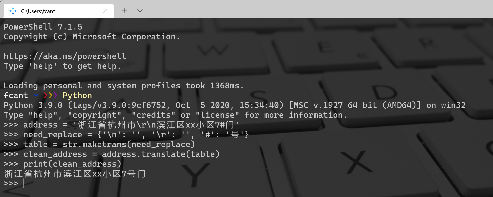

Python 字符串<br />在使用爬虫爬取下来的数据中可能混有很多不需要的字符，例如：
```python
address = '浙江省杭州市\r\n滨江区xx小区7#门'
```
现在需要移除里面的 `\r`、 `\n`、把`#`替换为`号`。可能会这样写代码：
```python
clean_address = address.replace('\r', '')
clean_address = address.replace('\n', '')
clean_address = address.replace('#', '号')
```
这样的写法，处理几个字符还行，但如果要处理几百个特殊符号，那就很困难了。<br />所以当要处理很多的字符串替换时，可能会有一个配置文件来记录替换关系：
```python
need_replace = {'\n': '', '\r': '', '#': '号'}
```
在这种情况下，可以使用字符串的 `translate`方法来实现替换：
```python
address = '浙江省杭州市\r\n滨江区xx小区7#门'
need_replace = {'\n': '', '\r': '', '#': '号'}
table = str.maketrans(need_replace)
clean_address = address.translate(table)
```
运行效果如下图所示：<br /><br />使用这种方式，可以让代码看起来更加简洁，也更方便配置。<br />不过当需要替换的字符串比较少时， `translate`的效率比 `replace`低。并且 `translate`只能实现多个单字符的替换，不能替换多字符的字符串，例如：
```python
address = '浙江省杭州市</p>滨江区'
```
如果要把 `</p>`整体替换为空，就不能使用 `translate`方法。
