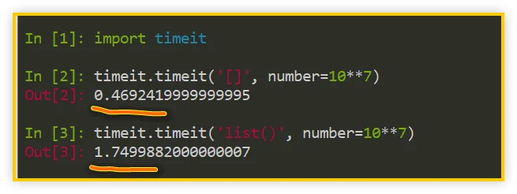
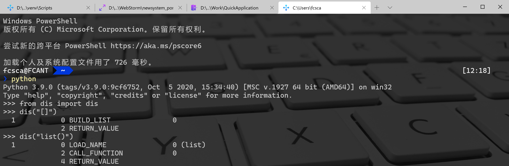
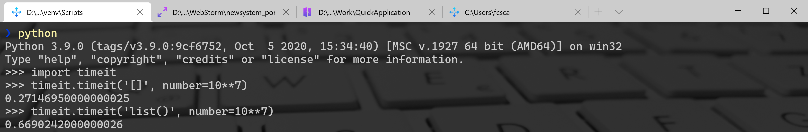

Python [] list()<br />在日常使用 Python 时，经常需要创建一个列表，有以下两种方法：
```python
# 方法一：使用成对的方括号语法
list_a = []
# 方法二：使用内置的 list()
list_b = list()
```
**两种创建列表的 **`**[]**`** 与 **`**list()**`** 写法，哪一个更快呢，为什么它会更快呢？**
<a name="Frn38"></a>
## 1、`[]` 是 `list()` 的三倍快
对于第一个问题，使用`timeit`模块的 `timeit()` 函数就能简单地测算出来：
```python
>>> import timeit
>>> timeit.timeit('[]', number=10**7)
>>> timeit.timeit('list()', number=10**7)
```
<br />如上图所示，在各自调用一千万次的情况下，`[]` 创建方式只花费了 0.47 秒，而 `list()` 创建方式要花费 1.75 秒，所以，后者的耗时是前者的 3.7 倍！<br />这就回答了刚才的问题：**创建空列表时，**`**[]**`** 要比 **`**list()**`** 快不少。**
> 注：`timeit()` 函数的效率跟运行环境相关，每次执行结果会有微小差异。在 Python3.8 版本实验了几次，总体上 `[]` 速度是 `list()` 的 3 倍多一点。

<a name="qY5Ha"></a>
## 2、`list()` 比 `[]` 执行步骤多
继续来分析一下第二个问题：为什么 `[]` 会更快呢？<br />这一次可以使用`dis`模块的 `dis()` 函数，看看两者执行的字节码有何差别：
```python
>>> from dis import dis
>>> dis("[]")
>>> dis("list()")
```
<br />如上图所示，`[]` 的字节码有两条指令（`BUILD_LIST` 与 `RETURN_VALUE`），而 `list()` 的字节码有三条指令（`LOAD_NAME`、`CALL_FUNCTION` 与 `RETURN_VALUE`）。<br />这些指令意味着什么呢？该如何理解呢？<br />首先，对于 `[]`，它是 Python 中的一组字面量（literal），像数字之类的字面量一样，表示确切的固定值。<br />也就是说，Python 在解析到它时，就知道它要表示一个列表，因此会直接调用解释器中构建列表的方法（对应`BUILD_LIST`），来创建列表，所以是一步到位。<br />而对于 `list()`，“list”只是一个普通的名称，并不是字面量，也就是说解释器一开始并不认识它。<br />因此，解释器的第一步是要找到这个名称（对应`LOAD_NAME`）。它会按照一定的顺序，在各个作用域中逐一查找（局部作用域--全局作用域--内置作用域），直到找到为止，找不到则抛出`NameError`。<br />解释器看到“list”之后是一对圆括号，因此第二步是把这个名称当作可调用对象来调用，即把它当成一个函数进行调用（对应 `CALL_FUNCTION`）。<br />因此，`list()` 在创建列表时，需要经过名称查找与函数调用两个步骤，才能真正开始创建列表（注：`CALL_FUNCTION` 在底层还会有一些函数调用过程，才能走到跟 `BUILD_LIST` 相通的逻辑，此处忽略不计）。<br />至此，就可以回答前面的问题了：**
<a name="cYIRV"></a>
## 3、`list()` 的速度提升
**在刚刚发布的 Python 3.9.0 版本中，它给 **`**list()**`** 实现了更快的 vectorcall 协议**，因此执行速度会有一定的提升。<br />**在新版本中运行 **`**list()**`** 一千万次，耗时大概在 1 秒左右，也就是 **`**[]**`** 运行耗时的 2 倍，相比于前面接近 4 倍的数据，当前版本总体上是提升了不少。**<br />
