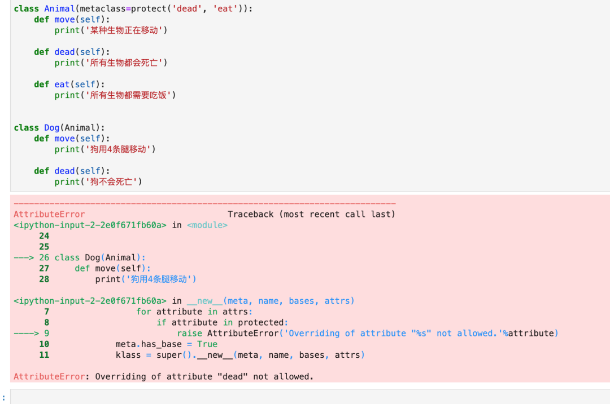

Python 类<br />当子类试图覆盖父类的时候，可以通过类型标注来发出警告。如何直接禁止覆盖。<br />Python 原生是没有提供禁止子类覆盖父类的方法的功能，因此需要自己来实现。<br />先来看一下实现效果：<br /><br />在这段代码里面，禁止子类覆盖父类的`dead()`和`eat()`方法，但不禁止`move`方法。所以，在子类Dog里面尝试覆盖父类中的`dead()`时，程序就报错了。具体要覆盖哪些方法，可以在定义类的时候指定，传入的参数`metaclass=protect('方法1', '方法2', '方法3', ...)`就可以了。<br />那么这个`protect`函数是个什么东西呢？来看看它的代码：
```python
def protect(*protected):
    """Returns a metaclass that protects all attributes given as strings"""
    class Protect(type):
        has_base = False
        def __new__(meta, name, bases, attrs):
            if meta.has_base:
                for attribute in attrs:
                    if attribute in protected:
                        raise AttributeError('Overriding of attribute "%s" not allowed.'%attribute)
            meta.has_base = True
            klass = super().__new__(meta, name, bases, attrs)
            return klass
    return Protect
```
这里，用到了 Python 的元类。简单的来说，元类用来定义类的创建行为。它一般的格式为：
```python
class 类名(metaclass=另一个类):
   ...
```
用来禁止重试的这个函数`protect`，它返回的就是一个`Protect`类。这个类继承于`type`对象。<br />`Protect`类有一个`__new__`方法，这个方法会在使用了元类的所有子类的`__init__`之前被调用。在__new__里面，拿到了子类要定义的方法，并且检查他们是不是在传给`protect`的列表里面。如果在，说明这个方法不能被覆盖。<br />当实现自己的父类`Animal`的时候，由于`meta.has_base`为 `False`，所以不会触发检查逻辑。但当基于`Animal`实现`Dog`子类的时候，由于`meta.has_base`是`True`，所以进入检查逻辑。`Dog`的所有方法名都在`attrs`参数里面。循环检查每一个方法名是否在禁止的列表中，如果在，就抛出异常。如果不在，就继续后面的创建过程。
