Python f-string 是格式化字符串的缩写，是以小写或大写字母 F 为前缀的字符串文本 f-string 提供简洁明了的语法，**允许对变量和表达式进行插值** 那对于还在即将发布的还在测试阶段的 Python 3.12 版本中，f-string 有哪些改动？Python 3.12 版本之前的 f-string 又有哪些限制？直接进入正文 原文链接：[**https://realpython.com/python312-f-strings/**](https://realpython.com/python312-f-strings/)

## f-string 在 python 3.12 前的限制
可以使用 Python 的 f-string 进行字符串格式化和插值，f-string 是以字母 F （大写小写都行）为前缀的字符串文本 这种文本允许插入变量和表达式，Python 会对其进行评估以生成最终字符串 自从在 Python 3.6 版本中引入以来，f-string 在 Python 社区内已经广泛流行起来。人们对它们的采纳热情高涨，并将其作为现代 Python 编程的标准 这其中的原因是什么呢？ 这是因为 f-string 提供了一种简洁而易读的语法，允许格式化字符串并插入变量和表达式，而无需使用传统的`.format()` 方法或旧式的字符串格式运算符（%） 然而，为了引入 f-string，CPython 核心开发团队必须做出关键的决策，特别是在解析f字符串时，所以 f-string 有自己的解析代码 换句话说，CPython 有一个专用的 f-string 解析器。因此，f-string 语法不是官方 Python 语法的一部分 从核心开发人员的角度来看，这样的实现决策意味着相当大的维护成本，因为他们必须手动维护一个单独的解析器 而且不作为官方语法的一部分，也意味着其他 Python 实现，如 PyPy，无法确定他们是否正确实现了 f-string 然而，最重要的负担在于用户方面。从用户的角度来看，当前的 f-string 实现施加了一些限制：

1. 无法重复使用引号或字符串分隔符
2. 无法嵌入反斜杠，这意味着不能使用转义字符
3. 禁止添加内联注释
4. f-string 的嵌套仅限于 Python 中可用的引用变体

PEP 536 列出了这些限制。接下来通过一些小示例来了解这些限制如何影响在 Python 中使用 f-string 示例中使用的是 Python 3.11 版本，如果使用较低的版本可能会导致输出不一样

### f-string 无法重复使用引号或字符串分隔符
首先在 f-string 中插入字典的 key 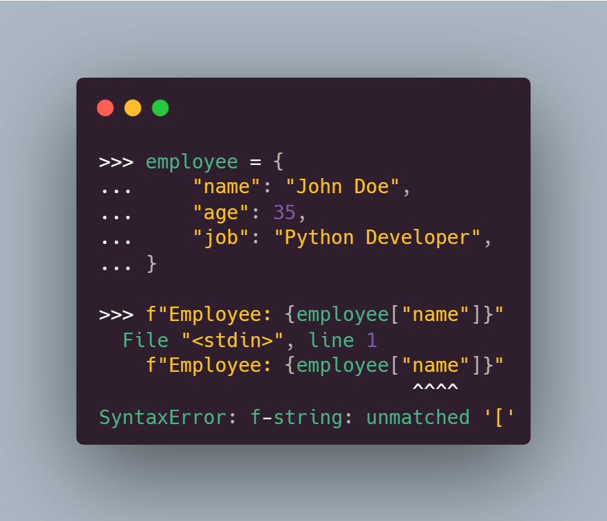 在上面的示例中，尝试在  f-string 中插入员工姓名，但是报错了 因为 "name" 键周围的双引号会破坏字符串文本（**f-string 无法重复使用引号或字符串分隔符**） 若要解决此问题，需要使用不同类型的引号来分隔键 将双引号用于 f-string ，单引号用于字典 key，这下就不会报错了 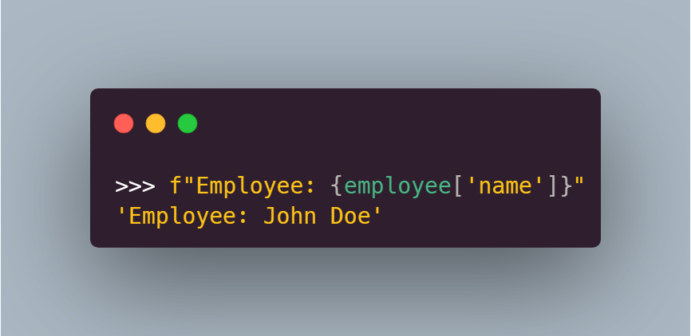

### f-string 的第二个限制是不能在嵌入式表达式中使用反斜杠字符
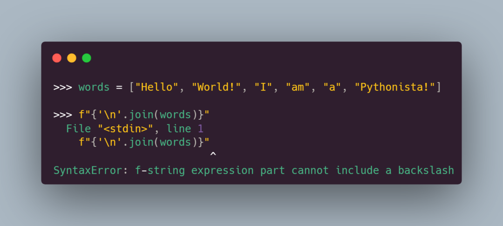 看到上面的示例得到了一个 SyntaxError ，因为 f-string 不允许在由大括号分隔的表达式中使用反斜杠字符 可以通过下面的方法来实现，但他并不优美 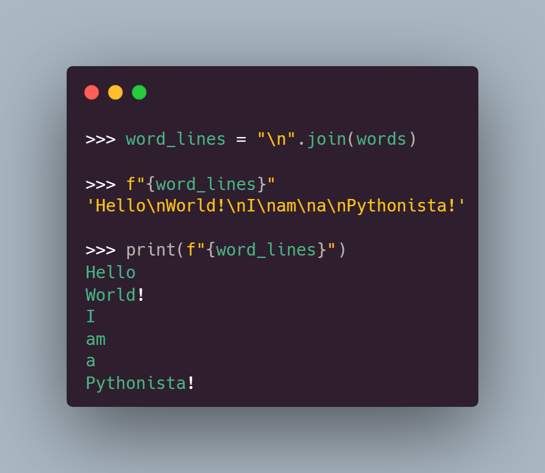

### f-string 的另一个限制是它们不允许在嵌入式表达式中插入注释
虽然这种限制可能看起来是多余的，但在某些情况下，一个好的注释可以帮助其他开发人员更好地理解代码 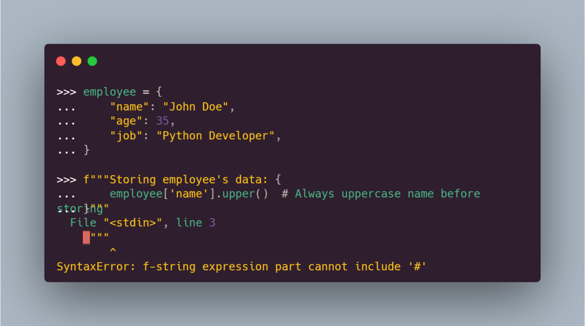 在上面的示例中，使用了三引号生成多行的字符串，当尝试增加注释时，程序却报错了

### f-string中的嵌套级别数受 Python 中可用的字符串分隔符的限制
最后，f-string 还有另一个限制——**f-string中的嵌套级别数受 Python 中可用的字符串分隔符的限制**，这些分隔符是 " 、 ' 、 """ 和 ''' 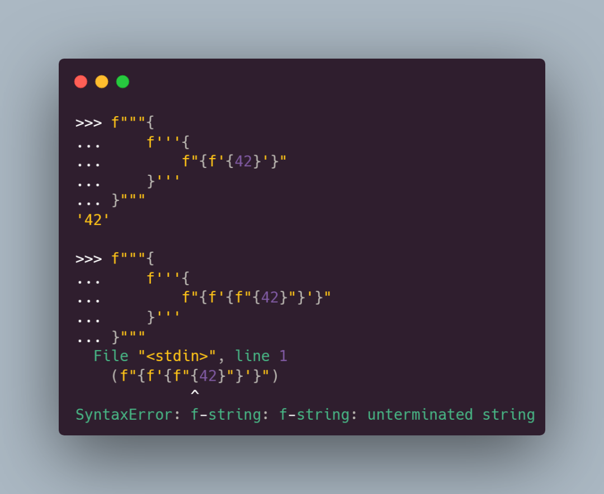 尽管嵌套 f-string 可能没有很多用例，但如果在特定用例中需要额外的嵌套级别，那么就不走运了，因为不能重用引号 需要注意的是：只有三引号的 f-string 可以跨越多行，但是这个是 Python 字符串的特征 虽然 f-string 字符串非常酷，大多数 Python 开发人员都喜欢它们，但上面这些限制让 f-string 感觉不完整，并且与 Python 本身的一般行为不一致 幸运的是，Python 在不断改进，下一个版本 3.12 正在解除这些限制使 f-string 变得更好

## Python 3.12 中 f-string 的改动

### 可重复使用引号，不再严格区分双引号单引号
在新的 f-string 实现中，嵌入的表达式组件可以包含任何 Python 表达式，包括使用与包含的 f-string 相同类型的引号的字符串文本 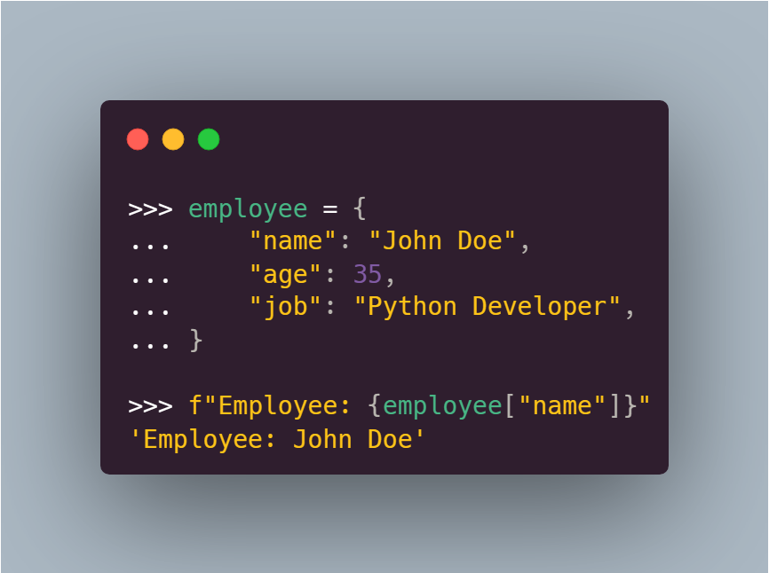 在上面的示例中，使用了双引号来定义 f-string 并分隔 employee 字典键 现在，在嵌入式表达式中使用字符串文本时，不必切换到其他类型的引号 尽管这种新行为看起来很酷且一致，但有些人认为在同一 f-string 中重用引号令人困惑且难以阅读 这些人可能是对的——重用引号违反了 Python 规则，即匹配的引号对分隔字符串 但是，专注于将纯字符串部分与嵌入的表达式部分分开有助于提高可读性 在这方面，PEP 701 的作者说：
> We believe that forbidding quote reuse should be done in linters and code style tools and not in the parser, the same way other confusing or hard-to-read constructs in the language are handled today
> 我们认为，禁止引用重用应该在 linters 和代码样式工具中完成，而不是在解析器中，就像今天处理语言中其他令人困惑或难以阅读的结构一样

这种说法是有道理的。但是最佳做法和样式建议可能依旧是在代码中避免使用它们 因此，如果发现重用引号不可读或令人困惑，那就坚持在 f-string 中使用不同引号的旧做法

### 允许使用反斜杠
f-string 不支持反斜杠是 Python 3.11 及更低版本中的另一个问题，在 Python 3.12 中，此问题已解决 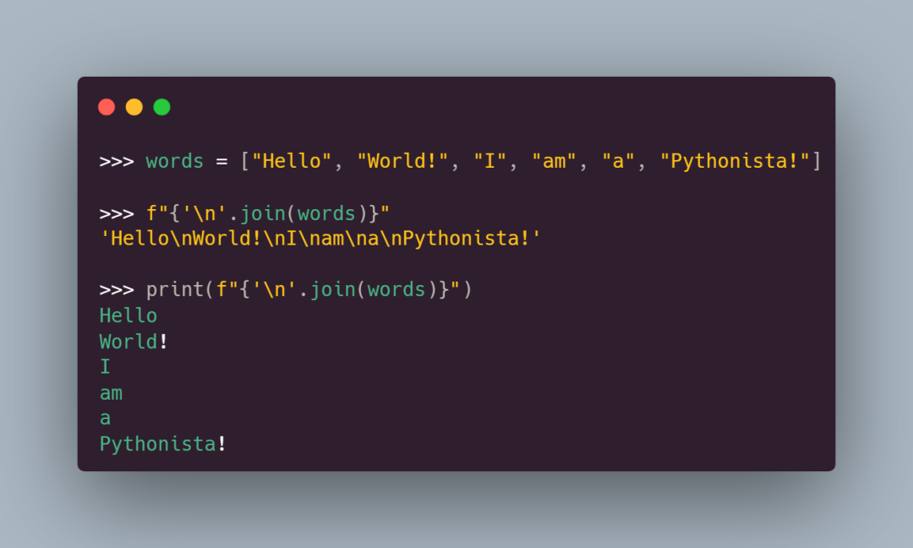 能够在嵌入在 f-string 中的表达式中包含反斜杠是一个很好的进步，它省去了寻找替代解决方法的工作量

### 支持多行实现和注释
f-string 还允许在这些表达式中使用多行表达式和内联注释 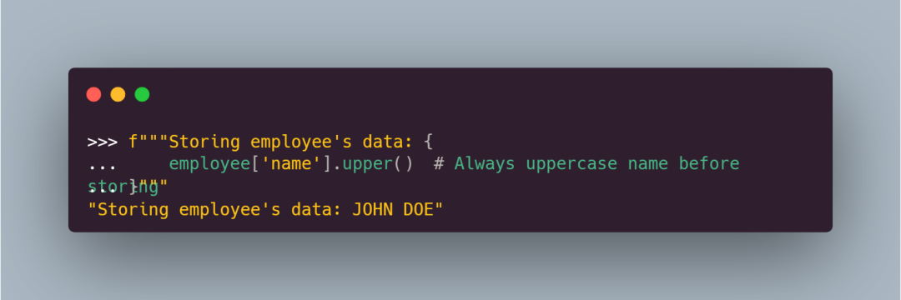 在 Python 3.12 的 f-string 中，可以定义跨越多个物理行的表达式。如果需要，每行都可以包含内联注释

### 实现任意级别的 f-string 嵌套
由于允许引号重用，新的  f-string 允许任意级别的嵌套 此功能的实用性有限，因为许多级别的嵌套可能会使代码难以阅读和理解 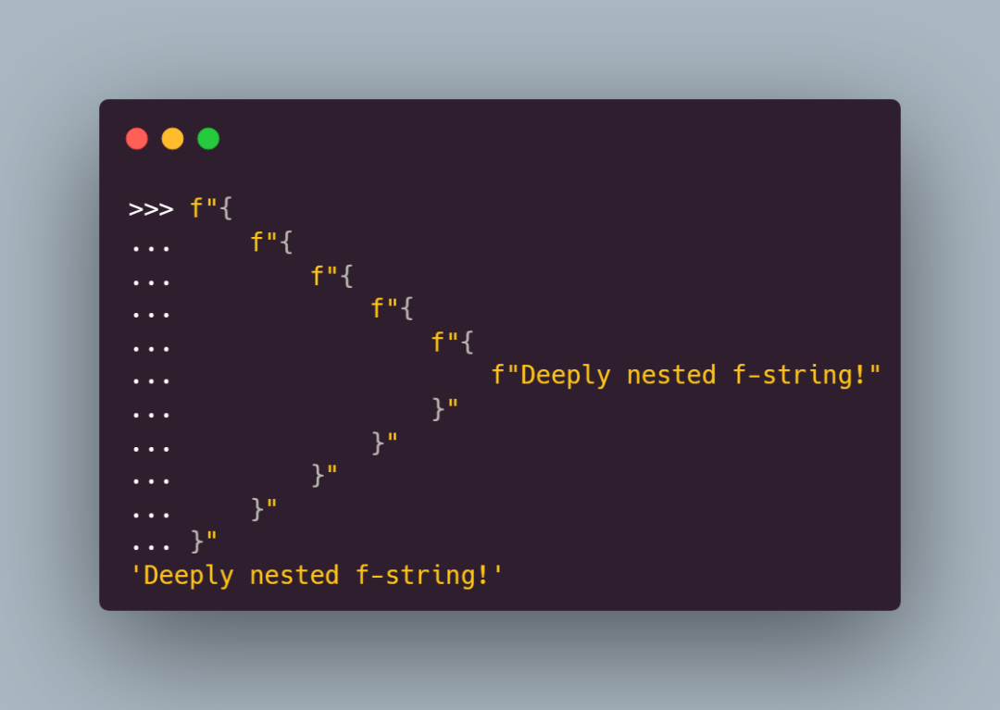 在上面的示例中，注意到新的 f-string 允许在表达式中的大括号内使用换行符，这个跟常规 Python 规范一致（常规 Python 允许将表达式括在一对括号中，使其能够跨越多行）

### 更具体更清晰的报错信息
Python 3.12 的新 f-string 消除了如何在现实代码中使用 f-string 的几个限制并且将其变成了新功能 但远不止于此 以前，这些增强的错误消息不适用于 f-string，因为它们不使用 PEG 解析器 因此，在 Python 3.12 之前，与 f-string 相关的错误消息不太具体和清晰 Python 开发团队在引入 PEG 解析器后投入了大量工作来改进 Python 错误消息，现在使用 PEG 解析器来解析新的 f-string 语法，所以会得到一个额外的、显着的好处——更具体更清晰的报错信息 例如，比较下面 f-string 在 3.11 与 3.12 中生成的错误消息 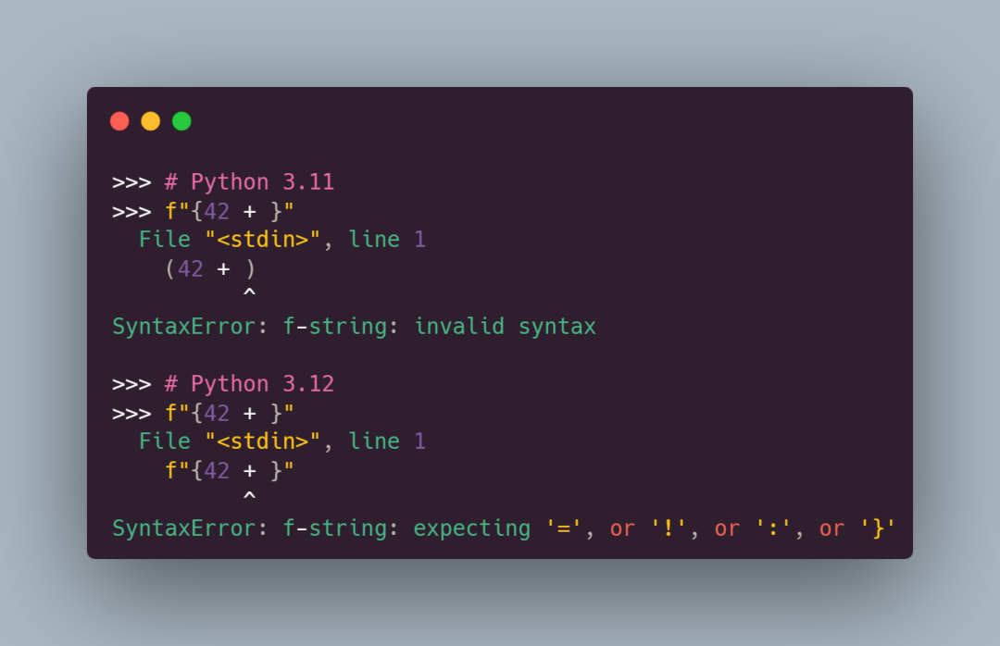 第一个示例中的错误消息是通用的，不指向违规行中错误的确切位置。此外，表达式在括号中，这会增加问题的噪音，因为原始代码不包含括号 在 Python 3.12 中，错误消息更加精确。它指示问题在受影响管中的确切位置。此外，异常消息提供了一些可能有助于解决问题的建议

## Python 3.12 中 f-string 仍有不足
新的 f-string 不会消除 f-string 的一些当前限制 例如，有关使用冒号 （ `:` ）、感叹号 （ `!` ） 和转义带反斜杠的大括号的规则仍然存在 要将冒号和感叹号 （ `:!` ） 用于字符串格式以外的目的，需要用一对括号将包含这些符号之一的表达式括起来。否则，f-string 将不起作用 根据PEP 701的作者的说法，这就是他们没有取消限制的原因：
> The reason is that this [removing the restriction] will introduce a considerable amount of complexity [in the f-string parsing code] for no real benefit.
> 原因是这[删除限制]将[在f字符串解析代码中]引入相当大的复杂性，而没有真正的好处

除了将这些字符用于字符串格式化之外，几乎找不到适合它们的用例。即使是 PEP 701 中的相关示例也毫无用处 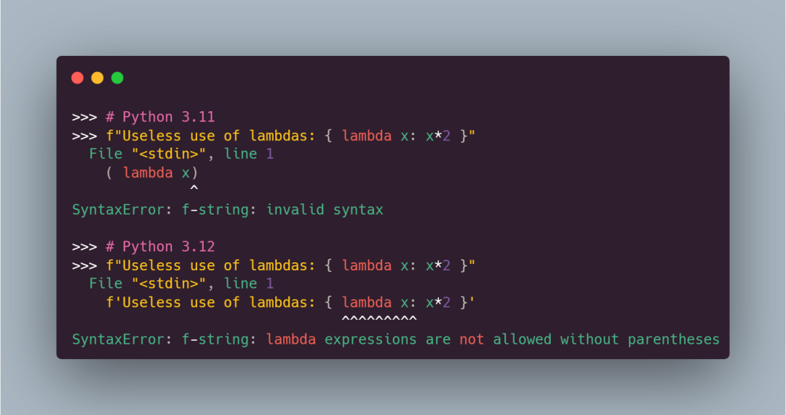 在上面的示例中，使用冒号作为匿名函数的一部分，但是却报错了 如果要避免这个错误，必须用括号括起来 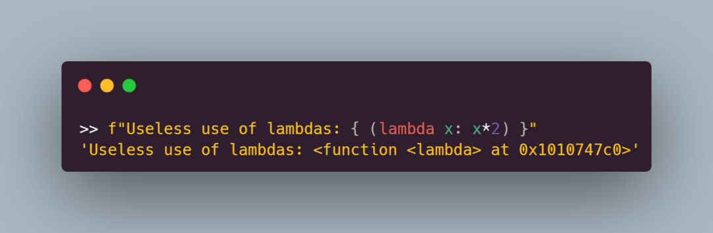 最后，新的 f-string 允许使用反斜杠转义字符，但**不允许使用反斜杠转义大括号**： 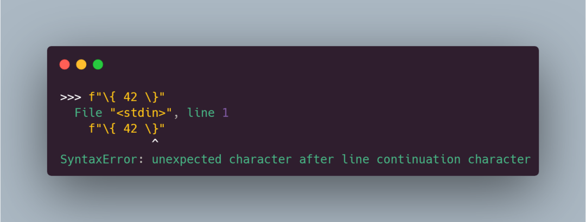 在此示例中，尝试使用反斜杠来转义大括号。但是，代码不起作用 以下是 PEP 701 的作者对此限制的看法:
> We have decided to disallow (for the time being) using escaped braces (\{ and \}) in addition to the {{ and }} syntax. Although the authors of the PEP believe that allowing escaped braces is a good idea, we have decided to not include it in this PEP, as it is not strictly necessary for the formalization of f-strings proposed here, and it can be added independently in a regular CPython issue
> 我们决定（暂时）禁止使用转义大括号（ \{ 和 \} ）以及 {{ 和 }} 语法。尽管 PEP 的作者认为允许转义大括号是个好主意，但我们决定不将其包含在此 PEP 中，因为它对于此处提出的 f-string 的形式化并不是绝对必要的，并且可以在常规的 CPython 问题中独立添加

如果要转义 f-string 中的大括号，需要在外面多加一层大括号 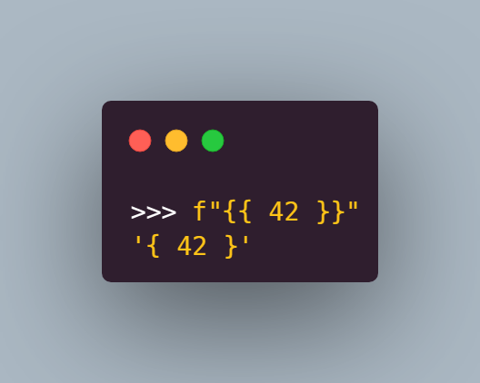 将大括号加倍（外面多加一层大括号）是目前版本在 f-string 中转义这些字符的方法，但是将来可能会改变
