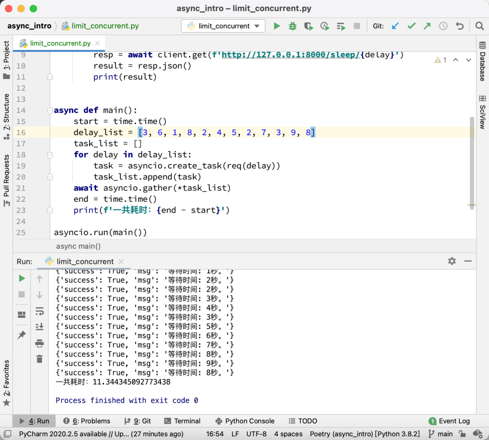
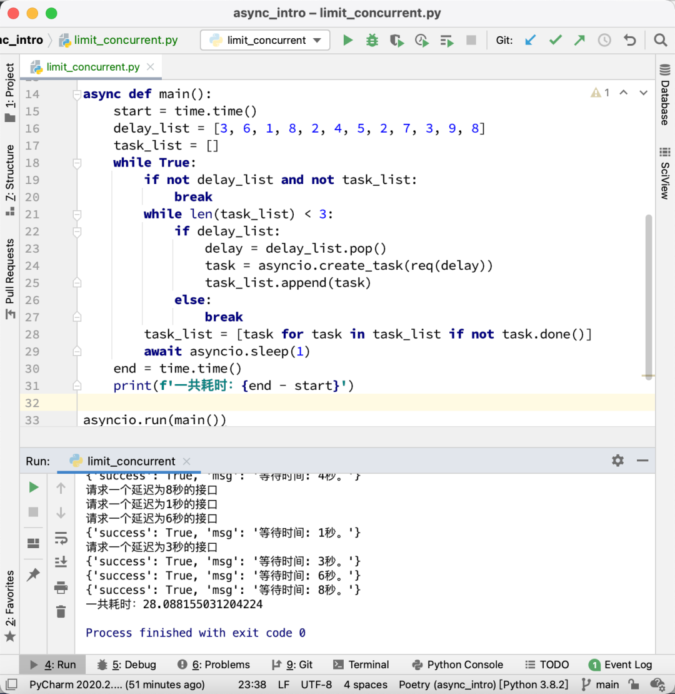
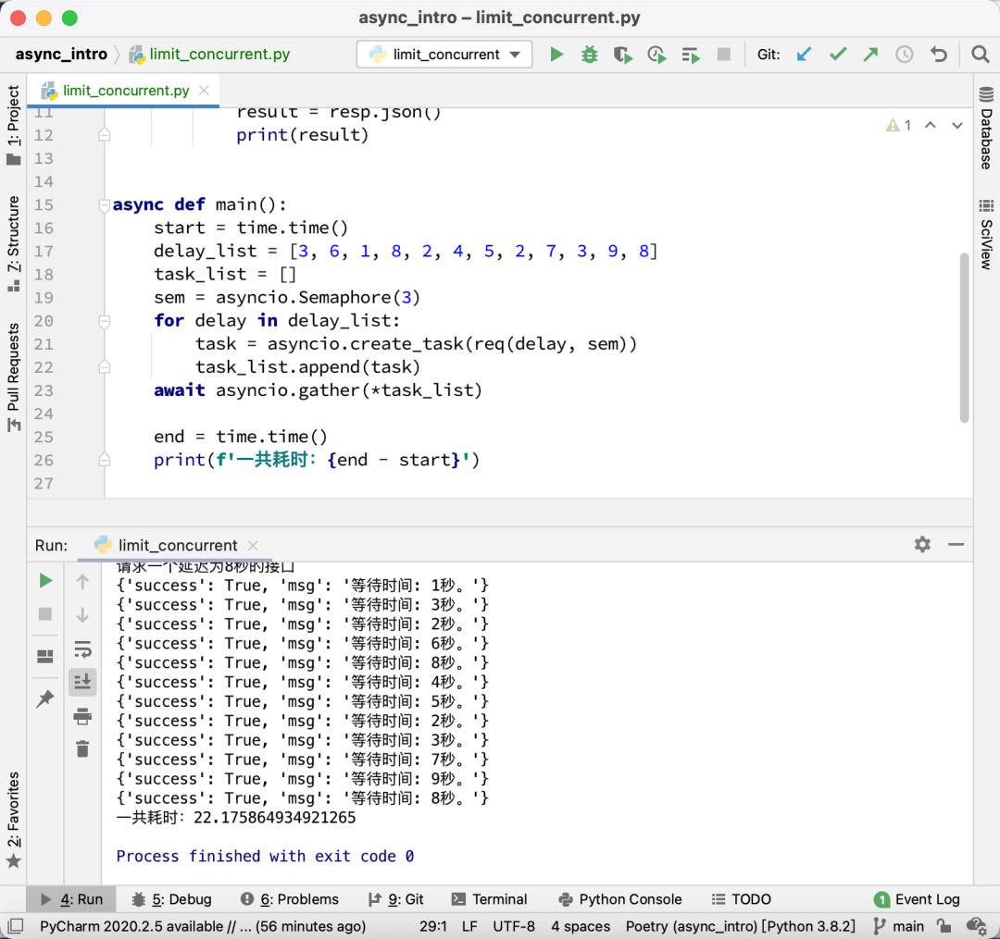

Python<br />如果使用 asyncio + httpx 实现并发请求，怎么限制请求的频率呢？怎么限制最多只能有 x 个请求同时发出呢？
<a name="kZ8UD"></a>
## 提出问题
假设如果同时发起12个请求，每个请求的时间不同，那么总共的请求时间大概跟最长耗时的请求差不多。先来写一个用于测试的例子：
```python
import asyncio
import httpx
import time


async def req(delay):
    print(f'请求一个延迟为{delay}秒的接口')
    async with httpx.AsyncClient(timeout=20) as client:
        resp = await client.get(f'http://127.0.0.1:8000/sleep/{delay}')
        result = resp.json()
        print(result)


async def main():
    start = time.time()
    delay_list = [3, 6, 1, 8, 2, 4, 5, 2, 7, 3, 9, 8]
    task_list = []
    for delay in delay_list:
        task = asyncio.create_task(req(delay))
        task_list.append(task)
    await asyncio.gather(*task_list)
    end = time.time()
    print(f'一共耗时：{end - start}')

asyncio.run(main())
```
这段代码，使用 for 循环创建了12个协程任务，这些任务几乎同时运行，于是，请求完成所有的接口，总共耗时如下图所示：<br /><br />现在的问题是，由于网站有反爬虫机制，最多只能同时发起3个请求。那么怎么确保同一时间最多只有3个协程在请求网络呢？
<a name="dBKnL"></a>
## 限制协程任务数
第一个方案跟以前限制多线程的线程数的方案相同。创建一个列表，确保列表里面最多只有3个任务，然后持续循环检查，发现有任务完成了，就移除这个完成的任务，并加入一个新的任务，直到待爬的列表为空，这个任务列表也为空。代码如下：
```python
import asyncio
import httpx
import time


async def req(delay):
    print(f'请求一个延迟为{delay}秒的接口')
    async with httpx.AsyncClient(timeout=20) as client:
        resp = await client.get(f'http://127.0.0.1:8000/sleep/{delay}')
        result = resp.json()
        print(result)


async def main():
    start = time.time()
    delay_list = [3, 6, 1, 8, 2, 4, 5, 2, 7, 3, 9, 8]
    task_list = []
    while True:
        if not delay_list and not task_list:
            break
        while len(task_list) < 3:
            if delay_list:
                delay = delay_list.pop()
                task = asyncio.create_task(req(delay))
                task_list.append(task)
            else:
                break
        task_list = [task for task in task_list if not task.done()]
        await asyncio.sleep(1)
    end = time.time()
    print(f'一共耗时：{end - start}')

asyncio.run(main())
```
运行效果如下图所示：<br /><br />总共耗时大概28秒左右。比串行需要的58秒快了一半，但比全部同时并发多了一倍。
<a name="VyBcE"></a>
## 使用 Semaphore
`asyncio` 实际上自带了一个限制协程数量的类，叫做`Semaphore`。只需要初始化它，传入最大允许的协程数量，然后就可以通过上下文管理器来使用。看一下代码：
```python
import asyncio
import httpx
import time


async def req(delay, sem):
    print(f'请求一个延迟为{delay}秒的接口')
    async with sem:
        async with httpx.AsyncClient(timeout=20) as client:
            resp = await client.get(f'http://127.0.0.1:8000/sleep/{delay}')
            result = resp.json()
            print(result)


async def main():
    start = time.time()
    delay_list = [3, 6, 1, 8, 2, 4, 5, 2, 7, 3, 9, 8]
    task_list = []
    sem = asyncio.Semaphore(3)
    for delay in delay_list:
        task = asyncio.create_task(req(delay, sem))
        task_list.append(task)
    await asyncio.gather(*task_list)

    end = time.time()
    print(f'一共耗时：{end - start}')

asyncio.run(main())
```
运行效果如下图所示：<br /><br />耗时为22秒，比第一个方案更快。<br />来看看`Semaphore`的用法，它的格式为：
```python
sem = asyncio.Semaphore(同时运行的协程数量)

async def func(sem):
    async with sem:
        这里是并发执行的代码

task_list = []
for _ in range(总共需要执行的任务数):
    task = asyncio.create_task(func(sem))
    task_list.append(task)
await asyncio.gather(*task_list)
```
当要限制一个协程的并发数的时候，可以在调用协程之前，先初始化一个`Semaphore`对象。然后把这个对象传到需要限制并发的协程里面，在协程里面，使用异步上下文管理器包住正式代码：
```python
async with sem:
    正式代码
```
这样一来，如果并发数没有达到限制，那么`async with sem`会瞬间执行完成，进入里面的正式代码中。如果并发数已经达到了限制，那么其他的协程会阻塞在`async with sem`这个地方，直到正在运行的某个协程完成了，退出了，才会放行一个新的协程去替换掉这个已经完成的协程。<br />这个写法其实跟多线程的加锁很像。只不过锁是确保同一个时间只有一个线程在运行，而`Semaphore`可以人为指定能有多少个协程同时运行。
<a name="U6Epi"></a>
## 如何限制1分钟内能够运行的协程数
可能同学看了上面的例子以后，只知道如何限制同时运行的协程数。但是怎么限制在一段时间里同时运行的协程数呢？<br />其实非常简单，在并发的协程里面加个 `asyncio.sleep` 就可以了。例如上面的例子，想限制每分钟只能有3个协程，那么可以把代码改为：
```python
async def req(delay, sem):
    print(f'请求一个延迟为{delay}秒的接口')
    async with sem:
        async with httpx.AsyncClient(timeout=20) as client:
            resp = await client.get(f'http://127.0.0.1:8000/sleep/{delay}')
            result = resp.json()
            print(result)
    await asyncio.sleep(60)
```
<a name="jfVZp"></a>
## 总结
如果要限制协程的并发数，那么最简单的办法就是使用`asyncio.Semaphore`。但需要注意的是，只能在启动协程之前初始化它，然后传给协程。要确保所有并发协程拿到的是同一个`Semaphore`对象。<br />当然程序里面可能有多个不同的部分，有些部分限制并发数为 a，有些部分限制并发数为 b。那么可以初始化多个`Semaphore`对象，分别传给不同的协程。
