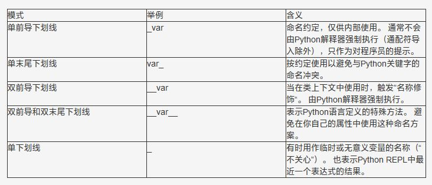

Python<br />介绍Python中**单下划线**和**双下划线**("dunder")的各种含义和命名约定，名称修饰(name mangling)的工作原理，以及它如何影响你自己的Python类。<br />**单下划线**和**双下划线** 在Python变量和方法名称中都各有其含义。有一些含义仅仅是依照约定，被视作是对程序员的提示 - 而有一些含义是由Python解释器严格执行的。<br />这里讨论以下五种下划线模式和命名约定，以及它们如何影响Python程序的行为：

- 单前导下划线：`**_var**`
- 单末尾下划线：`**var_**`
- 双前导下划线：`**__var**`
- 双前导和末尾下划线：`**__var__**`
- 单下划线：`**_**`

在文章结尾处，可以找到一个简短的**速查表**，总结了五种不同的下划线命名约定及其含义，让我们马上开始！
<a name="c5ySj"></a>
## 1、单前导下划线 _var
当涉及到变量和方法名称时，单个下划线前缀有一个约定俗成的含义。它是对程序员的一个提示：意味着Python社区一致认为它应该是什么意思，但程序的行为不受影响。<br />下划线前缀的含义是告知其他程序员：**以单个下划线开头的变量或方法仅供内部使用**。该约定在PEP 8中有定义。<br />这不是Python强制规定的。Python不像Java那样在“私有”和“公共”变量之间有很强的区别。这就像有人提出了一个小小的下划线警告标志，说：<br />“嘿，这不是真的要成为类的公共接口的一部分。不去管它就好。“<br />看看下面的例子：
```python
class Test:
   def __init__(self):
       self.foo = 11
       self._bar = 23
```
如果实例化此类，并尝试访问在`__init__`构造函数中定义的foo和_bar属性，会发生什么情况？让我们来看看：
```python
>>> t = Test()
>>> t.foo
11
>>> t._bar

23
```
会看到`_bar`中的单个下划线并没有阻止我们“进入”类并访问该变量的值。<br />这是因为Python中的单个下划线前缀仅仅是一个约定 - 至少相对于变量和方法名而言。<br />但是，前导下划线的确会影响从模块中导入名称的方式。<br />假设在一个名为my_module的模块中有以下代码：
```python
# This is my_module.py:

def external_func():
   return 23

def _internal_func():
   return 42
```
现在，如果使用通配符从模块中导入所有名称，则Python不会导入带有前导下划线的名称（除非模块定义了覆盖此行为的`__all__`列表）：
```python
>>> from my_module import *
>>> external_func()
23
>>> _internal_func()
NameError: "name '_internal_func' is not defined"
```
顺便说一下，应该避免通配符导入，因为它们使名称空间中存在哪些名称不清楚。为了清楚起见，坚持常规导入更好。<br />与通配符导入不同，常规导入不受前导单个下划线命名约定的影响：
```python
>>> import my_module
>>> my_module.external_func()
23
>>> my_module._internal_func()
42
```
这一点可能有点令人困惑。如果遵循PEP 8推荐，避免通配符导入，那么你真正需要记住的只有这个：<br />单个下划线是一个Python命名约定，表示这个名称是供内部使用的。它通常不由Python解释器强制执行，仅仅作为一种对程序员的提示。
<a name="JilbF"></a>
## 2、单末尾下划线 var_
有时候，一个变量的最合适的名称已经被一个关键字所占用。因此，像class或def这样的名称不能用作Python中的变量名称。在这种情况下，可以附加一个下划线来解决命名冲突：
```python
>>> def make_object(name, class):
SyntaxError: "invalid syntax"

>>> def make_object(name, class_):
...    pass
```
总之，单个末尾下划线（后缀）是一个约定，用来避免与Python关键字产生命名冲突。PEP 8解释了这个约定。
<a name="KaCmi"></a>
## 3、双前导下划线 `__var`
到目前为止，所涉及的所有命名模式的含义，来自于已达成共识的约定。而对于以**双下划线开头**的Python类的属性(包括变量和方法)，情况就有点不同了。<br />双下划线前缀会导致Python解释器重写属性名称，以避免子类中的命名冲突。<br />这也叫做**名称修饰(name mangling)** - 解释器更改变量的名称，以便在类被扩展的时候不容易产生冲突。<br />这听起来很抽象。因此，组合了一个小小的代码示例来予以说明：
```python
class Test:
   def __init__(self):
       self.foo = 11
       self._bar = 23
       self.__baz = 23
```
用内置的`dir()`函数来看看这个对象的属性：
```python
>>> t = Test()
>>> dir(t)
['_Test__baz', '__class__', '__delattr__', '__dict__', '__dir__',
'__doc__', '__eq__', '__format__', '__ge__', '__getattribute__',
'__gt__', '__hash__', '__init__', '__le__', '__lt__', '__module__',
'__ne__', '__new__', '__reduce__', '__reduce_ex__', '__repr__',
'__setattr__', '__sizeof__', '__str__', '__subclasshook__',
'__weakref__', '_bar', 'foo']
```
以上是这个对象属性的列表。让我们来看看这个列表，并寻找原始变量名称foo，`_bar`和`__baz`，我保证你会注意到一些有趣的变化。

- self.foo变量在属性列表中显示为未修改为foo。
- self._bar的行为方式相同 - 它以_bar的形式显示在类上。就像我之前说过的，在这种情况下，前导下划线仅仅是一个约定。给程序员一个提示而已。
- 然而，对于self.__baz而言，情况看起来有点不同。当你在该列表中搜索__baz时，你会看不到有这个名字的变量。
<a name="GAPju"></a>
### `__baz`出什么情况了？
如果仔细观察，会看到此对象上有一个名为_Test__baz的属性。这就是Python解释器所做的名称修饰。它这样做是为了防止变量在子类中被重写。<br />创建另一个扩展Test类的类，并尝试重写构造函数中添加的现有属性：
```python
class ExtendedTest(Test):
   def __init__(self):
       super().__init__()
       self.foo = 'overridden'
       self._bar = 'overridden'
       self.__baz = 'overridden'
```
现在，可以认为foo，`_bar`和`__baz`的值会出现在这个ExtendedTest类的实例上吗？来看一看：
```python
>>> t2 = ExtendedTest()
>>> t2.foo
'overridden'
>>> t2._bar
'overridden'
>>> t2.__baz
AttributeError: "'ExtendedTest' object has no attribute '__baz'"
```
等一下，当尝试查看`t2 .__ baz`的值时，为什么会得到AttributeError？名称修饰被再次触发了！事实证明，这个对象甚至没有__baz属性：
```python
>>> dir(t2)
['_ExtendedTest__baz', '_Test__baz', '__class__', '__delattr__','__dict__', '__dir__', '__doc__', '__eq__', '__format__', '__ge__','__getattribute__', '__gt__', '__hash__', '__init__', '__le__','__lt__', '__module__', '__ne__', '__new__', '__reduce__','__reduce_ex__', '__repr__', '__setattr__', '__sizeof__', '__str__','__subclasshook__', '__weakref__', '_bar', 'foo', 'get_vars']
```
正如上面看到的`__baz`变成`_ExtendedTest__baz`以防止意外修改：
```python
>>> t2._ExtendedTest__baz
'overridden'
```
但原来的_Test__baz还在：
```python
>>> t2._Test__baz
42
```
双下划线名称修饰对程序员是完全透明的。下面的例子证实了这一点：
```python
class ManglingTest:
   def __init__(self):
       self.__mangled = 'hello'

   def get_mangled(self):
       return self.__mangled

>>> ManglingTest().get_mangled()
'hello'
>>> ManglingTest().__mangled
AttributeError: "'ManglingTest' object has no attribute '__mangled'"
```
名称修饰是否也适用于方法名称？是的，也适用。名称修饰会影响在一个类的上下文中，以两个下划线字符（"dunders"）开头的所有名称：
```python
class MangledMethod:
   def __method(self):
       return 42

   def call_it(self):
       return self.__method()

>>> MangledMethod().__method()
AttributeError: "'MangledMethod' object has no attribute '__method'"
>>> MangledMethod().call_it()
42
```
这是另一个也许令人惊讶的运用名称修饰的例子：
```python
_MangledGlobal__mangled = 23

class MangledGlobal:
   def test(self):
       return __mangled

>>> MangledGlobal().test()
23
```
在这个例子中，声明了一个名为`_MangledGlobal__mangled`的全局变量。然后我在名为`MangledGlobal`的类的上下文中访问变量。由于名称修饰，能够在类的`test()`方法内，以`__mangled`来引用`_MangledGlobal__mangled`全局变量。<br />Python解释器自动将名称__mangled扩展为_MangledGlobal__mangled，因为它以两个下划线字符开头。这表明名称修饰不是专门与类属性关联的。它适用于在类上下文中使用的两个下划线字符开头的任何名称。<br />有很多要吸收的内容吧。<br />老实说，这些例子和解释不是从我脑子里蹦出来的。我作了一些研究和加工才弄出来。我一直使用Python，有很多年了，但是像这样的规则和特殊情况并不总是浮现在脑海里。<br />有时候程序员最重要的技能是“模式识别”，而且知道在哪里查阅信息。如果您在这一点上感到有点不知所措，请不要担心。慢慢来，试试这篇文章中的一些例子。<br />让这些概念完全沉浸下来，以便你能够理解名称修饰的总体思路，以及我向您展示的一些其他的行为。如果有一天你和它们不期而遇，你会知道在文档中按什么来查。
<a name="IHhHE"></a>
## 4、双前导和双末尾下划线`_var_`
也许令人惊讶的是，如果一个名字同时以双下划线开始和结束，则不会应用名称修饰。由双下划线前缀和后缀包围的变量不会被Python解释器修改：
```python
class PrefixPostfixTest:
   def __init__(self):
       self.__bam__ = 42

>>> PrefixPostfixTest().__bam__
42
```
但是，Python保留了有双前导和双末尾下划线的名称，用于特殊用途。这样的例子有，`**init__**`**对象构造函数，或**`**__call**` --- 它使得一个对象可以被调用。<br />这些dunder方法通常被称为神奇方法 - 但Python社区中的许多人（包括我自己）都不喜欢这种方法。<br />最好避免在自己的程序中使用以双下划线（“dunders”）开头和结尾的名称，以避免与将来Python语言的变化产生冲突。
<a name="codCf"></a>
## 5、单下划线 `_`
按照习惯，有时候单个独立下划线是用作一个名字，来表示某个变量是临时的或无关紧要的。<br />例如，在下面的循环中，不需要访问正在运行的索引，可以使用“_”来表示它只是一个临时值：
```python
>>> for _ in range(32):
...    print('Hello, World.')
```
也可以在拆分(unpacking)表达式中将单个下划线用作“不关心的”变量，以忽略特定的值。同样，这个含义只是“依照约定”，并不会在Python解释器中触发特殊的行为。单个下划线仅仅是一个有效的变量名称，会有这个用途而已。<br />在下面的代码示例中，我将汽车元组拆分为单独的变量，但我只对颜色和里程值感兴趣。但是，为了使拆分表达式成功运行，我需要将包含在元组中的所有值分配给变量。在这种情况下，“_”作为占位符变量可以派上用场：
```python
>>> car = ('red', 'auto', 12, 3812.4)
>>> color, _, _, mileage = car

>>> color
'red'
>>> mileage
3812.4
>>> _
12
```
除了用作临时变量之外，“_”是大多数Python REPL中的一个特殊变量，它表示由解释器评估的最近一个表达式的结果。<br />这样就很方便了，比如你可以在一个解释器会话中访问先前计算的结果，或者，你是在动态构建多个对象并与它们交互，无需事先给这些对象分配名字：
```python
>>> 20 + 3
23
>>> _
23
>>> print(_)
23

>>> list()
[]
>>> _.append(1)
>>> _.append(2)
>>> _.append(3)
>>> _
[1, 2, 3]
```
<a name="X1uPp"></a>
## 6、小结
以下是一个简短的小结，罗列了在本文中谈到的五种Python下划线模式的含义：<br />
